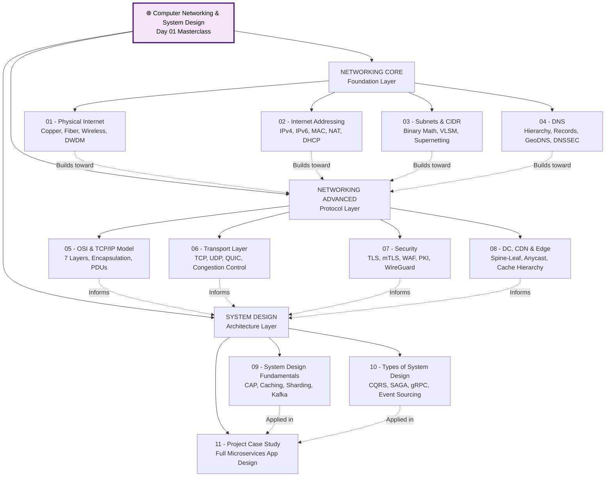
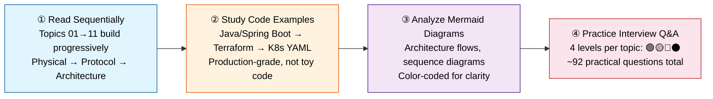

# 🌐 Computer Networking & System Design for DevOps — Day 01

> **Source:** [Computer Networking & System Design For DevOps in OneShot](https://www.youtube.com/watch?v=xN3BKHji12I) by TrainWithShubham  
> **Author:** Shubham Londhe | **Language:** Hinglish | **Duration:** ~4.5 hours  
> **Total Documentation:** ~10,200 lines across 13 files

---

## 📋 Quick Navigation

| Section | Link |
|---------|------|
| 🗺️ Topic Map | [↓ Jump](#-topic-map) |
| 🏗️ Architecture Overview | [↓ Jump](#-architecture-overview) |
| 💡 How to Use | [↓ Jump](#-how-to-use-this-document) |
| 📊 Skills Matrix | [↓ Jump](#-skills-proficiency-matrix) |
| 🎯 Interview Prep | [↓ Jump](#-interview-preparation) |
| 📂 File Tree | [↓ Jump](#-file-tree) |

---

## 🗺️ Topic Map

| # | Topic | File |
|---|-------|------|
| **01** | Physical Internet & Network Infrastructure | [📄 Open](topic-01-physical-internet-infrastructure.md) |
| **02** | Internet Addressing — IPv4, IPv6, MAC, NAT | [📄 Open](topic-02-internet-addressing.md) |
| **03** | Subnets, CIDR & VLSM | [📄 Open](topic-03-subnets-cidr.md) |
| **04** | DNS — Domain Name System | [📄 Open](topic-04-dns.md) |
| **05** | OSI & TCP/IP Model | [📄 Open](topic-05-osi-tcpip-model.md) |
| **06** | Transport Layer — TCP vs UDP | [📄 Open](topic-06-transport-layer-tcp-udp.md) |
| **07** | Internet Security | [📄 Open](topic-07-internet-security.md) |
| **08** | Data Centers, CDN & Edge Locations | [📄 Open](topic-08-datacenter-cdn-edge.md) |
| **09** | System Design Fundamentals | [📄 Open](topic-09-system-design-fundamentals.md) |
| **10** | Types of System Design | [📄 Open](topic-10-types-system-design.md) |
| **11** | Project System Design — Case Study | [📄 Open](topic-11-project-system-design.md) |

---

## 🏗️ Architecture Overview



---

## 💡 How to Use This Document



---

## 📊 Skills Proficiency Matrix

| # | Topic | 🟢 Basic | 🟡 Intermediate | 🔴 Advanced | ⚫ Expert |
|---|-------|:-:|:-:|:-:|:-:|
| **01** | Physical Internet | ✅ | ✅ | ✅ | ✅ |
| **02** | Internet Addressing | ✅ | ✅ | ✅ | ✅ |
| **03** | Subnets & CIDR | ✅ | ✅ | ✅ | ✅ |
| **04** | DNS | ✅ | ✅ | ✅ | ✅ |
| **05** | OSI/TCP-IP | ✅ | ✅ | ✅ | ✅ |
| **06** | Transport Layer | ✅ | ✅ | ✅ | ✅ |
| **07** | Security | ✅ | ✅ | ✅ | ✅ |
| **08** | DC/CDN/Edge | ✅ | ✅ | ✅ | ✅ |
| **09** | System Design Fundamentals | ✅ | ✅ | ✅ | ✅ |
| **10** | Types of System Design | ✅ | ✅ | ✅ | ✅ |
| **11** | Project Case Study | ✅ | ✅ | ✅ | ✅ |

---

## 🎯 Interview Preparation

Each topic has **🟢 Basic → 🟡 Intermediate → 🔴 Advanced → ⚫ Expert QA** (~92 total questions). Look for section **`4. Interview Preparation: Multi-Level QA`** in any topic file.

---

## 📂 File Tree

```
Day-01/1.Networking/
│
├── 📄 README.md                                       ← You are here
│
├── 📄 topic-01-physical-internet-infrastructure.md     # 542 lines — 3 diagrams — 10 Q&A
├── 📄 topic-02-internet-addressing.md                  # 724 lines — 5 diagrams — 8 Q&A
├── 📄 topic-03-subnets-cidr.md                         # 877 lines — 6 diagrams — 8 Q&A
├── 📄 topic-04-dns.md                                  # 981 lines — 11 diagrams — 9 Q&A
├── 📄 topic-05-osi-tcpip-model.md                      # 686 lines — 8 diagrams — 8 Q&A
├── 📄 topic-06-transport-layer-tcp-udp.md              # 930 lines — 10 diagrams — 9 Q&A
├── 📄 topic-07-internet-security.md                    # 1157 lines — 8 diagrams — 9 Q&A
├── 📄 topic-08-datacenter-cdn-edge.md                  # 826 lines — 11 diagrams — 8 Q&A
├── 📄 topic-09-system-design-fundamentals.md           # 761 lines — 10 diagrams — 10 Q&A
├── 📄 topic-10-types-system-design.md                  # 1146 lines — 10 diagrams — 9 Q&A
└── 📄 topic-11-project-system-design.md                # 1415 lines — 6 diagrams — 9 Q&A
```

**Totals:** 13 files | **10,159 lines** | **88 Mermaid diagrams** | **~92 Interview Q&A pairs**

---

*Generated from [TrainWithShubham's "Computer Networking & System Design For DevOps in OneShot"](https://www.youtube.com/watch?v=xN3BKHji12I) — Jun 2026*  
*Elevated from tutorial to Principal Engineer depth by DailyTracker*
