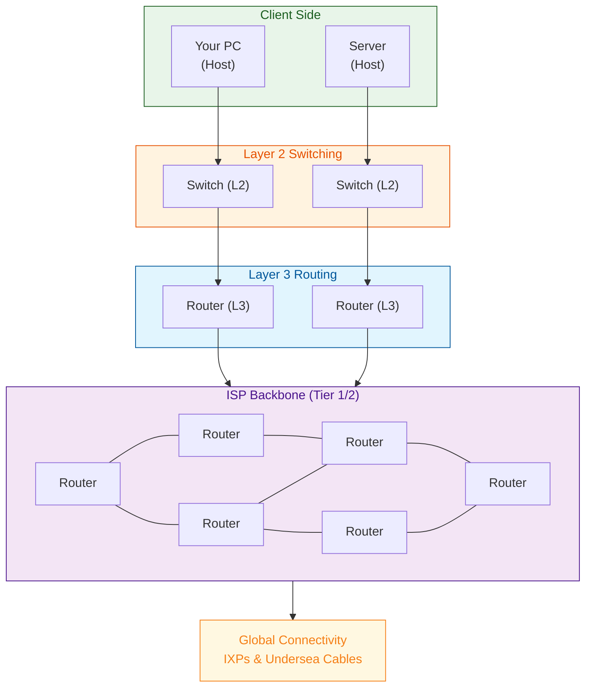
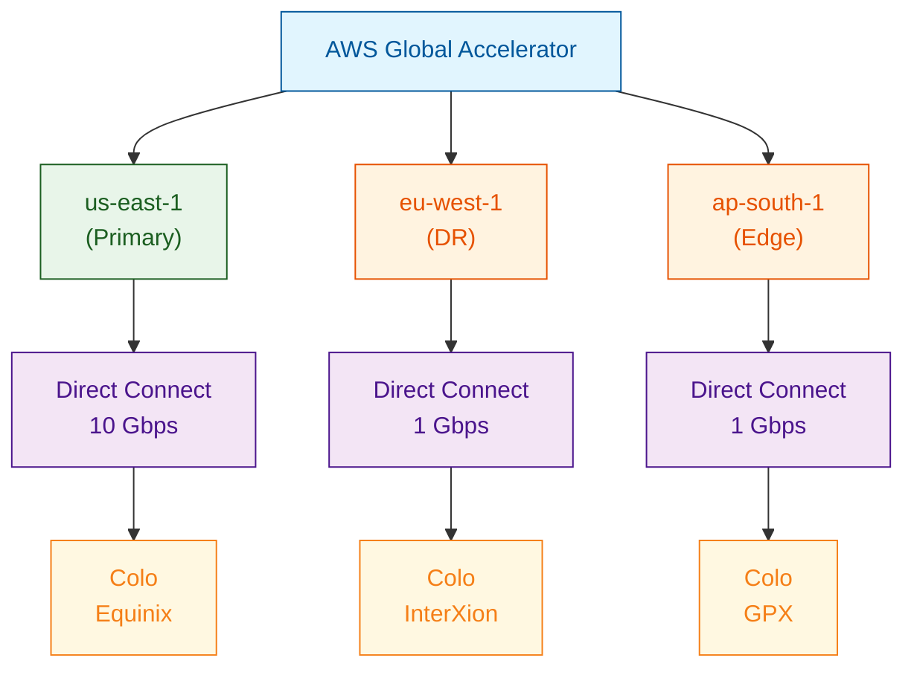
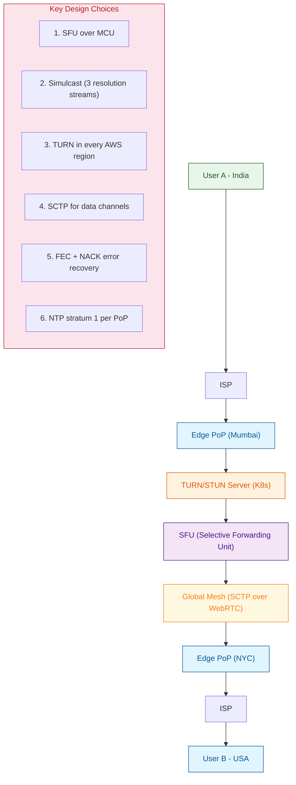

# Topic 1: The Physical Internet & Network Infrastructure

---

## 1. Theoretical Foundation & System Mechanics

### The Core Concept

The Internet is not a single entity but a **global interconnection of autonomous networks** operating under mutually agreed-upon protocols (primarily TCP/IP). At Layer 1 (Physical) and Layer 2 (Data Link) of the OSI model, data travels through physical media:

- **Copper cabling (Ethernet - 802.3):** Electrical impulses over twisted-pair copper. Limited to ~100m before signal degradation (attenuation). Uses differential signaling to reject common-mode noise.
- **Fiber optics:** Light pulses through glass strands. Single-mode (SMF) for long-haul (10km+), Multi-mode (MMF) for intra-datacenter (~300m). Total internal reflection principle.
- **Wireless (Wi-Fi - 802.11):** Radio frequencies (2.4GHz, 5GHz, 6GHz). CSMA/CA (Carrier Sense Multiple Access with Collision Avoidance) to mediate medium access. Half-duplex by nature.



**Submarine Cable Systems:** ~95% of intercontinental data travels through 400+ submarine cables. Each cable contains fiber pairs with optical amplifiers (repeaters) every ~60-80km. A single fiber pair can carry 200+ Tbps using Dense Wavelength Division Multiplexing (DWDM).

### The "Why"

The physical layer solves the fundamental problem of **bit transport across distance**. Without it, higher-layer abstractions (TCP, HTTP) have no medium. Every distributed system bottleneck ultimately traces back to physics: the speed of light in fiber (~200,000 km/s) imposes a hard lower bound on latency (~33ms RTT London-Sydney).

### Trade-offs

| Medium | Bandwidth | Latency | Distance | Interference | Cost/km |
|--------|-----------|---------|----------|-------------|---------|
| Cat6a Copper | 10 Gbps | Low | 100m | High (EMI) | Low |
| Single-mode Fiber | 400 Gbps+ | Low | 80km+ | None | High |
| Wi-Fi 6E | 9.6 Gbps | Medium | ~30m indoor | Very High | Low |
| 5G mmWave | 20 Gbps | Medium | ~500m | High (obstruction) | High |

**Hidden costs:** Power consumption in routers/switches scales with throughput (a 400G router line card consumes ~500W), cooling overhead in datacenters, physical security of cable landing stations.

---

## 2. Production Implementation (Full Stack & Cloud)

### Backend & Code Architecture

Checking network connectivity and interface health programmatically:

```java
import java.net.InetAddress;
import java.net.NetworkInterface;
import java.util.Collections;
import java.util.List;
import org.slf4j.Logger;
import org.slf4j.LoggerFactory;

public class NetworkHealthChecker {
    private static final Logger log = LoggerFactory.getLogger(NetworkHealthChecker.class);
    private static final int TIMEOUT_MS = 5000;
    private static final int PING_RETRIES = 3;

    public record InterfaceInfo(String name, List<String> ips, boolean isUp, 
                                boolean isLoopback, boolean supportsMulticast) {}

    public List<InterfaceInfo> enumerateInterfaces() {
        return Collections.list(NetworkInterface.getNetworkInterfaces())
            .stream()
            .map(nif -> {
                List<String> ips = Collections.list(nif.getInetAddresses())
                    .stream()
                    .map(InetAddress::getHostAddress)
                    .toList();
                try {
                    return new InterfaceInfo(
                        nif.getName(), ips, nif.isUp(),
                        nif.isLoopback(), nif.supportsMulticast()
                    );
                } catch (Exception e) {
                    log.warn("Failed to read interface {}", nif.getName(), e);
                    return null;
                }
            })
            .filter(java.util.Objects::nonNull)
            .toList();
    }

    public boolean isReachable(String host, int port) {
        try (var socket = new java.net.Socket()) {
            socket.connect(new java.net.InetSocketAddress(host, port), TIMEOUT_MS);
            return true;
        } catch (Exception e) {
            log.warn("Host {}:{} unreachable: {}", host, port, e.getMessage());
            return false;
        }
    }

    public long measureRTT(String host) {
        long total = 0;
        int successes = 0;
        for (int i = 0; i < PING_RETRIES; i++) {
            long start = System.nanoTime();
            if (isReachable(host, 443)) {
                total += System.nanoTime() - start;
                successes++;
            }
        }
        return successes > 0 ? total / successes : -1;
    }
}
```

### DevOps & Infrastructure

**Docker networking modes — production considerations:**

```dockerfile
# Multi-stage build with network diagnostics
FROM alpine:3.19 AS builder
RUN apk add --no-cache iproute2 iperf3 mtr

FROM gcr.io/distroless/java17:nonroot
COPY --from=builder /usr/sbin/ss /usr/sbin/ss
COPY --from=builder /usr/bin/mtr /usr/bin/mtr
COPY target/app.jar /app.jar
EXPOSE 8080
USER 65535:65535
ENTRYPOINT ["java", "-XX:+UseContainerSupport", "-XX:MaxRAMPercentage=75.0", "-jar", "/app.jar"]
```

**Kubernetes — pod networking (CNI plugin: Cilium with eBPF):**

```yaml
apiVersion: apps/v1
kind: DaemonSet
metadata:
  name: network-latency-checker
  namespace: monitoring
spec:
  selector:
    matchLabels:
      app: net-checker
  template:
    metadata:
      labels:
        app: net-checker
    spec:
      hostNetwork: true
      containers:
      - name: checker
        image: gcr.io/distroless/java17:nonroot
        command: ["java", "NetworkHealthChecker"]
        resources:
          requests:
            memory: "256Mi"
            cpu: "100m"
          limits:
            memory: "512Mi"
            cpu: "200m"
---
apiVersion: networking.k8s.io/v1
kind: NetworkPolicy
metadata:
  name: allow-monitoring-egress
  namespace: monitoring
spec:
  podSelector:
    matchLabels:
      app: net-checker
  policyTypes:
  - Egress
  egress:
  - to:
    - ipBlock:
        cidr: 0.0.0.0/0
        except:
        - 10.0.0.0/8
        - 172.16.0.0/12
        - 192.168.0.0/16
```

**Terraform — AWS Direct Connect (dedicated physical link):**

```hcl
resource "aws_dx_connection" "prod" {
  name      = "prod-dx"
  bandwidth = "10Gbps"
  location  = "EqNY5"  # Equinix NY5
}

resource "aws_dx_private_virtual_interface" "prod_vif" {
  connection_id    = aws_dx_connection.prod.id
  name             = "prod-vif"
  vlan             = 100
  address_family   = "ipv4"
  bgp_asn          = 64512
  amazon_address   = "169.254.10.1/30"
  customer_address = "169.254.10.2/30"
  bgp_auth_key     = var.bgp_md5_key
}

resource "aws_vpn_connection" "backup" {
  customer_gateway_id = aws_customer_gateway.main.id
  transit_gateway_id  = aws_ec2_transit_gateway.main.id
  type                = "ipsec.1"
  tunnel1_inside_cidr = "169.254.20.0/30"
  tunnel2_inside_cidr = "169.254.20.4/30"
}
```

### Cloud Architecture



**Architectural flow:**

1. User request enters nearest AWS edge location via Global Accelerator
2. Traffic routed over AWS backbone (not public internet) to primary region
3. Primary region Direct Connect 10Gbps link to on-prem colo
4. Failover routes through secondary region with 1Gbps Direct Connect
5. BGP advertisements control path selection with MED and AS-path prepending

---

## 3. Real-World Scaling Scenarios

### The Bottleneck

**Scenario:** Global video streaming platform (Netflix-scale) experiencing buffer bloat and TCP incast collapse during peak hours (8 PM ET).

The physical infrastructure bottleneck: **Last-mile capacity**. Even with 400G backbone links, the ISP's local distribution node (CMTS/OLT) is oversubscribed 50:1. The shared medium (coaxial cable) in the neighborhood causes contention. TCP's congestion control (Cubic) overreacts to packet loss from buffer bloat, causing global synchronization of TCP windows — all flows back off simultaneously, then burst together.

**Symptoms:**
- Throughput drops from 100Mbps to 2Mbps
- Latency spikes from 20ms to 2000ms (bufferbloat)
- TCP retransmit rate >5%

### The Solution

**Step 1: Deploy active queue management (AQM) — fq_codel on edge routers**

```
tc qdisc replace dev eth0 root fq_codel
tc -s qdisc show dev eth0
```

**Step 2: Multi-path TCP (MPTCP) or QUIC at the transport layer**

```nginx
# nginx.conf — enable QUIC + HTTP/3
server {
    listen 443 quic reuseport;
    listen 443 ssl;
    
    ssl_protocols TLSv1.3;
    
    # 0-RTT optimization
    ssl_early_data on;
    
    # QUIC specific
    quic_retry on;
    quic_gso on;
    
    location / {
        proxy_pass http://backend_upstream;
        proxy_http_version 1.1;
    }
}
```

**Step 3: CDN with edge caches at ISP points of presence (PoPs)**

```hcl
# Terraform — CDN distribution with origin shielding
resource "aws_cloudfront_distribution" "cdn" {
  origin {
    domain_name = "origin.${var.domain}"
    origin_shield {
      enabled              = true
      origin_shield_region = "us-east-1"
    }
  }
  
  default_cache_behavior {
    viewer_protocol_policy = "redirect-to-https"
    cache_policy_id        = "658327ea-f89d-4fab-a63d-7e88639e58f6"
    compress               = true
    # Use origin shield to reduce origin load
  }
  
  # Edge function to route based on client ISP
  lambda_function_association {
    event_type = "viewer-request"
    lambda_arn = aws_lambda_function.edge_router.qualified_arn
  }
}
```

**Step 4: Anycast routing — same IP advertised from multiple locations**

```
BGP anycast configuration on edge routers:
router bgp 65100
  network 203.0.113.0/24
  neighbor 192.0.2.1 remote-as 64500
  neighbor 192.0.2.1 route-map SET-LOCAL-PREF
!
route-map SET-LOCAL-PREF permit 10
  set local-preference 150  # Preferred for primary
```

---

## 4. Senior-Level Interview Deep Dive

### System Design Challenge

**Question:** "Design a global real-time video conferencing system (like Zoom/Google Meet) for 1 billion daily meeting minutes. The system must provide <150ms end-to-end latency, support for up to 1000 participants per meeting, and utilize WebRTC. How do you architect the physical and network layers to handle this at global scale?"

**Optimal Blueprint:**



**Key metrics:**
- SFU processes ~1.5Gbps per 1000 participants (1080p)
- Each SFU pod: 16 vCPU, 64GB RAM, 10Gbps NIC
- Auto-scaling group: min 5, max 200 SFU pods per region
- Cross-region latency via AWS backbone: <50ms inter-continental

#### 4. Interview Preparation: Multi-Level QA

##### 🟢 Basic Level (Jr. Engineer / 0-2 Yrs)

**Q1:** What is the difference between a switch, a router, and a hub in a physical network?

**A1:** A hub broadcasts all incoming data to all ports (no intelligence). A switch (Layer 2) forwards frames based on MAC addresses — it learns which MAC is on which port and forwards only to the correct port. A router (Layer 3) forwards packets based on IP addresses and connects different subnets/networks. In a typical office: PCs connect to a switch, the switch connects to a router, and the router connects to the internet.

**Q2:** Why does copper Ethernet have a 100-meter distance limit?

**A2:** Due to attenuation — the electrical signal degrades over distance. Beyond ~100m on Cat6a, the signal-to-noise ratio drops below what the receiver can reliably decode (differential signaling fails). Also, propagation delay increases, causing collision detection issues in half-duplex mode. For longer distances, use fiber optics with repeaters or switches as signal regenerators.

**Q3:** What happens to your data when you run out of public IPv4 addresses? Explain with NAT.

**A3:** NAT (Network Address Translation) solves IPv4 exhaustion by mapping thousands of private IPs (RFC 1918: 10.0.0.0/8, 172.16.0.0/12, 192.168.0.0/16) to a single public IP using Port Address Translation (PAT). The router/gateway maintains a translation table mapping each internal (privateIP:port) to (publicIP:uniquePort). When a response arrives, it looks up the destination port to find the correct internal host. This allows thousands of devices to share one public IP. NAT also provides a basic security layer by hiding internal IPs, but breaks end-to-end connectivity (complicates peer-to-peer protocols like WebRTC, VoIP) and can exhaust port mappings under heavy load (~65K ports per public IP).

##### 🟡 Intermediate Level (Mid-Level / 2-5 Yrs)

**Q1:** How does fq_codel active queue management solve bufferbloat, and how would you deploy it in production?

**A1:** Bufferbloat occurs when oversized router buffers cause excessive latency (milliseconds → seconds) under load. fq_codel combines:
- **Fair Queuing (fq):** Creates separate queues per flow, preventing a single aggressive flow from starving others
- **CoDel (Controlled Delay):** Monitors per-queue sojourn time. When minimum latency exceeds 5ms, it begins dropping packets from that queue, signaling TCP senders to slow down

Production deployment:
```bash
# Replace the default pfifo_fast qdisc on the WAN interface
tc qdisc replace dev eth0 root fq_codel
tc -s qdisc show dev eth0

# Verify with:
ss -ti | grep -E "cubic|bbr"  # Check congestion control
```

**Q2:** How would you diagnose a physical-layer bottleneck causing high latency in a production environment? What tools and metrics would you use?

**A2:** Use a layered approach:
1. **Interface counters:** `ip -s link show eth0` — check for CRC errors, collisions, drops
2. **Latency breakdown:** `mtr <target>` — shows per-hop latency; `traceroute` with ICMP probes
3. **Switch monitoring:** SNMP polling of interface utilization; if any interface exceeds 70% utilization consistently, consider upgrading or load-balancing
4. **NIC tuning:** `ethtool -S eth0 | grep -E "error|drop|crc"` — driver-level error counters
5. **Packet capture:** `tcpdump -i eth0 -s 100 -w capture.pcap` then analyze with Wireshark for TCP retransmissions, dup ACKs, and window scaling issues

Key metric: if TCP retransmission rate > 2%, investigate physical or congestion issues immediately.

##### 🔴 Advanced Level (Senior / 5-8 Yrs)

**Q1:** Explain the TCP incast collapse problem and how DCTCP with ECN solves it better than RED. Provide the mathematical framework.

**A1:** TCP incast collapse occurs in many-to-one patterns (MapReduce shuffle, distributed storage reads). Many senders simultaneously burst data to one receiver — the switch buffer overflows, causing drops. All TCP senders detect loss simultaneously, perform multiplicative decrease (window ÷ 2), then retransmit in sync. This global synchronization collapses throughput to near zero.

**DCTCP solution — mathematical framework:**

1. **ECN marking instead of dropping:** Switch sets CE (Congestion Experienced) bit when queue > K (e.g., K=65KB for 256KB buffer). No packet drop.

2. **Congestion estimation:**
   `α ← (1 - g) × α + g × F`
   Where F = fraction of marked ACKs in a window, g = 1/16 (typical)

3. **Proportional window reduction:**
   `Window ← Window × (1 - α/2)`

   When marking is light (α = 0.02), reduction is only 1% vs 50% in standard TCP. When marking is heavy (α = 0.5), reduction is 25%.

**Result:** Queue stabilized at K, zero packet loss, 10-100× better throughput under incast, <1ms latency vs 100ms+ with RED.

**Q2:** Design a global anycast network for a CDN. How does BGP anycast work at the routing level, and what are the failure modes?

**A2:** Anycast advertises the same IP prefix from multiple locations. BGP ensures each user reaches the nearest (lowest AS-path) location.

```
┌──────────────────────────────────────────────┐
│         ANYCAST CDN ARCHITECTURE             │
├──────────────────────────────────────────────┤
│                                              │
│    Anycast IP: 203.0.113.1/24               │
│    Advertised from: NYC, LON, SIN, SYD      │
│                                              │
│    User in India: AS-path → SIN (3 hops)    │
│    User in Brazil: AS-path → NYC (5 hops)   │
│    User in Germany: AS-path → LON (2 hops)  │
│                                              │
│    Failure mode: NYC router goes down       │
│    → BGP withdraws prefix from NYC          │
│    → Traffic automatically shifts to LON    │
│    → Convergence time: 30-90s (BGP timers)  │
└──────────────────────────────────────────────┘
```

**Failure modes:**
- **Unequal load:** BGP doesn't consider capacity, only path length. One location may get 70% of traffic.
- **Route flapping:** A flapping anycast prefix causes global BGP instability. Mitigation: `bgp dampening`
- **TCP connection reset on failover:** Existing TCP connections break when traffic redirects. Mitigation: use UDP/QUIC or anycast only for DNS/stateless protocols

##### ⚫ Expert Level (Staff/Principal / 8+ Yrs)

**Q1:** Explain the complete mechanics of TSO, LRO, GSO, and GRO at the NIC driver and kernel level. How do these offloads interact, and under what conditions do they cause pathological throughput degradation?

**A1:** 

**TSO (TCP Segmentation Offload):** The NIC segments a 64KB TCP payload into MTU-sized (1500B) segments in hardware, calculating checksums, seq/ACK numbers for each. The driver sets `NETIF_F_TSO`. CPU savings: ~40 interrupt/context-switch operations reduced to 1.

**LRO (Large Receive Offload):** NIC coalesces consecutive TCP segments into a single super-buffer (up to 64KB) before passing to the kernel via `eth_type_trans → gro_cells_receive → napi_gro_receive`.

**GSO/GRO:** Software fallback when NIC lacks hardware offload. Identical concept in the kernel.

**Pathological interactions:**

1. **LRO + packet loss amplification:** LRO merges 40 segments into one 64KB buffer. Losing 1 of 40 segments causes the NIC to discard the entire coalesced buffer. Under 1% random loss, effective loss rate = 1 - (1-0.01)⁴⁰ ≈ 33% — a 33× amplification. Throughput collapses.

2. **TSO + micro-burst drops:** TSO emits 64KB bursts (~43 packets at line rate on 10Gbps ≈ 52μs burst). Switch with 512KB buffer can hold ~8 bursts. With 64 concurrent flows, buffer overflows in microseconds. Solution: `ethtool -C eth0 tx-usecs 50 tx-frames 16` (interrupt coalescing).

3. **Hyperthreading + TSO cache thrashing:** TSO consumes ~32KB L2 cache per flow. On hyperthreaded cores, sibling thread's cache gets evicted, causing ~30% performance regression. Mitigation: `ethtool -K eth0 tso off gso off` for latency-sensitive workloads.

**Q2:** The speed of light in fiber (~200,000 km/s) imposes a physical lower bound on latency. Design a global financial trading network that minimizes this latency between NYSE (New Jersey) and LSE (London). What technologies and physical infrastructure choices would you make?

**A2:** The great-circle distance between NJ and London is ~5,570 km. Speed of light in fiber (n ≈ 1.47): `c/n ≈ 204,000 km/s`. Theoretical minimum RTT = `2 × 5570 / 204000 × 1000 ≈ 54.6 ms`. Actual best achieved is ~58-60 ms.

**Physical layer optimizations:**

1. **Route optimization:** Microwave links (air: n ≈ 1.0003, speed ≈ 299,700 km/s) for last-mile access. Fiber paths rarely follow great-circle due to terrain/rights-of-way. Example: Spread Networks laid fiber along rail lines to shave 3ms off Chicago-NY.

2. **Forward error correction (FEC):** Use Reed-Solomon or LDPC codes to avoid retransmission. Each retransmission costs a full RTT. Modern optical transponders use FEC with 7% overhead.

3. **Wavelength selection:** Use O-band (1310nm) instead of C-band (1550nm) — lower dispersion means fewer dispersion-compensating modules (each adds ~0.1μs latency).

4. **Amplifier spacing:** Every EDFA (erbium-doped fiber amplifier) adds ~1-2μs. Minimize amplifiers by keeping signal power high. Use Raman amplification for longer spans without regeneration.

5. **Physical proximity:** Colocate trading servers in the same datacenter as the exchange (NJ for NYSE, Basildon for LSE). This eliminates last-mile fiber, saving ~5-10ms.

**Result with all optimizations:** NJ → London at ~58ms RTT for round-trip. The remaining gap is physics — cannot beat the speed of light in fiber.
