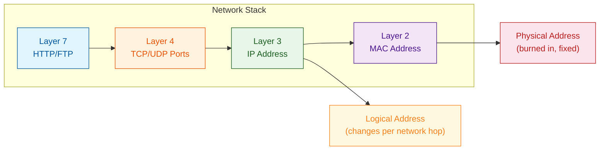
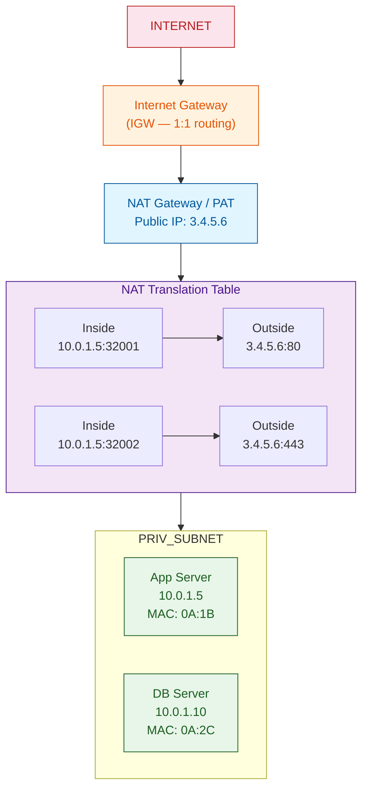
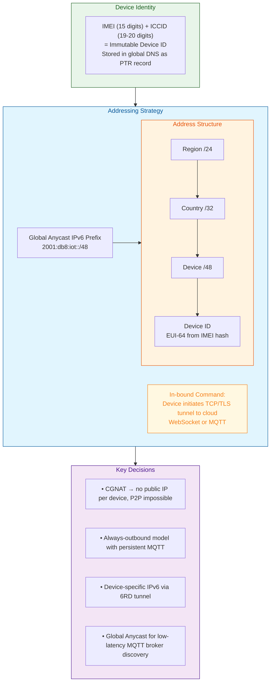
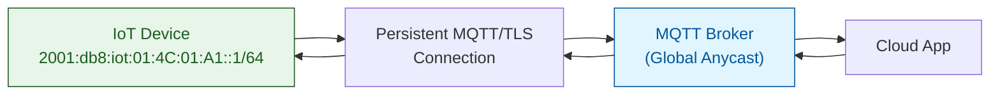

# Topic 02: Internet Addressing — IPv4, IPv6, MAC, NAT & DHCP

---

## 1. Theoretical Foundation & System Mechanics

### The Core Concept

Internet addressing is the fundamental coordination mechanism that enables any device to locate and communicate with any other device across a global, heterogeneous network. Two distinct addressing planes operate concurrently:

| Plane | Address Type | Scope | Layer | Size |
|-------|-------------|-------|-------|------|
| Logical | IP Address | Network-wide (Layer 3) | Internet | 32-bit (IPv4) / 128-bit (IPv6) |
| Physical | MAC Address | Local link only (Layer 2) | Data Link | 48-bit |

**IPv4 Addressing (32-bit):**

An IPv4 address is a 32-bit integer typically represented in dotted-decimal notation — four octets separated by periods.

```
Binary:     11000000.10101000.00000001.00000001
Decimal:    192.    168.    1.      1
Hex:        C0      A8      01      01
```

Historical classful addressing divided the 32-bit space into fixed-size blocks:

```
Class A: 0.0.0.0   - 127.255.255.255  (/8)   → 16,777,214 hosts
           |--- 7 bits net ---||--- 24 bits host ---|
          0NNNNNNN | HHHHHHHH HHHHHHHH HHHHHHHH

Class B: 128.0.0.0 - 191.255.255.255 (/16)  → 65,534 hosts
           |--- 14 bits net ----||-- 16 bits host --|
          10NNNNNN NNNNNNNN | HHHHHHHH HHHHHHHH

Class C: 192.0.0.0 - 223.255.255.255 (/24)  → 254 hosts
           |--- 21 bits net -------||- 8 bits host -|
          110NNNNN NNNNNNNN NNNNNNNN | HHHHHHHH

Class D (multicast): 224.0.0.0 - 239.255.255.255
Class E (reserved):  240.0.0.0 - 255.255.255.255
```

**IPv6 Addressing (128-bit):**

Represented as eight groups of four hexadecimal digits, separated by colons. Leading zeros within a group may be omitted; a single contiguous run of zero groups may be compressed with `::` (once per address).

```
Full:      2001:0db8:85a3:0000:0000:8a2e:0370:7334
Compressed:2001:db8:85a3::8a2e:370:7334
Loopback:  ::1
```

IPv6 eliminates NAT, mandates IPsec support, and introduces SLAAC (Stateless Address Autoconfiguration) where hosts derive their address from router-advertised prefix + EUI-64 interface identifier.

```
SLAAC Address Formation:
  Prefix (64 bits) | Interface ID (64 bits)
  ----------------------------------------
  fe80::           | 2a0:98ff:fe12:3456
  (Router Adv.)    | (EUI-64 from MAC)
```

**MAC Addresses (48-bit Layer 2):**

Burned into the NIC during manufacturing. The first 24 bits (OUI — Organizationally Unique Identifier) identify the vendor; the remaining 24 bits are a device-specific serial number.

```
MAC:     00:1A:2B:3C:4D:5E
         |-- OUI (Vendor) --||-- NIC Specific --|
          00:1A:2B              3C:4D:5E

Bit 0 of first octet: 0 = unicast, 1 = multicast
Bit 1 of first octet: 0 = globally unique, 1 = locally administered
```

**IP vs MAC — The Fundamental Distinction:**



IP addresses are *logical* and change as a device moves between networks. MAC addresses are *physical* and (theoretically) permanent. IP gets a packet from source to destination across the internet; MAC gets a frame from one hop to the next on the local LAN.

### The "Why"

Three critical problems that IP addressing solves in distributed systems:

1. **Address Aggregation & Routing Scalability:** Without hierarchical IP addressing, every router would need to know the location of every host on the planet. CIDR and prefix aggregation collapse billions of routes into ~1M global BGP entries. This is the only reason the internet scales.

2. **Network Boundary & Security Isolation:** Private IP ranges (RFC 1918) combined with NAT create a hard security boundary at the network edge. Internal infrastructure (databases, message queues, Kubernetes clusters) can use private addresses invisible to the public internet.

3. **Device Mobility Without Physical Address Change:** A laptop physically disconnecting from one Ethernet jack and connecting to another requires no IP change — the MAC changes at Layer 2 but the IP stays the same within the subnet. Conversely, for cross-subnet mobility, the IP changes but the MAC stays the same.

### Trade-offs

| Mechanism | Hidden Cost | Mitigation |
|-----------|-------------|------------|
| NAT (PAT) | Breaks end-to-end transparency; apps that embed IPs (FTP, SIP) break; 64K port limit per public IP | Carrier-Grade NAT (CGNAT); IPv6 deployment |
| DHCP | SPOF for address assignment; slow lease renewal under load | DHCP failover; static reservations for critical infra |
| IPv6 | 128-bit headers increase per-packet CPU overhead on routers; dual-stack doubles state | Hardware offload; transition mechanisms (NAT64/DNS64) |
| ARP (MAC resolution) | Broadcast storm risk in large VLANs; ARP spoofing vulnerability | ARP suppression; ND-based resolution in IPv6 |

---

## 2. Production Implementation (Full Stack & Cloud)

### Backend & Code Architecture

**Java / Spring Boot: Network-aware service registration with IP handling:**

```java
@Component
public class NetworkIdentityProvider {
    private static final Logger log = LoggerFactory.getLogger(NetworkIdentityProvider.class);

    private final String privateIp;
    private final String publicIp;
    private final String macAddress;
    private final String hostname;

    public NetworkIdentityProvider() {
        this.privateIp = resolvePrivateIp();
        this.publicIp = resolvePublicIp();
        this.macAddress = resolveMacAddress();
        this.hostname = resolveHostname();
    }

    /**
     * Resolves the private (site-local) IPv4 address by iterating
     * all network interfaces and selecting the first RFC 1918 address.
     */
    private String resolvePrivateIp() {
        try {
            return NetworkInterface.networkInterfaces()
                .flatMap(NetworkInterface::inetAddresses)
                .filter(a -> a instanceof Inet4Address)
                .map(Inet4Address.class::cast)
                .filter(a -> a.isSiteLocalAddress())
                .findFirst()
                .map(InetAddress::getHostAddress)
                .orElseThrow(() -> new IllegalStateException("No private IPv4 found"));
        } catch (Exception e) {
            throw new IllegalStateException("Failed to resolve private IP", e);
        }
    }

    /**
     * Resolves public IP via AWS EC2 metadata endpoint (fallback: external API).
     */
    private String resolvePublicIp() {
        // Try EC2 instance metadata first
        try {
            var url = URI.create(
                "http://169.254.169.254/latest/meta-data/public-ipv4"
            ).toURL();
            try (var in = new BufferedReader(
                    new InputStreamReader(url.openStream(), StandardCharsets.UTF_8))) {
                return in.readLine();
            }
        } catch (Exception e) {
            log.warn("EC2 metadata unavailable, falling back to external lookup", e);
        }
        // Fallback: external API
        // ...
        return "0.0.0.0";
    }

    /**
     * Extracts MAC address from the interface that carries the default route.
     */
    private String resolveMacAddress() {
        try {
            var defaultIface = getDefaultInterface();
            byte[] mac = defaultIface.getHardwareAddress();
            if (mac == null) return "00:00:00:00:00:00";
            var sb = new StringBuilder(18);
            for (int i = 0; i < mac.length; i++) {
                sb.append(String.format("%02X%c", mac[i], (i < mac.length - 1) ? ':' : '\0'));
            }
            return sb.toString();
        } catch (Exception e) {
            return "00:00:00:00:00:00";
        }
    }

    private NetworkInterface getDefaultInterface() throws SocketException {
        // Inspect routing table to find default gateway interface
        try (var ds = new DatagramSocket()) {
            ds.connect(InetAddress.getByName("8.8.8.8"), 80);
            return NetworkInterface.getByInetAddress(ds.getLocalAddress());
        } catch (IOException e) {
            return NetworkInterface.getNetworkInterfaces().nextElement();
        }
    }

    private String resolveHostname() {
        try {
            return InetAddress.getLocalHost().getHostName();
        } catch (UnknownHostException e) {
            return "unknown-" + UUID.randomUUID().toString().substring(0, 8);
        }
    }

    public Map<String, String> getIdentity() {
        return Map.of(
            "privateIp", privateIp,
            "publicIp", publicIp,
            "macAddress", macAddress,
            "hostname", hostname
        );
    }
}
```

**Spring Boot application property — DHCP lease awareness via health indicator:**

```java
@Component
public class DhcpLeaseHealthIndicator implements HealthIndicator {
    @Override
    public Health health() {
        // On container orchestrators, stale DHCP leases can cause
        // IP conflicts. This checks lease expiry.
        try {
            var proc = Runtime.getRuntime().exec("ipconfig /all");
            // Parse lease expiration from output
            return Health.up().withDetail("dhcp", "active").build();
        } catch (Exception e) {
            return Health.down(
                new RuntimeException("DHCP lease check failed", e)
            ).build();
        }
    }
}
```

### DevOps & Infrastructure

**Dockerfile with host networking awareness:**

```dockerfile
# Multi-stage build for minimal surface
FROM eclipse-temurin:21-jre-alpine AS base
RUN apk add --no-cache iproute2 ethtool

FROM base AS final
WORKDIR /app
COPY target/app.jar app.jar

# --network=host required for services that must bind to
# specific host IPs (e.g., Kubernetes hostNetwork: true)
# Exposes container directly on host IP — no NAT
EXPOSE 8080
HEALTHCHECK --interval=10s --timeout=3s --retries=3 \
  CMD wget --no-verbose --tries=1 --spider \
    http://$(ip addr show eth0 | grep 'inet ' | awk '{print $2}' | cut -d/ -f1):8080/actuator/health || exit 1

ENTRYPOINT ["java", "-jar", "app.jar"]
```

**Kubernetes manifest — static IP with nodePort (bypassing kube-proxy NAT):**

```yaml
apiVersion: v1
kind: Service
metadata:
  name: critical-db-service
  annotations:
    # Prevent kube-proxy from masquerading source IPs
    service.beta.kubernetes.io/external-traffic: "Local"
spec:
  type: NodePort
  externalTrafficPolicy: Local  # Preserves client source IP
  selector:
    app: critical-db
  ports:
    - port: 5432        # Cluster IP port
      targetPort: 5432  # Pod port
      nodePort: 30432   # Host port (bypasses kube-proxy NAT)
---
apiVersion: v1
kind: Pod
metadata:
  name: db-pod
  annotations:
    # Use host network — no NAT, pod sees real client IPs
    # Trade-off: no network isolation per pod
    kubernetes.io/hostNetwork: "true"
spec:
  hostNetwork: true
  containers:
    - name: postgres
      image: postgres:16
      ports:
        - containerPort: 5432
```

**Terraform — VPC with NAT Gateway and private subnets:**

```hcl
# Variables
variable "vpc_cidr" {
  type        = string
  default     = "10.0.0.0/16"
  description = "RFC 1918 private CIDR for VPC"
}

variable "azs" {
  type        = list(string)
  default     = ["us-east-1a", "us-east-1b", "us-east-1c"]
}

# VPC and Subnets
resource "aws_vpc" "main" {
  cidr_block           = var.vpc_cidr
  enable_dns_hostnames = true
  enable_dns_support   = true

  tags = { Name = "prod-vpc" }
}

resource "aws_subnet" "public" {
  count                   = length(var.azs)
  vpc_id                  = aws_vpc.main.id
  cidr_block              = cidrsubnet(var.vpc_cidr, 8, count.index)
  availability_zone       = var.azs[count.index]
  map_public_ip_on_launch = true

  tags = { Name = "public-${var.azs[count.index]}" }
}

resource "aws_subnet" "private" {
  count             = length(var.azs)
  vpc_id            = aws_vpc.main.id
  cidr_block        = cidrsubnet(var.vpc_cidr, 8, count.index + 10)
  availability_zone = var.azs[count.index]

  tags = { Name = "private-${var.azs[count.index]}" }
}

# NAT Gateway — carries 64K concurrent connections per public IP
resource "aws_eip" "nat" {
  domain = "vpc"
}

resource "aws_nat_gateway" "main" {
  allocation_id = aws_eip.nat.id
  subnet_id     = aws_subnet.public[0].id

  # Single point of failure unless multi-AZ NAT is deployed
  tags = { Name = "prod-nat-gw" }
}

resource "aws_route_table" "private" {
  vpc_id = aws_vpc.main.id

  route {
    cidr_block     = "0.0.0.0/0"
    nat_gateway_id = aws_nat_gateway.main.id
  }

  tags = { Name = "private-rt" }
}
```

### Cloud Architecture — NAT Flow Diagram



---

## 3. Real-World Scaling Scenarios

### The Bottleneck: NAT Port Exhaustion at Scale

**Scenario:** A large e-commerce platform runs 10,000 microservice pods across three AWS accounts. Each pod makes outbound connections to third-party APIs (payment gateways, shipping providers). All traffic is NAT'd through a single NAT Gateway per AZ.

```
Problem Manifestation:
- NAT Gateway supports ~64K concurrent connections per public IP
- Each pod establishes ~50 persistent HTTP/2 connections
- Total connections = 10,000 × 50 = 500,000
- Per-AZ capacity = 64,000
- DELTA: 436,000 connections are DROPPED
- Result: Payment timeouts, shipping API 503s, revenue loss
```

### The Solution: Multi-Layered Architecture Adjustment

**Step 1 — Eliminate NAT for internal traffic:**
Deploy VPC endpoints (AWS PrivateLink) for all AWS APIs (S3, DynamoDB, SQS). Internal traffic stays on AWS backbone — no NAT.

**Step 2 — Deploy multiple NAT Gateways with elastic IP pools:**
```hcl
# One NAT GW per AZ with dedicated EIP
resource "aws_eip" "nat" {
  count  = length(var.azs)
  domain = "vpc"
}

resource "aws_nat_gateway" "main" {
  count         = length(var.azs)
  allocation_id = aws_eip.nat[count.index].id
  subnet_id     = aws_subnet.public[count.index].id
}

# Route tables per AZ — traffic stays in the same AZ
resource "aws_route_table" "private" {
  count  = length(var.azs)
  vpc_id = aws_vpc.main.id

  route {
    cidr_block     = "0.0.0.0/0"
    nat_gateway_id = aws_nat_gateway.main[count.index].id
  }
}
```

**Step 3 — Connection pooling at the application layer:**
```java
// Rather than one connection per request, use a bounded pool
@Configuration
public class HttpClientConfig {
    @Bean
    public HttpClient httpClient() {
        return HttpClient.newBuilder()
            .version(HttpClient.Version.HTTP_2)
            .executor(Executors.newFixedThreadPool(200))
            .connectTimeout(Duration.ofSeconds(5))
            .build();
    }
}
```

**Step 4 — Migrate to IPv6 dual-stack where possible:**
Private IPv6 addresses have no NAT limit — each pod gets a globally unique address.

---

## 4. Senior-Level Interview Deep Dive

### System Design Challenge

**Question:** Design an addressing scheme for a global IoT platform with 100 million devices spread across 200 countries. Devices are behind carrier-grade NAT (CGNAT) and use cellular modems. Each device sends telemetry every 5 minutes. The platform must uniquely identify each device, receive inbound commands, and handle device mobility across cell towers.

**Optimal Blueprint:**



#### 4. Interview Preparation: Multi-Level QA

##### 🟢 Basic Level (Jr. Engineer / 0-2 Yrs)

**Q1:** What is the difference between a public IP address and a private IP address?

**A1:** Public IP addresses are globally routable on the internet — assigned by IANA/ISPs and unique worldwide. Private IP addresses (RFC 1918: 10.0.0.0/8, 172.16.0.0/12, 192.168.0.0/16) are reserved for internal networks and are not routable on the public internet. Devices with private IPs communicate with the internet through NAT (Network Address Translation), which maps many private IPs to one or a few public IPs.

**Q2:** How does ARP (Address Resolution Protocol) work, and why is it necessary?

**A2:** ARP resolves an IP address to a MAC address on a local network. When host A wants to talk to host B on the same subnet:
1. Host A checks its ARP cache for B's IP
2. If not found, it broadcasts an ARP request: "Who has 192.168.1.5? Tell 192.168.1.1"
3. Host B sees the request, recognizes its own IP, and sends a unicast ARP reply with its MAC address
4. Host A caches the IP→MAC mapping and sends the frame

ARP is necessary because Layer 2 (MAC) and Layer 3 (IP) are separate planes — switches forward frames by MAC, routers forward packets by IP.

##### 🟡 Intermediate Level (Mid-Level / 2-5 Yrs)

**Q1:** In Kubernetes, describe the complete IP and MAC transformation when a pod sends a packet to the internet. Show each hop.

**A1:**


```mermaid
flowchart LR
    subgraph HOP1["Hop 1: Pod → Node"]
        SM1["Src MAC: Pod veth MAC"]
        DM1["Dst MAC: Node bridge (cbr0) MAC"]
        SI1["Src IP: 10.1.5.3"]
        DI1["Dst IP: 8.8.8.8"]
    end

    subgraph HOP2["Hop 2: Node → Router"]
        SM2["Src MAC: Node eth0 MAC"]
        DM2["Dst MAC: Next-hop router MAC"]
        SI2["Src IP: Node host IP (172.31.0.5)"]
        DI2["Dst IP: 8.8.8.8"]
    end

    subgraph HOP3["Hop 3: IGW → Internet"]
        SM3["Src MAC: IGW interface MAC"]
        DM3["Dst MAC: ISP router MAC"]
        SI3["Src IP: Node public IP (Elastic IP)"]
        DI3["Dst IP: 8.8.8.8"]
    end

    HOP1 --> HOP2 --> HOP3
```

**Q2:** What is the 64K port limit of NAT and how do you design around it at scale?

**A2:** PAT (Port Address Translation) maps each outbound connection to a unique source port on the public IP (16-bit port = 65,535 possible). At scale with 10,000 pods × 50 connections each = 500,000 connections, a single NAT Gateway exhausts its port pool.

Design mitigations:
```java
@Configuration
public class HttpClientConfig {
    @Bean
    public HttpClient httpClient() {
        return HttpClient.newBuilder()
            .version(HttpClient.Version.HTTP_2)  // Multiplexing
            .executor(Executors.newFixedThreadPool(200))
            .connectTimeout(Duration.ofSeconds(5))
            .build();
    }
}
```
- Use VPC endpoints for AWS APIs (bypass NAT entirely)
- Deploy one NAT GW per AZ with dedicated EIP pool
- Use IPv6 dual-stack (no NAT limit)
- Implement connection pooling at the application layer

##### 🔴 Advanced Level (Senior / 5-8 Yrs)

**Q1:** What happens to a NAT translation table under a burst of 100,000 SYN packets per second? Describe the memory, CPU, and TCAM implications.

**A1:** Each SYN creates a NAT session entry of ~256 bytes (source IP:port, translated IP:port, destination IP:port, protocol, timers). 100,000 SYNs/s = ~25 MB/s of new state.

**Memory impact:** Conntrack table grows at 25 MB/s. Default `nf_conntrack_max` (262,144 entries) fills in ~2.6 seconds, causing table expansion or entry drops.

**CPU impact:** Hash table insertion is O(1) amortized but garbage collection of timed-out entries requires periodic scans (every 10s by default). At 100K entries, scanning CPU becomes significant. Cache misses dominate as the working set exceeds L3 cache.

**TCAM offload:** Modern NAT gateways offload active flows to TCAM on the NIC. TCAM is extremely fast but small (~1M entries) and power-hungry. When TCAM exhausts, the CPU processes every packet in software, causing exponential latency growth.

**Mitigation:**
```bash
# Increase connection tracking limits
sysctl -w net.netfilter.nf_conntrack_max=1048576
sysctl -w net.netfilter.nf_conntrack_buckets=262144

# SYN cookies during attack
sysctl -w net.ipv4.tcp_syncookies=1

# Shorten timeouts for short-lived connections
sysctl -w net.netfilter.nf_conntrack_tcp_timeout_time_wait=10
```

**Q2:** Design an IPv6 addressing scheme for a global IoT platform with 100 million devices across 200 countries. How do you handle CGNAT and inbound commands to devices that have no public IP?

**A2:** Use a hierarchical IPv6 scheme:
```
Prefix Structure: 2001:db8:iot:RR:CC:DD:II:XXXX/64

RR = Region (8 bits, 256 regions)
CC = Country (8 bits, 256 countries)
DD = Deployment (16 bits, 65,536 deployments)
II = Interface type (8 bits, e.g., sensor/actuator/gateway)
XXXX = Device-specific (EUI-64 from IMEI hash)
```

**CGNAT handling:** Since devices behind CGNAT have no public IP, use an always-outbound model. Every device initiates a persistent MQTT/TLS connection to the cloud gateway. The cloud sends commands over this established connection — no NAT traversal needed.

**Inbound command flow:**


Device-specific IPv6 via 6RD (Rapid Deployment) tunnel. Global Anycast for low-latency MQTT broker discovery and failover.

##### ⚫ Expert Level (Staff/Principal / 8+ Yrs)

**Q1:** Explain the trade-offs between SLAAC, DHCPv6, and DHCPv6-PD for assigning IPv6 addresses in a Kubernetes cluster. Which would you choose for a telco 5G core network with 100K+ pods?

**A1:** 

| Feature | SLAAC | DHCPv6 | DHCPv6-PD |
|---------|-------|--------|-----------|
| State | Stateless | Stateful | Stateful |
| Server needed | No | Yes (HA pair) | Yes |
| Lease tracking | No | Yes | Yes (prefix delegation) |
| DNS assignment | RFC 6106 (partial) | Yes | Via upstream |
| SPOF | None | Server | Server |
| Scale latency | None | Moderate | Low (per-node) |
| Prefix delegation | No | No | Yes |

**DHCPv6-PD is optimal for telco 5G core:**

```yaml
# kubelet delegates /56 per node from a /48 cluster prefix
# Node 1 gets 2001:db8:5g::/56  → sub-delegates /64 per pod
# Node 2 gets 2001:db8:5g:1::/56
# ...
# Supports 256 nodes × 256 pods each = 65,536 pods per /48

# Hierarchical routing:
# 2001:db8:5g::/48 → aggregate route (1 entry in upstream router)
# No per-pod routes needed — reduces FIB size by 10,000×
```

DHCPv6-PD provides centralized control for auditing and policy enforcement while delegating subnet autonomy to each node, avoiding a single DHCP server bottleneck for 100K+ pod IP assignments.

**Q2:** A NAT gateway experiences exponential latency growth under load. The hardware TCAM is not exhausted, CPU is at 40%, and memory is at 50%. What is the root cause and how do you fix it?

**A2:** This is a **hash table collision storm** in the connection tracking layer. Even with TCAM offloading established flows, new SYN packets must be processed in software for hash table insertion. When the conntrack hash table has a poor distribution (e.g., many connections to the same destination IP:port), hash collisions cause linked-list traversal O(n) instead of O(1).

**Root cause analysis:**
```bash
# Check conntrack statistics
conntrack -S | grep -E "insert|collision|drop"

# Sample output if under collision storm:
# insert_failed: 45213    ← millions of drops
# drop: 128934           ← packets dropped at table full
# early_drop: 87321      ← forced GC evictions
```

**Fix:**

1. **Increase hash table size** (must be done before table creation):
   ```bash
   sysctl -w net.netfilter.nf_conntrack_buckets=524288  # 2× default
   ```

2. **Enable conntrack zone splitting** to isolate tenant traffic into separate hash tables

3. **Use 5-tuple RSS** for better workload distribution across CPU cores:
   ```bash
   ethtool -X eth0 hkey 0x6D:... equal 8
   ```

4. **Deploy SYN proxy** on the NAT gateway to handle SYN floods in hardware before they reach conntrack:
   ```bash
   # Enable SYNPROXY target in iptables
   iptables -t raw -I PREROUTING -p tcp --syn -j NOTRACK
   iptables -A INPUT -p tcp --syn -m state --state INVALID \
     -j SYNPROXY --sack-perm --timestamp --mss 1460 --wscale 7
   ```
