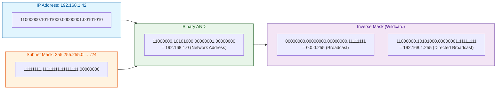
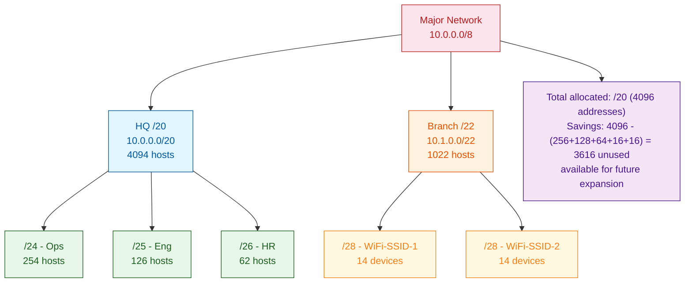
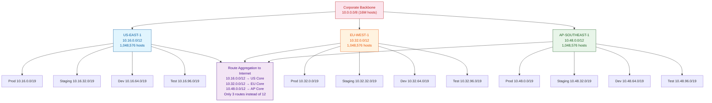
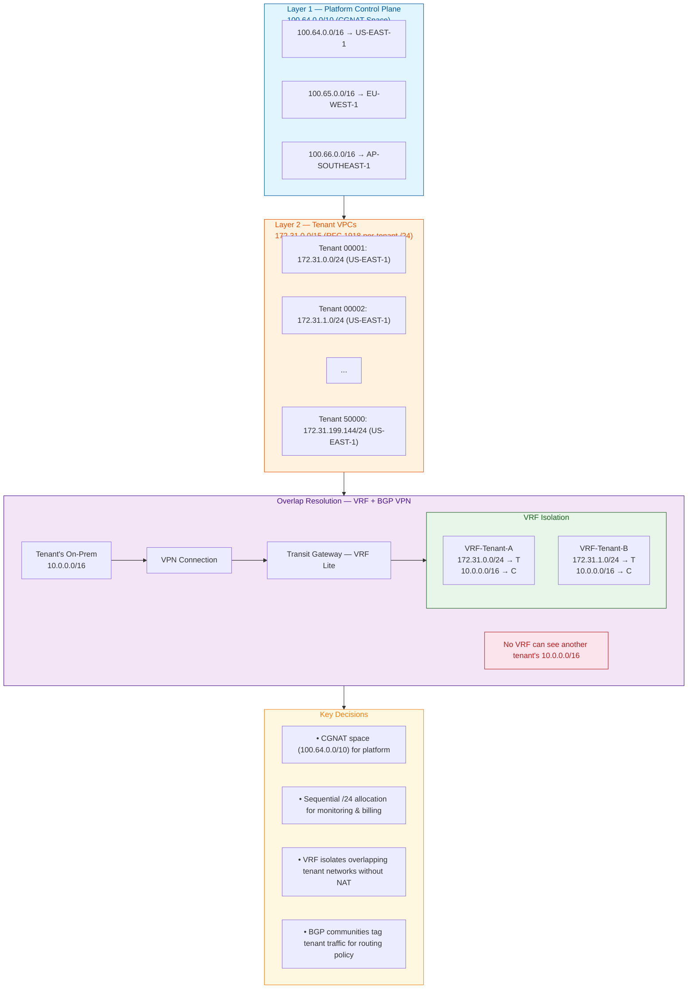
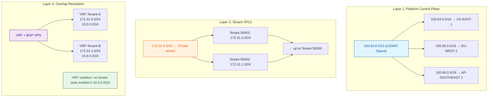
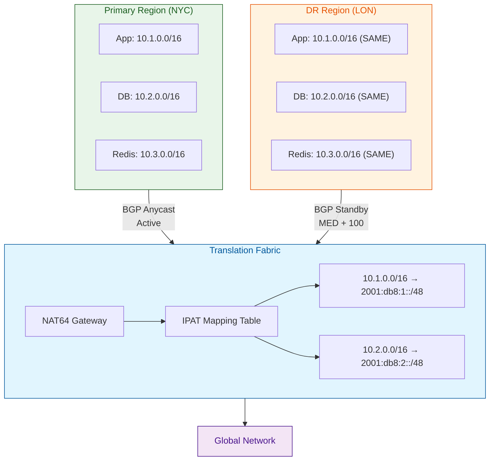

# Topic 03: Subnets, CIDR & VLSM — Binary Math to Production Networking

---

## 1. Theoretical Foundation & System Mechanics

### The Core Concept

Subnetting and CIDR (Classless Inter-Domain Routing) are the mechanisms that allow hierarchical decomposition of the IP address space. Rather than the rigid classful boundaries (A/B/C), CIDR allows any power-of-2 block size to be allocated, described by a prefix length.

**The Binary Foundation:**

Every subnet operation reduces to binary AND between the IP address and the subnet mask.



**CIDR Notation:**

`<IP Address>/<Prefix Length>` where prefix length = number of leading 1-bits in the mask.

```
/8  = 255.0.0.0       = 16,777,214 hosts
/16 = 255.255.0.0     = 65,534 hosts
/24 = 255.255.255.0   = 254 hosts
/25 = 255.255.255.128 = 126 hosts
/26 = 255.255.255.192 = 62 hosts
/27 = 255.255.255.224 = 30 hosts
/28 = 255.255.255.240 = 14 hosts
/29 = 255.255.255.248 = 6 hosts
/30 = 255.255.255.252 = 2 hosts (point-to-point link)
/31 = 255.255.255.254 = 2 hosts (RFC 3021 — no broadcast, no net addr)
/32 = 255.255.255.255 = 1 host (loopback)
```

**Subnet Calculation Formula:**

```
Number of subnets   = 2^(borrowed bits)
Hosts per subnet    = 2^(host bits) - 2   (network + broadcast)
Subnet increment    = 2^(remaining host bits)
```

**Example — Subnet a /24 into /27 subnets:**

```
Original:  192.168.1.0/24     (24 network bits, 8 host bits)
Subnetted: 192.168.1.0/27     (27 network bits, 5 host bits)

  ┌─────┬────────────┬──────────┬─────────────┬──────────┐
  │Subnet│ Network     │ Usable   │ Broadcast   │ Mask     │
  │  #   │ Address     │ Range    │ Address     │          │
  ├─────┼────────────┼──────────┼─────────────┼──────────┤
  │  0  │ .0          │ .1 - .30 │ .31         │ 255.255. │
  │     │             │          │             │ 255.224  │
  │  1  │ .32         │ .33 - .62│ .63         │ 255.255. │
  │     │             │          │             │ 255.224  │
  │  2  │ .64         │ .65 - .94│ .95         │ 255.255. │
  │     │             │          │             │ 255.224  │
  │  3  │ .96         │ .97 - .126│ .127       │ 255.255. │
  │     │             │          │             │ 255.224  │
  │  4  │ .128        │ .129 - .158│ .159      │ 255.255. │
  │     │             │          │             │ 255.224  │
  │  5  │ .160        │ .161 - .190│ .191     │ 255.255. │
  │     │             │          │             │ 255.224  │
  │  6  │ .192        │ .193 - .222│ .223     │ 255.255. │
  │     │             │          │             │ 255.224  │
  │  7  │ .224        │ .225 - .254│ .255     │ 255.255. │
  │     │             │          │             │ 255.224  │
  └─────┴────────────┴──────────┴─────────────┴──────────┘

Key: Subnet increment = 32 (256 / 8 subnets)
```

**VLSM (Variable Length Subnet Mask):**

Traditional subnetting forces all subnets to the same size (same prefix length). VLSM allows different prefix lengths within the same major network — critical for efficient address allocation.



**Default Gateway Concept:**

The default gateway is the router interface on the same subnet that handles traffic destined outside the local network. Each host derives its default gateway from the subnet's first usable address (convention, not a rule).

```
Host:    192.168.1.42/24
Net:     192.168.1.0/24
Gateway: 192.168.1.1  (first usable)

Routing Decision:
  Dest 8.8.8.8  →  Not in 192.168.1.0/24  →  Send to Gateway
  Dest 192.168.1.5  →  In 192.168.1.0/24  →  ARP + direct L2 delivery
```

**CIDR Aggregation (Route Summarization / Supernetting):**

Combining multiple contiguous prefixes into a single, larger prefix. This is the mechanism that keeps the global BGP routing table from exploding.

```
Networks to aggregate:
  192.168.0.0/24    (192.168.00000000.0)
  192.168.1.0/24    (192.168.00000001.0)
  192.168.2.0/24    (192.168.00000010.0)
  192.168.3.0/24    (192.168.00000011.0)

Binary alignment:
  192.168.000000  |  00.0
  192.168.000000  |  01.0
  192.168.000000  |  10.0
  192.168.000000  |  11.0
                22 bits match

Aggregated route: 192.168.0.0/22
  12288 addresses summarized into one routing table entry

Route Summarization Logic:
  Step 1: Convert all network addresses to binary
  Step 2: Find the longest common prefix (LCP)
  Step 3: LCP length = new prefix length
  Step 4: First address with LCP bits = summary address
```

### The "Why"

1. **Routing Table Scalability:** Without CIDR aggregation, each /24 would be an independent BGP route. The global routing table would exceed router TCAM capacity (currently ~512K-1M routes maximum on high-end hardware). CIDR aggregation compresses 256 /24s into one /16 — a 256:1 reduction.

2. **IP Address Exhaustion Mitigation:** VLSM and CIDR extended the lifespan of IPv4 by 15+ years. Classful allocation would have exhausted the IPv4 space by 1994. CIDR, NAT, and VLSM pushed exhaustion past 2020.

3. **Traffic Engineering & Isolation:** Subnets enable network segmentation for security (prod vs staging), performance (noisy neighbor isolation), and compliance (PCI-DSS environments must be on separate subnets).

### Trade-offs

| Technique | Hidden Cost | Mitigation |
|-----------|-------------|------------|
| VLSM | Complex address planning; misconfiguration causes black holes | IP Address Management (IPAM) tools; Terraform `cidrsubnet` |
| Route Aggregation | Loses granularity; sub-optimal routing possible (longer path) | Aggregate only within AS boundaries; use BGP communities for fine-grained policy |
| Supernetting | Not all aggregates are contiguous — NAT breaks summarization | Design IP allocation around aggregation boundaries |

---

## 2. Production Implementation (Full Stack & Cloud)

### Backend & Code Architecture

**Java CIDR Calculator — production subnet validation utility:**

```java
public final class CidrUtils {
    private static final Logger log = LoggerFactory.getLogger(CidrUtils.class);

    /**
     * Validates whether an IP address falls within a given CIDR range.
     * Uses bitwise AND against the subnet mask.
     */
    public static boolean isInRange(String cidr, String ip) {
        var parts = cidr.split("/");
        var networkBytes = InetAddress.getByName(parts[0]).getAddress();
        int prefixLength = Integer.parseInt(parts[1]);

        var ipBytes = InetAddress.getByName(ip).getAddress();
        int maskedBits = prefixLength;

        for (int i = 0; i < networkBytes.length; i++) {
            if (maskedBits <= 0) break;
            int shift = Math.max(0, maskedBits - 8 * (i + 1));
            int netOctet = networkBytes[i] & 0xFF;
            int ipOctet = ipBytes[i] & 0xFF;

            // Create mask for this octet
            int mask = maskedBits >= 8 * (i + 1) ? 0xFF
                       : (0xFF << (8 - maskedBits)) & 0xFF;

            if ((netOctet & mask) != (ipOctet & mask)) {
                return false;
            }
            maskedBits -= 8;
        }
        return true;
    }

    /**
     * Calculates the first and last usable addresses in a CIDR block.
     */
    public record AddressRange(String firstUsable, String lastUsable, int totalHosts) {}

    public static AddressRange getRange(String cidr) {
        try {
            var parts = cidr.split("/");
            var addr = InetAddress.getByName(parts[0]);
            int prefixLen = Integer.parseInt(parts[1]);

            byte[] netBytes = addr.getAddress();
            int hostBits = netBytes.length * 8 - prefixLen;
            long totalHosts = (1L << hostBits) - 2; // minus net and broadcast

            // First usable = network address + 1
            byte[] first = netBytes.clone();
            first[first.length - 1] |= 0x01; // works only for /24+ subnets

            // Last usable = broadcast address - 1
            byte[] last = netBytes.clone();
            for (int i = last.length - 1; i >= 0; i--) {
                last[i] |= (0xFF >> (prefixLen % 8 == 0 ? 0
                    : Math.min(8, prefixLen % 8)));
            }
            last[last.length - 1] &= 0xFE;

            return new AddressRange(
                InetAddress.getByAddress(first).getHostAddress(),
                InetAddress.getByAddress(last).getHostAddress(),
                totalHosts
            );
        } catch (Exception e) {
            throw new IllegalArgumentException("Invalid CIDR: " + cidr, e);
        }
    }

    /**
     * Validates that a subnetting plan uses non-overlapping CIDRs.
     */
    public static boolean validateNonOverlapping(List<String> cidrs) {
        for (int i = 0; i < cidrs.size(); i++) {
            for (int j = i + 1; j < cidrs.size(); j++) {
                if (isOverlapping(cidrs.get(i), cidrs.get(j))) {
                    log.error("Overlapping CIDRs: {} and {}", cidrs.get(i), cidrs.get(j));
                    return false;
                }
            }
        }
        return true;
    }

    private static boolean isOverlapping(String cidrA, String cidrB) {
        var rangeA = getRange(cidrA);
        var rangeB = getRange(cidrB);
        // Simple overlap check: does either endpoint of A fall inside B?
        return isInRange(cidrB, rangeA.firstUsable())
            || isInRange(cidrB, rangeA.lastUsable());
    }
}
```

**Spring Boot service — dynamic IP allocation from a CIDR pool:**

```java
@Service
public class IpAllocationService {
    private final Map<String, CidrPool> pools = new ConcurrentHashMap<>();

    public record CidrPool(String cidr, AtomicInteger counter, long min, long max) {
        long nextIp() {
            long val = min + counter.getAndIncrement();
            if (val > max) {
                throw new IllegalStateException("CIDR pool exhausted: " + cidr);
            }
            return val;
        }
    }

    @PostConstruct
    public void init() {
        // Load CIDR pools from config or IPAM
        pools.put("prod-services", createPool("10.0.0.0/24"));
        pools.put("staging-services", createPool("10.0.1.0/24"));
    }

    private CidrPool createPool(String cidr) {
        var range = CidrUtils.getRange(cidr);
        var first = ipToLong(range.firstUsable());
        var last = ipToLong(range.lastUsable());
        return new CidrPool(cidr, new AtomicInteger(0), first, last);
    }

    public String allocateIp(String poolName) {
        var pool = pools.get(poolName);
        if (pool == null) throw new IllegalArgumentException("Unknown pool: " + poolName);
        long ipLong = pool.nextIp();
        return longToIp(ipLong);
    }

    private long ipToLong(String ip) {
        var parts = ip.split("\\.");
        return (Long.parseLong(parts[0]) << 24)
             | (Long.parseLong(parts[1]) << 16)
             | (Long.parseLong(parts[2]) << 8)
             | Long.parseLong(parts[3]);
    }

    private String longToIp(long val) {
        return ((val >> 24) & 0xFF) + "."
             + ((val >> 16) & 0xFF) + "."
             + ((val >> 8) & 0xFF) + "."
             + (val & 0xFF);
    }
}
```

### DevOps & Infrastructure

**Terraform — Dynamic CIDR allocation with `cidrsubnet`:**

```hcl
variable "base_cidr" {
  type    = string
  default = "10.0.0.0/16"
}

variable "environment" {
  type    = string
}

locals {
  # Allocate /20 per environment (4096 addresses)
  env_cidr = cidrsubnet(var.base_cidr, 4, index(["dev", "staging", "prod"], var.environment))
  #               base cidr  newbits  netnum
  # cidrsubnet(10.0.0.0/16, 4, 0) → 10.0.0.0/20
  # cidrsubnet(10.0.0.0/16, 4, 1) → 10.0.16.0/20
  # cidrsubnet(10.0.0.0/16, 4, 2) → 10.0.32.0/20

  # Subdivide /20 into /24 per AZ
  az_cidrs = {
    "a" = cidrsubnet(local.env_cidr, 4, 0)  # 10.0.0.0/24
    "b" = cidrsubnet(local.env_cidr, 4, 1)  # 10.0.1.0/24
    "c" = cidrsubnet(local.env_cidr, 4, 2)  # 10.0.2.0/24
  }

  # Further subdivide each AZ /24 into /26 for public/private/db
  subnet_ranges = {
    for az, cidr in local.az_cidrs :
    az => {
      public  = cidrsubnet(cidr, 2, 0)  # 10.0.0.0/26
      private = cidrsubnet(cidr, 2, 1)  # 10.0.0.64/26
      db      = cidrsubnet(cidr, 2, 2)  # 10.0.0.128/26
    }
  }
}
```

**Docker networking — manual CIDR configuration:**

```yaml
# docker-compose.yml — custom subnet to avoid IP overlap with host
version: "3.9"
services:
  app:
    image: myapp:latest
    networks:
      internal:
        ipv4_address: 10.99.0.10
  db:
    image: postgres:16
    networks:
      internal:
        ipv4_address: 10.99.0.20

networks:
  internal:
    driver: bridge
    ipam:
      config:
        - subnet: 10.99.0.0/24
          gateway: 10.99.0.1
```

**Kubernetes — Cluster CIDR and node subnet allocation:**

```yaml
# kube-controller-manager flags
# --cluster-cidr=10.200.0.0/16        # Pod network
# --service-cluster-ip-range=10.100.0.0/16  # Service network
# --node-cidr-mask-size=24            # Each node gets a /24 subnet

# Each kubelet receives a /24 out of /16
# Node 1: 10.200.1.0/24  (254 pod IPs)
# Node 2: 10.200.2.0/24  (254 pod IPs)
# ...
# Node 255: 10.200.255.0/24
```

**CI/CD — GitLab pipeline with CIDR validation:**

```yaml
# .gitlab-ci.yml
cidr-validation:
  stage: test
  script:
    - |
      # Validate that new subnet definitions don't overlap
      python3 -c "
import ipaddress
import json

with open('infra/networks.json') as f:
    networks = json.load(f)

existing = [ipaddress.ip_network(n['cidr']) for n in networks]
for i, n1 in enumerate(existing):
    for j, n2 in enumerate(existing):
        if i < j and n1.overlaps(n2):
            print(f'OVERLAP: {n1} overlaps {n2}')
            exit(1)
print('All CIDRs validated — no overlaps')
      "
```

### Cloud Architecture — VLSM Supernet Diagram



---

## 3. Real-World Scaling Scenarios

### The Bottleneck: CIDR Exhaustion in a Microservices Migration

**Scenario:** A financial services company migrates from a monolith to 2,000 microservices across 4 Kubernetes clusters. Each service requires its own /24 subnet for network policies (HIPAA compliance enforces micro-segmentation). The original VPC was allocated a /16 (65,536 addresses). After 1,200 services, all /24 subnets are allocated.

```
┌──────────────────────────────────────────────┐
│  Original Plan: Single /16 VPC               │
│  10.0.0.0/16                                 │
│                                              │
│  Total /24 subnets possible: 256             │
│  Services deployed: 1,200                    │
│  Required /24 subnets: 1,200                 │
│  ────────────────────────────────────        │
│  Deficit: 944 subnets                        │
│                                              │
│  Impact: New services fail to deploy         │
│  Network policy cannot be applied            │
│  Security audit → FAIL                       │
└──────────────────────────────────────────────┘
```

### The Solution: Hierarchical CIDR Restructuring

**Phase 1 — Transition to VPC Peering and Transit Gateway:**
Deploy a Transit Gateway to connect multiple /16 VPCs:

```hcl
resource "aws_ec2_transit_gateway" "main" {
  description = "Global transit backbone"
  default_route_table_association = "enable"
  default_route_table_propagation = "enable"
}

resource "aws_vpc" "services" {
  count      = 4
  cidr_block = "10.${count.index + 1}.0.0/16"
  # VPC 1: 10.1.0.0/16
  # VPC 2: 10.2.0.0/16
  # VPC 3: 10.3.0.0/16
  # VPC 4: 10.4.0.0/16
}
```

Now: 4 VPCs × 256 /24 per VPC = 1,024 subnets. Still short.

**Phase 2 — CIDR Supernetting for Microsegmentation:**
Instead of /24 per service, use /28 (14 usable hosts) per service via Calico CNI:

```yaml
# Calico IPPool configuration
apiVersion: projectcalico.org/v3
kind: IPPool
metadata:
  name: prod-services
spec:
  cidr: 10.1.0.0/16       # 65,536 addresses
  blockSize: 28            # Each node gets a /28 (14 pods)
  # /28 = 16 addresses per service
  # /16 ÷ /28 = 4096 services per VPC
  # 4 VPCs × 4096 = 16,384 services — sufficient for 2,000 + growth
```

**Phase 3 — Dynamic CIDR with IPAM:**
Automate subnet allocation via Terraform state:

```hcl
terraform {
  backend "s3" {}
}

# Allocate the next available /28 from the pool
data "aws_subnet_pool" "dyn_pool" {
  filter {
    name   = "tag:Purpose"
    values = ["dynamic-services"]
  }
}

resource "aws_subnet" "service" {
  count             = var.service_count
  vpc_id            = aws_vpc.services[0].id
  cidr_block        = cidrsubnet(
    data.aws_subnet_pool.dyn_pool.cidr_block,
    12,               # newbits
    count.index       # netnum
  )
  availability_zone = var.azs[count.index % 3]
}
```

---

## 4. Senior-Level Interview Deep Dive

### System Design Challenge

**Question:** Design the IP addressing scheme for a multi-tenant SaaS platform that must support 50,000 tenants, each with an isolated VPC that can peer with the tenant's on-premise network. Tenants have overlapping IP ranges (all use 10.0.0.0/16). The platform runs across 3 AWS regions with 5 AZs each. Traffic must never leak between tenants.

**Optimal Blueprint:**



#### 4. Interview Preparation: Multi-Level QA

##### 🟢 Basic Level (Jr. Engineer / 0-2 Yrs)

**Q1:** What is a subnet mask, and how do you calculate the network address from an IP address and subnet mask?

**A1:** A subnet mask is a 32-bit number that separates the network portion from the host portion of an IP address. To find the network address, perform a bitwise AND between the IP address and the subnet mask:

```
IP:     192.168.1.42  = 11000000.10101000.00000001.00101010
Mask:   255.255.255.0 = 11111111.11111111.11111111.00000000
AND:    ────────────────────────────────────────────────────
        192.168.1.0   = 11000000.10101000.00000001.00000000
```

The result (192.168.1.0) is the network address. The host bits (last octet) are all zero.

**Q2:** Why are /31 subnets useful for point-to-point links?

**A2:** A /31 subnet (255.255.255.254) provides only 2 addresses — both are usable as host addresses (RFC 3021). There is no separate network or broadcast address. This is ideal for point-to-point links between routers because:
- Only two devices need addresses (one on each end)
- Wastes no IPs (a /30 wastes 2 addresses: net + broadcast)
- Doubles the number of point-to-point links available from a given block

##### 🟡 Intermediate Level (Mid-Level / 2-5 Yrs)

**Q1:** You have a Kubernetes cluster with 10,000 pods using a /16 cluster CIDR and /24 node CIDR mask. A new node joins every 30 seconds during scale-up. Describe the IPAM contention scenario and how to fix it.

**A1:** **Contention:** The kube-controller-manager allocates a /24 to each new node from the /16 pool. At 30-second intervals, two concurrent node creations can receive the same /24 if the allocator's index isn't properly synchronized, causing duplicate IPs and routing loops.

**Fix:**

```yaml
# 1. Enable IPAMAllocationGA feature gate (GA in v1.29)
# 2. Use external IPAM (e.g., Calico with etcd-based locking)
# 3. Configure larger pool:
#    --cluster-cidr=10.200.0.0/14      (262,144 addresses)
#    --node-cidr-mask-size=26          (64 addresses per node)
#    Supports: 4096 nodes × 62 pods = 254K pods
```

**Q2:** A developer creates a security group rule allowing `10.0.0.0/23` but someone else creates a deny rule for `10.0.1.0/24`. Will traffic to 10.0.1.5 be allowed or denied? Explain why /23s are tricky.

**A2:** Traffic will be **denied** for 10.0.1.5. A /23 spans exactly two /24s (10.0.0.0/24 and 10.0.1.0/24). The deny rule for 10.0.1.0/24 is more specific (longer prefix) than the /23 allow — and in firewall processing, the most specific (longest prefix match) rule wins.

```
/23 subnet structure:
  Octet 3: 0000000|N   (7 net bits, 1 host bit in 3rd octet)

  Network:   10.0.0.0/23
  Broadcast: 10.0.1.255 (all host bits = 1)
  Range:     10.0.0.0 — 10.0.1.255
            ├── 10.0.0.0/24
            └── 10.0.1.0/24

  Security rule precedence:
    10.0.0.0/23 (allow) → prefix length 23
    10.0.1.0/24 (deny)  → prefix length 24 ✓ (wins for 10.0.1.x)
```

##### 🔴 Advanced Level (Senior / 5-8 Yrs)

**Q1:** Explain VLSM (Variable Length Subnet Mask) with a real-world production example using Terraform. How does `cidrsubnet` work and what are the pitfalls?

**A1:** VLSM allows different prefix lengths within the same major network, enabling efficient address allocation.

**Production Terraform example:**
```hcl
variable "base_cidr" {
  default = "10.0.0.0/16"
}

locals {
  # /20 per environment
  env_cidr = cidrsubnet(var.base_cidr, 4, 0)
  # cidrsubnet(10.0.0.0/16, 4, 0) → 10.0.0.0/20

  # Subdivide /20 into /24 per AZ
  az_cidrs = {
    "a" = cidrsubnet(local.env_cidr, 4, 0)  # 10.0.0.0/24
    "b" = cidrsubnet(local.env_cidr, 4, 1)  # 10.0.1.0/24
    "c" = cidrsubnet(local.env_cidr, 4, 2)  # 10.0.2.0/24
  }
}
```

**Pitfalls:**
1. **Non-contiguous allocation:** Once allocated, you cannot change the base CIDR without destroying recreating all subnets
2. **CIDR overlap:** `cidrsubnet` does NOT validate that the new subnet doesn't overlap with existing ones — you must track state
3. **Fixed ordering:** `netnum` determines the position; inserting a new subnet in the middle requires renumbering

```java
// Validation utility to prevent overlap in code
public static boolean validateNonOverlapping(List<String> cidrs) {
    for (int i = 0; i < cidrs.size(); i++) {
        for (int j = i + 1; j < cidrs.size(); j++) {
            if (isOverlapping(cidrs.get(i), cidrs.get(j))) {
                return false;  // Overlap detected
            }
        }
    }
    return true;
}
```

**Q2:** Design a multi-tenant SaaS IP addressing scheme for 50,000 tenants where each tenant brings overlapping RFC 1918 space (all using 10.0.0.0/16). The platform runs across 3 AWS regions with 5 AZs each.

**A2:** Use a three-layer approach:



**Key decisions:**
- Use CGNAT space (100.64.0.0/10) for platform — guaranteed no customer overlap
- Sequential /24 allocation simplifies monitoring and billing
- VRF isolates overlapping tenant networks without requiring NAT
- BGP communities tag tenant traffic for regional routing policy

##### ⚫ Expert Level (Staff/Principal / 8+ Yrs)

**Q1:** Explain the Default-Free Zone (DFZ) and the precise mathematics of CIDR aggregation. What happens when a /24 is deaggregated into 256 /32s, and why does this threaten global routing stability?

**A1:** The DFZ is the set of BGP routers that carry the full internet routing table (no default route). Without CIDR aggregation, every /24 prefix would be advertised, producing ~17M routes. With aggregation, only ~960K prefixes exist in the DFZ as of 2024.

**Mathematics of aggregation:**
```
Networks to aggregate:
  192.168.0.0/24  = 192.168.00000000.0
  192.168.1.0/24  = 192.168.00000001.0
  192.168.2.0/24  = 192.168.00000010.0
  192.168.3.0/24  = 192.168.00000011.0

Common prefix: 22 bits match
  192.168.000000 | 00.0  (22 bits)
  
Aggregated: 192.168.0.0/22
Compression ratio: 4:1 (256:1 for full /16 aggregation)
```

**Deaggregation attack (/24 → 256 × /32):**
- Each /32 requires a TCAM entry in the FIB
- TCAM is expensive (power-hungry, ~$500/Mb) and limited (~1M entries)
- 256 /32s consume 256 entries vs 1 for the /24
- At scale, 10,000 such deaggregations would exhaust most router TCAMs
- **Result:** TCAM overflow → software forwarding → CPU exhaustion → router crash → cascading failure

**Mitigations:**
```
router bgp 65100
  ! Reject /32s from peers
  ip prefix-list FILTER-TOO-SPECIFIC deny 0.0.0.0/0 ge 29
  ! Route dampening for flapping prefixes
  bgp dampening 15 750 2000 60
  ! Max prefix limit per peer
  neighbor 192.0.2.1 maximum-prefix 100000 80 restart 60
```

**Q2:** Design a disaster recovery IP addressing plan for a global bank that must maintain connectivity across 3 regions with overlapping 10.0.0.0/8 addresses. Both active-active and active-passive failover must be supported. Address collisions during failover must be impossible.

**A2:** 

**Architecture — IP Address Translation (IPAT) with NAT46:**



**Key mechanisms:**
1. **Same IP in each region** — simplifying application config (no region-specific addressing)
2. **NAT64 translation** — converts overlapping IPv4 to globally unique IPv6 at the region boundary
3. **BGP anycast with MED** — primary region advertises with lower MED; on failure, DR's advertisement is preferred
4. **IPAT (IP Address Translation)** — maintains a mapping table so cross-region traffic never sees overlapping addresses

**Failover sequence:**
```
T+0:    NYC active, LON standby
T+1s:   NYC failure detected (BGP keepalive timeout)
T+2s:   LON's BGP advertisement becomes primary (MED takes effect)
T+3s:   DNS TTL expires → clients resolve to LON anycast IP
T+5s:   LON serving all traffic with same IPs — zero addressing conflicts
T+60s:  IPAT routes converged globally
```
