# Topic 04: DNS — The Global Name Resolution Infrastructure

---

## 1. Theoretical Foundation & System Mechanics

### The Core Concept

The Domain Name System (DNS) is a hierarchical, distributed, and eventually-consistent key-value store that maps human-readable domain names to machine-oriented resource records. It is the single most critical system in internet infrastructure — every HTTP request, every email delivery, every database connection begins with a DNS lookup.

**DNS Hierarchy — The Tree Structure:**

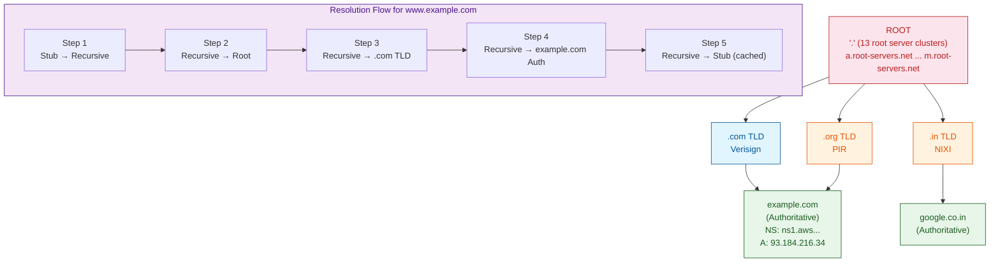

**DNS Record Types — The Full Reference:**

| Record | Purpose | Example | TTL Guidance |
|--------|---------|---------|-------------|
| A | Maps hostname → IPv4 | `www.example.com. IN A 93.184.216.34` | 300-3600s |
| AAAA | Maps hostname → IPv6 | `www.example.com. IN AAAA 2606:2800:220:1:248:1893:25c8:1946` | 300-3600s |
| CNAME | Canonical name alias | `api.example.com. IN CNAME lb.example.com.` | 600s |
| MX | Mail exchange server | `example.com. IN MX 10 mail.example.com.` | 3600s |
| NS | Authoritative name server | `example.com. IN NS ns1.example.com.` | 86400s |
| TXT | Arbitrary text (SPF, DKIM, DMARC) | `example.com. IN TXT "v=spf1 include:_spf.google.com ~all"` | 3600s |
| SRV | Service location (priority, weight, port, target) | `_sip._tcp.example.com. IN SRV 10 60 5060 sip.example.com.` | 300s |
| PTR | Reverse DNS (IP → hostname) | `34.216.184.93.in-addr.arpa. IN PTR www.example.com.` | 86400s |
| SOA | Start of Authority — zone metadata | `example.com. IN SOA ns1.example.com. admin.example.com. 2024010101 3600 900 604800 86400` | Cache only |
| CAA | Certificate Authority Authorization | `example.com. IN CAA 0 issue "letsencrypt.org"` | 86400s |

**Recursive vs Authoritative — The Distinction:**

```mermaid
flowchart LR
    subgraph RECURSIVE["Recursive Resolver"]
        RR_DESC["'Do the full resolution for me'"]
        RR_OPS["Operated by: ISP, Google (8.8.8.8),<br/>Cloudflare (1.1.1.1), OpenDNS"]
        RR_CACHE["Caches aggressively (respects TTL)"]
        RR_NOZONE["Does NOT own any zone data"]
        RR_DDOS["Protects against DoS via rate limiting"]
        RR_BLOCK["May implement blocklists, filtering"]
    end

    subgraph AUTH["Authoritative Server"]
        AU_DESC["'I know the answer for this zone; here it is'"]
        AU_OPS["Operated by: DNS provider<br/>(Route53, CloudDNS, PowerDNS, BIND)"]
        AU_ZONE["Serves only its own zones"]
        AU_NOCACHE["Does NOT cache"]
    end

    RECURSIVE -->|"Query → Response"| AUTH

    style RECURSIVE fill:#e1f5fe,stroke:#01579b,color:#01579b
    style AUTH fill:#e8f5e9,stroke:#1b5e20,color:#1b5e20
```

**TTL and Caching — The Performance-Complexity Trade-off:**

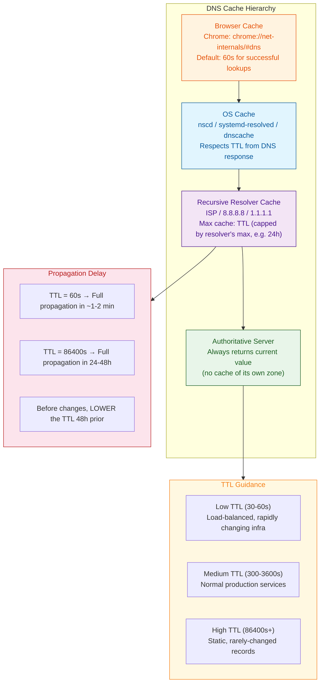

**DNS Propagation — The Myth vs Reality:**

"DNS propagation" is a misnomer. There is no central push mechanism. Each resolver independently expires its cache based on the TTL and re-queries the authoritative server. "Propagation" is the aggregate of all caches across the internet expiring and refreshing.

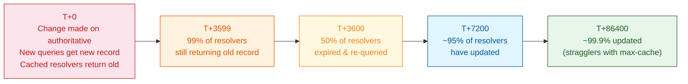

### The "Why"

1. **Human-Machine Translation:** Humans remember names, not IPs. DNS decouples the service identity (name) from its network location (IP), enabling IP changes without breaking user access.

2. **Global Load Distribution:** DNS-based load balancing (GeoDNS, weighted records, latency-based routing) directs users to the nearest or healthiest backend without requiring any changes to the application layer.

3. **Service Discovery in Distributed Systems:** In Kubernetes, CoreDNS provides DNS-based service discovery. A service named `my-svc.namespace.svc.cluster.local` resolves to the set of pod IPs backing that service. Without DNS, microservices would need a hardcoded service registry with health checks — DNS provides this as an infrastructure primitive.

### Trade-offs

| Feature | Hidden Cost | Mitigation |
|---------|-------------|------------|
| DNS Caching | Stale records during failover; clients hit dead IPs | Low TTL (30s) for critical records; proactive health-check-based DNS updates |
| DNS Amplification Attack | Public resolvers used as DDoS amplifiers (up to 50× reflection) | Rate limiting; Response Rate Limiting (RRL); disable recursion on auth servers |
| GeoDNS | Complexity; geo-DB maintenance; latency estimation inaccuracies | EDNS0 Client Subnet (ECS); Anycast routing |
| DNSSEC | Increased DNS response size (fragmentation risk); key management overhead; zone walking vulnerability | NSEC3 (mitigates zone walking); EDNS0 with TCP fallback for large responses |

---

## 2. Production Implementation (Full Stack & Cloud)

### Backend & Code Architecture

**Java — DNS-based service discovery with SRV records:**

```java
@Component
public class DnsServiceDiscovery {
    private static final Logger log = LoggerFactory.getLogger(DnsServiceDiscovery.class);

    /**
     * Resolves all SRV records for a given service and returns
     * sorted (by priority, then weight) list of targets.
     */
    public List<ServiceEndpoint> resolveSrv(String serviceName) {
        var env = new Hashtable<String, String>();
        env.put("java.naming.factory.initial",
                "com.sun.jndi.dns.DnsContextFactory");
        env.put("java.naming.provider.url", "dns://8.8.8.8");

        try {
            var ctx = new InitialDirContext(env);
            var attrs = ctx.getAttributes(
                serviceName, new String[]{"SRV"});
            var attr = attrs.get("SRV");
            if (attr == null) return List.of();

            var endpoints = new ArrayList<ServiceEndpoint>();
            var nenum = attr.getAll();
            while (nenum.hasMore()) {
                var parts = nenum.next().toString().split(" ");
                // SRV format: priority weight port target
                endpoints.add(new ServiceEndpoint(
                    Integer.parseInt(parts[0]),  // priority
                    Integer.parseInt(parts[1]),  // weight
                    Integer.parseInt(parts[2]),  // port
                    parts[3]                     // target hostname
                ));
            }

            // Sort by priority (asc), then weight (desc — higher weight = more traffic)
            endpoints.sort((a, b) -> {
                int priCmp = Integer.compare(a.priority(), b.priority());
                if (priCmp != 0) return priCmp;
                return Integer.compare(b.weight(), a.weight());
            });

            return endpoints;
        } catch (NamingException e) {
            log.error("SRV resolution failed for {}", serviceName, e);
            return List.of();
        }
    }

    public record ServiceEndpoint(int priority, int weight, int port, String target) {}
}
```

**Spring Boot — DNS health checks with JNDI:**

```java
@Component
public class DnsHealthIndicator implements HealthIndicator {
    @Override
    public Health health() {
        try {
            var addr = InetAddress.getByName("api.external-service.com");
            return Health.up()
                .withDetail("resolvedTo", addr.getHostAddress())
                .withDetail("canonicalName", addr.getCanonicalHostName())
                .build();
        } catch (UnknownHostException e) {
            return Health.down(
                new RuntimeException("DNS resolution failed for API endpoint", e)
            ).build();
        }
    }
}
```

**///etc/hosts and /etc/resolv.conf — The Local DNS Override:**

```bash
# /etc/hosts — Static hostname-to-IP mapping (checked before DNS)
# Format: IP_ADDRESS  CANONICAL_NAME  [ALIASES...]
#
# Localhost (IPv4)
127.0.0.1       localhost
127.0.0.1       my-dev-machine

# Localhost (IPv6)
::1             localhost ip6-localhost ip6-loopback

# Production overrides for development
# Uncomment to redirect production API to local
# 93.184.216.34  api.production.com

# Block malicious sites (redirect to localhost)
# 127.0.0.1  tracking.example.com

# Kubernetes /etc/hosts (injector via pod spec)
# Pods see service names via CoreDNS, but /etc/hosts overrides
# for special cases (e.g., database migration isolation)
```

```bash
# /etc/resolv.conf — Resolver configuration
# Format:
#   nameserver <IP>          (max 3, queried in order)
#   search <domain-list>     (append these to unqualified names)
#   domain <domain>          (default domain for unqualified names)
#   options <options>

# Typical cloud VM (single NIC):
nameserver 169.254.169.253  # AWS VPC DNS (VPC+2)
nameserver 1.1.1.1          # Cloudflare (fallback)
search ec2.internal.        # Append for short hostnames
options rotate              # Round-robin across nameservers
options timeout:2           # 2s timeout per query
options attempts:3          # Retry before returning error

# Kubernetes pod (auto-generated by kubelet via kube-dns config):
nameserver 10.100.0.10      # CoreDNS Service IP
search prod-svc.cluster.local svc.cluster.local cluster.local ec2.internal.
options ndots:5             # If query has <5 dots, search domains are appended
                            # before trying the FQDN
```

### DevOps & Infrastructure

**Docker DNS configuration:**

```dockerfile
# docker-compose.yml — custom DNS and search domains
version: "3.9"
services:
  app:
    image: myapp:latest
    dns:
      - 10.0.0.2   # Private DNS resolver
      - 1.1.1.1    # Fallback
    dns_search:
      - internal.corp.com
      - svc.cluster.local
    # Override /etc/hosts with extra_hosts
    extra_hosts:
      - "db.internal:10.0.1.5"
      - "cache.internal:10.0.1.10"
```

**Kubernetes CoreDNS Configuration:**

```yaml
# ConfigMap for CoreDNS — full custom configuration
apiVersion: v1
kind: ConfigMap
metadata:
  name: coredns
  namespace: kube-system
data:
  Corefile: |
    .:53 {
        # Kubernetes plugin — serves pods and services
        # Rewrites queries like my-svc.my-ns.svc.cluster.local → Cluster IP
        kubernetes cluster.local. in-addr.arpa ip6.arpa {
            pods insecure
            fallthrough in-addr.arpa ip6.arpa
            ttl 30
        }

        # Prometheus metrics on port 9153
        prometheus :9153

        # Health check endpoint
        health :8080

        # Forward external queries to VPC DNS resolver
        forward . 169.254.169.253 {
            max_concurrent 1000
            health_check 5s
        }

        # Cache with 30s TTL for external queries
        cache 30

        # Load balance across A/AAAA records
        loadbalance round_robin

        # Log all queries (disable in prod — high volume)
        # log . { class denial error }

        # Errors to stdout
        errors
    }

    # Internal zone — override external DNS for internal services
    internal.corp.com:53 {
        file /etc/coredns/internal.zone
        log
        errors
    }
---
# CoreDNS service — ClusterIP
apiVersion: v1
kind: Service
metadata:
  name: kube-dns
  namespace: kube-system
  annotations:
    prometheus.io/port: "9153"
    prometheus.io/scrape: "true"
spec:
  selector:
    k8s-app: kube-dns
  clusterIP: 10.100.0.10    # Fixed — this is the value injected into /etc/resolv.conf
  ports:
    - name: dns
      port: 53
      protocol: UDP
    - name: dns-tcp
      port: 53
      protocol: TCP
    - name: metrics
      port: 9153
      protocol: TCP
```

**Terraform — Route53 with GeoDNS and latency-based routing:**

```hcl
# Primary application record with latency-based routing
resource "aws_route53_record" "app" {
  zone_id = aws_route53_zone.main.zone_id
  name    = "app.example.com"
  type    = "A"

  alias {
    name                   = aws_lb.us_east.dns_name
    zone_id                = aws_lb.us_east.zone_id
    evaluate_target_health = true
  }

  # Latency routing policy — directs to the region with lowest latency
  latency_routing_policy {
    region = "us-east-1"
  }

  set_identifier = "app-us-east-1"
}

# Secondary failover record
resource "aws_route53_record" "app_failover" {
  zone_id = aws_route53_zone.main.zone_id
  name    = "app.example.com"
  type    = "A"

  alias {
    name                   = aws_lb.eu_west.dns_name
    zone_id                = aws_lb.eu_west.zone_id
    evaluate_target_health = true
  }

  # Failover routing — secondary disabled unless primary is unhealthy
  failover_routing_policy {
    type = "SECONDARY"
  }

  set_identifier = "app-eu-west-1"
}

# GeoDNS — serve different records based on client location
resource "aws_route53_record" "content" {
  zone_id = aws_route53_zone.main.zone_id
  name    = "content.example.com"
  type    = "CNAME"
  ttl     = 60

  geolocation_routing_policy {
    # Route all NA traffic to US CDN
    continent = "NA"
  }
  set_identifier = "content-na"
  records        = ["us-cdn.example.com."]
}

resource "aws_route53_record" "content_eu" {
  zone_id = aws_route53_zone.main.zone_id
  name    = "content.example.com"
  type    = "CNAME"
  ttl     = 60

  geolocation_routing_policy {
    continent = "EU"
  }
  set_identifier = "content-eu"
  records        = ["eu-cdn.example.com."]
}

# DNSSEC with KMS
resource "aws_route53_key_signing_key" "main" {
  hosted_zone_id = aws_route53_zone.main.id
  key_management_service_arn = aws_kms_key.dnssec.arn
  name = "main-ksk"
}

resource "aws_route53_hosted_zone_dnssec" "main" {
  depends_on = [aws_route53_key_signing_key.main]
  hosted_zone_id = aws_route53_zone.main.id
}
```

**CI/CD — DNS deployment with propagation verification:**

```yaml
# .gitlab-ci.yml — Safe DNS deployment with wait-for-propagation
dns-deploy:
  stage: deploy
  script:
    - |
      # Update Route53 record
      aws route53 change-resource-record-sets \
        --hosted-zone-id Z3WXYZ \
        --change-batch file://new-record.json

      # Wait for DNS to propagate across 10 global resolvers
      RESOLVERS="8.8.8.8 1.1.1.1 9.9.9.9 208.67.222.222"
      TARGET="new-lb-12345.elb.us-east-1.amazonaws.com"
      TIMEOUT=300  # 5 minute max

      for RESOLVER in $RESOLVERS; do
        for i in $(seq 1 $TIMEOUT); do
          RESULT=$(dig @$RESOLVER +short app.example.com)
          if [ "$RESULT" = "$TARGET" ]; then
            echo "✓ $RESOLVER resolved correctly"
            break
          fi
          if [ $i -eq $TIMEOUT ]; then
            echo "✗ $RESOLVER did NOT resolve after $TIMEOUT seconds"
            exit 1
          fi
          sleep 1
        done
      done
      echo "DNS propagation verified across all resolvers"
```

### Cloud Architecture — Full DNS Resolution Flow

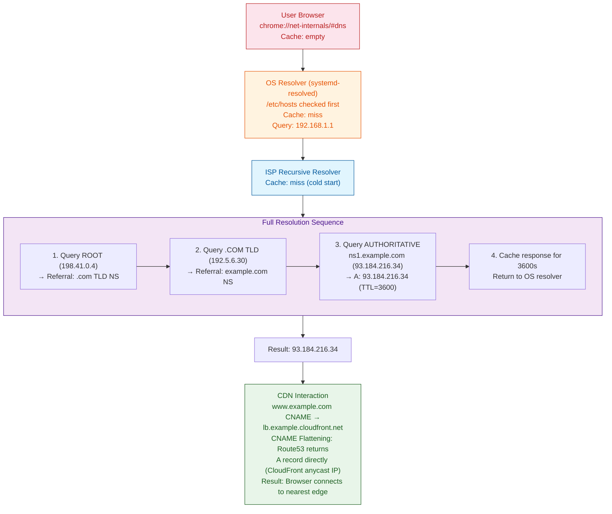

---

## 3. Real-World Scaling Scenarios

### The Bottleneck: DNS Cache Poisoning During Global Traffic Shift

**Scenario:** A major streaming platform needs to fail over 50 million concurrent users from US-East-1 to EU-West-1 after an AWS availability zone failure. They update the Route53 A record for `api.streaming.com` to point to the EU load balancer. The TTL was 86400 (24 hours). After 8 hours, only 28% of resolvers have re-queried. Users in North America are still hitting a dead US load balancer, receiving 502 errors.

```mermaid
flowchart LR
    T0["T+0<br/>US AZ down<br/>DNS changed"]
    T1["T+1s<br/>New users → EU<br/>success"]
    T10["T+10min<br/>Cached users<br/>still hitting US<br/>timeout"]
    T1H["T+1h<br/>~5% resolvers<br/>updated"]
    T8H["T+8h<br/>~28% resolvers updated<br/>72% of users still down"]
    T24H["T+24h<br/>~95% updated<br/>5% stale (max-cache)"]
    T48H["T+48h<br/>~99.9% updated<br/>recovery complete"]

    T0 --> T1 --> T10 --> T1H --> T8H --> T24H --> T48H
    T48H --> REVENUE["Revenue loss:<br/>$2.1M/hour × 24 hours = $50.4M"]

    style T0 fill:#fce4ec,stroke:#b71c1c,color:#b71c1c
    style T1 fill:#e8f5e9,stroke:#1b5e20,color:#1b5e20
    style T10 fill:#fff3e0,stroke:#e65100,color:#e65100
    style T1H fill:#fff8e1,stroke:#f57f17,color:#f57f17
    style T8H fill:#e1f5fe,stroke:#01579b,color:#01579b
    style T24H fill:#f3e5f5,stroke:#4a148c,color:#4a148c
    style T48H fill:#e8f5e9,stroke:#1b5e20,color:#1b5e20
    style REVENUE fill:#fce4ec,stroke:#b71c1c,color:#b71c1c
```

### The Solution: Pre-Failover TTL Reduction + Multi-Layer DNS

**Phase 1 — Proactive TTL Management (48 hours before expected failover):**

```yaml
# Step 1: Lower TTL to 60 seconds before known maintenance window
# This allows rapid propagation when the record changes
# Terraform:
resource "aws_route53_record" "api" {
  zone_id = aws_route53_zone.main.zone_id
  name    = "api.streaming.com"
  type    = "A"
  ttl     = 60  # Reduced from 86400

  records = [aws_eip.us_east.public_ip]
}
```

**Phase 2 — Health-Check-Based DNS with Route53 Failover:**

```hcl
# Step 2: Implement Route53 health checks for automated failover
resource "aws_route53_health_check" "us_east_api" {
  fqdn              = "api-us.streaming.com"
  port              = 443
  type              = "HTTPS"
  resource_path     = "/health"
  failure_threshold = 3
  request_interval  = 10
  measure_latency   = false
}

resource "aws_route53_record" "api_failover" {
  zone_id = aws_route53_zone.main.zone_id
  name    = "api.streaming.com"
  type    = "A"
  set_identifier = "us-east-primary"

  failover_routing_policy {
    type = "PRIMARY"
  }

  health_check_id = aws_route53_health_check.us_east_api.id
  ttl             = 60
  records         = [aws_eip.us_east.public_ip]
}

resource "aws_route53_record" "api_failover_secondary" {
  zone_id = aws_route53_zone.main.zone_id
  name    = "api.streaming.com"
  type    = "A"
  set_identifier = "eu-west-secondary"

  failover_routing_policy {
    type = "SECONDARY"
  }

  ttl     = 60
  records = [aws_eip.eu_west.public_ip]
}
```

**Phase 3 — CNAME Flattening with CDN Anycast:**

Instead of direct A records, use CloudFront with CNAME flattening:

```hcl
resource "aws_cloudfront_distribution" "api" {
  aliases = ["api.streaming.com"]

  origin {
    domain_name = aws_lb.primary.dns_name
    origin_id   = "primary-origin"
    failover_origin {
      domain_name = aws_lb.secondary.dns_name
      origin_id   = "secondary-origin"
    }
  }
}

resource "aws_route53_record" "api_cdn" {
  zone_id = aws_route53_zone.main.zone_id
  name    = "api.streaming.com"
  type    = "A"

  alias {
    name                   = aws_cloudfront_distribution.api.domain_name
    zone_id                = aws_cloudfront_distribution.api.hosted_zone_id
    evaluate_target_health = true
  }
}
```

Now the DNS TTL is irrelevant for failover — CloudFront's global edge network handles the traffic shift at the application layer within seconds.

---

## 4. Senior-Level Interview Deep Dive

### System Design Challenge

**Question:** Design a global DNS system for a real-time multiplayer gaming platform with 200 million monthly active users. The platform must support:
- Sub-50ms DNS resolution globally (99th percentile)
- Instant failover (< 5s) when a game server cluster dies
- DDoS resilience (20 Tbps attack is the SLA ceiling)
- DNSSEC signing without slowing resolution
- Integration with Kubernetes for service discovery (10,000 microservices)

**Optimal Blueprint:**

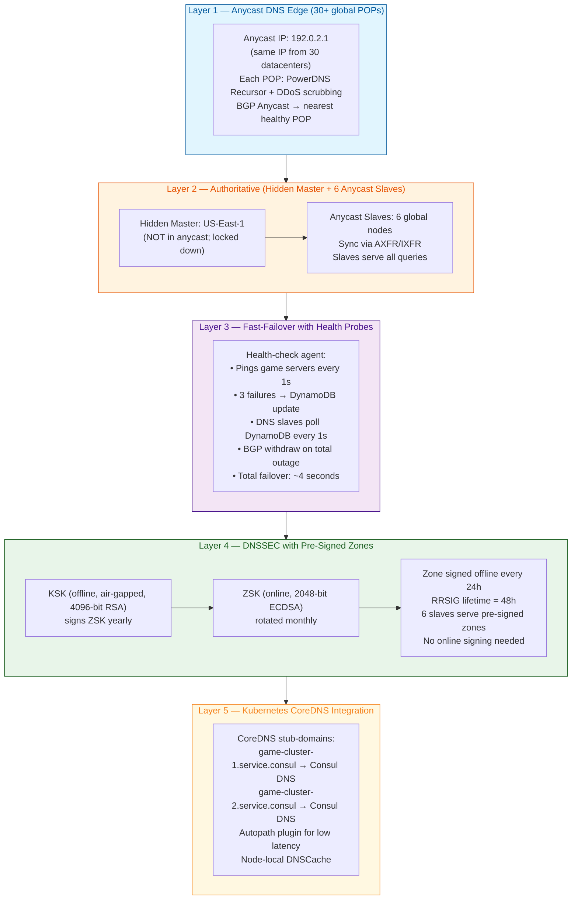

#### 4. Interview Preparation: Multi-Level QA

##### 🟢 Basic Level (Jr. Engineer / 0-2 Yrs)

**Q1:** What is the difference between an A record and a CNAME record?

**A1:** An **A record** maps a hostname directly to an IPv4 address (e.g., `www.example.com → 93.184.216.34`). A **CNAME record** maps a hostname to another hostname (an alias), e.g., `api.example.com → lb.example.com`. The client must then resolve the target hostname separately. CNAMEs cannot coexist with other record types for the same name, and the root domain name cannot be a CNAME (per RFC 1912). Use A records for the canonical name, CNAMEs for aliases.

**Q2:** What happens when you type a URL in a browser? Walk through the DNS resolution steps.

**A2:** 
1. Browser checks its local DNS cache (chrome://net-internals/#dns)
2. OS checks `/etc/hosts` file for static mappings
3. OS queries the configured recursive resolver (e.g., 192.168.1.1)
4. Recursive resolver queries the root server → gets referral to .com TLD
5. Recursive resolver queries .com TLD → gets referral to the domain's authoritative nameserver
6. Recursive resolver queries the authoritative nameserver → gets the A/AAAA record
7. Response is cached per TTL and returned to the browser
8. Browser now has the IP and opens a TCP connection

##### 🟡 Intermediate Level (Mid-Level / 2-5 Yrs)

**Q1:** In Kubernetes, how does CoreDNS resolve a headless service (clusterIP: None)? How does kube-proxy handle the endpoints?

**A1:** A headless service causes CoreDNS to return pod IPs directly instead of a single ClusterIP.

```yaml
apiVersion: v1
kind: Service
metadata:
  name: statefulset-svc
spec:
  clusterIP: None          # Triggers headless mode
  selector:
    app: stateful-app
```

**Resolution path:**
1. Pod queries `statefulset-svc.ns.svc.cluster.local`
2. CoreDNS kubernetes plugin finds the service
3. Since `clusterIP=None`, endpoint slices are NOT aggregated
4. CoreDNS queries endpoint slice API for all ready endpoints
5. A/AAAA queries return all pod IPs (round-robin via CoreDNS)
6. SRV queries return individual pod hostnames with ports

**kube-proxy behavior:**
- No ClusterIP → kube-proxy installs NO iptables/IPVS rules
- Client pods connect directly to pod IPs from DNS
- If pod IP changes, client must re-resolve (no automatic LB)
- Use headless services for StatefulSets where each pod needs a stable network identity

**Q2:** What is DNS amplification attack and how do you mitigate it?

**A2:** A DNS amplification attack uses small queries (~60 bytes) to trigger large responses (~4000 bytes) from open resolvers, amplified by EDNS0. The attacker spoofs the source IP to the victim's IP, causing all responses to flood the victim. Amplification factor: up to 70:1 with DNSSEC.

**Mitigations:**

```yaml
# 1. Disable recursion on authoritative servers
options {
    recursion no;
    allow-query { trusted-nets; };
};

# 2. Response Rate Limiting (RRL) on recursive resolvers
rate-limit {
    responses-per-second 10;
    slip 2;
};

# 3. Network-level: BGP Flowspec to drop DNS from unexpected sources
# 4. Deploy DNS-over-TLS/QUIC to prevent spoofing
# 5. Use anycast to absorb and distribute attack traffic
```

**Q3:** How do you diagnose a DNS resolution failure in production? Walk through the tools and steps.

**A3:** Start with `nslookup` in interactive mode (`set debug`) and non-interactive mode (`nslookup example.com 8.8.8.8`). For deeper diagnostics, use `dig`:
- `dig +short example.com` — quick A record lookup
- `dig +trace example.com` — step-by-step resolution from root
- `dig +additional example.com` — shows additional section (glue records)
Check `/etc/resolv.conf` for nameserver order, `systemd-resolve --status` for systemd DNS config. In Kubernetes, inspect CoreDNS logs: `kubectl logs -n kube-system -l k8s-app=kube-dns`. Check upstream DNS latency with `dig +stats example.com` and distinguish between resolver failure (timeout contacting upstream) vs authoritative failure (NXDOMAIN or SERVFAIL from the authoritative server). Use `tcpdump port 53` to capture raw DNS queries/responses when tools show conflicting results.

##### 🔴 Advanced Level (Senior / 5-8 Yrs)

**Q1:** Explain EDNS0 Client Subnet (ECS) in detail. How does it affect cache locality and resolver privacy, and when should you use it?

**A1:** ECS (EDNS0 option code 8) allows the recursive resolver to include a portion of the client's IP prefix (e.g., /24 for IPv4, /48 for IPv6) in the DNS query. The authoritative server uses this prefix for geo-aware responses instead of the resolver's IP (which may be in a different geography for large resolvers like 8.8.8.8).

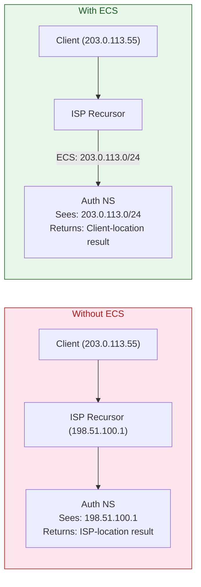

**Cache impact:**
- Without ECS: one cache entry per resolver (shared by all clients behind it)
- With ECS: one cache entry per /24 prefix — cache fragmentation
- Result: lower cache hit ratio, higher latency for less popular queries

**Privacy concern:** ECS leaks the client's IP prefix to authoritative servers. Mitigations:
- Use truncated prefix (/24 for IPv4 is coarse enough to prevent identification)
- Only enable ECS for geo-sensitive domains (CDNs)
- Use Oblivious DNS-over-HTTPS (ODoH) for privacy-critical lookups

**Q2:** Design a global DNS failover strategy for a real-time platform with 200M MAU that must fail over in under 5 seconds. Address TTL, caching, and health-check challenges.

**A2:** Traditional DNS failover with TTL=60s takes at least 60s to propagate. For sub-5s failover, a multi-layer architecture is required:

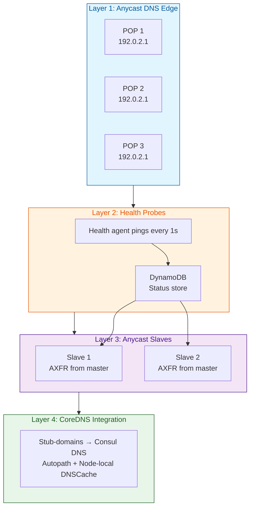

**Key mechanisms for sub-5s failover:**
1. **BGP anycast withdrawal** — BGP converges in <30s, and with BFD (Bidirectional Forwarding Detection), can achieve <1s convergence
2. **Health check → DynamoDB → DNS slave poll** — 1s + 1s + 1s = ~3s total
3. **Low TTL (1s)** for critical records, combined with TCP keepalives on established connections
4. **Pre-signed DNSSEC zones** — zone signed offline every 24h; no online signing latency
5. **Client-side retry with jitter** — exponential backoff with jitter to avoid thundering herd

##### ⚫ Expert Level (Staff/Principal / 8+ Yrs)

**Q1:** Describe the complete DNSSEC chain of trust from the root zone to `www.example.com`. What happens during each validation failure mode? How does NSEC3 prevent zone enumeration, and what are its cryptographic weaknesses?

**A1:**

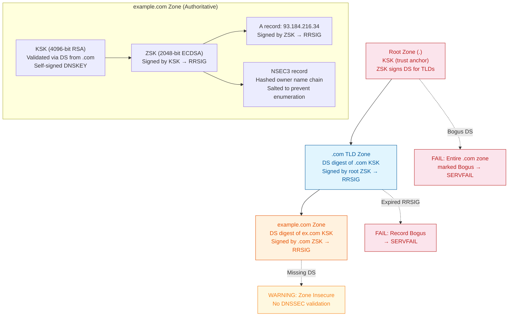

**Validation failure outcomes:**
- **Bogus DS at root:** Entire .com zone marked as Bogus → SERVFAIL
- **Expired RRSIG:** Record treated as Bogus → SERVFAIL returned
- **Missing DS:** Zone is Insecure (no DNSSEC) → acceptable but flagged
- **Signature mismatch:** Bogus → SERVFAIL with extended error code 6

**NSEC3 vs NSEC:**
- NSEC (original): returns the next domain name in the zone, allowing enumeration of all domain names via iterative queries. An attacker can walk the entire zone.
- NSEC3: returns the **hashed** next domain name using salted SHA-1. The salt is included in the record, making pre-computation of rainbow tables infeasible.

**NSEC3 Cryptographic Weaknesses:**
1. **Offline brute force:** The hash is unsalted per-record (salt is zone-wide). An attacker with the hash list can brute-force common names locally
2. **Opt-out (NSEC3 parameter):** Unsigned delegations are covered by NSEC3 opt-out records that leak which names have DNSSEC
3. **SHA-1 deprecation:** NSEC3 uses SHA-1, which is increasingly weak. NSEC5 (proposed standard) uses verifiable random functions to prevent enumeration entirely

**Q2:** Design a Response Policy Zone (RPZ) strategy for a large enterprise blocking 100K malicious domains while maintaining sub-millisecond DNS resolution. Address performance, update frequency, and false-positive handling.

**A2:**

```bind
# Hierarchical RPZ implementation
zone "rpz.malware.local" {
    type master;
    file "/etc/bind/db.rpz.malware";
    update-policy { grant rpz-updater zonesub ANY; };
};

zone "rpz.phishing.local" {
    type master;
    file "/etc/bind/db.rpz.phishing";
};

zone "rpz.corp-policy.local" {
    type master;
    file "/etc/bind/db.rpz.corp";
};
```

**Performance at 100K entries:**
- BIND loads RPZ into a hash table (O(1) lookup)
- Each RPZ policy adds ~50μs per query at 100K entries
- With 3 RPZ zones, total overhead: ~150μs — acceptable for sub-ms resolution

**Architecture:**

```mermaid
flowchart LR
    subgraph FEEDS["Threat Intelligence Feeds"]
        T1["Commercial TI Feed"]
        T2["Open Source (Spamhaus)"]
        T3["Internal Security"]
    end

    subgraph RPZ_UPD["RPZ Update Pipeline"]
        AGG["Aggregator<br/>Deduplicates 100K domains"]
        GEN["Zone Generator<br/>Converts to RPZ format<br/>Applies TTL and policy"]
        SIGN["Signing Service<br/>DNSSEC signs RPZ"]
    end

    subgraph DNS["DNS Infrastructure"]
        MASTER["Hidden Master<br/>Updates via IXFR"]
        SLAVES["Anycast Slaves (6 POPs)<br/>Serve RPZ + Authoritative"]
    end

    FEEDS --> AGG --> GEN --> SIGN --> MASTER --> SLAVES

    style FEEDS fill:#e1f5fe,stroke:#01579b,color:#01579b
    style RPZ_UPD fill:#fff3e0,stroke:#e65100,color:#e65100
    style DNS fill:#e8f5e9,stroke:#1b5e20,color:#1b5e20
```

**False positive handling:**
1. **Logging:** Every RPZ hit logged to a SIEM (Splunk/Elastic) with client IP and timestamp
2. **Override mechanism:** Whitelist domains via RPZ passthru: `important-partner.com CNAME rpz-passthru.`
3. **Staged rollout:** New feeds go to "monitor-only" RPZ that logs but doesn't block for 24h
4. **Rate-limited NXDOMAIN:** Instead of NXDOMAIN, return a block page IP with HTTP 200 explaining the block — users can request exceptions
5. **Automated false-positive reversal:** If 10+ unique source IPs query a blocked domain in 1 minute, auto-remove from RPZ and alert security team
