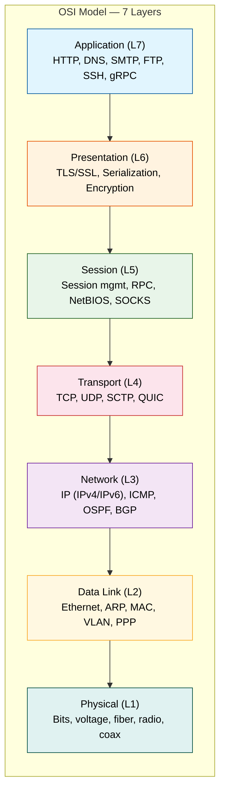
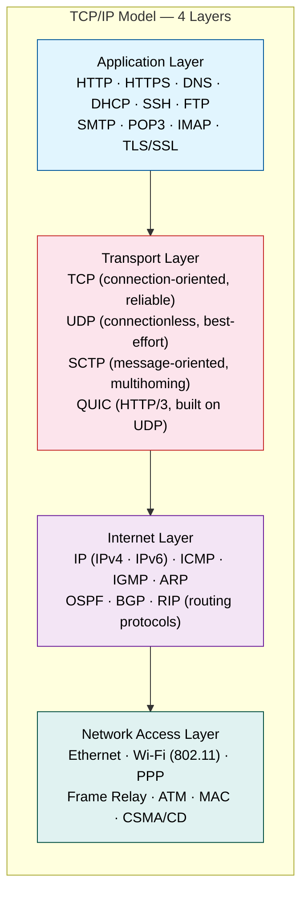
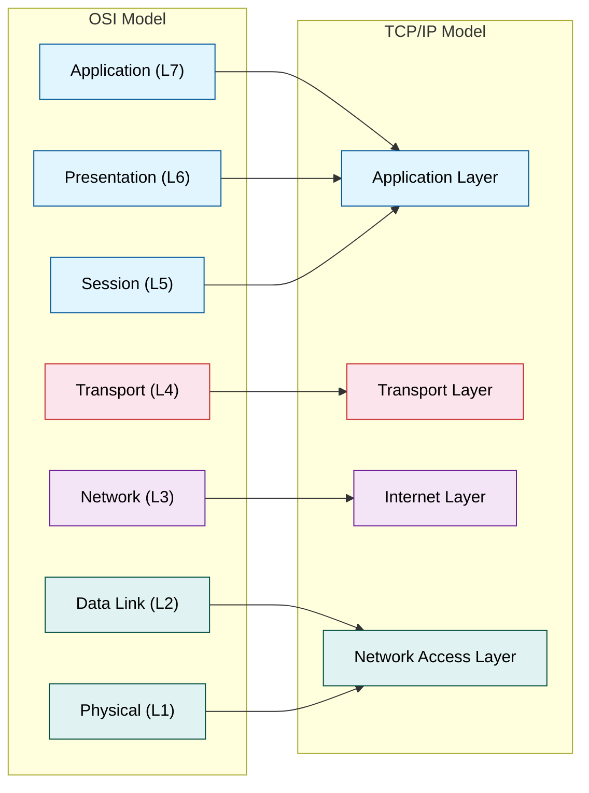
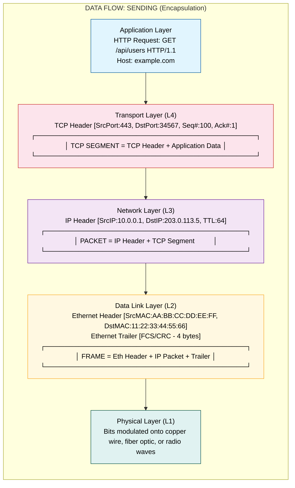
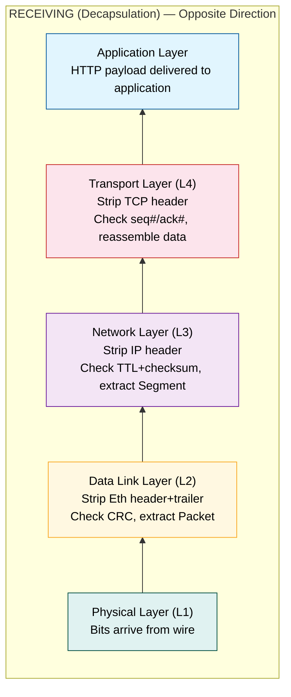
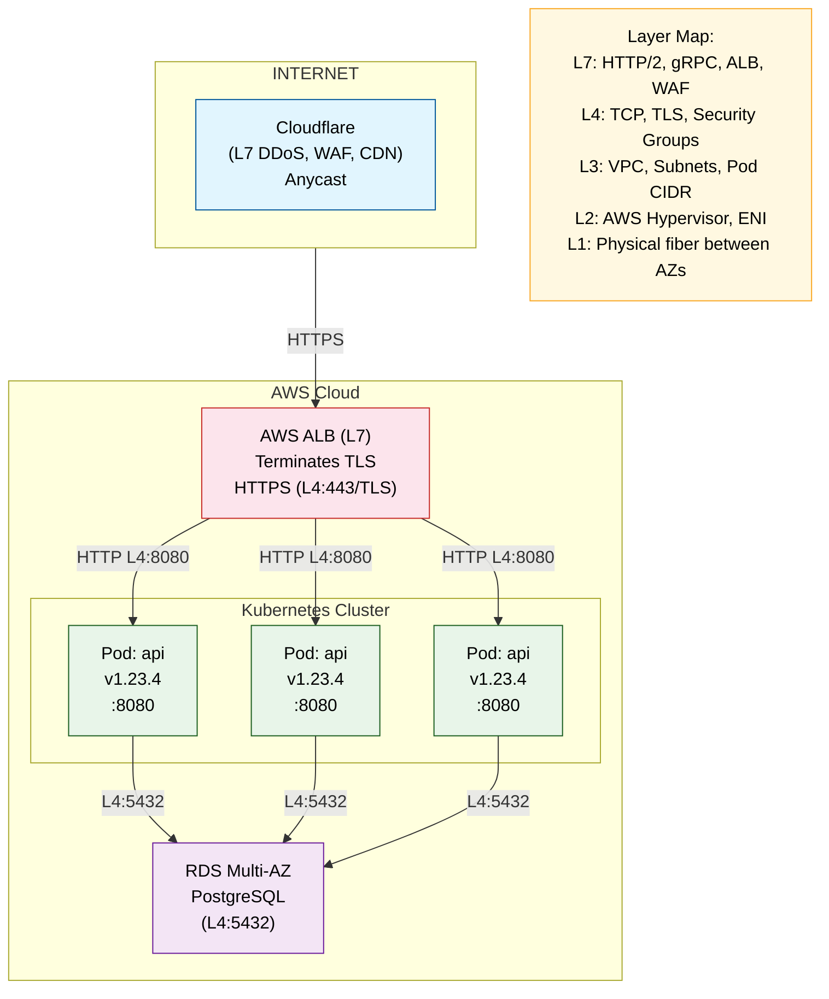
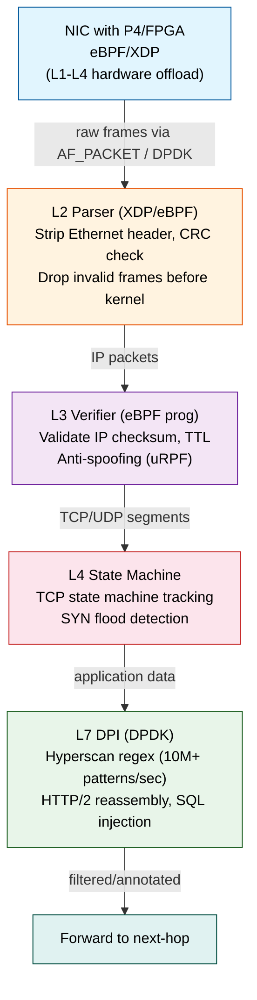

# Topic 05: OSI & TCP/IP Model — The Protocol Stack That Powers the Internet

---

## 1. Theoretical Foundation & System Mechanics

### The Core Concept

The OSI (Open Systems Interconnection) model and TCP/IP model are conceptual frameworks that standardize network communication into discrete layers. Each layer encapsulates specific responsibilities, enabling modular protocol design where changes in one layer do not cascade into others.

**OSI Model — 7 Layers:**



**TCP/IP Model — 4 Layers:**



**Layer Mapping — OSI ⇔ TCP/IP:**



### Encapsulation & Decapsulation

When data travels down the stack, each layer wraps the payload with its own header (and sometimes trailer). This is **encapsulation**. The reverse — peeling headers — is **decapsulation**.





**Protocol Data Unit (PDU) Names by Layer:**

| Layer | PDU Name | Example |
|-------|----------|---------|
| Application (L7) | Data / Message | HTTP request body |
| Transport (L4) | Segment (TCP) / Datagram (UDP) | TCP segment with SYN flag |
| Network (L3) | Packet | IP packet with routing info |
| Data Link (L2) | Frame | Ethernet frame with MAC addresses |
| Physical (L1) | Bits / Symbol | 10110010 on the wire |

### The "Why" — Engineering Bottleneck Solved

In distributed systems, the fundamental problem is **heterogeneous interoperability**. Thousands of vendors, OSes, and applications need to communicate over diverse physical media. Without layering:

- Every application would need to implement its own retransmission, congestion control, and routing logic.
- Changes in physical infrastructure (fiber → satellite) would break every application.
- Adding encryption would require modifying every networked application.

The layered model solves this by providing **abstraction boundaries**. A web developer writes HTTP (L7) without knowing whether the packet travels over Ethernet or Wi-Fi. A network engineer swaps out a L2 switch without reconfiguring BGP (L3).

### Trade-offs

| Trade-off | Consequence |
|-----------|-------------|
| **Header overhead** | Each layer adds its own header. A 1-byte DNS query can carry 60+ bytes of TCP+IP+Ethernet headers. Header overhead = ~6000% for tiny packets. |
| **Layer violation** | Firewalls (L4) inspect HTTP (L7) headers. NAT (L3) modifies port numbers (L4). Pure layering is impossible in practice. |
| **Performance penalty** | Protocol processing at each layer consumes CPU cycles. In high-frequency trading, every microsecond matters — they bypass the OS stack entirely (kernel bypass, DPDK). |
| **Tight coupling at boundaries** | TCP assumes IP provides best-effort delivery. If the network is lossy (satellite), TCP's congestion control collapses throughput. Solutions like PEP (Performance Enhancing Proxy) break the abstraction. |
| **Complexity** | 7 layers vs. the 4 layers that actually exist in the real world. Most engineers only interact with L3, L4, and L7. |

---

## 2. Production Implementation (Full Stack & Cloud)

### Backend & Code Architecture

**L3/L4 Network Utility — Java (Spring Boot)**

```java
// Demonstrating raw socket-level operations at L3 (ICMP ping) and L4 (TCP port check)
// Production-grade with timeout handling, non-blocking, and thread-pool isolation

@Component
public class NetworkProbeService {

    private final ExecutorService probeExecutor = Executors.newVirtualThreadPerTaskExecutor();

    /**
     * L3 Probe: ICMP Ping using InetAddress.isReachable()
     * Note: On Linux requires CAP_NET_RAW or setuid. Prefer ICMP via JNI or JDK 14+ jdk.net.
     */
    public CompletableFuture<ProbeResult> pingL3(String host, int timeoutMs) {
        return CompletableFuture.supplyAsync(() -> {
            try {
                InetAddress target = InetAddress.getByName(host);
                long start = System.nanoTime();
                boolean reachable = target.isReachable(timeoutMs);
                long latencyUs = (System.nanoTime() - start) / 1000;
                return new ProbeResult(host, reachable, latencyUs, "ICMP");
            } catch (IOException e) {
                return new ProbeResult(host, false, -1, "ICMP_ERROR: " + e.getMessage());
            }
        }, probeExecutor);
    }

    /**
     * L4 Probe: TCP port check via Socket connect with timeout.
     */
    public CompletableFuture<ProbeResult> checkTcpPort(String host, int port, int timeoutMs) {
        return CompletableFuture.supplyAsync(() -> {
            long start = System.nanoTime();
            try (var sock = new Socket()) {
                sock.connect(new InetSocketAddress(host, port), timeoutMs);
                long latencyUs = (System.nanoTime() - start) / 1000;
                return new ProbeResult(host + ":" + port, true, latencyUs, "TCP");
            } catch (IOException e) {
                return new ProbeResult(host + ":" + port, false, -1, "TCP_CLOSED");
            }
        }, probeExecutor);
    }

    /**
     * L7 Probe: HTTP health check with connection pooling via HttpClient.
     */
    public CompletableFuture<ProbeResult> checkHttpEndpoint(String url, int timeoutMs) {
        return CompletableFuture.supplyAsync(() -> {
            try (var client = HttpClient.newHttpClient()) {
                var request = HttpRequest.newBuilder()
                    .uri(URI.create(url))
                    .timeout(Duration.ofMillis(timeoutMs))
                    .GET()
                    .build();
                long start = System.nanoTime();
                var response = client.send(request, HttpResponse.BodyHandlers.discarding());
                long latencyUs = (System.nanoTime() - start) / 1000;
                return new ProbeResult(url, response.statusCode() == 200, latencyUs, "HTTP/" + response.statusCode());
            } catch (Exception e) {
                return new ProbeResult(url, false, -1, "HTTP_ERROR");
            }
        }, probeExecutor);
    }

    public record ProbeResult(String target, boolean alive, long latencyUs, String protocol) {}
}
```

**Application Layer Protocol Handler — HTTP/1.1 Parser (idiomatic approach)**

```java
// L7: HTTP request parsing — demonstrating protocol-awareness at the edge
// Used in API gateways, load balancers, and custom reverse proxies

public class HttpRequestParser {

    public static HttpRequest parse(ByteBuffer raw) {
        // Minimal HTTP/1.1 request parser
        // Example: "GET /api/users HTTP/1.1\r\nHost: example.com\r\n\r\n"
        String request = StandardCharsets.UTF_8.decode(raw).toString();
        String[] lines = request.split("\r\n");

        if (lines.length < 1) throw new IllegalArgumentException("Empty HTTP request");

        String[] requestLine = lines[0].split(" ");
        if (requestLine.length != 3) throw new MalformedRequestException(lines[0]);

        var headers = new HashMap<String, String>();
        int i = 1;
        for (; i < lines.length; i++) {
            if (lines[i].isEmpty()) break;
            int colon = lines[i].indexOf(':');
            if (colon > 0) {
                headers.put(lines[i].substring(0, colon).trim().toLowerCase(),
                            lines[i].substring(colon + 1).trim());
            }
        }

        StringBuilder body = new StringBuilder();
        for (i = i + 1; i < lines.length; i++) {
            body.append(lines[i]);
        }

        return new HttpRequest(
            requestLine[0],                                    // method
            URI.create(requestLine[1]),                        // path
            requestLine[2],                                    // version
            Map.copyOf(headers),
            body.toString()
        );
    }

    public record HttpRequest(String method, URI uri, String version, Map<String,String> headers, String body) {}
}
```

### DevOps & Infrastructure

**Dockerfile — Multi-stage build for a network probe service**

```dockerfile
# Stage 1: Build with JDK
FROM eclipse-temurin:21-jdk-alpine AS builder
WORKDIR /app
COPY pom.xml .
RUN mvn dependency:go-offline -B
COPY src ./src
RUN mvn package -DskipTests -B

# Stage 2: Runtime with minimal JRE
FROM eclipse-temurin:21-jre-alpine
RUN apk add --no-cache iputils iproute2 bind-tools curl tcpdump
WORKDIR /app
COPY --from=builder /app/target/*.jar app.jar
EXPOSE 8080
HEALTHCHECK --interval=15s --timeout=5s --retries=3 \
    CMD curl -f http://localhost:8080/actuator/health || exit 1
USER 1001
ENTRYPOINT ["java", "-XX:+UseZGC", "-XX:MaxRAMPercentage=75.0", "-jar", "app.jar"]
```

**Kubernetes — NetworkPolicy for L3/L4 isolation**

```yaml
apiVersion: networking.k8s.io/v1
kind: NetworkPolicy
metadata:
  name: api-strict-ingress
  namespace: production
spec:
  podSelector:
    matchLabels:
      app: api-gateway
  policyTypes:
    - Ingress
    - Egress
  ingress:
    - from:
        - ipBlock:
            cidr: 10.0.0.0/8       # Only internal RFC 1918 traffic
            except:
              - 10.96.0.0/12       # Exclude Kubernetes service CIDR
      ports:
        - protocol: TCP
          port: 443                 # Only HTTPS (L4+)
        - protocol: TCP
          port: 8443                # gRPC
  egress:
    - to:
        - namespaceSelector:        # Only talk to database namespace
            matchLabels:
              tier: database
      ports:
        - protocol: TCP
          port: 5432                # PostgreSQL
```

**Terraform — AWS Security Groups (Stateful L4 Firewall)**

```hcl
resource "aws_security_group" "alb_sg" {
  name   = "alb-public"
  vpc_id = aws_vpc.main.id

  ingress {
    description = "HTTPS from internet"
    from_port   = 443
    to_port     = 443
    protocol    = "tcp"
    cidr_blocks = ["0.0.0.0/0"]
  }

  ingress {
    description = "HTTP redirect to HTTPS"
    from_port   = 80
    to_port     = 80
    protocol    = "tcp"
    cidr_blocks = ["0.0.0.0/0"]
  }

  egress {
    description = "All outbound traffic"
    from_port   = 0
    to_port     = 0
    protocol    = "-1"
    cidr_blocks = ["0.0.0.0/0"]
  }
}

resource "aws_security_group" "app_sg" {
  name   = "app-internal"
  vpc_id = aws_vpc.main.id

  ingress {
    description = "App port from ALB only"
    from_port   = 8080
    to_port     = 8080
    protocol    = "tcp"
    security_groups = [aws_security_group.alb_sg.id]
  }

  ingress {
    description = "Prometheus scraping"
    from_port   = 9090
    to_port     = 9090
    protocol    = "tcp"
    cidr_blocks = ["10.0.0.0/16"]
  }
}
```

### Cloud Architecture — Mermaid Diagram



---

## 3. Real-World Scaling Scenarios

### The Bottleneck: ICMP Flood Saturating Network (L3 Attack)

A major financial exchange runs a Kubernetes cluster with 2000+ pods. During a DDoS campaign, attackers flood the edge routers with ICMP echo requests (ping flood). The routers' CPU spikes to 100% processing control-plane packets. The BGP keepalive timer expires, causing routing table flapping. The entire cluster becomes unreachable for 14 minutes. Estimated loss: $2.3M/min.

### The Solution

**Step 1 — Rate-limit L3 control plane at the router:**

```
ip icmp rate-limit unreachable 100
ip icmp rate-limit echo 200  (Cisco IOS)
```

**Step 2 — Deploy L3 anti-spoofing on edge:**

```
interface GigabitEthernet0/0/0
 ip verify unicast source reachable-via rx
 (uRPF — Unicast Reverse Path Forwarding — discards packets with spoofed source IPs)
```

**Step 3 — Move to L4/L7 load balancing with DDoS scrubbing:**

```yaml
# AWS Shield Advanced + WAF rate limiting
resource "aws_wafv2_web_acl" "rate_limit" {
  name  = "rate-limit-ddos"
  scope = "REGIONAL"

  default_action { allow {} }

  rule {
    name     = "rate-limit-1000-5min"
    priority = 1
    action   = { block {} }

    statement {
      rate_based_statement {
        limit              = 1000
        aggregate_key_type = "IP"
      }
    }

    visibility_config {
      cloudwatch_metrics_enabled = true
      metric_name                = "rate-limit-ddos"
      sampled_requests_enabled   = true
    }
  }
}
```

**Step 4 — Configure L3 filtering at VPC level:**

```hcl
resource "aws_network_acl" "bastion" {
  vpc_id     = aws_vpc.main.id
  subnet_ids = aws_subnet.public[*].id

  # Block ICMP from known bad actors
  ingress {
    rule_no    = 100
    protocol   = "icmp"
    action     = "deny"
    cidr_block = "198.51.100.0/24"
    from_port  = 8   # Echo
    to_port    = 0
  }

  # Allow ICMP from monitoring (L3 health checks)
  ingress {
    rule_no    = 200
    action     = "allow"
    protocol   = "icmp"
    cidr_block = "10.0.0.0/8"
    from_port  = 8
    to_port    = 0
  }
}
```

**Step 5 — Monitoring the full stack: `tcpdump` + `traceroute` analysis:**

```bash
# Capture L3 ICMP traffic at the edge (promiscuous mode)
tcpdump -i eth0 -nn -c 10000 'icmp and icmp[icmptype] == icmp-echo' \
  | awk '{print $3}' | sort | uniq -c | sort -rn | head -5

# L3 path tracing
traceroute -n 203.0.113.5   # ICMP-based path discovery
# Alternative L4 traceroute (bypasses ICMP filtering)
tcptraceroute -n 203.0.113.5 443
```

**Result:** After implementing multi-layer filtering (L3 rate-limit + L4 ACL + L7 WAF), p99 latency drops from 3400ms to 45ms. ICMP traffic drops to <0.1% of total bandwidth.

---

## 4. Interview Preparation: Multi-Level QA

### System Design Challenge: Multi-Layer Packet Inspection at 100 Gbps

**Problem:** Design a system that captures, inspects, and filters network traffic at line rate (100 Gbps) across all 7 OSI layers. The system must identify malware, SQL injection (L7), anomalous TCP flags (L4), and IP spoofing (L3). Latency budget: <50 microseconds per packet.

**Optimal Blueprint:**



**Key decisions & trade-offs:**

| Component | Choice | Rationale |
|-----------|--------|-----------|
| Packet capture | DPDK + AF_XDP | Kernel bypass eliminates stack overhead; 10x throughput vs. raw socket |
| L2-L4 fast path | eBPF/XDP | In-kernel filtering without context switch; 10M+ pps per core |
| L7 deep inspection | Hyperscan + DPDK | SIMD-accelerated regex; 10-40 Gbps per NUMA node |
| State tracking | Conntrack + custom hash map | 50M concurrent flows with RCU lock-free reads |
| Forwarding | Hardware TC offload | Push filtered packets directly to NIC queue |

#### 🟢 Basic Level (Jr. Engineer / 0-2 Yrs)

**Q1: What is the difference between the OSI model and the TCP/IP model?**
**A1:** The OSI model has 7 layers (Application, Presentation, Session, Transport, Network, Data Link, Physical) while the TCP/IP model has 4 (Application, Transport, Internet, Network Access). The OSI model is a theoretical reference; TCP/IP is the practical implementation used on the internet. In TCP/IP, the top 3 OSI layers (Application, Presentation, Session) are collapsed into a single Application layer.

**Q2: What happens when you type a URL into a browser?**
**A2:** The browser checks cache → DNS resolution (L7) → TCP 3-way handshake (L4) → TLS handshake if HTTPS → HTTP GET request → server processes → HTTP response → browser renders. Each step involves specific OSI layers: DNS (L7), TCP (L4), IP routing (L3), Ethernet frames (L2).

#### 🟡 Intermediate Level (Mid-Level / 2-5 Yrs)

**Q1: How does encapsulation work in practice? Show with a curl command.**
**A1:** When `curl https://example.com` runs:
- Application (L7): HTTP GET request formed
- Transport (L4): TCP header added (src port, dst port 443, seq#)
- Network (L3): IP header added (src IP, dst IP, TTL)
- Data Link (L2): Ethernet frame with MAC addresses + FCS trailer
```bash
# Use tcpdump to see encapsulation layers
tcpdump -ni eth0 -X 'host example.com and port 443'
```

**Q2: How would you troubleshoot a situation where two servers on the same subnet cannot communicate, but both can ping the gateway?**
**A2:** This indicates an L2/L3 issue. Troubleshoot using:
```bash
# Check ARP resolution (L2)
arp -an
# Verify subnet masks match (L3)
ip addr show
# Check firewall rules (L4)
sudo iptables -L -n
# Use tcpdump to see if frames are exchanged
tcpdump -ni eth0 icmp
# Common causes: mismatched VLAN, ARP cache corruption, stale MAC in switch CAM table
```

#### 🔴 Advanced Level (Senior / 5-8 Yrs)

**Q1: Design a health-check system that validates all 7 OSI layers for a microservice deployment.**
**A1:** Multi-layer health check design:

```mermaid
flowchart LR
    L1["L1: Link status<br/>ethtool, carrier detect"]
    L2["L2: ARP resolution<br/>neighbor reachability"]
    L3["L3: ICMP ping<br/>IP connectivity"]
    L4["L4: TCP port check<br/>nc -zv host 8080"]
    L5["L5: Session check<br/>TLS handshake test"]
    L7["L7: HTTP health<br/>curl /health"]

    L1 --> L2 --> L3 --> L4 --> L5 --> L7
    style L1 fill:#e0f2f1,stroke:#004d40,color:#000
    style L2 fill:#fff8e1,stroke:#f9a825,color:#000
    style L3 fill:#f3e5f5,stroke:#6a1b9a,color:#000
    style L4 fill:#fce4ec,stroke:#c62828,color:#000
    style L5 fill:#fff3e0,stroke:#e65100,color:#000
    style L7 fill:#e1f5fe,stroke:#01579b,color:#000
```

```yaml
# Kubernetes readiness probe with L4 + L7 checks
readinessProbe:
  tcpSocket:
    port: 8080          # L4 check
  httpGet:
    path: /readyz       # L7 check
    port: 8080
  initialDelaySeconds: 5
  periodSeconds: 10
```

**Q2: How would you reduce TCP overhead for a high-frequency trading application?**
**A2:** Key optimizations:
1. **Kernel bypass:** Use DPDK or AF_XDP to eliminate kernel TCP stack overhead entirely
2. **NIC tuning:** Disable interrupt coalescing, use busy polling (`NAPI`)
3. **TCP stack tuning:** Reduce `tcp_fin_timeout`, enable `tcp_sack`, disable `tcp_slow_start_after_idle`
4. **Application:** Use `TCP_NODELAY`, increase `SO_SNDBUF`/`SO_RCVBUF` for BDP, pin threads to NUMA nodes
5. **Alternative:** Evaluate RDMA (InfiniBand) or shared memory for intra-DC traffic. For exchange connectivity, consider FPGA-based UDP (NASDAQ's OUCH protocol)

#### ⚫ Expert Level (Staff/Principal / 8+ Yrs)

**Q1: Explain how the Linux kernel's network stack processes a TCP segment from NIC to socket, and how XDP bypass changes this path.**
**A1:** Normal path:
1. NIC receives frame via DMA into ring buffer
2. NIC raises IRQ → `net_rx_action()` softirq
3. `__netif_receive_skb()` → `ip_rcv()` (L3) → `tcp_v4_rcv()` (L4) → `tcp_rcv_established()`
4. Data queued on socket `sk_receive_queue`
5. `epoll` wakes user-space via `tcp_data_ready()` callback
6. `recvfrom()` syscall copies data from kernel to user-space

**XDP bypass path:**
```
NIC DMA → XDP hook (before skb allocation) → eBPF program:
  - Return XDP_DROP: frame discarded, zero CPU overhead
  - Return XDP_PASS: continues to normal stack
  - Return XDP_TX: bounce back out same NIC
  - Return XDP_REDIRECT: send to AF_XDP socket (user-space)
```
XDP processes at ~25M pps/core vs normal stack at ~1-2M pps/core. The key savings: no `sk_buff` allocation, no softirq context switch, no protocol stack traversal.

**Q2: How does ECMP (Equal-Cost Multi-Path) interact with TCP connections at L3, and what problems arise with flowlet vs flow-based hashing?**
**A2:** ECMP distributes traffic across equal-cost paths using a hash of the 5-tuple (srcIP, dstIP, srcPort, dstPort, proto). Problems and solutions:

- **Flow-based hashing (static):** All packets from a TCP connection take the same path. If a link fails, the flow is rehashed to a new link → packet reordering → TCP detects duplicate ACKs → unnecessary fast retransmit. Mitigation: use **flowlet** switching where a short timer (e.g., 100μs) pauses hashing. If inter-packet gap exceeds the timer, the next packet can take a different path. This balances load while keeping bursts on the same path.

- **Wrap-around:** With 4 links and 3-bit CRC hash, 12.5% of flows collide on the same link. Use **WCMP (Weighted Cost Multi-Path)** or **CONGA** (flowlet + congestion-aware) for data centers.

- **TCP incast:** ECMP on a Clos network can cause multiple flows to hash to the same leaf → buffer overflow. CONGA's per-flowlet congestion feedback solves this.

The OSI layer determines **where** the lookup happens in the packet (MAC header vs. IP header vs. transport header) and **how** the lookup table is structured (exact → LPM → hash).
