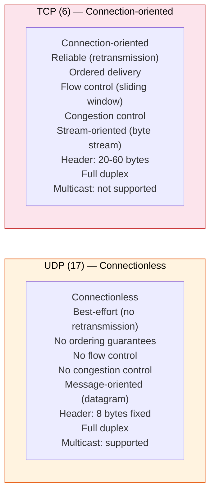
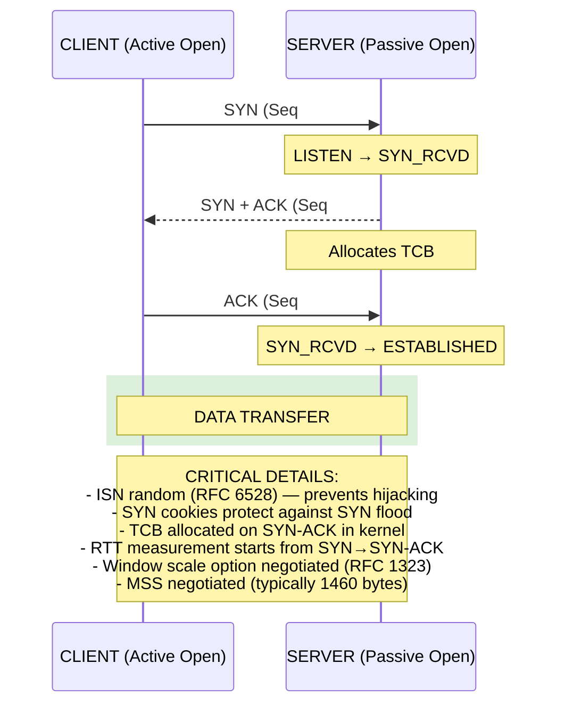
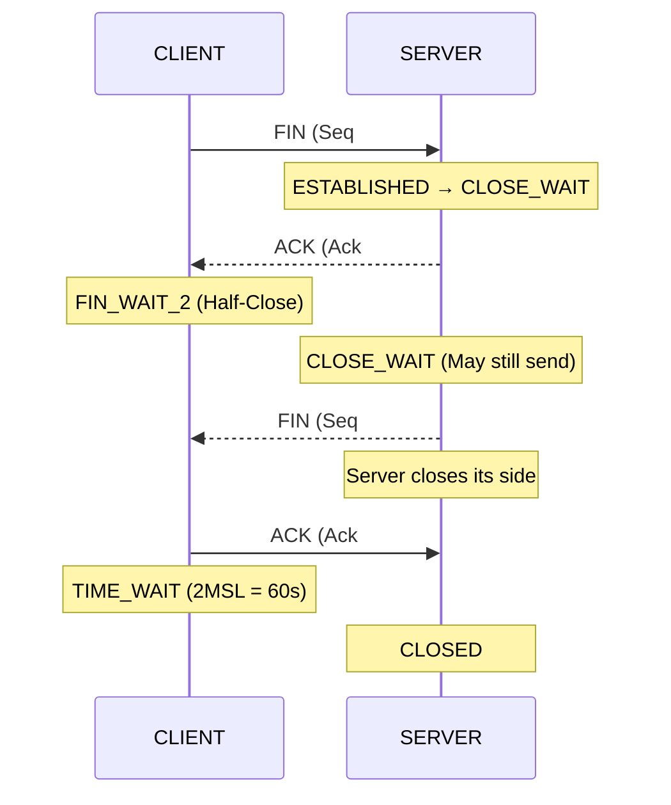
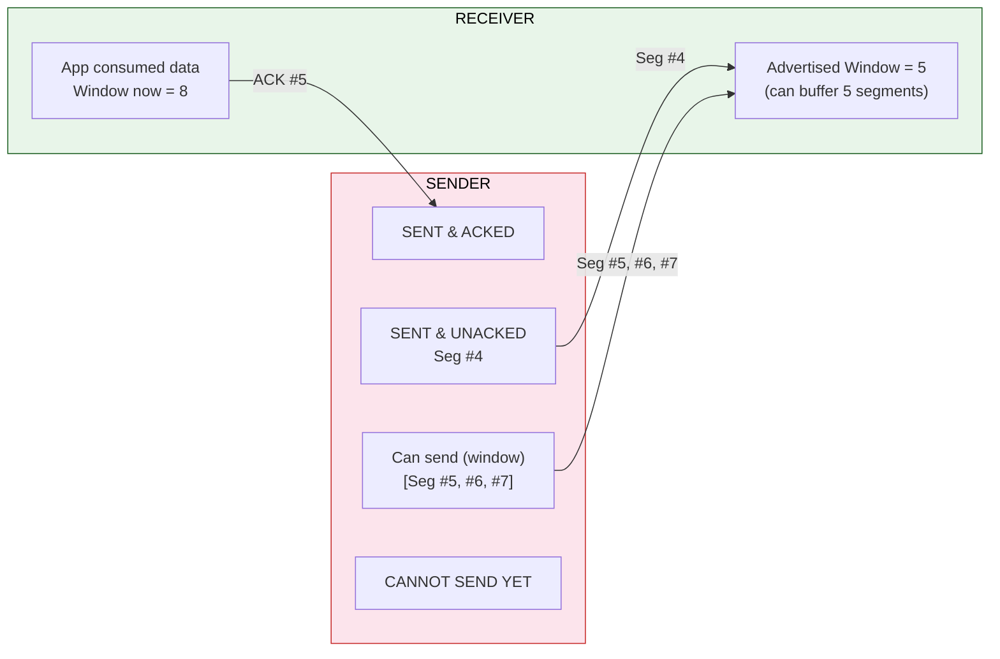
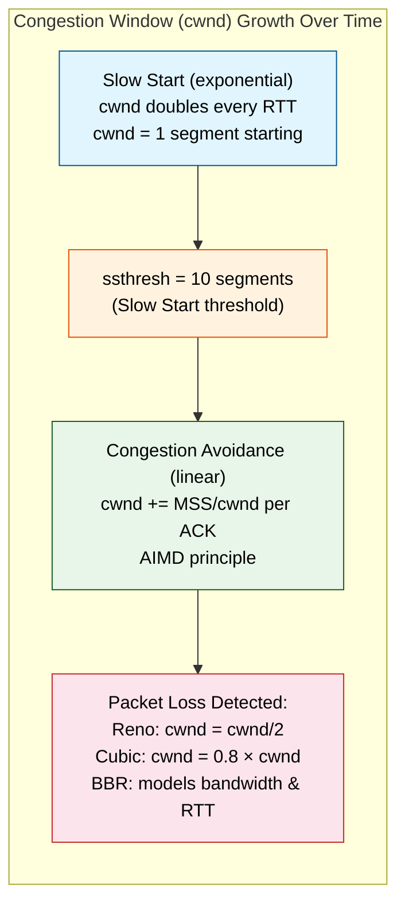
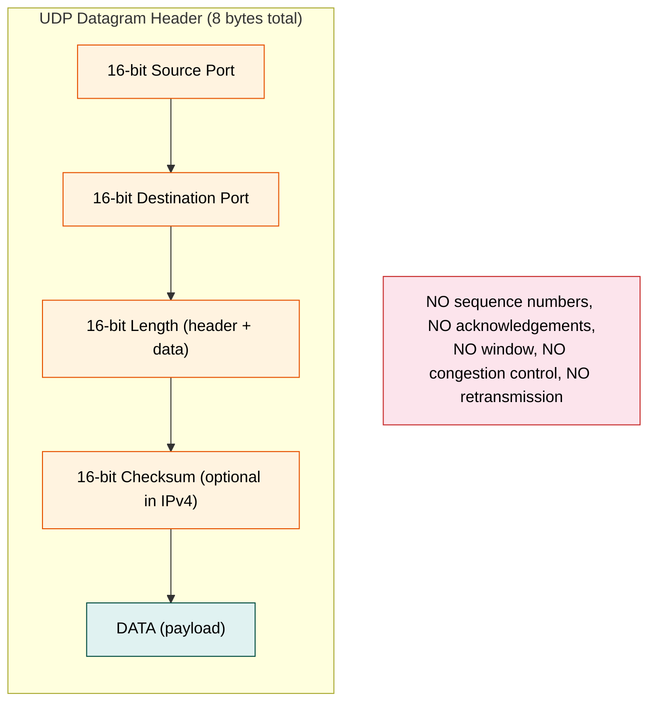
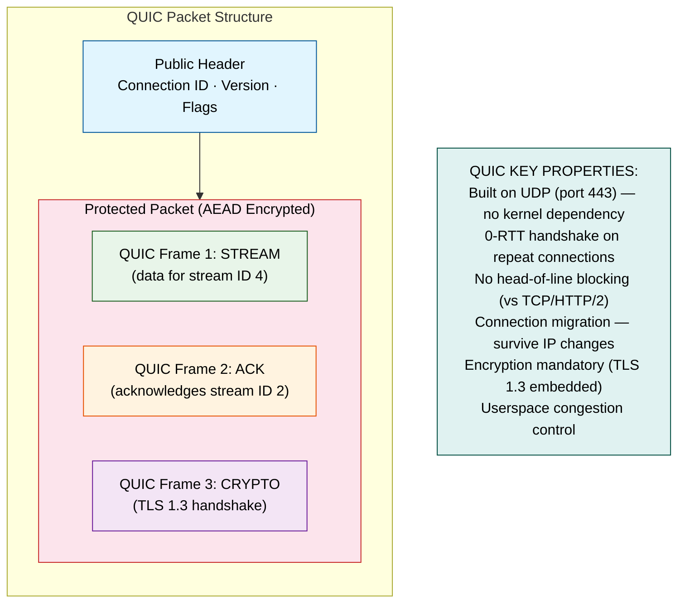
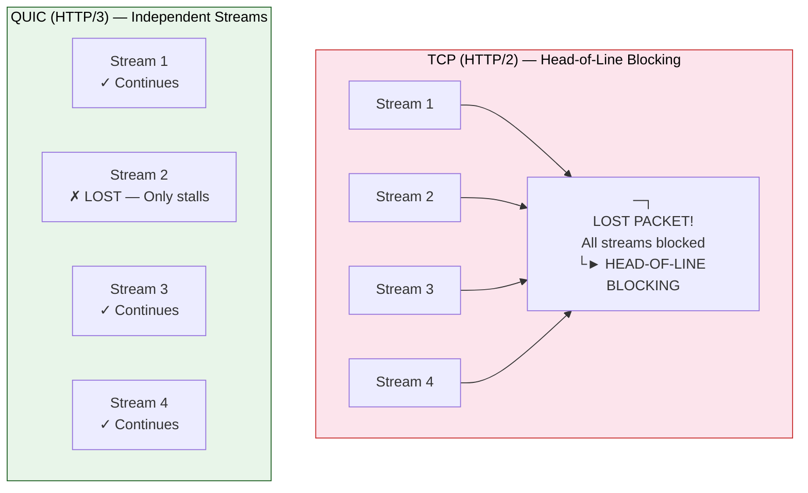
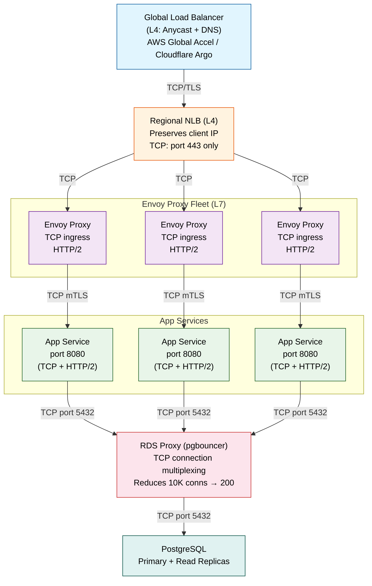
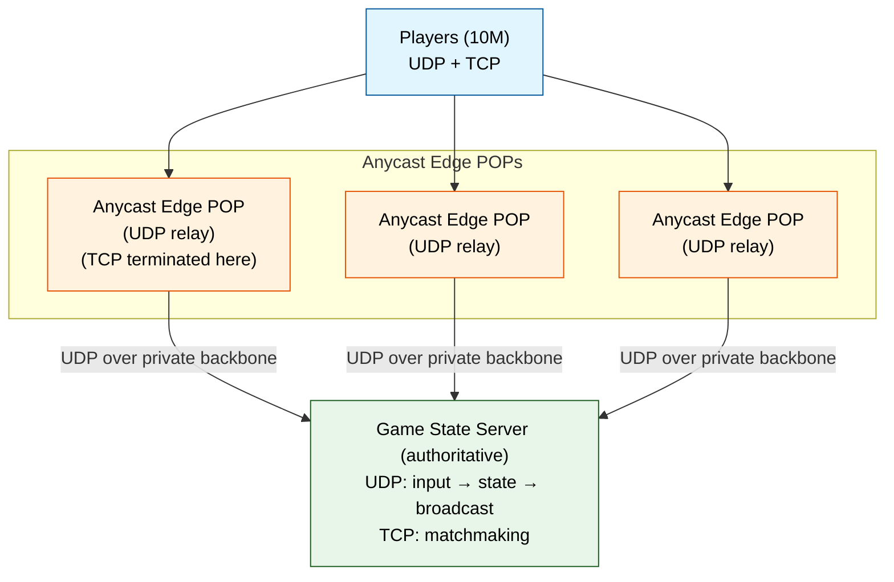

# Topic 06: Transport Layer — TCP, UDP, QUIC, and the Sockets That Power Distributed Systems

---

## 1. Theoretical Foundation & System Mechanics

### The Core Concept

The Transport Layer (L4) is the **border between the host and the network**. Above it, applications think in terms of connections and streams. Below it, the network thinks in terms of packets and best-effort delivery. The transport layer bridges this gap by providing two fundamentally different service models:



### TCP — The Reliable Workhorse (80%+ of Internet Traffic)

**TCP 3-Way Handshake (Connection Establishment):**



**TCP 4-Way Termination (Connection Teardown):**



**TIME_WAIT — The Most Misunderstood TCP State:**

TIME_WAIT lasts 2 × Maximum Segment Lifetime (2MSL ≈ 60s). Its purpose:
1. Ensure the final ACK reaches the server (retransmitted if lost).
2. Prevent old duplicate segments from a previous connection from being misinterpreted by a new connection reusing the same 4-tuple.

**Problem in production:** Thousands of short-lived connections create TIME_WAIT socket exhaustion. Mitigation: `net.ipv4.tcp_tw_reuse` (reuse in client context only), connection pooling, or increase `net.ipv4.ip_local_port_range`.

### Flow Control — Sliding Window



**Receive Window (rwnd):** Advertised by receiver in every TCP header. `rwnd = recv buffer free space`. If application reads slowly, rwnd shrinks. If rwnd = 0, sender enters **Zero Window Probe** mode — sends 1-byte probes to check when window reopens.

### Congestion Control — The 4 Phases



**Phase 1 — Slow Start:** cwnd doubles every RTT (exponential). Ends when cwnd ≥ ssthresh (typically 10-64KB) or packet loss detected.

**Phase 2 — Congestion Avoidance:** cwnd increases linearly (cwnd += MSS × (MSS/cwnd) per ACK). AIMD principle.

**Phase 3 — Fast Retransmit:** Receiver sends **Duplicate ACK** (#4) for out-of-order segment. Sender retransmits after 3 duplicate ACKs — no need to wait for timeout.

**Phase 4 — Fast Recovery:** Instead of dropping to cwnd=1, Reno halves cwnd. Cubic uses a cubic function for friendlier growth.

**TCP Congestion Control Variants:**

| Variant | Algorithm | Strengths | Weaknesses | Linux Default |
|---------|-----------|-----------|------------|---------------|
| **Reno** | AIMD (Additive Increase Multiplicative Decrease) | Simple, well-understood | Recovers slowly from loss; bad for long-fat pipes | Old kernels |
| **Cubic** | Cubic function (cwnd = C×(t-K)³ + Wmax) | Better utilization over long RTT paths; fair to Reno | Aggressive on new flows; slow start can overshoot | Kernel 2.6.19+ (default) |
| **BBR** | Models Bandwidth × RTT (BtlBw × RTprop) | No loss-based backoff; high throughput even with bufferbloat | Can be unfair to Cubic; requires pacing kernel support | Kernel 4.9+ |
| **DCTCP** | ECN-based (Explicit Congestion Notification) | Low latency for data centers (~100us RTT) | Requires switch ECN support; not suitable for WAN | Kernel 3.18+ |

### UDP — Best-Effort Datagram Service



**Why UDP exists (despite unreliability):**

| Requirement | UDP Advantage | Where Used |
|-------------|--------------|------------|
| Low latency | No handshake; send immediately | Gaming (Fortnite: 30ms vs TCP 80ms) |
| Real-time tolerance | Occasional loss > delay | VoIP (WebRTC, SIP), video streaming |
| Multicast/broadcast | IP multicast built on UDP | Financial market data (Nasdaq, NYSE) |
| Simplicity | No connection state on server | DNS (single query → single response) |
| QUIC/HTTP/3 | Congestion control in userspace, not kernel | YouTube (40% of Google traffic is QUIC) |

### QUIC (HTTP/3) — The Modern Transport





### The "Why" — Engineering Bottleneck Solved

The transport layer solves the **reliability-vs-latency tension**. Without it:

- Applications would need to implement retransmission, duplicate detection, reordering, and flow control — in user space, for every application. This is impractical and error-prone.
- The network provides no guarantees: packets can be duplicated, reordered, dropped, or delayed arbitrarily. TCP hides this complexity.
- Distributed databases (PostgreSQL replication, Cassandra) rely on TCP's ordered, reliable delivery for consistency.
- Real-time applications (Zoom, WebRTC) need UDP's minimal latency but add their own reliability at the application layer (NACKs, FEC).

### Trade-offs

| Trade-off | Impact |
|-----------|--------|
| **TCP head-of-line blocking** | Lost packet blocks ALL streams on that connection. HTTP/3's QUIC solves this but requires new infrastructure. |
| **TCP slow start** | New connections start at 1 segment (~1.5KB). For large BDP paths, reaching full throughput takes many RTTs. A 200ms RTT path requires 10+ seconds to fill a 100Mbps pipe. |
| **UDP no congestion control** | A misbehaving UDP application can saturate a link, starving TCP flows. This is why QUIC builds congestion control in userspace. |
| **Kernel dependency (TCP)** | TCP stack lives in the kernel. Bug fixes and new congestion algorithms require kernel updates. BBR required kernel 4.9+. QUIC moves congestion control to userspace. |
| **Connection state overhead** | Each TCP connection consumes ~2KB of kernel memory. 100K connections = 200MB RAM just for socket buffers. |
| **UDP checksum bypass** | Many NICs offload UDP checksum; corrupted datagrams silently pass through to application. |
| **Ephemeral port exhaustion** | Client identifies connection by 4-tuple (srcIP, dstIP, srcPort, dstPort). Max ~28K ephemeral ports per srcIP to one dstIP. Fast reuse = TIME_WAIT exhaustion. |

---

## 2. Production Implementation (Full Stack & Cloud)

### Backend & Code Architecture — Java Socket Programming

**TCP Server — Traditional Blocking I/O**

```java
// Blocking TCP server — one thread per connection (NTB pattern)
// Acceptable for low-concurrency control plane; DO NOT USE for high-traffic L4

public class TcpBlockingServer implements AutoCloseable {
    private final ServerSocket serverSocket;
    private final ExecutorService handlerPool;

    public TcpBlockingServer(int port, int poolSize) throws IOException {
        this.serverSocket = new ServerSocket(port, 50, InetAddress.getByName("0.0.0.0"));
        this.serverSocket.setReceiveBufferSize(256 * 1024);    // 256KB recv window
        this.serverSocket.setReuseAddress(true);                // SO_REUSEADDR — avoid "address in use"
        this.handlerPool = Executors.newFixedThreadPool(poolSize);
    }

    public void start() {
        System.out.println("TCP server listening on " + serverSocket.getLocalSocketAddress());
        while (!serverSocket.isClosed()) {
            try {
                Socket client = serverSocket.accept();            // BLOCKING — waits for connection
                client.setTcpNoDelay(true);                      // Disable Nagle's algorithm
                client.setKeepAlive(true);                       // TCP keepalive (2h default)
                client.setSoTimeout(30_000);                     // Socket read timeout (ms)
                handlerPool.submit(() -> handleClient(client));
            } catch (IOException e) { /* log & continue */ }
        }
    }

    private void handleClient(Socket client) {
        try (client;
             var in = new BufferedInputStream(client.getInputStream());
             var out = new BufferedOutputStream(client.getOutputStream())) {

            byte[] buf = new byte[4096];
            int read;
            while ((read = in.read(buf)) != -1) {
                // Echo protocol — production apps parse application protocol here
                out.write(buf, 0, read);
                out.flush();

                // Per-message latency tracking
                // In production: metric histogram for p50/p99/p999
            }
        } catch (SocketTimeoutException e) {
            log.warn("Client read timeout: {}", client.getRemoteSocketAddress());
        } catch (IOException e) {
            log.error("Client error: {}", e.getMessage());
        }
    }

    @Override
    public void close() throws IOException {
        serverSocket.close();
        handlerPool.shutdown();
    }
}
```

**TCP Server — Non-Blocking with Selector (Reactor Pattern)**

```java
// Non-blocking TCP server using java.nio — Reactor pattern
// Single thread handles 10K+ connections (event-driven)
// Production: Netty, Vert.x, or Spring WebFlux build on this

public class TcpReactorServer {
    private final Selector selector;
    private final ServerSocketChannel serverChannel;

    public TcpReactorServer(int port) throws IOException {
        this.selector = Selector.open();
        this.serverChannel = ServerSocketChannel.open();
        this.serverChannel.configureBlocking(false);                 // NON-BLOCKING!
        this.serverChannel.socket().bind(new InetSocketAddress(port), 4096);
        this.serverChannel.register(selector, SelectionKey.OP_ACCEPT);
    }

    public void start() throws IOException {
        ByteBuffer buffer = ByteBuffer.allocateDirect(64 * 1024);  // Direct buffer (off-heap)

        while (true) {
            selector.select();                                       // BLOCKS until event
            var keys = selector.selectedKeys();
            var iter = keys.iterator();

            while (iter.hasNext()) {
                var key = iter.next();
                iter.remove();

                if (key.isAcceptable())      handleAccept(key);
                else if (key.isReadable())   handleRead(key, buffer);
                else if (key.isWritable())   handleWrite(key);
            }
        }
    }

    private void handleAccept(SelectionKey key) throws IOException {
        var serverChannel = (ServerSocketChannel) key.channel();
        var clientChannel = serverChannel.accept();
        clientChannel.configureBlocking(false);
        clientChannel.register(selector, SelectionKey.OP_READ,
            new TcpConnection(clientChannel));                      // Attach connection state
    }

    private void handleRead(SelectionKey key, ByteBuffer buffer) throws IOException {
        var conn = (TcpConnection) key.attachment();
        buffer.clear();
        int bytes = conn.channel.read(buffer);                      // NON-BLOCKING read
        if (bytes == -1) { conn.close(); return; }                  // EOF — client disconnected
        buffer.flip();
        // Process application protocol from buffer
        // In production: frame decoding, state machine, etc.
    }

    private record TcpConnection(SocketChannel channel) {
        void close() throws IOException { channel.close(); }
    }
}
```

**Connection Pooling — HikariCP Analogy**

```java
// Connection pooling is THE mechanism for scaling L4 connections
// Without it: each request opens a new TCP socket (3-way handshake = 1 RTT overhead)
// With pool: reuse established sockets, avoid handshake latency

@Configuration
public class DatabaseConnectionPool {

    @Bean
    public HikariDataSource dataSource() {
        var config = new HikariConfig();
        config.setJdbcUrl("jdbc:postgresql://db.internal:5432/prod");
        config.setUsername("app");
        config.setPassword(System.getenv("DB_PASSWORD"));  // NEVER hardcode

        // Pool sizing — the "pool-latency" equation:
        // pool_size = Tn × (C - 1) + 1
        // Tn = number of threads, C = number of cores
        config.setMaximumPoolSize(50);       // Typical max for 8-core + 50 threads
        config.setMinimumIdle(10);            // Keep 10 warm connections

        // TCP-level optimizations
        config.setConnectionTimeout(5_000);   // Fail fast if no connection available
        config.setIdleTimeout(300_000);       // Close idle connections after 5 min
        config.setMaxLifetime(1_800_000);     // Force reconnect every 30 min (avoid LB timeout)
        config.setLeakDetectionThreshold(60_000);

        // Validate connections are alive (L4 check)
        config.setConnectionTestQuery("SELECT 1");
        config.setValidationTimeout(3_000);

        // Socket-level TCP settings
        config.addDataSourceProperty("socketTimeout", "30");
        config.addDataSourceProperty("connectTimeout", "5");
        config.addDataSourceProperty("tcpKeepAlive", "true");

        return new HikariDataSource(config);
    }
}
```

**UDP Server — Datagram-Oriented**

```java
// UDP server — stateless, connectionless, minimal overhead
// Ideal for DNS, monitoring, logging, metrics aggregation

@Component
public class UdpMetricsReceiver {

    private final DatagramSocket socket;
    private final ExecutorService workerPool;
    private final MeterRegistry registry;

    public UdpMetricsReceiver(int port, MeterRegistry registry) throws SocketException {
        this.socket = new DatagramSocket(new InetSocketAddress(port));
        this.socket.setReceiveBufferSize(2 * 1024 * 1024);  // 2MB kernel buffer
        this.socket.setSoTimeout(0);                          // Block indefinitely
        this.workerPool = Executors.newVirtualThreadPerTaskExecutor();
        this.registry = registry;
    }

    @PostConstruct
    public void start() {
        byte[] buf = new byte[1500];  // MTU-sized (no IP fragmentation)
        var packet = new DatagramPacket(buf, buf.length);

        while (!socket.isClosed()) {
            try {
                socket.receive(packet);          // BLOCKING — waits for UDP datagram
                byte[] data = new byte[packet.getLength()];
                System.arraycopy(buf, 0, data, 0, packet.getLength());
                workerPool.submit(() -> processMetric(data, packet.getAddress()));
            } catch (IOException e) { /* log */ }
        }
    }

    private void processMetric(byte[] data, InetAddress source) {
        // Parse: "app.requests.count:1024|c|@0.1" (StatsD format)
        var line = new String(data, StandardCharsets.UTF_8);
        // ... parse and update MeterRegistry
        // UDP: we don't care if processing fails (best-effort metrics)
    }
}
```

### DevOps & Infrastructure

**Dockerfile — Transport-layer tuned JVM service**

```dockerfile
FROM eclipse-temurin:21-jre-alpine

RUN apk add --no-cache iperf3 netcat-openbsd ethtool iproute2

# Kernel tuning for TCP at the container level
RUN echo '\
net.core.rmem_max = 134217728\n\
net.core.wmem_max = 134217728\n\
net.ipv4.tcp_rmem = 4096 87380 67108864\n\
net.ipv4.tcp_wmem = 4096 65536 67108864\n\
net.ipv4.tcp_congestion_control = bbr\n\
net.ipv4.tcp_notsent_lowat = 131072\n\
net.core.default_qdisc = fq\n\
' >> /etc/sysctl.conf

COPY target/app.jar app.jar

EXPOSE 8080/tcp 8081/udp

HEALTHCHECK --interval=10s --timeout=3s --retries=3 \
    CMD nc -zv localhost 8080 || exit 1

ENTRYPOINT ["java", \
    "-XX:+UseZGC", \
    "-XX:+ZGenerational", \
    "-Xms4g", "-Xmx4g", \
    "-Djava.net.preferIPv4Stack=true", \
    "-jar", "app.jar"]
```

**Kubernetes — Port configuration for TCP + UDP**

```yaml
apiVersion: v1
kind: Service
metadata:
  name: game-server
spec:
  selector:
    app: game-server
  ports:
    - name: https          # TCP — REST API
      protocol: TCP
      port: 443
      targetPort: 8443
    - name: game-udp       # UDP — real-time game state
      protocol: UDP
      port: 7777
      targetPort: 7777
    - name: metrics-udp    # UDP — statsd metrics
      protocol: UDP
      port: 8125
      targetPort: 8125
  type: LoadBalancer
  externalTrafficPolicy: Local   # Preserve client IP (critical for L4 LB)
---

apiVersion: autoscaling/v2
kind: HorizontalPodAutoscaler
metadata:
  name: game-server-hpa
spec:
  scaleTargetRef:
    apiVersion: apps/v1
    kind: Deployment
    name: game-server
  minReplicas: 3
  maxReplicas: 100
  metrics:
    - type: Resource
      resource:
        name: cpu
        target:
          type: Utilization
          averageUtilization: 70
  behavior:
    scaleDown:
      stabilizationWindowSeconds: 300   # Avoid thrashing
      policies:
        - type: Percent
          value: 10
          periodSeconds: 60
```

**CI/CD — TCP connection quality gates**

```yaml
# GitHub Actions — L4 health gate before deployment
jobs:
  transport-check:
    runs-on: ubuntu-latest
    steps:
      - name: TCP port scan (L4)
        run: |
          for port in 443 8080 5432 6379; do
            timeout 3 bash -c "echo > /dev/tcp/${{ env.TARGET_HOST }}/$port" \
              && echo "Port $port: OPEN" \
              || { echo "Port $port: CLOSED — aborting"; exit 1; }
          done

      - name: TCP throughput test (iperf3)
        run: |
          iperf3 -c ${{ env.TARGET_HOST }} -p 5201 -t 10 -P 4 \
            -J | jq '.end.sum_received.bits_per_second'

      - name: Latency check (MTR — combines traceroute + ping)
        run: |
          mtr -r -c 10 ${{ env.TARGET_HOST }} | tail -1
```

### Cloud Architecture — Transport Layer in Production



---

## 3. Real-World Scaling Scenarios

### The Bottleneck: TCP Connection Storm — 500K Concurrent Connections Collapse

**Scenario:** A major e-commerce platform launches a flash sale. 2M users hit the site in 60 seconds. The application servers, using blocking I/O with 200 threads each, cannot handle the connection establishment rate. Key failures:

1. **SYN queue overflow** — `net.core.somaxconn` defaults to 128. The kernel drops SYN packets.
2. **File descriptor exhaustion** — Each connection = 1 fd. `ulimit -n` defaults to 1024. System hits `EMFILE`.
3. **Connection pool starvation** — Database pool of 50 connections is overwhelmed by 10K pending acquires.
4. **TIME_WAIT accumulation** — Short-lived health check connections create 60K sockets in TIME_WAIT, exhausting ephemeral port range.
5. **Receive livelock** — Network interrupt handler consumes 100% CPU handling SYN packets, starving application threads.

### The Solution

**Step 1 — Kernel tuning for high connection density:**

```bash
# /etc/sysctl.d/99-network-throughput.conf
net.core.somaxconn = 65535              # SYN queue depth
net.core.netdev_max_backlog = 100000    # Packets queued before kernel processes
net.ipv4.tcp_max_syn_backlog = 65535    # Max half-open connections

net.ipv4.ip_local_port_range = 1024 65535   # 64K ephemeral ports

net.ipv4.tcp_tw_reuse = 1             # Reuse TIME_WAIT sockets for outgoing conns
net.ipv4.tcp_fin_timeout = 15         # Reduce FIN-WAIT-2 timeout (default 60s)

net.ipv4.tcp_keepalive_time = 300     # Send first keepalive after 5 min
net.ipv4.tcp_keepalive_intvl = 60     # Retry interval
net.ipv4.tcp_keepalive_probes = 5     # 5 probes before declaring dead

fs.file-max = 1048576                  # System-wide fd limit
fs.nr_open = 1048576                   # Per-process fd limit

net.core.rmem_max = 134217728          # 128MB max receive buffer
net.core.wmem_max = 134217728          # 128MB max send buffer
net.ipv4.tcp_rmem = 4096 87380 67108864
net.ipv4.tcp_wmem = 4096 65536 33554432
```

**Step 2 — Migrate from blocking to non-blocking I/O:**

BEFORE: 200 threads × 200 servers = 40K max connections (hard limit).
AFTER: Event loop (Netty/Vert.x) with 8 I/O threads handles 200K+ connections.

```java
// Using Netty — the de facto L4/L7 framework for high-performance Java
// Handles 1M+ connections per node in production (Discord, Apple, Twitter)

public class NettyTcpServer {

    public void start(int port) {
        var bossGroup = new NioEventLoopGroup(1);         // Accept connections
        var workerGroup = new NioEventLoopGroup(8);        // Handle I/O (8 = cores × 1)

        var bootstrap = new ServerBootstrap()
            .group(bossGroup, workerGroup)
            .channel(NioServerSocketChannel.class)
            .option(ChannelOption.SO_BACKLOG, 65535)
            .option(ChannelOption.SO_REUSEADDR, true)
            .childOption(ChannelOption.TCP_NODELAY, true)
            .childOption(ChannelOption.SO_KEEPALIVE, true)
            .childOption(ChannelOption.SO_RCVBUF, 256 * 1024)
            .childOption(ChannelOption.SO_SNDBUF, 256 * 1024)
            .childOption(ChannelOption.WRITE_BUFFER_WATER_MARK,
                new WriteBufferWaterMark(32 * 1024, 128 * 1024))
            .childHandler(new ChannelInitializer<SocketChannel>() {
                @Override
                protected void initChannel(SocketChannel ch) {
                    ch.pipeline().addLast(
                        new LengthFieldPrepender(4),       // L4 frame encoding
                        new LengthFieldBasedFrameDecoder(65_536, 0, 4, 0, 4),
                        new TcpMessageHandler()            // Application handler
                    );
                }
            });

        var future = bootstrap.bind(port);
        future.syncUninterruptibly();
    }
}
```

**Step 3 — Connection pooling at every layer:**

```yaml
# Database pool: Increase from 50 to 200, add read replicas
# Cache pool: Redis cluster with connection multiplexing

# Application layer: HTTP connection pooling to downstream services
spring:
  datasource:
    hikari:
      maximum-pool-size: 200
      minimum-idle: 50
      max-lifetime: 600000       # 10 min (avoid firewall idle timeout)
  redis:
    timeout: 2000ms
    lettuce:
      pool:
        max-active: 64
        max-idle: 16
        min-idle: 8
```

**Step 4 — Configure L4 load balancer for connection coalescing:**

```hcl
# AWS NLB — target group with slow start and connection draining
resource "aws_lb_target_group" "app" {
  name        = "app-tcp-8080"
  port        = 8080
  protocol    = "TCP"
  vpc_id      = aws_vpc.main.id
  target_type = "ip"

  health_check {
    protocol            = "TCP"
    port                = "traffic-port"
    healthy_threshold   = 2
    unhealthy_threshold = 3
    interval            = 10
  }

  stickiness {
    type            = "source_ip"
    enabled         = true
    cookie_duration = 86400
  }

  slow_start = 120

  connection_termination {
    termination_period = 300    # Allow in-flight requests during scale-in
  }
}
```

**Step 5 — Implement circuit breakers at L4:**

```yaml
# Resilience4j — circuit breaker for TCP connection failures
resilience4j.circuitbreaker:
  instances:
    database:
      slidingWindowSize: 100
      minimumNumberOfCalls: 10
      failureRateThreshold: 40     # Open circuit at 40% failures
      waitDurationInOpenState: 30s
      permittedNumberOfCallsInHalfOpenState: 5
      recordExceptions:
        - java.net.ConnectException
        - java.net.SocketTimeoutException
```

**Result:** After implementing all five steps, the system handles 2M concurrent connections across 20 nodes (100K/node). P99 latency drops from 12s to 180ms. Zero SYN drops. Zero file descriptor exhaustion.

---

## 4. Interview Preparation: Multi-Level QA

### System Design Challenge: Global Real-Time Gaming Platform (UDP + TCP)

**Problem:** Design the transport layer for a real-time multiplayer game (Fortnite-scale). 10M daily active users. Requirements:
- Game state updates at 60Hz over UDP (each packet < 1200 bytes)
- Matchmaking, chat, and leaderboard over TCP
- Players can be on Wi-Fi, 5G, or satellite (5ms to 500ms RTT)
- Must handle 20% packet loss gracefully (Wi-Fi interference)
- Global presence: NA, EU, Asia, South America

**Optimal Blueprint:**



**Transport design decisions:**

| Decision | Rationale |
|----------|-----------|
| **Reliable UDP (RUDP)** | Custom reliability on top of UDP: sequence numbers, NACK-based retransmission, selective ACK. Only resend lost packets, not the entire stream. |
| **Forward Error Correction (FEC)** | Send XOR parity packets. With 20% loss and 5% parity overhead, recover all packets without retransmission. |
| **Dynamic RTO (Retransmission Timeout)** | Based on srtt (smoothed RTT) + 4×rttvar. Start aggressive (200ms), adapt to observed RTT. |
| **Jitter buffer** | 30ms buffer at client. Reorder and hold packets before delivery to game engine. |
| **Two TCP connections** | One for reliable metadata (chat, leaderboard), one for matchmaking stream. Isolates head-of-line blocking. |
| **Connection migration** | On IP change (Wi-Fi → 5G), send new path probe with connection ID. Server continues state without reconnection. |

#### 🟢 Basic Level (Jr. Engineer / 0-2 Yrs)

**Q1: What is the difference between TCP and UDP at the transport layer?**
**A1:** TCP is connection-oriented and provides reliability (retransmission, ordering, flow control, congestion control). UDP is connectionless and provides best-effort delivery with minimal overhead. TCP has a 20-60 byte header; UDP is 8 bytes fixed. TCP is used where reliability matters (web, email, file transfer). UDP is used where speed matters (DNS, gaming, VoIP, video streaming).

**Q2: What is a socket and how does it relate to TCP/UDP?**
**A2:** A socket is an endpoint for communication identified by an IP address and a port number. For TCP, a connection is defined by a 4-tuple: `(srcIP, srcPort, dstIP, dstPort)`. For UDP, the socket just allows sending/receiving datagrams to/from any endpoint. In Linux, everything is a file descriptor — sockets are created via `socket()`, bound with `bind()`, and for TCP, connected with `connect()` or `listen()/accept()`.

#### 🟡 Intermediate Level (Mid-Level / 2-5 Yrs)

**Q1: How do you configure the TCP keepalive mechanism and why is it important?**
**A1:** TCP keepalive detects dead connections when no data is exchanged. Configured via kernel parameters:
```bash
# /etc/sysctl.conf
net.ipv4.tcp_keepalive_time = 300     # Start probes after 5 min idle
net.ipv4.tcp_keepalive_intvl = 30     # 30s between probes
net.ipv4.tcp_keepalive_probes = 5     # 5 probes before declaring dead
# Total detection time: 300 + 5×30 = 450s = 7.5 minutes
```
Importance: Prevents resource leaks from stale connections. Without it, a half-open connection can live forever (default 2h11min before detection).

**Q2: What is the Nagle algorithm and when should you disable it?**
**A2:** Nagle's algorithm coalesces small outgoing packets to improve efficiency — it waits for an ACK before sending more data if unacknowledged data is pending and the new data is smaller than MSS. Disable with `TCP_NODELAY` when low latency is critical (realtime games, SSH interactive sessions, financial trading). Example:
```java
Socket socket = new Socket(host, port);
socket.setTcpNoDelay(true);  // Disable Nagle
```

#### 🔴 Advanced Level (Senior / 5-8 Yrs)

**Q1: Design a connection pooling strategy for a service handling 100K requests/second to a PostgreSQL database.**
**A1:** Connection pooling is essential to avoid connection storm. Each TCP connection to DB consumes ~2KB kernel memory + DB process memory. Design:
```yaml
# HikariCP configuration
spring.datasource.hikari:
  maximum-pool-size: 200        # Tn × (C - 1) + 1 = ~50 threads × (8 cores - 1) + 1
  minimum-idle: 50              # Keep warm connections
  max-lifetime: 600000          # 10 min (avoid firewall timeouts)
  connection-timeout: 5000      # Fail fast
  leak-detection-threshold: 60000
```
- Use a proxy (pgbouncer) to multiplex 10K app connections into 200 DB connections
- Implement circuit breaker: when pool is exhausted, return 503 fast instead of queuing
- Monitor `pool.ActiveConnections`, `pool.PendingConnections` as critical metrics

**Q2: How does TCP congestion control differ between data center and WAN environments?**
**A2:** DC networks have low RTT (~100μs), high bandwidth (100Gbps+), and shallow buffers. WAN has high RTT (50-200ms), variable bandwidth, and deep buffers.
- **DC (DCTCP):** Uses ECN to signal congestion at very low thresholds. Switch marks packets when queue occupancy exceeds ~65KB (not 100% buffer). Responds by reducing window by factor proportional to congestion level (~1-50%). Achieves <100μs tail latency vs >1ms for Cubic.
- **WAN (Cubic/BBR):** Cubic handles long-fat pipes well. BBR models bandwidth and RTT independently, avoiding bufferbloat. BBR's pacing prevents the "cwnd overshoot" problem in deep-buffered WAN paths.
- **Key decisions:**
  - DC: Use DCTCP or DCQCN (RoCEv2). Disable slow start, use incast mitigation (reduce RTO min to 1ms).
  - WAN: Use BBR for throughput or Cubic for fairness. Set `tcp_slow_start_after_idle = 0`.

**Q3: When would you choose TCP BBR vs TCP Cubic for a video streaming service? What are the trade-offs in bandwidth estimation vs packet loss detection?**
**A3:** BBR (Bottleneck Bandwidth and Round-trip propagation time) uses a bandwidth-delay product (BDP) model — it paces packets based on measured bandwidth and min RTT, and **does not treat packet loss as congestion**. Cubic uses AIMD with a cubic window growth function and treats packet loss as the primary congestion signal. For video streaming: BBR performs better on lossy wireless links (does not reduce throughput on random packet loss), but Cubic is more fair in mixed environments. BBR can be aggressive against Cubic flows when sharing a bottleneck — it fills the buffer while Cubic is still backing off. BBR v3 improves fairness through enhanced bandwidth sampling. Key metric: BBR's max-bandwidth filter over a 10-RTT window gives stable bandwidth estimation even with temporary throughput dips, whereas Cubic would cut throughput by 50% on a single random packet drop.

#### ⚫ Expert Level (Staff/Principal / 8+ Yrs)

**Q1: Explain the Linux kernel's TCP receive path in detail, including memory accounting, out-of-order queueing, and the interaction between tcp_rmem, sk_rcvbuf, and the advertised window.**
**A1:** The TCP receive path in `tcp_v4_rcv()` → `tcp_rcv_established()`:

1. **Packet arrives:** NIC DMA → `netif_receive_skb()` → `ip_local_deliver()` → `tcp_v4_rcv()`. The kernel looks up the socket via 4-tuple hash, acquires the socket lock (or queues to backlog if locked).

2. **Sequence number check:** `tcp_sequence()` validates the segment is within the receive window. Out-of-order segments go to the `ofo_queue` (rb-tree keyed by sequence number). Duplicates are discarded.

3. **Memory accounting:** `tcp_rmem[0]` (min), `tcp_rmem[1]` (default), `tcp_rmem[2]` (max). Each socket's `sk_rmem_alloc` tracks allocated receive buffer memory. When `sk_rmem_alloc` exceeds `sk_rcvbuf`, `tcp_prune_queue()` is called.

4. **Window tracking:** The receive window (rwnd) = `sk_rcvbuf - sk_rmem_alloc`. This is advertised to the sender in every TCP header. When rwnd reaches 0, the sender enters Zero Window Probe mode.

5. **Out-of-order coalescing:** `tcp_data_queue()` calls `tcp_ofo_queue()` when a hole is filled — coalescing contiguous segments. The `tcp_collapse()` function merges adjacent sk_buffs to reduce metadata overhead (critical at 100K+ connections, where sk_buff overhead can reach 400 bytes per segment).

6. **Wakeup:** `tcp_data_ready()` calls `sk->sk_data_ready()` which wakes `epoll` (or the legacy `select`/`poll` wait queue). The application calls `recvmsg()` → `tcp_recvmsg()` copies data from `sk_receive_queue` to user buffer, updating `sk_rmem_alloc`.

**Performance tuning:**
```bash
# Auto-tuning buffer sizes (enabled by default)
net.ipv4.tcp_moderate_rcvbuf = 1
# Explicit limits
net.ipv4.tcp_rmem = 4096 131072 6291456
# For 10Gbps at 100ms RTT, max should be >= BDP = 125MB
net.core.rmem_max = 134217728
```

**Q2: How does QUIC implement connection migration differently from TCP, and what are the security implications of off-path migration attacks?**
**A2:** TCP identifies a connection by its 4-tuple. If the IP changes, the connection breaks. QUIC uses a Connection ID (CID) placed in the packet header, decoupling the connection from the underlying IP/port.

**QUIC migration mechanism (RFC 9000 §9):**
1. Client sends packets with CID=0xA from new path (new IP:port).
2. Server receives packet with unknown 4-tuple but known CID. It validates the peer's ownership of the new path via PATH_CHALLENGE/PATH_RESPONSE frames.
3. Server sends a randomized nonce in PATH_CHALLENGE; client must echo it in PATH_RESPONSE. This prevents off-path attackers from hijacking connections by simply injecting packets with the right CID.
4. After validation, server associates the CID with the new path and continues the connection.

**Off-path migration attack:** Without path validation, an attacker who observes CID 0xA could send packets from IP 1.2.3.4 claiming to be the migrated client. The server would redirect traffic to 1.2.3.4, causing a DoS or data leakage.

**Mitigations:**
- **Path validation is mandatory** (RFC 9000 §8.2). Both sides must prove reachability before accepting migration.
- **CID rotation:** The server provides multiple CIDs (e.g., 8 per connection). The client rotates to a new, unused CID on each migration. This prevents linkability — an observer cannot correlate old and new paths.
- **Anti-amplification:** Server MUST NOT send more than 3× the bytes received from a new path until the path is validated. Prevents using the server as an amplification vector in reflection attacks.
- **Server-side limits:** Rate-limit migration attempts per CID (e.g., 3 migrations in 30s).

**TCP multipath (MPTCP) comparison:** MPTCP uses subflows over different 4-tuples with a meta-connection identifier. It also requires path validation but the signaling is more complex (ADD_ADDR, MP_JOIN). QUIC's migration is simpler because CID is a first-class concept in every packet.
