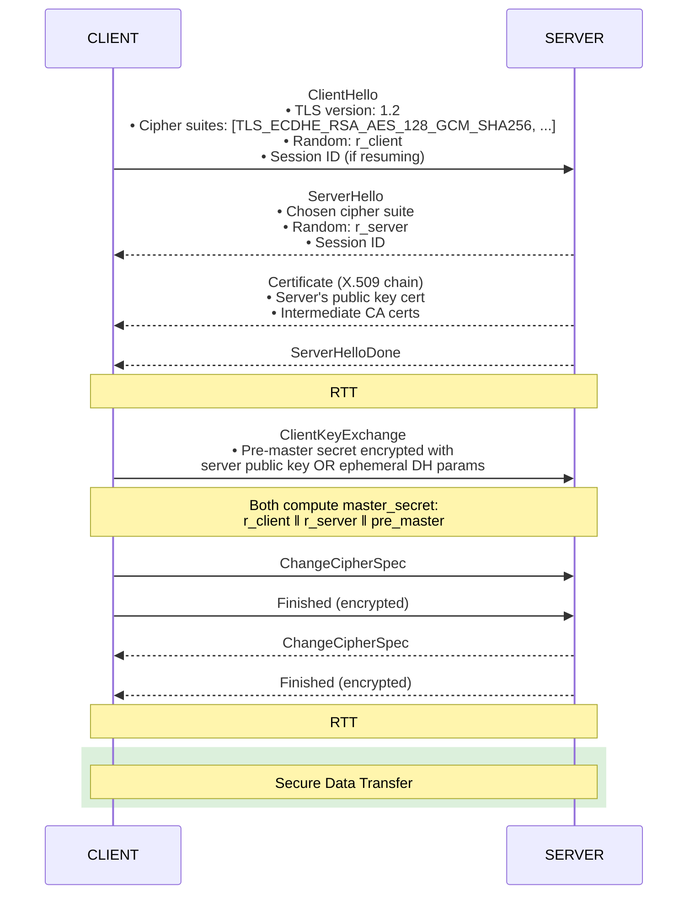
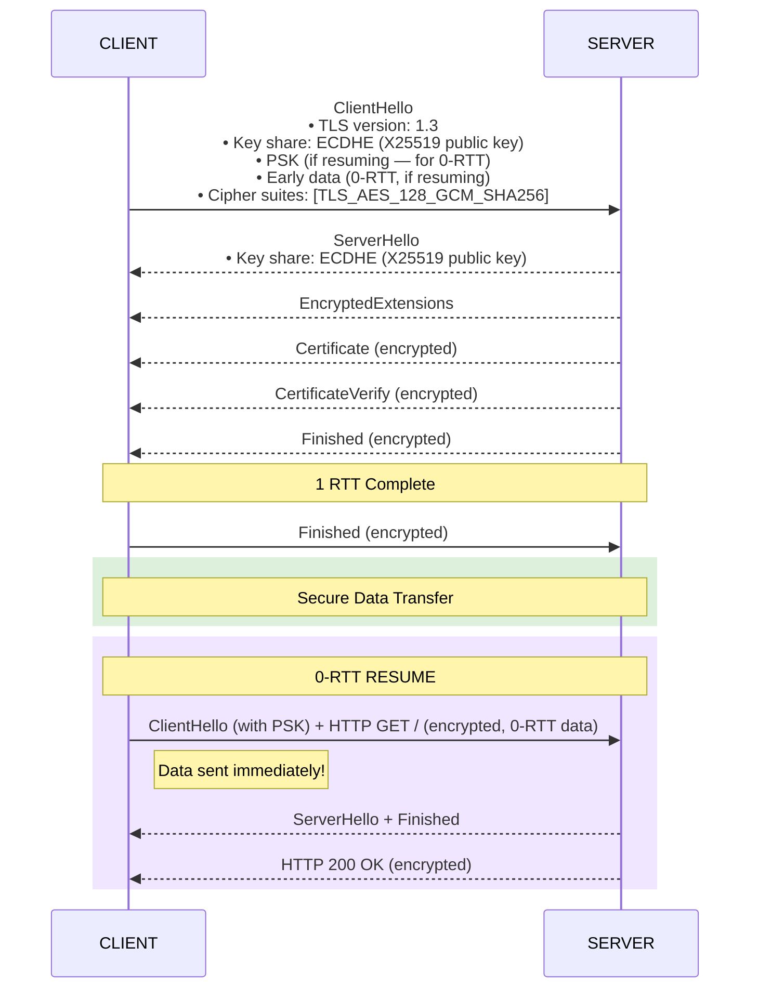
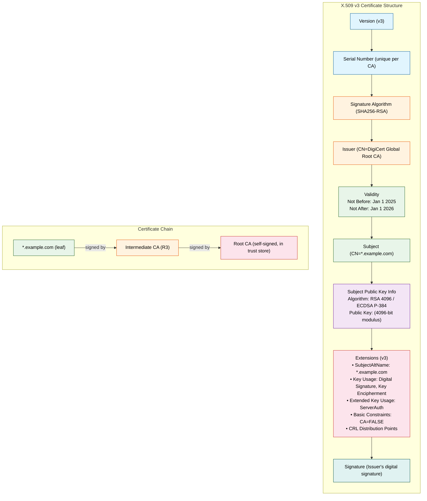
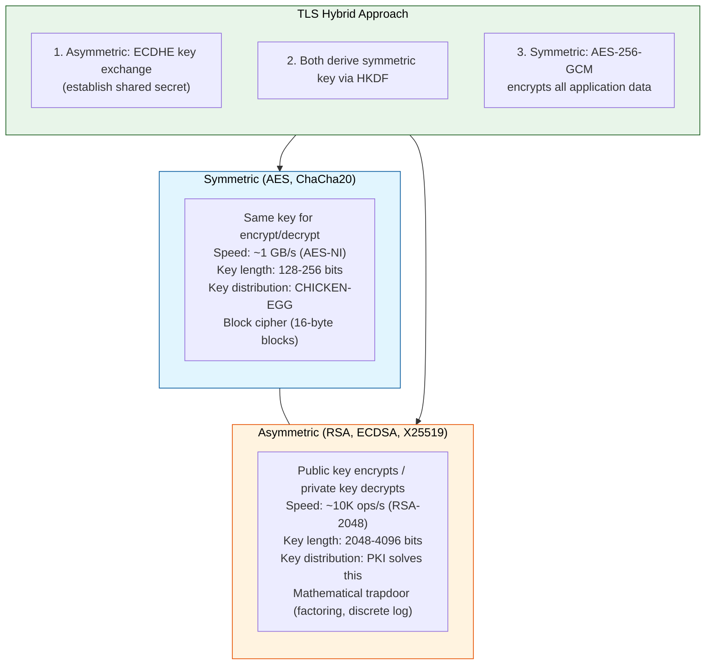
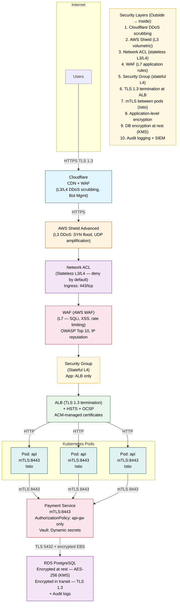
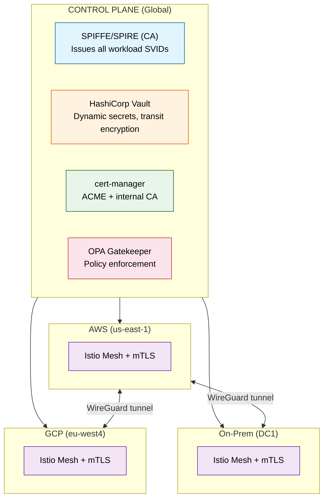
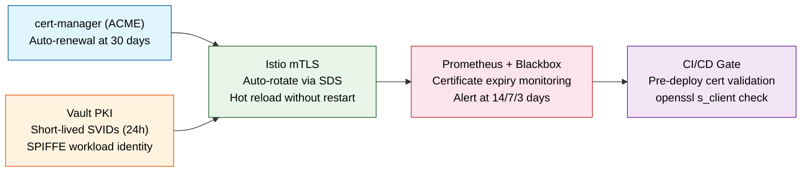
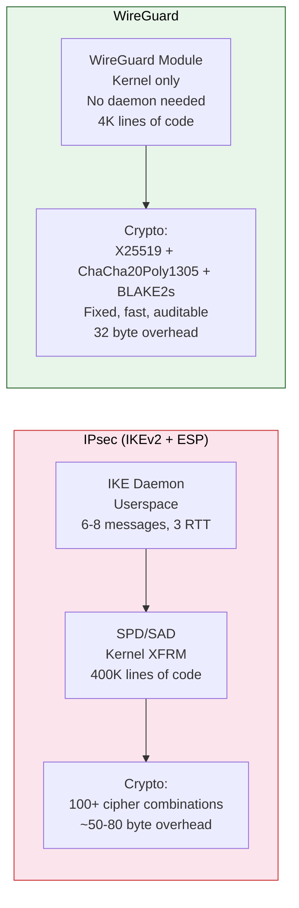

# Topic 07: Internet Security — TLS, Firewalls, VPNs, and the Defense-in-Depth Stack

---

## 1. Theoretical Foundation & System Mechanics

### The Core Concept

Internet security at the network level is about **confidentiality, integrity, authentication, and availability** — the CIA+A triad — applied at every layer of the stack. From the TLS handshake that encrypts your HTTP traffic to the firewall rules that filter packets at line rate, each mechanism solves a specific threat vector in distributed systems.

**Security Mapping Across the OSI Stack:**

```
LAYER       THREAT VECTOR           DEFENSE MECHANISM
─────       ─────────────           ─────────────────
L7 (App)    SQL injection, XSS,     WAF, input validation,
            CSRF, auth bypass       OAuth2/OIDC, CSP headers

L6 (Pres)   Weak encryption,        TLS 1.3, certificate pinning,
            downgrade attack        HSTS, cipher suite negotiation

L5 (Sess)   Session hijacking,      mTLS, session tokens,
            replay attack           Signed CSRF tokens, JWT

L4 (Trans)  SYN flood,              Stateful firewall, SYN cookies,
            connection hijacking    TCP timestamps (RFC 7323)

L3 (Net)    IP spoofing,            ACLs, uRPF, IPsec VPN,
            DDoS amplification      BGP Flowspec, DDoS scrubbing

L2 (Data)   MAC flooding,           Port security, 802.1X,
            ARP spoofing            Dynamic ARP inspection (DAI)

L1 (Phys)   Wiretapping,            Physical security, Faraday cages,
            signal jamming          encrypted transceivers
```

### TLS/SSL Handshake — TLS 1.2 vs 1.3

**TLS 1.2 Handshake (2 RTT):**



**TLS 1.3 Handshake (1 RTT, or 0-RTT on resume):**



**TLS 1.3 vs 1.2 — Key Differences:**

| Aspect | TLS 1.2 | TLS 1.3 |
|--------|---------|---------|
| Handshake latency | 2 RTT | 1 RTT (0-RTT on resume) |
| Cipher suites | ~30+ combinations | 5 AEAD suites only |
| Key exchange | RSA or (EC)DHE | (EC)DHE only (no RSA key transport) |
| Negotiation | Explicit cipher list | Supported versions + key shares |
| Encrypted handshake | No (certificates in clear) | Yes (entire handshake encrypted) |
| Downgrade protection | Optional (SCSV) | Mandatory (version downgrade protection) |
| 0-RTT | Not supported | Supported (with anti-replay) |
| Removal | — | Removed: RC4, 3DES, compression, renegotiation |

### Certificate Authorities and X.509 Certificates



### Symmetric vs Asymmetric Encryption



### Cipher Suites

```
TLS 1.3 Cipher Suites (only 5 — much simpler):

TLS_AES_128_GCM_SHA256          ── Most widely compatible
TLS_AES_256_GCM_SHA384          ── Higher security margin
TLS_CHACHA20_POLY1305_SHA256    ── Mobile (no AES-NI) fallback
TLS_AES_128_CCM_SHA256          ── IoT / constrained devices
TLS_AES_128_CCM_8_SHA256        ── Constrained (8-byte tag)

Breakdown: TLS_AES_256_GCM_SHA384
            │    │       │      │
            │    │       │      └── HMAC-SHA384 for PRF (key derivation)
            │    │       └───────── AEAD mode: GCM (Galois/Counter Mode)
            │    └───────────────── AES with 256-bit key
            └────────────────────── TLS protocol

TLS 1.2 Common Ciphers (legacy — use TLS 1.3 if possible):

TLS_ECDHE_RSA_WITH_AES_128_GCM_SHA256
  │   │   │        │       │      │
  │   │   │        │       │      └── HMAC-SHA256
  │   │   │        │       └───────── AEAD mode (GCM)
  │   │   │        └───────────────── AES-128
  │   │   └────────────────────────── Key exchange mechanism
  │   └────────────────────────────── Auth algorithm (RSA signature)
  └────────────────────────────────── Key agreement (ECDHE — PFS)

FORWARD SECRECY:
  ECDHE (Ephemeral Diffie-Hellman) ensures that if the server's
  private key is compromised, past session keys cannot be derived.
  Each session generates unique ephemeral keys.

  ── WITHOUT PFS (RSA key exchange):
     Private key leak = decrypt ALL past sessions!

  ── WITH PFS (ECDHE):
     Private key leak = cannot decrypt past sessions.
     Ephemeral keys are independent per session and deleted.
```

### The "Why" — Engineering Bottleneck Solved

Network security solves the fundamental problem of **trust over an untrusted medium**. The internet is a shared, public infrastructure. Without these mechanisms:

- Anyone on the same Wi-Fi network can read your HTTP traffic (packet sniffing).
- Anyone can impersonate a server (DNS spoofing → fake bank website).
- Anyone can modify packets in transit (man-in-the-middle).
- Anyone can overwhelm your servers with traffic (DDoS).

The bottleneck is **asymmetric trust**: you want to connect to api.stripe.com but you cannot physically verify Stripe's server identity. The PKI (Public Key Infrastructure) — Certificate Authorities + X.509 certificates — solves this by delegating trust to a set of root CAs pre-installed in your OS/browser.

### Trade-offs

| Security Mechanism | Trade-off |
|--------------------|-----------|
| **TLS termination** | Terminating TLS at the load balancer means traffic inside the VPC is plaintext. End-to-end encryption requires mTLS or application-level encryption. |
| **Certificate management** | 90-day certs (Let's Encrypt) improve security but require automation. Expired certs cause production outages. |
| **mTLS** | Every service needs a cert. Certificate rotation at scale (Istio, SPIRE) adds operational complexity. |
| **Stateful firewalls** | Track connection state — consumes memory. At 10M concurrent connections, firewall state table can exhaust. Stateless ACLs don't track state but cannot detect TCP flags anomalies. |
| **DDoS scrubbing** | Traffic routed through scrubbing centers adds 5-20ms latency. Always-on scrubbing (Cloudflare) vs. on-demand (AWS Shield Advanced). |
| **VPN** | IPsec adds 15-20% CPU overhead due to encryption. WireGuard is more efficient (<5% overhead) but less supported in enterprise gear. |
| **HSTS** | Once HSTS is set, clients refuse HTTP. If your TLS cert expires, users are locked out with no fallback. HSTS preload is even worse — listed domains can NEVER downgrade to HTTP. |

---

## 2. Production Implementation (Full Stack & Cloud)

### Backend & Code Architecture

**TLS Configuration — Spring Boot (Production Hardening)**

```java
@Configuration
public class TlsConfiguration {

    @Bean
    public ServletWebServerFactory servletContainer() {
        var factory = new TomcatServletWebServerFactory();
        factory.setPort(443);

        var ssl = new Ssl();
        ssl.setEnabled(true);
        ssl.setKeyStore("classpath:keystore.p12");
        ssl.setKeyStorePassword(System.getenv("KEYSTORE_PASSWORD")); // Vault injected
        ssl.setKeyStoreType("PKCS12");
        ssl.setKeyAlias("wildcard-example-com");
        factory.setSsl(ssl);

        // Tomcat-specific connector hardening
        factory.addConnectorCustomizers(connector -> {
            var http11NioProtocol = (Http11NioProtocol) connector.getProtocolHandler();

            // TLS 1.3 only (no 1.2 fallback for PCI/HIPAA)
            http11NioProtocol.setProperty("sslProtocols", "TLSv1.3");

            // Restrict cipher suites — only AEAD
            http11NioProtocol.setProperty("ciphers",
                "TLS_AES_256_GCM_SHA384," +
                "TLS_AES_128_GCM_SHA256," +
                "TLS_CHACHA20_POLY1305_SHA256");

            // Disable TLS session tickets (forward secrecy concerns)
            http11NioProtocol.setProperty("sessionTicketsEnabled", "false");

            // OCSP stapling — reduces cert validation latency
            http11NioProtocol.setProperty("ocspEnabled", "true");

            // Enable SNI (Server Name Indication) — multi-domain on same IP
            http11NioProtocol.setProperty("sniEnabled", "true");

            // Strict transport security at server level (redundant with nginx)
            http11NioProtocol.setProperty("useServerCipherSuitesOrder", "true");
        });

        return factory;
    }
}
```

**Application-Level Encryption — AES-GCM (Defense in Depth)**

```java
// Application-layer encryption for sensitive fields (PII, tokens)
// This is INDEPENDENT of TLS — protects data even if TLS is compromised

@Component
public class FieldLevelEncryption {

    private static final String ALGORITHM = "AES/GCM/NoPadding";
    private static final int GCM_IV_LENGTH = 12;     // 96-bit nonce
    private static final int GCM_TAG_LENGTH = 128;   // 16-byte auth tag
    private final SecretKey key;

    public FieldLevelEncryption(@Value("${encryption.key}") String base64Key) {
        var decoded = Base64.getDecoder().decode(base64Key);
        this.key = new SecretKeySpec(decoded, "AES");
    }

    public String encrypt(String plaintext) {
        try {
            var cipher = Cipher.getInstance(ALGORITHM);
            var iv = new byte[GCM_IV_LENGTH];
            SecureRandom.getInstanceStrong().nextBytes(iv);     // Cryptographic randomness
            var spec = new GCMParameterSpec(GCM_TAG_LENGTH, iv);
            cipher.init(Cipher.ENCRYPT_MODE, key, spec);
            var ciphertext = cipher.doFinal(plaintext.getBytes(StandardCharsets.UTF_8));

            // Concat: IV (12) + Ciphertext (variable) + Tag (16)
            var result = ByteBuffer.allocate(iv.length + ciphertext.length);
            result.put(iv);
            result.put(ciphertext);
            return Base64.getEncoder().encodeToString(result.array());
        } catch (GeneralSecurityException e) {
            throw new EncryptionException("Encryption failed", e);
        }
    }

    public String decrypt(String encrypted) {
        try {
            var decoded = Base64.getDecoder().decode(encrypted);
            var cipher = Cipher.getInstance(ALGORITHM);
            var iv = Arrays.copyOfRange(decoded, 0, GCM_IV_LENGTH);
            var ciphertext = Arrays.copyOfRange(decoded, GCM_IV_LENGTH, decoded.length);
            var spec = new GCMParameterSpec(GCM_TAG_LENGTH, iv);
            cipher.init(Cipher.DECRYPT_MODE, key, spec);
            return new String(cipher.doFinal(ciphertext), StandardCharsets.UTF_8);
        } catch (GeneralSecurityException e) {
            // AEAD will throw AEADBadTagException if data tampered
            throw new EncryptionException("Decryption or integrity check failed", e);
        }
    }
}
```

**HashiCorp Vault — Dynamic Secrets for TLS Certificates**

```java
// Vault PKI — dynamically generate short-lived TLS certificates
// Each service instance gets a unique, time-limited cert. NO manual rotation.

@Component
public class VaultPkiProvisioner {

    private final VaultTemplate vault;
    private final String pkiRole;

    public VaultPkiProvisioner(VaultTemplate vault,
                               @Value("${vault.pki.role}") String role) {
        this.vault = vault;
        this.pkiRole = role;
    }

    public KeyStore generateCertificate(String commonName) {
        var request = VaultCertificateRequest.builder()
            .role(pkiRole)
            .commonName(commonName)
            .altNames(List.of(
                "DNS:" + commonName,
                "DNS:localhost",
                "IP:127.0.0.1"
            ))
            .ttl("24h")        // Cert expires in 24h — auto-renew cycle
            .privateKeyFormat(VaultPrivateKeyFormat.PKCS8)
            .build();

        var response = vault.doWithVault(
            ops -> ops.write("pki/issue/" + pkiRole, request)
        );

        // Load into PKCS12 keystore
        var keystore = KeyStore.getInstance("PKCS12");
        keystore.load(null, null);

        var certBytes = response.getData().get("certificate").toString().getBytes();
        var keyBytes = response.getData().get("private_key").toString().getBytes();

        // Parse and store (using BouncyCastle in production)
        keystore.setKeyEntry(
            "server",
            parsePrivateKey(keyBytes),
            "changeit".toCharArray(),
            new Certificate[] { parseCertificate(certBytes) }
        );

        return keystore;
    }
}
```

### DevOps & Infrastructure

**nginx — TLS Termination Gateway**

```nginx
# /etc/nginx/nginx.conf — hardened TLS configuration
# Front-line TLS termination for all HTTPS traffic

events {
    multi_accept on;
    worker_connections 65535;
    use epoll;
}

http {
    # Security headers
    add_header Strict-Transport-Security "max-age=63072000; includeSubDomains; preload" always;
    add_header X-Content-Type-Options "nosniff" always;
    add_header X-Frame-Options "DENY" always;
    add_header Content-Security-Policy "default-src 'self'; script-src 'self'; object-src 'none'" always;
    add_header Referrer-Policy "strict-origin-when-cross-origin" always;
    add_header Permissions-Policy "camera=(), microphone=(), geolocation=()" always;

    # OCSP stapling — reduce cert validation latency
    ssl_stapling on;
    ssl_stapling_verify on;
    resolver 1.1.1.1 8.8.8.8 valid=300s;
    resolver_timeout 5s;

    # TLS configuration
    ssl_protocols TLSv1.3 TLSv1.2;          # No SSLv3, TLSv1.0, TLSv1.1
    ssl_ciphers 'ECDHE-ECDSA-AES256-GCM-SHA384:ECDHE-RSA-AES256-GCM-SHA384:ECDHE-ECDSA-CHACHA20-POLY1305:ECDHE-RSA-CHACHA20-POLY1305';

    ssl_prefer_server_ciphers on;            # Server picks cipher, not client
    ssl_ecdh_curve X25519:secp384r1;         # Modern elliptic curves
    ssl_session_cache shared:SSL:10m;        # Cache TLS sessions (80K sessions)
    ssl_session_timeout 10m;                 # Reuse session for 10 min
    ssl_session_tickets off;                 # Disable session tickets (security)

    # Diffie-Hellman parameters (generate: openssl dhparam -out dhparam.pem 4096)
    ssl_dhparam /etc/nginx/ssl/dhparam.pem;

    # Certificate paths
    ssl_certificate     /etc/nginx/ssl/fullchain.pem;
    ssl_certificate_key /etc/nginx/ssl/privkey.pem;

    # Buffer size limits
    client_body_buffer_size 8K;
    client_header_buffer_size 1k;
    large_client_header_buffers 2 1k;

    # Rate limiting
    limit_req_zone $binary_remote_addr zone=api:10m rate=100r/s;
    limit_conn_zone $binary_remote_addr zone=addr:10m;

    server {
        listen 443 ssl http2;
        listen [::]:443 ssl http2;
        server_name api.example.com;

        # Application proxy
        location / {
            proxy_pass http://app-backend:8080;
            proxy_set_header Host $host;
            proxy_set_header X-Real-IP $remote_addr;
            proxy_set_header X-Forwarded-For $proxy_add_x_forwarded_for;
            proxy_set_header X-Forwarded-Proto $scheme;

            # mTLS header (if backend needs client cert info)
            proxy_set_header X-Client-Cert $ssl_client_escaped_cert;

            proxy_read_timeout 30s;
            proxy_connect_timeout 5s;
        }

        location /api/ {
            limit_req zone=api burst=200 nodelay;
            proxy_pass http://app-backend:8080;
        }
    }

    # Redirect HTTP → HTTPS
    server {
        listen 80;
        listen [::]:80;
        server_name api.example.com;
        return 301 https://$host$request_uri;
    }
}
```

**Istio — mTLS Service Mesh Configuration**

```yaml
# Istio PeerAuthentication — enforce STRICT mTLS across mesh
apiVersion: security.istio.io/v1beta1
kind: PeerAuthentication
metadata:
  name: default
  namespace: production
spec:
  mtls:
    mode: STRICT                    # Reject plaintext traffic
  portLevelMtls:
    8080:
      mode: STRICT
    9090:
      mode: PERMISSIVE              # Metrics port accepts plaintext (Prometheus)
---
# Istio DestinationRule — TLS settings for egress
apiVersion: networking.istio.io/v1beta1
kind: DestinationRule
metadata:
  name: payment-service-mtls
  namespace: production
spec:
  host: payment-service.prod.svc.cluster.local
  trafficPolicy:
    tls:
      mode: ISTIO_MUTUAL            # Mutual TLS with Istio certs
    connectionPool:
      tcp:
        maxConnections: 10000
        connectTimeout: 3s
      http:
        http2MaxRequests: 5000
        maxRequestsPerConnection: 100
    loadBalancer:
      simple: LEAST_CONN
---
# AuthorizationPolicy — fine-grained L4/L7 access control
apiVersion: security.istio.io/v1beta1
kind: AuthorizationPolicy
metadata:
  name: payment-service-authz
  namespace: production
spec:
  selector:
    matchLabels:
      app: payment-service
  rules:
    - from:
        - source:
            principals: ["cluster.local/ns/production/sa/api-gateway"]
            namespaces: ["production"]
      to:
        - operation:
            methods: ["POST", "PUT"]
            paths: ["/api/v1/charges"]
      when:
        - key: request.headers[X-Idempotency-Key]
          values: ["*"]
```

**Dockerfile — Minimal Security Base Image**

```dockerfile
FROM gcr.io/distroless/java21:nonroot

USER 1001:1001

WORKDIR /app

COPY --chown=1001:1001 target/app.jar app.jar

# Read-only root filesystem (immutable deployment)
VOLUME /tmp

EXPOSE 8443

# No shell, no package manager, no curl — minimal attack surface
ENTRYPOINT ["java", \
    "-Djava.security.egd=file:/dev/urandom", \
    "-Dcom.sun.net.ssl.enableECC=true", \
    "-Djdk.tls.client.protocols=TLSv1.3", \
    "-Dhttps.protocols=TLSv1.3", \
    "-jar", "app.jar"]
```

**Terraform — AWS Security Infrastructure**

```hcl
# WAF — Web Application Firewall (L7)
resource "aws_wafv2_web_acl" "api_acl" {
  name        = "api-waf"
  description = "WAF for API Gateway"
  scope       = "REGIONAL"

  default_action { allow {} }

  # AWS-managed OWASP Top 10 rules
  rule {
    name     = "AWS-AWSManagedRulesCommonRuleSet"
    priority = 0
    override_action { none {} }
    statement {
      managed_rule_group_statement {
        vendor_name = "AWS"
        name        = "AWSManagedRulesCommonRuleSet"
      }
    }
    visibility_config { cloudwatch_metrics_enabled = true
                        metric_name = "awsCommonRules"
                        sampled_requests_enabled = true }
  }

  # SQL injection protection
  rule {
    name     = "SQLiProtection"
    priority = 1
    action   = { block {} }
    statement {
      sqli_match_statement {
        field_to_match { body {} }
        text_transformation { priority = 0; type = "URL_DECODE" }
        text_transformation { priority = 1; type = "HTML_ENTITY_DECODE" }
      }
    }
    visibility_config { /* ... */ }
  }

  # Rate-based rule (DDoS)
  rule {
    name     = "RateBasedDDoS"
    priority = 2
    action   = { block {} }
    statement {
      rate_based_statement {
        limit              = 2000
        aggregate_key_type = "IP"
      }
    }
    visibility_config { /* ... */ }
  }
}

# Shield Advanced — DDoS protection
resource "aws_shield_protection" "api_alb" {
  name         = "api-alb-shield"
  resource_arn = aws_lb.api.arn
}

# Security Group — Stateful Firewall (L4)
resource "aws_security_group" "app" {
  name        = "app-sg"
  description = "Application tier security group"
  vpc_id      = aws_vpc.main.id

  ingress {
    description     = "HTTPS from ALB"
    from_port       = 443
    to_port         = 443
    protocol        = "tcp"
    security_groups = [aws_security_group.alb.id]
  }

  ingress {
    description = "mTLS from mesh proxies"
    from_port   = 8443
    to_port     = 8443
    protocol    = "tcp"
    cidr_blocks = ["10.0.0.0/8"]
  }

  egress {
    description = "All outbound"
    from_port   = 0
    to_port     = 0
    protocol    = "-1"
    cidr_blocks = ["0.0.0.0/0"]
  }
}

# Network ACL — Stateless Firewall (L3/L4)
resource "aws_network_acl" "public" {
  vpc_id     = aws_vpc.main.id
  subnet_ids = aws_subnet.public[*].id

  ingress {
    rule_no    = 100
    action     = "allow"
    protocol   = "tcp"
    cidr_block = "0.0.0.0/0"
    from_port  = 443
    to_port    = 443
  }

  ingress {
    rule_no    = 110
    action     = "allow"
    protocol   = "tcp"
    cidr_block = "0.0.0.0/0"
    from_port  = 80
    to_port    = 80
  }

  # Ephemeral ports for return traffic
  ingress {
    rule_no    = 120
    action     = "allow"
    protocol   = "tcp"
    cidr_block = "0.0.0.0/0"
    from_port  = 1024
    to_port    = 65535
  }

  egress {
    rule_no    = 100
    action     = "allow"
    protocol   = "tcp"
    cidr_block = "0.0.0.0/0"
    from_port  = 443
    to_port    = 443
  }
}
```

### Cloud Architecture — Defense in Depth



---

## 3. Real-World Scaling Scenarios

### The Bottleneck: Certificate Expiration Causes Global Outage

**Scenario:** A fintech company with 500 microservices uses a centralized PKI. The operations team manually rotates wildcard certificates for `*.company.com` every 6 months. During a weekend deployment, the DevOps engineer rotates the **staging** certificate instead of production. All production TLS handshakes fail with `CERTIFICATE_VERIFY_FAILED`. Impact:

- All HTTPS traffic fails (web, mobile app, 3rd party API calls)
- mTLS between services fails — payment processing stops
- 47 minutes of downtime
- Estimated loss: $3.8M
- PCI-DSS compliance violation (fraud detection unavailable)

### The Solution

**Step 1 — Automate certificate lifecycle with cert-manager (Kubernetes):**

```yaml
# cert-manager ClusterIssuer — ACME (Let's Encrypt) automatic renewal
apiVersion: cert-manager.io/v1
kind: ClusterIssuer
metadata:
  name: letsencrypt-prod
spec:
  acme:
    server: https://acme-v02.api.letsencrypt.org/directory
    email: devops@company.com
    privateKeySecretRef:
      name: letsencrypt-account-key
    solvers:
      - http01:
          ingress:
            class: nginx
---
apiVersion: cert-manager.io/v1
kind: Certificate
metadata:
  name: company-wildcard
  namespace: istio-system
spec:
  secretName: company-tls
  commonName: "*.company.com"
  dnsNames:
    - "*.company.com"
    - "company.com"
  issuerRef:
    name: letsencrypt-prod
    kind: ClusterIssuer
  renewBefore: 720h   # Renew 30 days before expiry
  privateKey:
    algorithm: ECDSA
    size: 256          # ECDSA P-256 (smaller, faster than RSA)
    rotationPolicy: Always
```

**Step 2 — mTLS with short-lived certs via SPIFFE/SPIRE:**

```yaml
# SPIRE Agent — workload attestation + short-lived SVIDs (24h expiry)
apiVersion: spire.spiffe.io/v1alpha1
kind: ClusterSPIFFEID
metadata:
  name: app-registration
spec:
  spiffeIDTemplate: "spiffe://company.com/ns/{{ .Pod.Namespace }}/sa/{{ .Pod.ServiceAccount }}"
  dnsNameTemplates:
    - "{{ .Pod.Name }}.{{ .Pod.Namespace }}.svc.cluster.local"
  ttl: "24h"           # Cert expires in 24 hours — auto-renewed
  workLoadSelector:
    matchLabels:
      spiffe.io/managed: "true"
```

**Step 3 — Certificate expiration monitoring and alerting:**

```yaml
# Prometheus — Blackbox exporter for certificate expiry
- job_name: 'certificate-expiry'
  metrics_path: /probe
  params:
    module: [http_2xx]
    target: ["https://api.company.com"]
  static_configs:
    - targets:
      - https://api.company.com
      - https://app.company.com
      - https://payment.company.com
  relabel_configs:
    - source_labels: [__address__]
      target_label: __param_target
    - source_labels: [__param_target]
      target_label: instance
    - target_label: __address__
      replacement: blackbox-exporter:9115

# Alert: cert expires in <14 days
groups:
  - name: certificate
    rules:
      - alert: CertificateExpiringSoon
        expr: probe_ssl_earliest_cert_expiry - time() < 14 * 86400
        for: 1h
        annotations:
          summary: "Certificate expires in <14 days"
```

**Step 4 — Graceful degradation when TLS fails:**

```java
// Circuit breaker pattern for TLS failures
// When certificate validation fails, don't crash — fall back

@Component
public class ResilientHttpClient {

    private final HttpClient primaryClient;     // TLS 1.3 with mTLS
    private final HttpClient fallbackClient;    // TLS 1.3 without client cert

    public CompletableFuture<HttpResponse<String>> sendWithFallback(
            HttpRequest request, int retries) {

        for (int i = 0; i < retries; i++) {
            try {
                return primaryClient.sendAsync(request, BodyHandlers.ofString());
            } catch (SSLHandshakeException e) {
                log.warn("TLS handshake failed (attempt {}/{}): {}",
                    i + 1, retries, e.getMessage());

                // Fallback: try without mTLS client cert
                if (i == retries - 1) {
                    return fallbackClient.sendAsync(request, BodyHandlers.ofString());
                }

                // Backoff before retry
                try { Thread.sleep(100L * (i + 1)); } catch (InterruptedException ie) {
                    Thread.currentThread().interrupt();
                    break;
                }
            }
        }
        return CompletableFuture.failedFuture(
            new RuntimeException("All TLS attempts failed"));
    }
}
```

**Step 5 — Pre-deployment certificate validation gate:**

```yaml
# CI/CD pipeline — verify certs before deploy
deploy:
  stage: deploy
  script:
    - |
      # Validate certificate expiration across all environments
      for env in staging production; do
        expiry=$(openssl s_client -connect ${env}.company.com:443 \
          -servername ${env}.company.com </dev/null 2>/dev/null \
          | openssl x509 -noout -enddate)
        echo "${env}: $expiry"
        days=$(echo "$expiry" | sed 's/notAfter=//' \
          | xargs -I{} sh -c 'echo $(($(date -d "{}" +%s) - $(date +%s)))' \
          | xargs -I{} sh -c 'echo $(({} / 86400))')
        if [ "$days" -lt 30 ]; then
          echo "ERROR: Certificate expires in $days days — aborting deploy"
          exit 1
        fi
      done
    - helm upgrade --install --atomic --timeout 5m
```

**Result:** Zero certificate-related outages in 18 months. 100% of certificates auto-renew before expiry. Alerting fires at 30-day, 14-day, and 7-day thresholds.

---

## 4. Interview Preparation: Multi-Level QA

### System Design Challenge: Zero-Trust Network Architecture for a Multi-Cloud Fintech

**Problem:** Design a zero-trust network security architecture for a fintech operating across AWS, GCP, and on-premise. Requirements:
- 2000+ microservices in Kubernetes (Istio service mesh)
- PCI-DSS, SOC2, HIPAA compliance
- All traffic must be authenticated and encrypted (no plaintext)
- 20 million daily active users
- Global: US, EU, APAC (5 regions)
- On-premise mainframe integration (COBOL, SQL/400)
- Must survive a CA compromise scenario

**Optimal Blueprint:**



**Key architectural decisions:**

| Component | Choice | Rationale |
|-----------|--------|-----------|
| Workload identity | SPIFFE/SPIRE | Platform-agnostic identity; survives CA compromise by rotating CAs |
| Service-to-service | mTLS (Istio) | Every pod gets unique SPIFFE identity; certs expire in 24h |
| Cross-cloud | WireGuard tunnel | Simple, auditable, no public IP exposure; Cloud VPN is backup |
| Secrets | Vault PKI + Dynamic DB creds | Short-lived DB passwords (5 min TTL); certs (24h TTL) |
| Ingress | Cloudflare + ALB + Istio Ingress | Three-layer TLS termination with mutual authentication |
| Policy | OPA + Istio AuthorizationPolicy | Enforce "need-to-know" between services |
| Audit | All mTLS traffic logged | Every request has SPIFFE identity for forensics |

#### 🟢 Basic Level (Jr. Engineer / 0-2 Yrs)

**Q1: What is TLS and why is it important?**
**A1:** TLS (Transport Layer Security) is a cryptographic protocol that provides encryption, authentication, and integrity for network communications. It ensures that data exchanged between a client and server is private (cannot be read by eavesdroppers), authenticated (the server is who it claims to be), and unmodified (any tampering is detected). Without TLS, all HTTP traffic is sent in plaintext — anyone on the same Wi-Fi network can read passwords, credit card numbers, and personal data.

**Q2: What is the difference between symmetric and asymmetric encryption?**
**A2:** Symmetric encryption uses the same key for both encryption and decryption (e.g., AES). It is fast (~1 GB/s with AES-NI) but has a key distribution problem. Asymmetric encryption uses a public/private key pair (e.g., RSA, ECDSA). It solves key distribution but is slow (~10K ops/s). TLS uses both: asymmetric (ECDHE) for initial key exchange, then symmetric (AES-256-GCM) for all data encryption.

#### 🟡 Intermediate Level (Mid-Level / 2-5 Yrs)

**Q1: How would you configure TLS 1.3 on an nginx reverse proxy?**
**A1:**
```nginx
server {
    listen 443 ssl http2;
    ssl_protocols TLSv1.3 TLSv1.2;          # No older versions
    ssl_ciphers 'ECDHE-ECDSA-AES256-GCM-SHA384:ECDHE-RSA-AES256-GCM-SHA384';
    ssl_prefer_server_ciphers on;
    ssl_ecdh_curve X25519:secp384r1;         # Modern curves
    ssl_session_cache shared:SSL:10m;
    ssl_session_tickets off;                 # Disable for security

    ssl_certificate     /etc/nginx/ssl/fullchain.pem;
    ssl_certificate_key /etc/nginx/ssl/privkey.pem;

    add_header Strict-Transport-Security "max-age=63072000; includeSubDomains; preload" always;
}
```

**Q2: Explain how a Certificate Authority (CA) establishes trust.**
**A2:** Trust is established through the **chain of trust** model. Root CAs (e.g., DigiCert, Let's Encrypt) are pre-installed in OS/browser trust stores. They sign intermediate CAs, which sign leaf certificates. When a browser connects to `https://example.com`:
1. Server sends its leaf cert + intermediate cert(s)
2. Browser builds the chain: leaf → intermediate → root (in trust store)
3. Each signature is verified using the issuer's public key
4. Additional checks: hostname matches SAN, cert not expired, not revoked (OCSP/CRL)

**Q3: How do you set up automated HTTPS certificate renewal with Let's Encrypt and cert-manager in Kubernetes?**
**A3:** Deploy cert-manager and create a ClusterIssuer for Let's Encrypt's ACME server:
```yaml
apiVersion: cert-manager.io/v1
kind: ClusterIssuer
metadata:
  name: letsencrypt-prod
spec:
  acme:
    server: https://acme-v02.api.letsencrypt.org/directory
    email: ops@example.com
    privateKeySecretRef:
      name: letsencrypt-prod-key
    solvers:
    - http01:
        ingress:
          class: nginx
```
The validation flow: cert-manager creates a temporary pod/ingress for the HTTP-01 challenge on port 80, the ACME server verifies domain control by fetching a token at `http://<domain>/.well-known/acme-challenge/<token>`, cert-manager auto-detects certificate renewal 30 days before expiry. For DNS-01 challenges (wildcard certs), use a webhook (Route53, CloudFlare) that creates TXT records via the DNS provider's API.

#### 🔴 Advanced Level (Senior / 5-8 Yrs)

**Q1: Design a certificate rotation strategy for 500 microservices with zero downtime.**
**A1:** Zero-downtime certificate rotation requires automation at every layer:



Key principles:
- **Never use long-lived certs (>90 days).** Let's Encrypt (90 days) or Vault PKI (24h for SVIDs).
- **Automate with cert-manager** for ingress certs and SPIFFE/SPIRE for workload certs.
- **Stagger expiry** across services to avoid mass renewal storms.
- **Use `ocspMustStaple`** extension to ensure OCSP stapling is enforced.

**Q2: How does OCSP stapling work and why does it reduce certificate validation latency?**
**A2:** OCSP (Online Certificate Status Protocol) stapling lets the server include a time-stamped, CA-signed proof that its certificate is not revoked. The server fetches the OCSP response from the CA (e.g., every 4-24 hours) and "staples" it to the TLS handshake. Benefits:
- **Latency:** Without stapling, the browser must make an additional HTTP connection to the CA's OCSP responder, adding 100-500ms. With stapling, OCSP response is included in the handshake — zero extra RTT.
- **Privacy:** Without stapling, the CA learns which websites every user visits (tracking concern). Stapling hides this from the CA.
- **Implementation:** `ssl_stapling on;` in nginx, `ocspEnabled=true` in Tomcat.

#### ⚫ Expert Level (Staff/Principal / 8+ Yrs)

**Q1: Design a defense-in-depth strategy against a nation-state actor who has compromised a Root CA. How does your architecture survive?**
**A1:** A compromised Root CA is catastrophic because the attacker can issue valid certificates for any domain. Defense requires multiple independent layers:

1. **Certificate Pinning (deprecated) → Certificate Transparency (CT):** All certificates must be logged in CT logs (public, append-only). Browsers require SCTs (Signed Certificate Timestamps) for any cert issued after April 2018 (Chrome). An attacker issuing a rogue cert must submit it to CT logs, where it is detected.

2. **Multi-Perspective Issuance Correlation:** CAs validate domain control from multiple network perspectives (different ASNs, geographies). This prevents BGP hijacking attacks where an attacker intercepts validation traffic from a single CA.

3. **ACME + Short-Lived Certs:** Automatically rotate every 90 days (or 24h with SPIFFE). Even if the CA is compromised, the blast radius is limited — compromised SVIDs expire quickly.

4. **mTLS with SPIFFE Identity:** In a zero-trust mesh, every request is authenticated via mTLS using SPIFFE IDs. The SPIFFE CA manages its own intermediate CA independent of the public PKI. A compromised public Root CA cannot issue valid SPIFFE SVIDs.

5. **Audit Logging:** All certificate issuance events logged to immutable audit trail (e.g., Sigstore/Rekor). The DAG-based transparency log ensures that any unlogged issuance is detectable.

6. **Fail-Open vs Fail-Close:** When certificate validation fails (e.g., OCSP responder unreachable), decide based on risk tolerance. For internal traffic, fail-open with logging (prefer availability). For external payment traffic, fail-close (prefer security over availability).

**Q2: Compare IPsec and WireGuard at the kernel level. How does WireGuard achieve lower latency and simpler code, and what are the security trade-offs?**
**A2:**

| Aspect | IPsec (IKEv2 + ESP) | WireGuard |
|--------|---------------------|-----------|
| **Code size** | ~400K lines (Linux kernel) | ~4K lines (kernel module) |
| **State machine** | IKEv2 daemon + kernel SPD/SAD | Single module, no daemon |
| **Key exchange** | IKEv2 (6-8 messages, 3 RTT) | Noise protocol (4 messages, 1 RTT + data) |
| **Crypto agility** | 100+ cipher combinations | Fixed: X25519 + ChaCha20Poly1305 + BLAKE2s |
| **PFS** | Optional (PFS=yes recommended) | Mandatory (every session new DH) |
| **Packet overhead** | ~50-80 bytes (ESP + padding + ICV) | 32 bytes (type + reserved + key index + nonce) |
| **Roaming** | MOBIKE (complex) | Naturally via public key identity |



**Security trade-offs of WireGuard:**
- **Advantage:** Tiny attack surface — 4K lines of code means fewer bugs. No dynamic memory allocation in fast path. ChaCha20Poly1305 is constant-time, side-channel resistant.
- **Disadvantage:** No built-in forward secrecy for idle sessions (session key persists until rekey). IPsec with PFS rekeys more aggressively. No built-in NAT traversal (though WireGuard has `PersistentKeepalive`).
- **Advantage:** Perfect forward secrecy is mandatory (every session derives new ephemeral keys). IPsec makes PFS optional — many deployments skip it.
- **Disadvantage:** No hardware offload support (no NIC-level crypto acceleration for ChaCha20Poly1305 yet). IPsec AES-GCM has widespread NIC offload support.
