# Topic 08: Data Center Architecture, CDN & Edge Computing

## 1. Theoretical Foundation & System Mechanics

### The Core Concept

Modern internet-scale applications are not served from a single server room. They operate from a global network of **data centers** interconnected through **Content Delivery Networks (CDNs)** and **edge computing** infrastructure. Understanding this stack is essential for any engineer building systems that serve millions of users across continents.

**Data Center Tiers (Tier 1-4):**

```
TIER CLASSIFICATION MATRIX

                  Availability          Annual Downtime      Redundancy
Tier 1            99.671%               28.8 hours           None (N)
Tier 2            99.741%               22.0 hours           Partial (N+1)
Tier 3            99.982%               1.6 hours            N+1 (maintainable)
Tier 4            99.995%               26.3 minutes         2N+1 (fault-tolerant)
```

- **Tier 1:** Basic capacity. No redundancy. Single path for power/cooling. A UPS battery and that is it. Used for dev/test environments.
- **Tier 2:** Redundant power/cooling components (N+1) but still a single distribution path. Maintenance requires downtime.
- **Tier 3:** Concurrently maintainable. N+1 redundancy with dual power feeds. Any component can be taken offline without disrupting operations. This is the **minimum enterprise standard**.
- **Tier 4:** Fault-tolerant. 2N+1 redundancy — every component is dual-powered with an independent backup. Automatic failover. Zero single point of failure.

**Power Redundancy Models:**

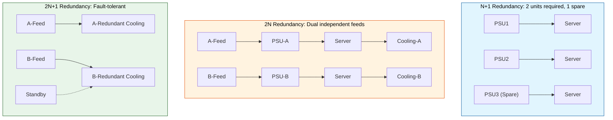

A Tier 4 data center costs roughly **2-3x more** per square foot than Tier 3. The decision of which tier to use depends on the application's **criticality** — a banking transaction system requires Tier 4; a content website can operate on Tier 3.

**Server Rack Architecture & ToR Switches:**

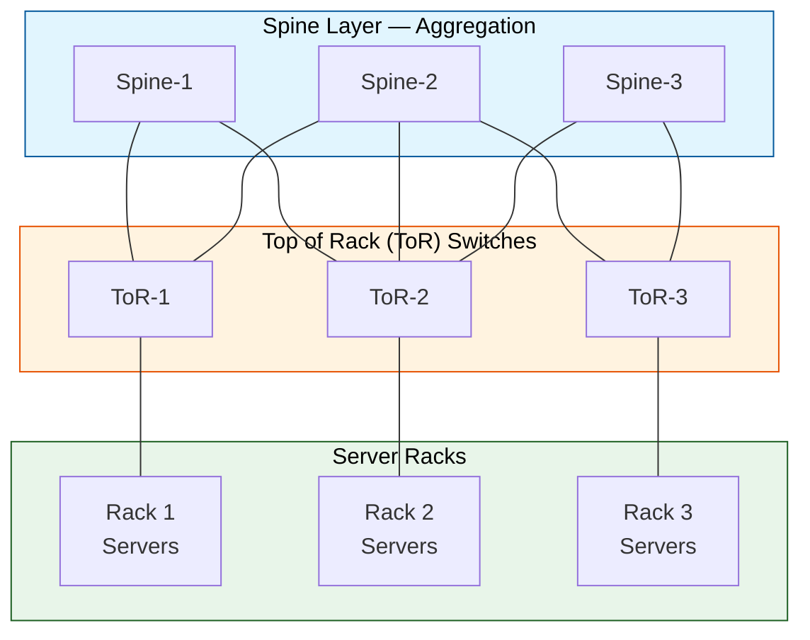

**Top of Rack (ToR)** switches sit at the top of each server rack. Every server in the rack connects to the ToR via 10/25/40/100 GbE links. The ToR then connects upward to **spine switches** (the aggregation layer). This is the foundation of the **Spine-Leaf (Clos) topology**.

**Spine-Leaf Network Topology (Clos Network):**

A Clos network is a multistage circuit-switching topology originally invented by Charles Clos in 1952. It has been revived in modern data centers because of its **predictable latency** and **linear scalability**.

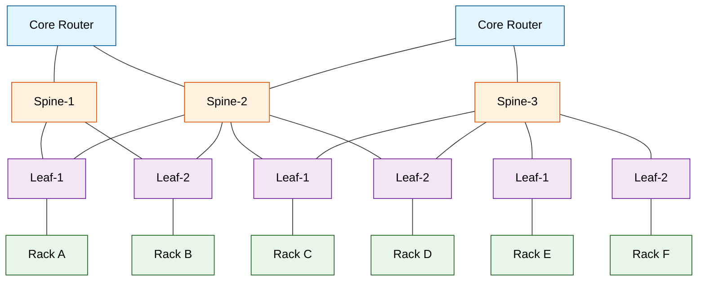

Key properties of a Clos network:
- **Every leaf switch connects to every spine switch.** This means any server can reach any other server in exactly **2 hops** (leaf -> spine -> leaf).
- **Bandwidth scales linearly** with the number of spine switches. Add more spines -> add more bandwidth.
- **No single point of failure.** If a spine dies, traffic re-routes through remaining spines.
- **ECMP (Equal-Cost Multi-Path)** routing distributes traffic across all available spines.

The bottleneck in a spine-leaf topology is the **oversubscription ratio**: the ratio of downlink bandwidth (to servers) to uplink bandwidth (to spines). A 3:1 oversubscription ratio means 3 Gbps of server bandwidth shares 1 Gbps of spine bandwidth.

### The "Why"

**Why do we need data center tiers and spine-leaf topologies?**

The bottleneck being solved is **predictable performance under failure**. In traditional three-tier architectures (access-aggregate-core), traffic must traverse multiple layers, creating variable latency and bandwidth contention. A spine-leaf Clos network guarantees:

- **Predictable latency:** Exactly 2 hops between any two points.
- **Linear bandwidth scaling:** Add more spines, get more bisection bandwidth.
- **Fault isolation:** A failed spine switch affects capacity, not connectivity.

**Why do we need CDNs?**

The fundamental bottleneck is **the speed of light** combined with **internet congestion**. A user in Mumbai requesting content from a server in Virginia will experience:
- Round-trip latency of ~200-300ms (geographic distance)
- Packet loss across 15+ router hops
- Peering congestion at transit points

A CDN solves this by **caching content at the edge** — bringing data as close to the user as physically possible.

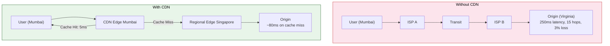

### Trade-offs

| Component | Hidden Cost | Impact |
|-----------|-------------|--------|
| **Tier 4 DC** | 2-3x CapEx, 40% more power per sq ft | Only justified for mission-critical workloads |
| **Spine-Leaf** | More fiber/cabling than traditional 3-tier | Higher initial cabling cost, simpler ongoing ops |
| **CDN Caching** | Stale content, cache miss penalty | 1% cache miss degradation can increase origin load 100x |
| **Edge Computing** | Limited compute, state management complexity | Stateless apps only; state must live at origin |

**SSL Termination at the Edge** — While offloading SSL to the CDN edge reduces origin CPU load, it means the CDN provider can see decrypted traffic. For PCI/HIPAA compliance, end-to-end encryption may be mandatory, preventing edge SSL termination.

---

## 2. Production Implementation (Full Stack & Cloud)

### Backend & Code Architecture

**Cache-Control Header Strategy (Spring Boot):**

```java
@Configuration
@EnableCaching
public class CacheConfig {

    @Bean
    public CacheManager cacheManager() {
        RedisCacheConfiguration config = RedisCacheConfiguration.defaultCacheConfig()
            .entryTtl(Duration.ofMinutes(5))
            .disableCachingNullValues()
            .computePrefixWith(cacheName -> "app:" + cacheName + ":");
        return RedisCacheManager.builder(redisConnectionFactory())
            .cacheDefaults(config)
            .build();
    }
}

@RestController
@RequestMapping("/api/v1/projects")
public class ProjectController {

    @GetMapping("/{id}")
    public ResponseEntity<Project> getProject(@PathVariable String id) {
        Project project = projectService.findById(id);
        return ResponseEntity.ok()
            .cacheControl(CacheControl.maxAge(300, TimeUnit.SECONDS)
                .sMaxAge(600, TimeUnit.SECONDS)
                .mustRevalidate())
            .eTag(project.getVersion())
            .body(project);
    }
}
```

The `s-maxage` directive tells CDN edges to cache for 600 seconds, while the browser caches for only 300 seconds. The `ETag` enables **conditional requests** — the CDN sends a `If-None-Match` header to origin and gets a `304 Not Modified` response without payload, saving bandwidth.

### DevOps & Infrastructure

**Dockerfile for Edge-Optimized Static Assets:**

```dockerfile
FROM node:20-alpine AS builder
WORKDIR /app
COPY package*.json ./
RUN npm ci --only=production
COPY . .
RUN npm run build

FROM nginx:1.25-alpine
COPY --from=builder /app/build /usr/share/nginx/html
COPY nginx.conf /etc/nginx/conf.d/default.conf

# Security headers for edge serving
RUN echo 'add_header X-Content-Type-Options "nosniff";' \
     'add_header X-Frame-Options "DENY";' \
     'add_header Cache-Control "public, max-age=31536000, immutable";' \
     >> /etc/nginx/conf.d/security.conf

EXPOSE 80
CMD ["nginx", "-g", "daemon off;"]
```

**Kubernetes Deployment with Pod Topology Spread:**

```yaml
apiVersion: apps/v1
kind: Deployment
metadata:
  name: edge-cache-worker
spec:
  replicas: 12
  selector:
    matchLabels:
      app: edge-cache-worker
  template:
    metadata:
      labels:
        app: edge-cache-worker
    spec:
      topologySpreadConstraints:
        - maxSkew: 1
          topologyKey: topology.kubernetes.io/zone
          whenUnsatisfiable: DoNotSchedule
          labelSelector:
            matchLabels:
              app: edge-cache-worker
      containers:
        - name: worker
          image: myapp/edge-worker:1.0
          env:
            - name: CACHE_SIZE_MB
              value: "4096"
            - name: ORIGIN_URL
              value: "https://origin.internal.example.com"
          resources:
            requests:
              memory: "512Mi"
              cpu: "500m"
            limits:
              memory: "2Gi"
              cpu: "2"
```

The `topologySpreadConstraints` ensures pods are evenly distributed across availability zones — critical for edge caching where every zone must have a cache node.

**Terraform for CloudFront Distribution:**

```hcl
resource "aws_cloudfront_distribution" "main" {
  enabled             = true
  is_ipv6_enabled     = true
  comment             = "Production CDN distribution"
  price_class         = "PriceClass_All"
  http_version        = "http2and3"

  origin {
    domain_name = aws_lb.main.dns_name
    origin_id   = "ALBOrigin"
    custom_origin_config {
      http_port              = 80
      https_port             = 443
      origin_protocol_policy = "https-only"
      origin_ssl_protocols   = ["TLSv1.2"]
    }
    origin_shield {
      enabled              = true
      origin_shield_region = "ap-south-1"
    }
  }

  default_cache_behavior {
    target_origin_id       = "ALBOrigin"
    viewer_protocol_policy = "redirect-to-https"
    allowed_methods        = ["GET", "HEAD", "OPTIONS"]
    cached_methods         = ["GET", "HEAD"]
    compress               = true

    forwarded_values {
      query_string = true
      cookies {
        forward = "whitelist"
        whitelisted_names = ["session", "locale"]
      }
    }

    min_ttl     = 0
    default_ttl = 3600
    max_ttl     = 86400

    function_association {
      event_type = "viewer-request"
      function_arn = aws_cloudfront_function.redirect.arn
    }
  }

  ordered_cache_behavior {
    path_pattern     = "/api/*"
    target_origin_id = "ALBOrigin"
    viewer_protocol_policy = "https-only"
    allowed_methods  = ["DELETE", "GET", "HEAD", "OPTIONS", "PATCH", "POST", "PUT"]
    cached_methods   = ["GET", "HEAD"]
    compress         = true
    forwarded_values {
      query_string = true
      cookies {
        forward = "all"
      }
    }
    min_ttl     = 0
    default_ttl = 0
    max_ttl     = 0
  }

  restrictions {
    geo_restriction {
      restriction_type = "whitelist"
      locations        = ["IN", "US", "GB", "DE", "SG"]
    }
  }

  viewer_certificate {
    acm_certificate_arn      = "arn:aws:acm:us-east-1:xxxxx:certificate/xxxxx"
    ssl_support_method       = "sni-only"
    minimum_protocol_version = "TLSv1.2_2021"
  }
}
```

**Origin Shield** creates a regional caching layer that aggregates requests from multiple edge locations before forwarding to the origin. This reduces origin load by up to 5x.

### Cloud Architecture

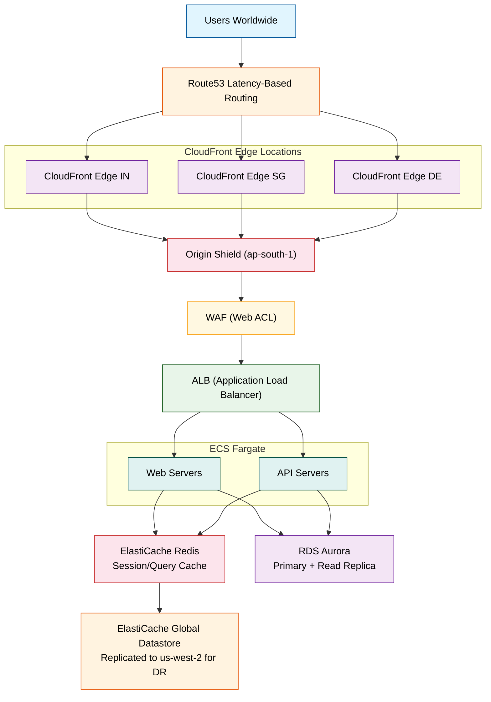

**Regional Edge Caches** sit between edge locations and the origin. They have larger caches (hundreds of GB) and longer TTLs, acting as a shock absorber for the origin.

---

## 3. Real-World Scaling Scenarios

### The Bottleneck

**Scenario:** A major e-commerce platform runs a Flash Sale event. 5 million concurrent users hit the site within 30 seconds. The origin servers are in a single AWS region (us-east-1).

**Failure Sequence:**

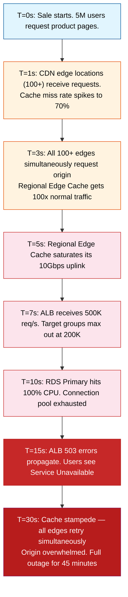

**Root Cause Analysis:**
1. **Cache Stampede:** All edges missed cache simultaneously and all hit origin at once.
2. **Single Region:** No regional diversity for compute/database.
3. **No read replicas:** All queries hit the primary database.
4. **No request collapsing:** Origin Shield was not configured, so redundant requests reached origin.

### The Solution

**Step-by-Step Architectural Adjustments:**

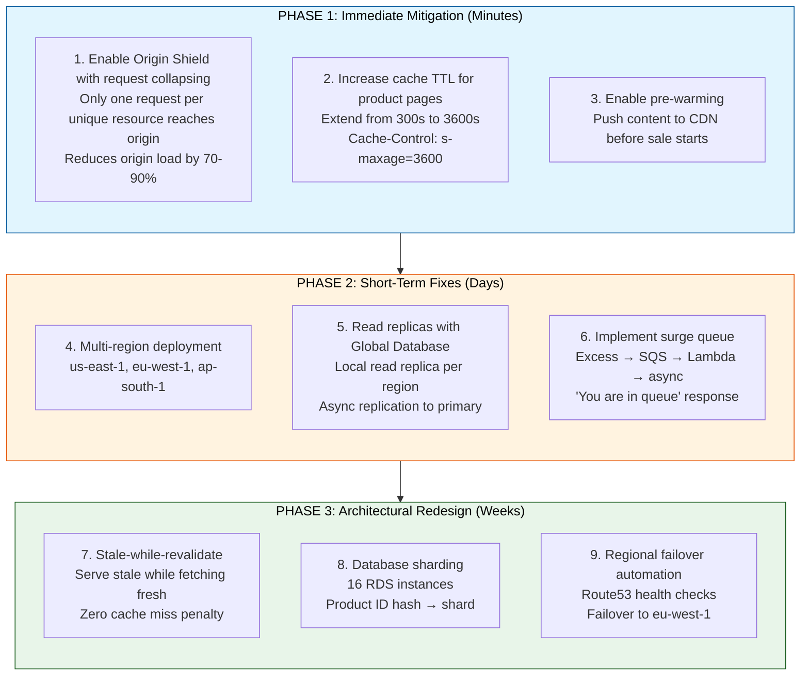

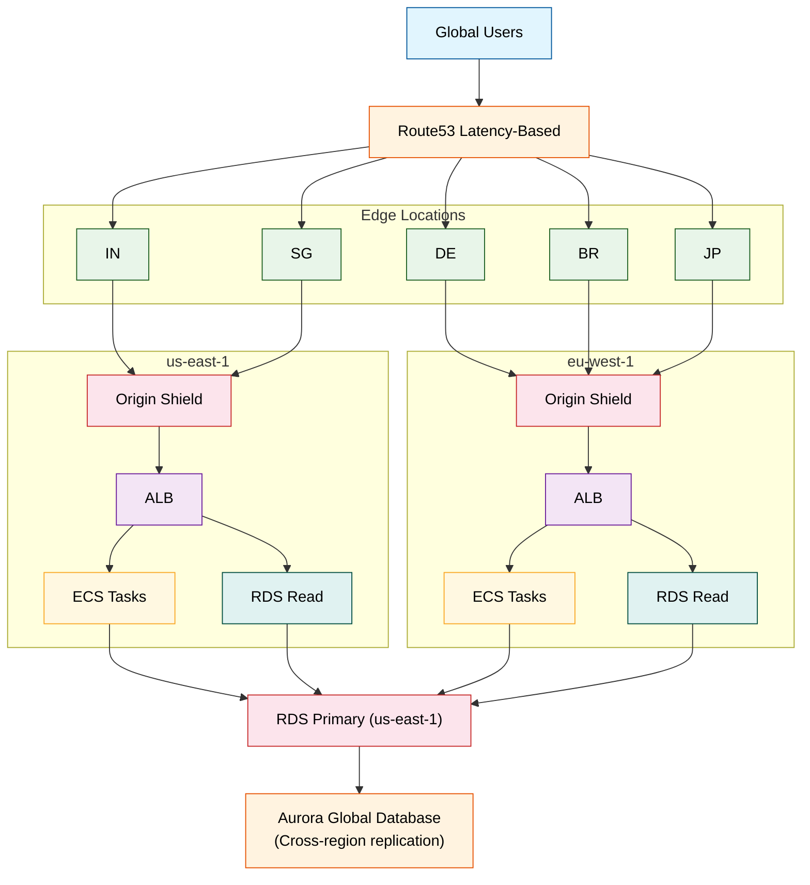

---

## 4. Interview Preparation: Multi-Level QA

### System Design Challenge

**Question:** Design a global CDN and edge computing platform that supports dynamic content personalization at the edge. Users in different geographies should see localized content, and authenticated users should see personalized dashboards — all without hitting the origin server.

**Optimal Blueprint:**

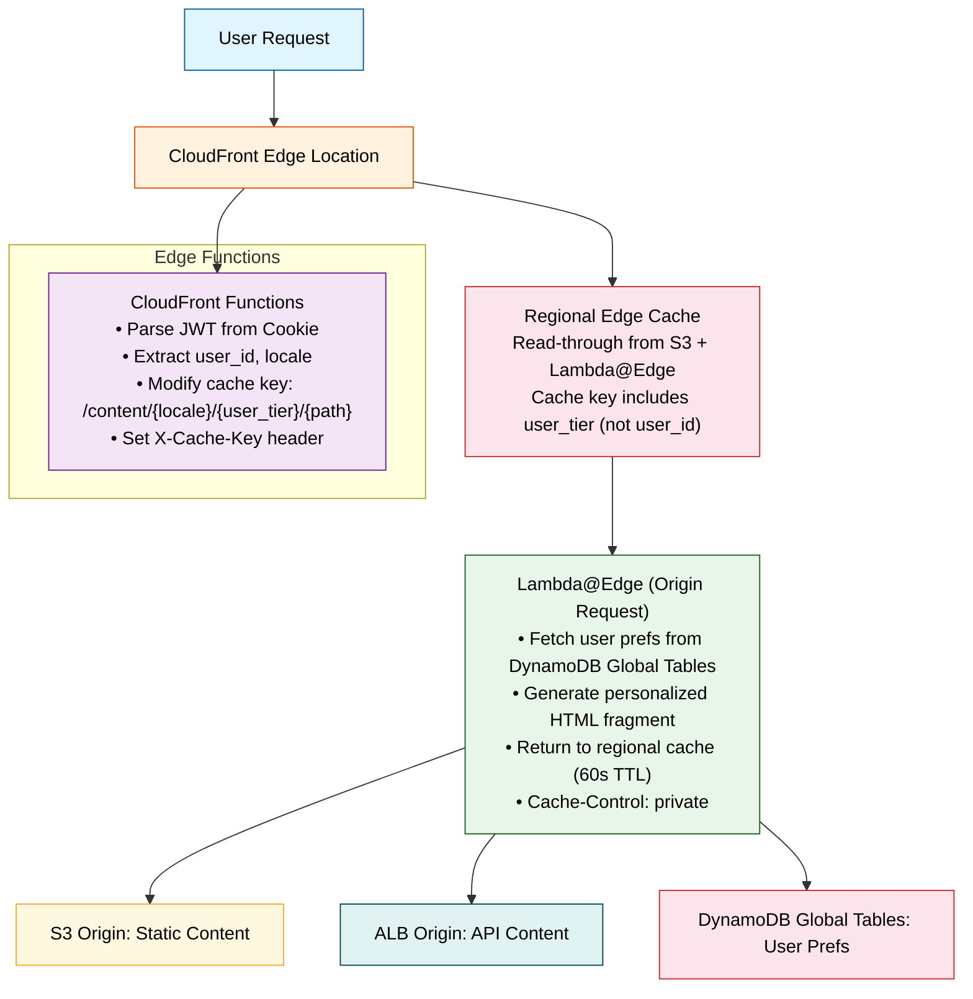

Key design decisions:
- **Cache key includes user tier but not user ID** — all users in the same tier share cached content.
- **Stale-while-revalidate = 86400** — serve stale content for up to 24 hours if origin is down.
- **Private Cache-Control** for personalized fragments ensures they are not cached at shared edges.

#### 🟢 Basic Level (Jr. Engineer / 0-2 Yrs)

**Q1: What is a CDN and how does it improve website performance?**
**A1:** A Content Delivery Network (CDN) is a globally distributed network of proxy servers that cache content close to users. It improves performance by: (1) reducing latency — content is served from a nearby edge location instead of a distant origin server; (2) reducing origin load — cached requests never reach the origin; (3) handling traffic spikes — the CDN absorbs sudden traffic increases. Without a CDN, a user in India accessing a US-based server experiences 200-300ms latency vs. 5-20ms with a local CDN edge.

**Q2: What is the difference between a data center Tier 3 and Tier 4?**
**A2:** Tier 3 provides N+1 redundancy with 99.982% availability (~1.6 hours downtime/year). It is concurrently maintainable — any component can be taken offline without disruption. Tier 4 provides 2N+1 fault-tolerant redundancy with 99.995% availability (~26 minutes downtime/year). Every component is dual-powered with automatic failover and zero single points of failure. Tier 4 costs 2-3x more per square foot than Tier 3.

#### 🟡 Intermediate Level (Mid-Level / 2-5 Yrs)

**Q1: How do you configure CloudFront to cache API responses?**
**A1:**
```hcl
resource "aws_cloudfront_distribution" "api" {
  default_cache_behavior {
    target_origin_id       = "APIOrigin"
    viewer_protocol_policy = "https-only"
    allowed_methods        = ["GET", "HEAD", "OPTIONS"]
    cached_methods         = ["GET", "HEAD"]
    compress               = true
    forwarded_values {
      query_string = true
      cookies {
        forward = "whitelist"
        whitelisted_names = ["session"]
      }
    }
    min_ttl     = 0
    default_ttl = 60        # Cache for 60 seconds
    max_ttl     = 3600      # Max cache 1 hour
  }
  # Origin Shield for request collapsing
  origin {
    origin_shield {
      enabled              = true
      origin_shield_region = "ap-south-1"
    }
  }
}
```

**Q2: Explain Cache-Control headers: public, private, no-cache, no-store, must-revalidate.**
**A2:**
- `public`: Can be cached by CDNs and browsers
- `private`: Cacheable only by the browser (not CDNs) — for personalized content
- `no-cache`: Must revalidate with origin before serving cached copy (can still cache, just checks freshness)
- `no-store`: Never cache at all — for sensitive data
- `must-revalidate`: Origin must be checked when cached content is stale
- `s-maxage`: CDN-specific max-age (overrides max-age for shared caches)
- Example: `Cache-Control: public, max-age=300, s-maxage=600, stale-while-revalidate=86400`

#### 🔴 Advanced Level (Senior / 5-8 Yrs)

**Q1: Design a multi-region active-active architecture with CDN and global database replication.**
**A1:**
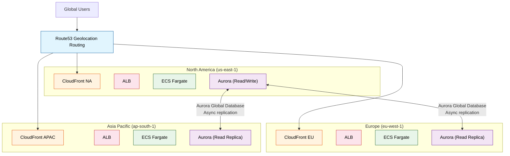

Key design decisions:
- Route53 geolocation routing directs users to the nearest region
- CloudFront for static caching + regional edge caches for API content
- Each region has its own read replica; writes go to the primary (us-east-1)
- Writes are async-replicated via Aurora Global Database
- Cache TTLs are staggered — shorter at edge, longer at regional cache
- `stale-while-revalidate` of 86400s provides resilience during origin failures

**Q2: How would you handle a cache stampede where thousands of CDN edges simultaneously request the same new content from origin?**
**A2:** Cache stampede (aka thundering herd) happens when popular content expires simultaneously across all edges. Mitigation strategies:

1. **Origin Shield with request collapsing:** Only the first edge's request reaches origin; subsequent edges wait for the same response. Reduces origin load by 10x+.
2. **Staggered TTLs:** Add random jitter to TTL (`s-maxage: 3600 ± 300`). Edges expire at different times, spreading the load.
3. **Stale-while-revalidate:** Serve stale content while fetching fresh version in background. Zero penalty for users.
4. **Pre-warming:** Before a flash sale, proactively push content to all CDN edges via CDN预热 APIs (supported by CloudFront, Akamai, Fastly).
5. **Proactive cache refresh:** Use Lambda@Edge to detect traffic spikes and pre-fetch popular content before mass expiration.

#### ⚫ Expert Level (Staff/Principal / 8+ Yrs)

**Q1: Explain how Anycast routing works at the BGP level for CloudFront and how traffic is steered to the correct edge location. What happens during a BGP hijack?**
**A1:** Anycast routing works by advertising the same IP prefix (e.g., 13.224.0.0/14) from multiple geographically distributed locations simultaneously.

**BGP mechanics:**
1. CloudFront edge locations (350+ PoPs) each announce the IP prefix to their upstream ISPs via eBGP.
2. Each announcement has a different AS-path length depending on the ISP's routing table. The ISP selects the route with the shortest AS-path.
3. The user's ISP propagates the best route to its customers. The user's packets are routed to the nearest edge location in BGP terms (which may differ from geographic proximity due to peering/policy).

**Connection flow:**
- `traceroute` shows the path: User → ISP router → Transit → CloudFront edge router
- The edge router terminates the TCP connection and performs DSR (Direct Server Return) — response packets go directly to the user without backhauling to origin
- The router uses ECMP to distribute connections across edge servers within the PoP

**BGP hijack scenario:**
An attacker advertises a more specific prefix (e.g., 13.224.0.0/24) or the same prefix with a shorter AS-path. Traffic is redirected to the attacker's infrastructure. Mitigations:
- **RPKI (Resource Public Key Infrastructure):** Route Origin Authorization (ROA) cryptographically signs the origin AS that is authorized to announce a prefix. ISPs implementing RPKI validation (e.g., Cloudflare, Comcast) reject invalid announcements. As of 2026, ~60% of the internet validates RPKI.
- **BGP Flowspec:** Drops traffic from the hijacked prefix at the network edge.
- **Anycast inherently limits blast radius:** Only users routed to the affected ISP are impacted.

**Q2: Describe the full request flow through a multi-tier cache hierarchy (CloudFront Edge → Regional Cache → Origin Shield → Origin). How does request collapsing prevent the thundering herd problem?**
**A2:** The cache hierarchy has four tiers:

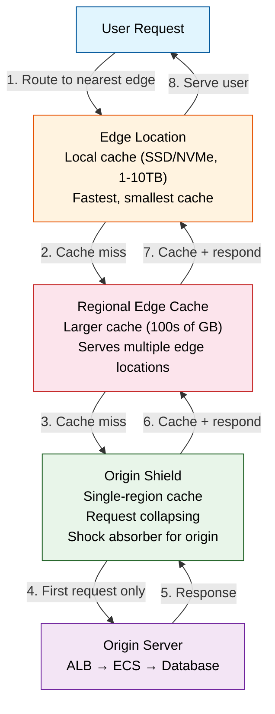

**Request collapsing internals:**
When 100 edges simultaneously request the same object and all miss:
1. Each edge sends a request to the regional cache. If all miss there too:
2. Each regional cache forwards to Origin Shield.
3. Origin Shield maintains a **pending request hash table**. The first request creates an entry; subsequent requests **park** in a wait-list (implemented as a condition variable or completion queue).
4. When the first response arrives from origin, the response is written to the Origin Shield cache, then all parked connections are unblocked and served the cached response.
5. The origin receives exactly **1 request** instead of 100.

**Performance characteristics:**
- Edge cache: ~1ms hit, 50-100ms miss (to regional)
- Regional cache: ~5ms hit, 100-200ms miss (to Origin Shield)
- Origin Shield: ~10ms hit, 200-500ms miss (to origin)
- Request collapsing: Saves 99% of origin load during stampede events

**Memory architecture of Varnish (used in Origin Shield):**
- Shared memory hash table with RCU (lock-free reads)
- Busy object pattern: creates an in-flight marker atomically
- Worker threads use non-blocking hash table lookups (~50M ops/sec)
- LRU eviction runs in dedicated thread with stop-the-world for structural changes only
