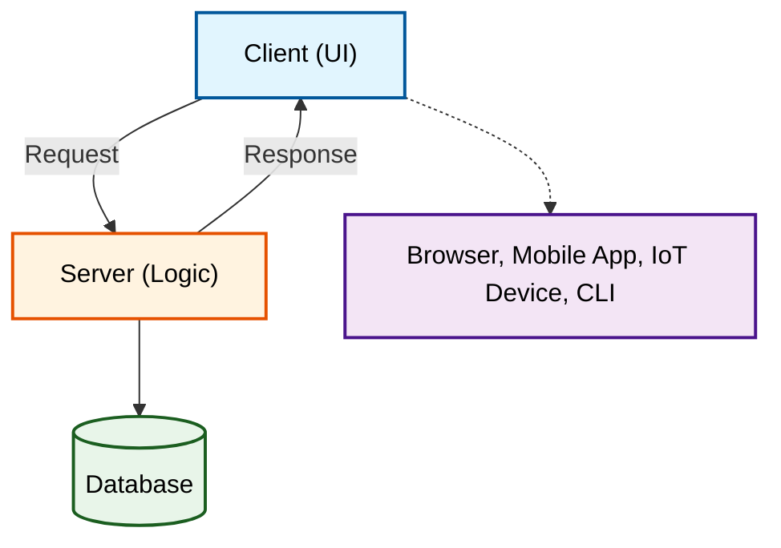
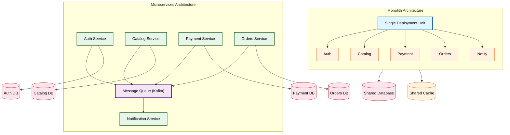

# Topic 09: System Design Fundamentals

## 1. Theoretical Foundation & System Mechanics

### The Core Concept

System design is the process of defining the architecture, components, modules, interfaces, and data flow of a system to satisfy specified requirements. It is the bridge between product requirements and running code in production.

**High-Level Design (HLD) vs Low-Level Design (LLD):**

```
HLD (Architecture View)             LLD (Implementation View)
─────────────────────────────────────────────────────────────────
Focus: System architecture          Focus: Component internals
Audience: Architects, PMs           Audience: Developers
Output: Box-and-line diagrams       Output: Class diagrams, schemas
Scope: Components & interactions    Scope: Classes, methods, SQL
Granularity: Coarse                 Granularity: Fine
Tools: Draw.io, Lucidchart          Tools: UML, ER diagrams

HLD answers: "What components exist and how do they talk?"
LLD answers: "How does each component work internally?"
```

**Client-Server Model:**



The fundamental unit of distributed systems. The client initiates communication; the server listens and responds. This model is asymmetric — the server is a shared resource, the client is a consumer.

**Monolith vs Microservices:**



**Monolith Pros:** Simple deployment, low latency (in-process calls), easy transactions, single codebase.
**Monolith Cons:** Cannot scale components independently, long CI/CD cycles, technology lock-in, difficult for large teams.

**Microservices Pros:** Independent scaling, polyglot persistence, smaller deployable units, team autonomy.
**Microservices Cons:** Network latency, distributed transactions complexity (SAGA), operational overhead, debugging difficulty.

### The "Why"

System design fundamentals solve the **scalability bottleneck**. When a system grows from 100 to 10 million users, every architectural assumption changes:

| Scale | Bottleneck | Design Decision |
|-------|-----------|-----------------|
| 100 users | Single database | Monolith, single server |
| 10K users | Web server CPU | Load balancer, horizontal scaling |
| 100K users | Database reads | Read replicas, caching |
| 1M users | Database writes | Sharding, CQRS |
| 10M users | Cross-region latency | CDN, edge computing, global DB |

Understanding where the next bottleneck will emerge is the core skill of a system designer.

### Trade-offs

**Vertical vs Horizontal Scaling:**

```mermaid
flowchart LR
    subgraph Vertical["Vertical Scaling (Scale Up)"]
        direction TB
        VS[("Single Big Server")]:::big
        VU["Upgrade to Bigger Box"]:::up
        VP["+ Simple<br/>- Hardware limit<br/>$ Super-linear cost"]:::procon
        VS --> VU --> VP
    end
    subgraph Horizontal["Horizontal Scaling (Scale Out)"]
        direction TB
        HS1[("Server 1")]:::small
        HS2[("Server 2")]:::small
        HS3[("Server 3")]:::small
        HA["Add more boxes"]:::up
        HP["+ Linear scaling<br/>- Complexity<br/>$ Linear cost"]:::procon
        HS1 & HS2 & HS3 --> HA --> HP
    end

    classDef big fill:#e1f5fe,stroke:#01579b,color:#000,stroke-width:3px
    classDef small fill:#e8f5e9,stroke:#1b5e20,color:#000,stroke-width:2px
    classDef up fill:#fff3e0,stroke:#e65100,color:#000
    classDef procon fill:#f3e5f5,stroke:#4a148c,color:#000


Vertical scaling has a hard ceiling (max RAM/CPU available in a single machine). Horizontal scaling is theoretically unlimited but introduces distributed systems complexity.

**CAP Theorem:**

```mermaid
flowchart TD
    CAP["CAP Theorem"]:::cap
    C["Consistency (C)<br/>Every read = most recent write"]:::c
    A["Availability (A)<br/>Every request gets a response"]:::a
    P["Partition Tolerance (P)<br/>System works despite network failures"]:::p
    CP["CP Systems<br/>(Banking, ZooKeeper)"]:::cp
    CA["CA Systems<br/>(Monolith RDBMS)"]:::ca
    AP["AP Systems<br/>(Cassandra, DynamoDB)"]:::ap
    REALITY["REALITY: P is non-negotiable<br/>You choose between CP and AP"]:::reality

    CAP --> C & A & P
    C <--> CP
    A <--> AP
    C <--> CA
    CP --> REALITY
    AP --> REALITY

    classDef cap fill:#fce4ec,stroke:#b71c1c,color:#000,stroke-width:3px
    classDef c fill:#e1f5fe,stroke:#01579b,color:#000,stroke-width:2px
    classDef a fill:#e8f5e9,stroke:#1b5e20,color:#000,stroke-width:2px
    classDef p fill:#fff3e0,stroke:#e65100,color:#000,stroke-width:2px
    classDef cp fill:#f3e5f5,stroke:#4a148c,color:#000
    classDef ca fill:#e1f5fe,stroke:#01579b,color:#000
    classDef ap fill:#e8f5e9,stroke:#1b5e20,color:#000
    classDef reality fill:#fce4ec,stroke:#b71c1c,color:#000,stroke-width:2px


**PACELC Theorem (Extension of CAP):**

```mermaid
flowchart TD
    NP["Network Partition?"]:::q
    YES["YES"]:::yes
    NO["NO"]:::no
    CP["CP<br/>DynamoDB Strong<br/>Cassandra Quorum"]:::cp
    AP["AP<br/>Cassandra Eventual<br/>DynamoDB Eventual"]:::ap
    Lat["Latency<br/>DynamoDB DAX"]:::lat
    Cons["Consistency<br/>MongoDB Strong<br/>RDS"]:::cons

    NP --> YES & NO
    YES --> CP & AP
    NO --> Lat & Cons

    classDef q fill:#fce4ec,stroke:#b71c1c,color:#000,stroke-width:3px
    classDef yes fill:#e8f5e9,stroke:#1b5e20,color:#000,stroke-width:2px
    classDef no fill:#e1f5fe,stroke:#01579b,color:#000,stroke-width:2px
    classDef cp fill:#fff3e0,stroke:#e65100,color:#000
    classDef ap fill:#f3e5f5,stroke:#4a148c,color:#000
    classDef lat fill:#e1f5fe,stroke:#01579b,color:#000
    classDef cons fill:#e8f5e9,stroke:#1b5e20,color:#000


PACELC adds the **E** (Else) dimension: even without partitions, there is a trade-off between latency (L) and consistency (C). Systems like DynamoDB Accelerator (DAX) optimize for low latency at the cost of eventual consistency.

**Strong vs Eventual Consistency:**

```mermaid
flowchart LR
    subgraph Strong["Strong Consistency"]
        direction LR
        SW["Write"]:::write --> SP["Primary"]:::primary
        SP -->|Sync Replication| SR["Read Replica"]:::replica
        SP -->|"Read returns latest write"| SR
        SLabel["Higher latency<br/>Example: RDS Sync"]:::slabel
    end
    subgraph Eventual["Eventual Consistency"]
        direction LR
        EW["Write"]:::write --> EP["Primary"]:::primary
        EP -.->|Async Replication| ER["Read Replica"]:::replica
        ER -->|"Read may return stale data"| EP
        ELabel["Lower latency<br/>Example: DynamoDB Global Tables"]:::elabel
    end

    classDef write fill:#e1f5fe,stroke:#01579b,color:#000,stroke-width:2px
    classDef primary fill:#fff3e0,stroke:#e65100,color:#000,stroke-width:2px
    classDef replica fill:#e8f5e9,stroke:#1b5e20,color:#000,stroke-width:2px
    classDef slabel fill:#fce4ec,stroke:#b71c1c,color:#000
    classDef elabel fill:#f3e5f5,stroke:#4a148c,color:#000


---

## 2. Production Implementation (Full Stack & Cloud)

### Backend & Code Architecture

**Load Balancing Algorithms — Implementation:**

```java
// Consistent Hashing Ring (Virtual Nodes)
public class ConsistentHashRouter<T> {
    private final HashFunction hashFn;
    private final int virtualNodes;
    private final TreeMap<Long, T> ring = new TreeMap<>();

    public ConsistentHashRouter(Collection<T> nodes, int virtualNodes) {
        this.hashFn = Hashing.murmur3_128();
        this.virtualNodes = virtualNodes;
        for (T node : nodes) {
            addNode(node);
        }
    }

    public void addNode(T node) {
        for (int i = 0; i < virtualNodes; i++) {
            long hash = hashFn.hashUnencodedChars(node.toString() + "-" + i).asLong();
            ring.put(hash, node);
        }
    }

    public T route(String key) {
        if (ring.isEmpty()) return null;
        long hash = hashFn.hashUnencodedChars(key).asLong();
        Map.Entry<Long, T> entry = ring.ceilingEntry(hash);
        if (entry == null) entry = ring.firstEntry();
        return entry.getValue();
    }
}
```

**Caching Patterns — Cache Aside (Most Common):**

```java
@Service
public class ProjectService {
    private final RedisTemplate<String, Project> redis;
    private final ProjectRepository repository;

    public Project getProject(String id) {
        // 1. Try cache
        String key = "project:" + id;
        Project cached = redis.opsForValue().get(key);
        if (cached != null) return cached;

        // 2. Cache miss — load from DB
        Project project = repository.findById(id)
            .orElseThrow(() -> new NotFoundException("Project not found"));

        // 3. Populate cache
        redis.opsForValue().set(key, project, Duration.ofMinutes(5));

        return project;
    }

    @Transactional
    public Project updateProject(String id, ProjectUpdate update) {
        Project project = repository.findById(id)
            .orElseThrow(() -> new NotFoundException("Project not found"));

        // Update database
        project.apply(update);
        repository.save(project);

        // Invalidate cache (NOT update — let next read populate)
        redis.delete("project:" + id);

        return project;
    }
}
```

**Write Behind (Write Back) Pattern:**

```java
@Service
public class WriteBehindCache {
    private final RedisTemplate<String, Task> cache;
    private final KafkaTemplate<String, Task> kafka;
    private final TaskRepository repository;

    // Write to cache immediately, async write to DB via Kafka
    public void createTask(Task task) {
        cache.opsForValue().set("task:" + task.getId(), task, Duration.ofHours(1));
        kafka.send("task-write-behind", task.getId(), task);
    }
}

@KafkaListener(topics = "task-write-behind")
public void processWriteBehind(Task task) {
    repository.save(task);
}
```

**Rate Limiting — Token Bucket Algorithm:**

```java
public class TokenBucketRateLimiter {
    private final long capacity;      // Max tokens
    private final double refillRate;  // Tokens per second
    private double tokens;
    private long lastRefillTimestamp;

    public TokenBucketRateLimiter(long capacity, double refillRate) {
        this.capacity = capacity;
        this.refillRate = refillRate;
        this.tokens = capacity;
        this.lastRefillTimestamp = System.nanoTime();
    }

    public synchronized boolean allowRequest() {
        refill();
        if (tokens >= 1.0) {
            tokens -= 1.0;
            return true;
        }
        return false;
    }

    private void refill() {
        long now = System.nanoTime();
        double elapsedSeconds = (now - lastRefillTimestamp) / 1_000_000_000.0;
        tokens = Math.min(capacity, tokens + elapsedSeconds * refillRate);
        lastRefillTimestamp = now;
    }
}
```

### DevOps & Infrastructure

**Docker Compose for Local System Design Prototyping:**

```yaml
version: '3.8'
services:
  postgres:
    image: postgres:16
    environment:
      POSTGRES_DB: systemdesign
      POSTGRES_USER: dev
      POSTGRES_PASSWORD: devpass
    ports:
      - "5432:5432"
    volumes:
      - pgdata:/var/lib/postgresql/data

  redis:
    image: redis:7-alpine
    ports:
      - "6379:6379"
    command: redis-server --appendonly yes --maxmemory 512mb --maxmemory-policy allkeys-lru

  kafka:
    image: confluentinc/cp-kafka:7.5
    depends_on:
      - zookeeper
    environment:
      KAFKA_BROKER_ID: 1
      KAFKA_ZOOKEEPER_CONNECT: zookeeper:2181
      KAFKA_ADVERTISED_LISTENERS: PLAINTEXT://localhost:9092
      KAFKA_OFFSETS_TOPIC_REPLICATION_FACTOR: 1
    ports:
      - "9092:9092"

  zookeeper:
    image: confluentinc/cp-zookeeper:7.5
    environment:
      ZOOKEEPER_CLIENT_PORT: 2181
      ZOOKEEPER_TICK_TIME: 2000

  haproxy:
    image: haproxy:2.8-alpine
    ports:
      - "8080:8080"
      - "8404:8404"
    volumes:
      - ./haproxy.cfg:/usr/local/etc/haproxy/haproxy.cfg:ro

volumes:
  pgdata:
```

**HAProxy Configuration for Load Balancing:**

```cfg
global
    daemon
    maxconn 4096
    stats socket /var/run/haproxy.sock mode 600 level admin

defaults
    log global
    mode http
    timeout connect 5000
    timeout client 50000
    timeout server 50000
    option dontlognull

frontend http_front
    bind *:8080
    default_backend app_servers

backend app_servers
    balance roundrobin
    # Alternatively: balance leastconn, balance uri, balance hdr(X-Real-IP)
    option httpchk GET /health
    server app1 app1:8080 check weight 3
    server app2 app2:8080 check weight 2
    server app3 app3:8080 check weight 1

listen stats
    bind *:8404
    stats enable
    stats uri /stats
    stats refresh 10s
```

### Cloud Architecture

```mermaid
flowchart TD
    DNS["Route53"]:::dns
    CDN["CloudFront"]:::cdn
    WAF["WAF"]:::security
    ALB["ALB<br/>Sticky Sessions"]:::lb
    ASG_RANGE("- Auto Scaling Group -<br/>min=2, max=20"):::asg
    A1["App Server 1"]:::app
    A2["App Server 2"]:::app
    A3["App Server 3"]:::app
    A4["App Server 4"]:::app
    REDIS["Redis Cluster<br/>(Cache)"]:::cache
    RDS_P["RDS Primary"]:::db
    RDS_R1["RDS Read Replica 1"]:::db
    RDS_R2["RDS Read Replica 2"]:::db
    RDS_R3["RDS Read Replica 3"]:::db
    SQS["SQS Queue"]:::queue
    WKR["Worker ASG"]:::app
    EC["ElastiCache<br/>(Result Cache)"]:::cache
    KFK["Kafka Cluster"]:::kafka
    STREAM["Stream Processors<br/>(Kafka Streams / Flink)"]:::stream
    S3["S3 Data Lake"]:::s3

    DNS --> CDN
    CDN --> WAF
    WAF --> ALB
    ALB --> A1 & A2 & A3 & A4
    ASG_RANGE -.-> A1 & A2 & A3 & A4
    A1 & A2 & A3 & A4 --> REDIS
    A1 & A2 & A3 & A4 --> RDS_P
    RDS_P --> RDS_R1 & RDS_R2 & RDS_R3
    A1 & A2 & A3 & A4 --> SQS
    SQS --> WKR --> EC
    SQS --> KFK --> STREAM --> S3

    subgraph MONITORING["Monitoring Stack"]
        CW["CloudWatch"]:::mon --> PROM["Prometheus"]:::mon --> GRAF["Grafana"]:::mon
        ELK["ELK Stack"]:::mon --> ES["Elasticsearch"]:::mon --> KIB["Kibana"]:::mon
    end

    classDef dns fill:#e1f5fe,stroke:#01579b,color:#000,stroke-width:2px
    classDef cdn fill:#fff3e0,stroke:#e65100,color:#000
    classDef security fill:#fce4ec,stroke:#b71c1c,color:#000
    classDef lb fill:#e8f5e9,stroke:#1b5e20,color:#000,stroke-width:2px
    classDef asg fill:#f3e5f5,stroke:#4a148c,color:#000
    classDef app fill:#e1f5fe,stroke:#01579b,color:#000
    classDef cache fill:#fff3e0,stroke:#e65100,color:#000
    classDef db fill:#e8f5e9,stroke:#1b5e20,color:#000
    classDef queue fill:#fce4ec,stroke:#b71c1c,color:#000
    classDef kafka fill:#f3e5f5,stroke:#4a148c,color:#000
    classDef stream fill:#e1f5fe,stroke:#01579b,color:#000
    classDef s3 fill:#fff3e0,stroke:#e65100,color:#000
    classDef mon fill:#e8f5e9,stroke:#1b5e20,color:#000


---

## 3. Real-World Scaling Scenarios

### The Bottleneck

**Scenario:** A social media platform with 50 million DAU experiences viral growth. Traffic spikes from 10K QPS to 500K QPS in 2 hours.

**Failure Modes:**

| QPS | Bottleneck | Symptom |
|-----|-----------|---------|
| 10K | Single DB read | Page load time 50ms |
| 50K | DB CPU 80% | Page load time 200ms |
| 100K | DB CPU 100% | Connection pool exhausted |
| 200K | Full table scans | Queries timing out at 30s |
| 500K | Cascading fail | Circuit breakers open everywhere |

```mermaid
flowchart TD
    S1["1. DB CPU hits 100%"]:::fail
    S2["2. Connection pool saturates<br/>App servers cannot acquire connections"]:::fail
    S3["3. App server threads block on DB<br/>HTTP response times spike"]:::fail
    S4["4. Health checks fail<br/>Orchestrator kills unhealthy servers"]:::fail
    S5["5. Remaining servers take more traffic<br/>Faster saturation"]:::fail
    S6["6. ALB sees all targets unhealthy<br/>503 Service Unavailable"]:::fail
    S7["7. User sees error page"]:::fail

    S1 --> S2 --> S3 --> S4 --> S5 --> S6 --> S7

    classDef fail fill:#fce4ec,stroke:#b71c1c,color:#000,stroke-width:2px


### The Solution

```mermaid
flowchart TD
    subgraph Phase1["Phase 1: Immediate - Caching"]
        P1_APP["App Server"]:::app
        P1_REDIS["Redis Cache"]:::cache
        P1_DB["DB Read Replicas<br/>(4 replicas)"]:::db
        P1_APP -->|"Cache hit → &lt;5ms"| P1_REDIS
        P1_APP -->|"Cache miss → query DB"| P1_DB
    end

    subgraph Phase2["Phase 2: Short-Term"]
        P2["Add 8 Read Replicas (Aurora)<br/>HikariCP: maxPool=50, minIdle=10<br/>Read/Write Splitting"]:::solution
    end

    subgraph Phase3["Phase 3: Long-Term - Architecture"]
        P3A["Cache-Aside + Write-Through"]:::arch
        P3B["Shard DB by user_id hash<br/>(128 shards)"]:::arch
        P3C["CQRS: Separate read/write models"]:::arch
        P3D["DynamoDB DAX for &lt;1ms reads"]:::arch
    end

    Phase1 --> Phase2 --> Phase3

    classDef app fill:#e1f5fe,stroke:#01579b,color:#000
    classDef cache fill:#fff3e0,stroke:#e65100,color:#000
    classDef db fill:#e8f5e9,stroke:#1b5e20,color:#000
    classDef solution fill:#f3e5f5,stroke:#4a148c,color:#000
    classDef arch fill:#e1f5fe,stroke:#01579b,color:#000


---

## 4. Senior-Level Interview Deep Dive

### System Design Challenge

**Question:** Design a global URL shortening service (like Bitly) that handles 10 billion redirects per month. Requirements: <10ms redirect latency, 99.99% uptime, analytics tracking per short URL.

**Optimal Blueprint:**

```mermaid
flowchart LR
    subgraph WritePath["Write Path (Create Short URL)"]
        direction TB
        W_CLIENT["Client"]:::client
        W_ALB["ALB"]:::lb
        W_GW["API Gateway"]:::gw
        W_LAMBDA["Create Short URL Lambda"]:::lambda
        W_B62["Base62 Encoding"]:::proc
        W_DB["DynamoDB<br/>(long_url ↔ short_id)"]:::db
        W_RESP["Response: short.url/abc123"]:::resp

        W_CLIENT --> W_ALB --> W_GW --> W_LAMBDA --> W_B62 --> W_DB
        W_DB --> W_RESP
    end

    subgraph ReadPath["Read Path (Redirect)"]
        direction TB
        R_CLIENT["Client"]:::client
        R_CF["CloudFront"]:::cdn
        R_LE["Lambda@Edge"]:::lambda
        R_CACHE["Check Cache"]:::proc
        R_DAX["DynamoDB (DAX)<br/>Global Table"]:::db
        R_REDIR["301 Redirect → Long URL"]:::resp

        R_CLIENT --> R_CF --> R_LE --> R_CACHE --> R_DAX
        R_DAX --> R_REDIR
    end

    subgraph STORAGE["Storage & Scaling"]
        S1["DynamoDB: short_id → long_url, created_at, expiry"]:::store
        S2["DAX: In-memory cache, 90% hit ratio"]:::store
        S3["S3: Analytics logs (Athena queries)"]:::store
        S4["Base62: 62⁷ = 3.5T unique URLs"]:::store
        S5["DynamoDB: 10K WCU / 50K RCU"]:::store
        S6["DAX: 3 nodes HA, 10TB cache"]:::store
        S7["Lambda@Edge: 1K concurrent/edge"]:::store
    end

    classDef client fill:#e1f5fe,stroke:#01579b,color:#000,stroke-width:2px
    classDef lb fill:#fff3e0,stroke:#e65100,color:#000
    classDef gw fill:#f3e5f5,stroke:#4a148c,color:#000
    classDef lambda fill:#e8f5e9,stroke:#1b5e20,color:#000,stroke-width:2px
    classDef proc fill:#fff3e0,stroke:#e65100,color:#000
    classDef db fill:#fce4ec,stroke:#b71c1c,color:#000,stroke-width:2px
    classDef resp fill:#e8f5e9,stroke:#1b5e20,color:#000
    classDef cdn fill:#e1f5fe,stroke:#01579b,color:#000
    classDef store fill:#f3e5f5,stroke:#4a148c,color:#000
```

### Deep Technical QA

#### 4. Interview Preparation: Multi-Level QA

##### 🟢 Basic Level (Jr. Engineer / 0-2 Yrs)

**Q1: What is the Client-Server model and why is it fundamental to system design?**

**A1:** The client-server model is a distributed architecture where clients (browsers, mobile apps, IoT devices) initiate requests to a centralized server that processes them and returns responses. The server is a shared resource provider; the client is a consumer. This asymmetry allows centralized control, security, and resource optimization. Example: when you visit `google.com`, your browser (client) sends an HTTP request to Google's server, which processes it and returns the search page HTML.

**Q2: What is the difference between vertical scaling and horizontal scaling?**

**A2:** Vertical scaling (scale-up) means adding more power (CPU, RAM) to an existing machine. It is simple but has a hard hardware limit and super-linear cost. Horizontal scaling (scale-out) means adding more machines to distribute the load. It is theoretically unlimited but introduces distributed systems complexity (networking, data consistency, load balancing). Example: upgrading from 16GB to 64GB RAM on one server is vertical; adding 3 more servers behind a load balancer is horizontal.

**Q3:** What is a load balancer and what are the different types?

**A3:** A load balancer distributes incoming traffic across multiple backend servers to improve availability, scalability, and fault tolerance. **L4 (Layer 4)** load balancers (e.g., AWS NLB) forward traffic based on IP + port — they are fast but cannot inspect HTTP headers. **L7 (Layer 7)** load balancers (e.g., AWS ALB) inspect HTTP headers, cookies, and paths — they support path-based routing, SSL termination, and sticky sessions but have higher overhead. Common algorithms: round-robin, least connections, IP hash (for session persistence). Health checks remove unhealthy backends automatically. Active-passive (standby failover) vs active-active (all nodes serve traffic). Example: AWS ALB for L7 routing (/api/* → service A, /web/* → service B), NLB for extreme throughput with TCP/UDP.

##### 🟡 Intermediate Level (Mid-Level / 2-5 Yrs)

**Q1: Implement a cache-aside pattern with Redis for a high-traffic API endpoint. How do you handle cache invalidation on writes?**

**A1:** Cache-aside (lazy loading) works as follows:
```java
public Project getProject(String id) {
    String key = "project:" + id;
    Project cached = redis.opsForValue().get(key);
    if (cached != null) return cached;           // Cache hit
    Project project = repository.findById(id)    // Cache miss
        .orElseThrow(() -> new NotFoundException());
    redis.opsForValue().set(key, project, Duration.ofMinutes(5));
    return project;
}

@Transactional
public Project updateProject(String id, ProjectUpdate update) {
    Project project = repository.findById(id)...;
    project.apply(update);
    repository.save(project);
    redis.delete("project:" + id);  // Invalidate, don't update
    return project;
}
```
Key principle: **invalidate on write**, let the next read populate the cache. This avoids stale data and race conditions.

**Q2: How does the Token Bucket rate-limiting algorithm work? Provide a Java implementation.**

**A2:** Token Bucket maintains a bucket that fills at a constant rate (refill rate) up to a capacity. Each request consumes one token. If no tokens remain, the request is denied.
```java
public class TokenBucketRateLimiter {
    private final long capacity;
    private final double refillRate;
    private double tokens;
    private long lastRefill;

    public synchronized boolean allowRequest() {
        refill();
        if (tokens >= 1.0) { tokens -= 1.0; return true; }
        return false;
    }
    private void refill() {
        long now = System.nanoTime();
        double elapsed = (now - lastRefill) / 1_000_000_000.0;
        tokens = Math.min(capacity, tokens + elapsed * refillRate);
        lastRefill = now;
    }
}
```
This allows bursts up to `capacity` while enforcing a steady-state rate of `refillRate` requests/second.

##### 🔴 Advanced Level (Senior / 5-8 Yrs)

**Q1: Design a leaderboard system for a real-time gaming platform with 10M daily active users. How do you handle writes (score updates) and reads (top 100) with sub-second latency?**

**A1:** Use a **Redis Sorted Set** with member = `userId` and score = `totalScore`. Every score update is a `ZINCRBY user_leaderboard {delta} {userId}` (O(log n)). For top-N reads, use `ZREVRANGE user_leaderboard 0 99 WITHSCORES` (O(log n + N)).

For write scaling:
- **Score sharding:** Partition users by score range into multiple sorted sets (e.g., 0-999, 1000-4999, 5000+). Reads merge top results from each shard.
- **Write coalescing:** Batch score updates in-memory every 100ms before writing to Redis.
- **Read replica:** Use a Redis read replica for leaderboard queries; writes go to the primary.

For 10M users, a single sorted set of ~500MB is feasible on a Redis instance with 4GB RAM. For higher scale, use **Redis Cluster** with key-level sharding.

**Q2: Compare Consistent Hashing with virtual nodes vs a simple modulo-based hash for distributed caching. Why does consistent hashing minimize cache stampedes during scale events?**

**A2:** Modulo-based hashing (`serverIndex = hash(key) % N`): when N changes (add/remove a server), nearly all keys map to different servers → cache miss avalanche (cache stampede).

Consistent Hashing places servers on a hash ring (0 to 2³²-1). Each key is assigned to the nearest server clockwise. Adding/removing a server only affects its immediate neighbors (~1/N of keys). **Virtual nodes** (each physical server represented by V virtual positions on the ring) improve load distribution when servers have different weights.

```java
public class ConsistentHashRouter<T> {
    private final TreeMap<Long, T> ring = new TreeMap<>();
    private final int virtualNodes;

    public T route(String key) {
        long hash = hash(key);
        Map.Entry<Long, T> entry = ring.ceilingEntry(hash);
        if (entry == null) entry = ring.firstEntry();
        return entry.getValue();
    }
}
```
With V=100 virtual nodes per server, key redistribution during a scale event drops from ~100% (modulo) to ~1/(N*100)% — a 10,000x improvement.

**Q3:** How do you choose between SQL and NoSQL for a new system? Walk through your decision framework.

**A3:** Decision tree: **Do you need ACID transactions?** → SQL. **Is your schema fixed and known upfront?** → SQL. **Do you need complex joins (relational data)?** → SQL. **Do you have poly-structured or rapidly changing data?** → NoSQL (MongoDB). **Do you need high write throughput with horizontal scaling?** → NoSQL (Cassandra). **Do you need global scale with eventual consistency?** → NoSQL (DynamoDB). Many production systems use **polyglot persistence**: PostgreSQL for transactional data, Redis for caching/sessions, Elasticsearch for full-text search, and Cassandra/DynamoDB for high-volume event logs. The trade-off is consistency vs scalability — start with SQL for complex business logic, add NoSQL for specific high-volume or flexible-schema use cases.

##### ⚫ Expert Level (Staff/Principal / 8+ Yrs)

**Q1: Explain the memory management and garbage collection implications of a high-throughput caching layer. How does Redis manage memory for 50 million keys without GC pauses?**

**A1:** Redis is **single-threaded** for command execution but uses **jemalloc** as its memory allocator. Redis avoids garbage collection entirely because it is **not garbage-collected** — it manages memory explicitly through reference counting and deterministic deallocation.

Key memory management strategies:
- **jemalloc:** Reduces fragmentation by allocating objects to size classes (8, 16, 32, 64… bytes). A 37-byte value goes into a 40-byte bin, wasting only 3 bytes.
- **Explicit key expiry:** Uses **lazy expiry** (check on access) + **active expiry** (a background cron job samples 20 random keys every 100ms, deletes expired ones, repeats if >25% of sampled keys expired).
- **Eviction policies:** When `maxmemory` is hit, `allkeys-lru` uses a **pool of sampled keys** (not full LRU) to approximate LRU eviction in O(1).
- **No copy-on-write for persistence:** During `BGSAVE`, Redis forks. The child writes the RDB file while the parent continues serving. jemalloc minimizes fragmentation that would blow up COW memory.

For 50M keys of 100 bytes each (~5GB data), Redis overhead: ~50 bytes/key (dict entry + SDS header) + ~20 bytes/value (robj header) ≈ 8.5GB total (1.7x amplification).

**Q2: Describe the Sliding Window Log rate-limiting algorithm vs Sliding Window Counter. What are the memory and accuracy trade-offs at 100K QPS per node?**

**A2:** **Sliding Window Log** maintains a sorted set (Redis Sorted Set) per user with timestamps. `ZCOUNT` counts requests in the window. Memory: O(requests_per_window) per user — at 100 QPS/user with a 60s window: 6,000 timestamps × ~50 bytes = 300KB/user. At 10K active users = 3GB. Accuracy: perfect (exact count). CPU: O(log n).

**Sliding Window Counter** maintains two counters: current minute + previous minute. Estimate = `previousCounter × (1 - elapsedRatio) + currentCounter`. Memory: 2 counters/user ≈ 16 bytes/user. At 10K users = 160KB (20,000× less). Accuracy: ~5% error at boundaries. CPU: O(1) per request.

The trade-off is stark: production systems overwhelmingly choose **Sliding Window Counter** — 5% accuracy loss for 20,000× memory reduction. At 100K QPS, the sliding log would require Redis memory in the tens of GB just for rate limiting, while the counter fits in a few MB.

---

*Reference: TrainWithShubham — Computer Networking & System Design For DevOps in OneShot (YouTube)*
