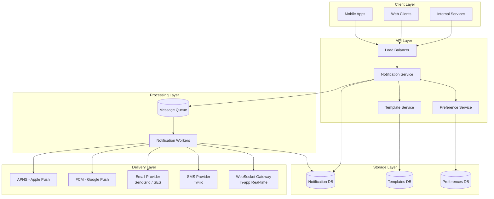
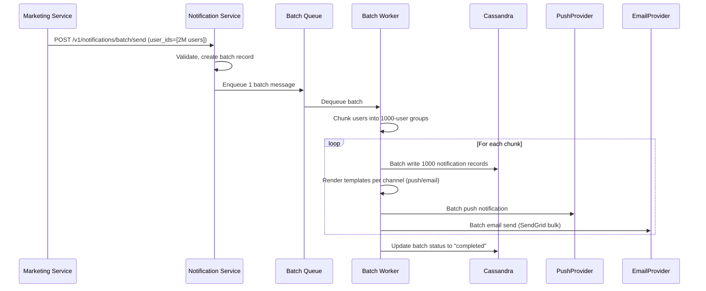
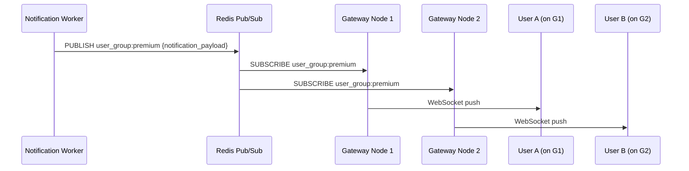

# Full Interview Transcript: Design a Scalable Notifications System

**Date:** June 25, 2026
**Role:** Senior Software Engineer (System Design)
**Interviewer:** Staff Engineer (15+ yrs distributed systems)
**Candidate:** Senior Engineer candidate

---

## Phase 1: Clarification & Scope

**I:** Let's begin. Today I'd like you to design a scalable notifications system. It sends notifications across push, email, SMS, and in-app channels. Take a few minutes to gather requirements, then walk me through your design. What questions do you have?

**C:** A few. First, the scale — how many daily active users, notifications per day, and peak throughput?

**I:** 100M DAU, roughly 1B notifications sent per day. Peak write throughput around 50K notifications/second. Read traffic for notification history is about 4× that — 200K reads/second at peak.

**C:** Delivery semantics? At-most-once, at-least-once, exactly-once?

**I:** At-least-once is acceptable. Duplicates are tolerable if rare. Exactly-once is not required. Real-time channels (push, in-app) need p99 latency under 500ms.

**C:** Understood. Are all channels first-class, or do some have lower priority?

**I:** All important, but transactional (password resets, payment confirmations) must always take priority over promotional. We need priority differentiation.

**C:** Retention period? Do users need full paginated history?

**I:** 90-day retention. Yes, users need paginated history. They also need per-channel opt-in/out controls and quiet hours.

**C:** Notification templates? For example, a "welcome email" with dynamic variables rendered per channel?

**I:** Yes. Templates are critical — managed separately, versioned, channel-specific rendering. A single event may produce different content for push versus email.

**C:** Multi-region from day one?

**I:** Design for multi-region. Initial deployment can be single-region, but the architecture must extend.

**C:** Let me confirm my understanding:

| Requirement | Value |
|---|---|
| DAU | 100M |
| Notifications/day | 1B |
| Peak writes | 50K/sec |
| Peak reads | 200K/sec |
| Channels | Push, Email, SMS, In-app |
| Delivery | At-least-once |
| Latency (real-time) | p99 < 500ms |
| Priority | Transactional > Promotional |
| Retention | 90 days |
| Templates | Yes, versioned, per-channel |
| Preferences | Per-channel opt-in/out, quiet hours |
| Regions | Eventual multi-region |

**I:** Correct. Let's move to the design.

---

## Phase 2: High-Level Design (Happy Path)

**C:** My mental model has four layers:

1. **Client Layer** — Mobile apps, web clients, internal services that trigger notifications.
2. **API Layer** — Notification service that accepts requests, validates, enriches, and routes them.
3. **Processing Layer** — Queue-based async worker pool handling delivery to external providers.
4. **Storage Layer** — Database for history, templates, preferences.

Sending a notification requires deciding *if* we should send (preferences), *what* to send (templates), and *how* to send (channels). I'd split these into separate services from the start.

Here's the initial architecture:



**I:** I like the separation. A few pushes. You have a single queue. What happens when a burst of 10M promotional notifications delays a critical password-reset email?

**C:** Fair point. I'd use **priority queues** — high-priority (transactional) and low-priority (promotional). Workers drain the high-priority queue first, with a configurable ratio: 80% capacity reserved for high-priority, 20% for low. During off-peak, low-priority uses full capacity.

**I:** And real-time delivery? Polling the database is too slow.

**C:** Agreed. For in-app and push, I'd use a **WebSocket gateway**. When a worker processes a real-time notification, it pushes directly to the user's active connection. If offline, the push notification provider handles delivery. The WebSocket is for in-app delivery only.

**I:** Where does the user preference check happen? You don't want to SMS an opted-out user.

**C:** In the Notification Service, before the message reaches the queue. On receiving a send request, it queries the Preference Service. If the user has SMS disabled, SMS is stripped from the channel list. This avoids wasted queueing and worker processing.

**I:** Database choice for notification history?

**C:** Cassandra or ScyllaDB. The access pattern is append-heavy (write once, read many times for history), always by `user_id` with time-based ordering. No joins, no complex relationships. Cassandra's partition key on `user_id` with clustering key on `created_at` maps perfectly to "show my last 50 notifications." The built-in TTL handles the 90-day retention cleanly.

**I:** Why not PostgreSQL? It's simpler, widely understood.

**C:** At 50K writes/second, PostgreSQL would require significant application-level sharding and careful index management to avoid contention. The append-only, time-series pattern fits Cassandra's linear write scalability. I add nodes to scale writes. With PostgreSQL, I'd need to build and maintain a sharding layer. That said, I'd absolutely use PostgreSQL for templates and preferences — smaller data, relational, updated frequently, strong consistency matters.

**I:** What about cost? ScyllaDB nodes aren't cheap.

**C:** Rough estimate: at 50K writes/sec with RF=3, I need ~15-20 ScyllaDB nodes per region. At ~$2K/node/month, that's $30K-$40K/month per region. PostgreSQL sharded across 10-12 nodes would be cheaper — ~$15K-$20K/month. But the operational complexity of PostgreSQL sharding (resharding, query routing, cross-shard operations) would likely offset the savings in engineering time and reliability risk. For this scale, I'd pay the ScyllaDB premium.

**I:** Fair. Let's see the detailed APIs and schema.

---

## Phase 3: API & Database Specifications

**C:** Here are the core REST endpoints.

### Notification APIs

**POST /v1/notifications/send** — Trigger a notification

```json
// Request
{
  "user_id": "usr_abc123",
  "channels": ["push", "email"],
  "template_id": "tpl_welcome_2026",
  "template_data": {
    "username": "jdoe",
    "activation_link": "https://..."
  },
  "priority": "high",
  "idempotency_key": "idem_xyz789",
  "expires_at": "2026-06-25T12:00:00Z"
}

// Response 201
{
  "notification_id": "notif_001",
  "status": "queued",
  "channel_status": {
    "push": "queued",
    "email": "queued"
  },
  "created_at": "2026-06-25T10:30:00Z"
}
```

**GET /v1/notifications** — Read history (cursor-paginated)

```
Query:  user_id (required), status, channel, limit (default 20, max 100), cursor
```

```json
// Response 200
{
  "notifications": [
    {
      "notification_id": "notif_001",
      "template_id": "tpl_welcome_2026",
      "channels": ["push", "email"],
      "status": "delivered",
      "created_at": "2026-06-25T10:30:00Z",
      "read_at": "2026-06-25T10:31:15Z"
    }
  ],
  "next_cursor": "eyJvZmZzZXQiOiIyMDI2LTA2LTI1VDEwOjMwOjAwWiJ9"
}
```

**PUT /v1/notifications/{id}/read** — Mark as read

```json
// Response 200
{
  "status": "read",
  "read_at": "2026-06-25T10:32:00Z"
}
```

### Preference APIs

**GET /v1/users/{user_id}/preferences**

```json
// Response 200
{
  "user_id": "usr_abc123",
  "channels": {
    "push":   { "enabled": true,  "quiet_hours_start": "22:00", "quiet_hours_end": "08:00" },
    "email":  { "enabled": true,  "digest": "instant" },
    "sms":    { "enabled": false },
    "in_app": { "enabled": true }
  }
}
```

**PUT /v1/users/{user_id}/preferences** — Update preferences (partial update supported via JSON merge patch)

### Template APIs

**POST /v1/templates** — Create template

```json
// Request
{
  "template_id": "tpl_welcome_2026",
  "name": "User Welcome",
  "version": 2,
  "channels": {
    "push": { "title": "Welcome {{username}}!", "body": "Click to get started" },
    "email": { "subject": "Welcome!", "body_html": "<h1>Hi {{username}}</h1>..." },
    "sms": { "body": "Welcome {{username}}! Your code is {{code}}" }
  },
  "defaults": { "priority": "medium" }
}
```

### Batch API

**POST /v1/notifications/batch/send** — Send same notification to many users

```json
// Request
{
  "user_ids": ["usr_001", "usr_002", ..., "usr_10000"],
  "channels": ["push", "in_app"],
  "template_id": "tpl_campaign_june",
  "template_data": { "offer": "50% off" },
  "priority": "low",
  "batch_idempotency_key": "batch_xyz789"
}

// Response 201
{
  "batch_id": "batch_001",
  "total_users": 10000,
  "status": "queued"
}
```

### Database Schema

**I:** You said Cassandra. Walk me through the tables.

**C:** Three tables:

**Table 1: notifications_by_user** — Primary table for user history

```sql
CREATE TABLE notifications_by_user (
    user_id             TEXT,
    created_at          TIMESTAMP,
    notification_id     UUID,
    channels            SET<TEXT>,
    priority            TEXT,
    template_id         TEXT,
    template_data       TEXT,
    status              TEXT,
    channel_status      MAP<TEXT, TEXT>,
    title               TEXT,
    body                TEXT,
    provider_responses  MAP<TEXT, TEXT>,
    delivered_at        TIMESTAMP,
    read_at             TIMESTAMP,
    ttl                 INT,
    PRIMARY KEY ((user_id), created_at, notification_id)
) WITH CLUSTERING ORDER BY (created_at DESC, notification_id ASC)
  AND default_time_to_live = 7776000;  -- 90 days
```

**Table 2: notifications_by_status** — Operational queries and reconciliation

```sql
CREATE TABLE notifications_by_status (
    status              TEXT,
    bucket              TIMESTAMP,   -- hourly bucket: 2026-06-25T10:00:00Z
    notification_id     UUID,
    user_id             TEXT,
    created_at          TIMESTAMP,
    PRIMARY KEY ((status, bucket), created_at, notification_id)
) WITH CLUSTERING ORDER BY (created_at DESC, notification_id ASC)
  AND default_time_to_live = 259200;  -- 3 days; operational only
```

The `bucket` prevents unbounded partitions. A reconciliation job reads from this table to re-drive stale "pending" notifications.

**Table 3: idempotency_cache** — Deduplication

```sql
CREATE TABLE idempotency_cache (
    idempotency_key     TEXT,
    notification_id     UUID,
    created_at          TIMESTAMP,
    PRIMARY KEY ((idempotency_key))
) WITH default_time_to_live = 86400;  -- 24 hours
```

**I:** Why composite key with `created_at`? What's the read pattern?

**C:** The read pattern is always "get my recent notifications." `created_at` as the clustering key with DESC order means Cassandra stores rows in reverse chronological order within each user partition. A query like:

```sql
SELECT * FROM notifications_by_user
WHERE user_id = 'usr_abc123'
ORDER BY created_at DESC LIMIT 20;
```

hits a **single partition** and reads contiguous SSTable rows. Extremely efficient.

**I:** What about a user with 50,000 notifications? Partition size risk?

**C:** Good catch. For power users, a single partition could exceed Cassandra's ~100MB recommended limit. I'd introduce time-based sub-bucketing — partition on `(user_id, month)` instead of just `user_id`:

```sql
PRIMARY KEY ((user_id, created_at_month), created_at, notification_id)
```

The application computes the month key from `created_at` and queries the current and recent month partitions. For the 99.9th percentile user, this keeps partitions well under 100MB within the 90-day TTL.

**I:** Solid. Let's push on resilience.

---

## Phase 4: Scaling, Bottlenecks, and Failure Modes

**I:** One of your email providers goes down mid-day. Walk through the sequence.

**C:** I'd wrap each provider call in a **circuit breaker**. Here's the flow:

1. Worker attempts delivery via Provider A (SendGrid).
2. Provider A returns 5xx or times out.
3. After threshold (e.g., 5 failures in 30s), the circuit trips to **OPEN**.
4. Subsequent calls fail fast — no network request made.
5. Worker immediately attempts Provider B (AWS SES) as fallback.
6. A background health-check probe periodically tests Provider A. On recovery, circuit transitions **HALF-OPEN → CLOSED**.
7. Notifications that exhaust all providers go to a **Dead Letter Queue** (DLQ) for manual replay.

**I:** How does the user see the correct status when Provider A fails but Provider B succeeds?

**C:** The `channel_status` map tracks per-provider state:

```
"channel_status": {
  "sendgrid": "failed",
  "aws_ses": "delivered"
}
```

The overall notification status is "delivered" if at least one provider succeeded. The user sees a delivered notification. Operations can inspect per-provider granularity.

**I:** Marketing campaign at 10:00 AM. 2M users get the same promotional notification. How do you prevent this from impacting transactional traffic?

**C:** Four mechanisms working together:

**1. Rate limiting at the API layer.** Token bucket per sender identity. Marketing service gets 10K tokens/sec. Auth service gets 50K/sec. Exceeded senders get HTTP 429.

**2. Priority queue isolation.** The burst goes to the low-priority queue. Workers reserve 80% capacity for the high-priority queue. Low-priority cannot starve transactional traffic.

**3. Autoscaling with lag-based metrics.** Worker pool scales based on queue depth, but only after confirming the high-priority queue is near-empty. Additional workers peel off low-priority backlog without competing for high-priority capacity.

**4. Request coalescing via batch API.** Identical notifications to 2M users → single batch job. Instead of 2M individual queue messages and DB writes, the worker processes chunks of 1,000 users with batched Cassandra writes. Reduces queue and storage pressure by orders of magnitude.



**I:** Read scaling. 200K reads/sec peak. How does Cassandra handle that?

**C:** Cassandra handles reads well, but at this scale I'd add a **Redis cache layer**:

Read flow:
1. Request hits the Notification Service.
2. Check Redis: `notifications:{user_id}:{cursor_hash}`.
3. Cache hit → return immediately (~1ms).
4. Cache miss → query Cassandra, populate Redis with 60s TTL.
5. On new notification write → invalidate the user's cached pages or use a version counter.

Cache hit ratio for notification history is high: most users check notifications shortly after receiving them and rarely revisit older pages. A Bloom filter at the API gateway rejects queries for non-existent cursors without hitting the cache or database.

**I:** Walk me through a thundering herd. 500K users reconnect WebSocket simultaneously after a regional outage.

**C:** Three mitigations:

**1. Client-side exponential backoff with jitter.** Connection logic:

```
delay = min(60, base * 2^attempt + random(0, jitter_max))
```

First retry ~1-2 seconds (not instant). Spreads reconnections across the window.

**2. Server-side capacity management.** Each gateway node has a max connections limit. At 80% capacity, nodes return 503 with `Retry-After` header. The load balancer routes to available nodes.

**3. Redis Pub/Sub for fan-out delivery.** Workers don't push to individual WebSocket connections. They publish to Redis channels per user group. Gateway nodes subscribe to channels their connected users care about and push locally.



**I:** Multi-region — how does this work across US, EU, APAC?

**C:** Full stack deployed per region — API, services, queues, database. Users route to nearest region via DNS-based latency routing (Route53 / Cloudflare).

| Data Type | Strategy |
|---|---|
| Notification history | Fully local. EU user sees EU-sent notifications only. Region-local Cassandra. |
| Templates | Global, master-follower. Write to US-primary, replicate to EU/APAC followers. Low write volume, strong consistency for reads. |
| Preferences | Global. Redis with active-active replication (CRDT-based) or master-follower with fast failover. |
| Idempotency keys | Global composite key: `{region}:{idempotency_key}`. Each region owns its key space. |

Cross-region strong consistency isn't needed — a user traveling from EU to US might see slightly stale history. Acceptable for this domain.

**I:** Operational scenario: you've been running 6 months. A bad deployment crashes 100% of workers immediately. On-call is asleep. What's the automated recovery path?

**C:** Multi-layer safety net:

**1. Canary deployment.** Rolling update replaces 10% of workers first. If error rate exceeds 1% of baseline, pipeline auto-rolls back. Metric: delivery success rate. If it drops, the deployment is aborted before reaching 100%.

**2. Health probes + orchestrator.** Kubernetes liveness/readiness probes detect the crash-loop. Failed pods are terminated and not re-routed to. After 3 consecutive canary failures, the deployment pipeline triggers a **git revert** + redeploy of the last-known-good version.

**3. Queue recovery.** Messages picked up but not acknowledged during the crash reappear after the visibility timeout. Once healthy workers are back, they drain naturally. No data loss.

**4. Alerting escalation.** Queue depth threshold alert fires after 2 minutes. If unacknowledged for 5 minutes, escalates to secondary on-call. PagerDuty + Slack + SMS notification.

**I:** Final deliverable. Give me the complete scaled architecture.

**C:** Here's the final architecture integrating everything we've discussed:

### Final Scaled Architecture

```mermaid
graph TB
    subgraph "Client Layer"
        Mobile[Mobile Apps<br/>iOS / Android]
        Web[Web Clients<br/>React / WebSocket]
        Svc[Internal Services<br/>REST / gRPC]
        WH[External Webhooks<br/>Partner Systems]
    end

    subgraph "Global Edge"
        GLB[Global Load Balancer<br/>DNS Latency Routing]
        CDN[CDN Edge<br/>Static Template Assets]
        WAF[WAF / Rate Limiting<br/>DDoS Protection]
    end

    subgraph "Region: US / EU / APAC"
        subgraph "Ingress"
            R_LB[Regional NLB / ALB]
            R_AGW[API Gateway<br/>Auth, Rate Limit, Validation]
        end

        subgraph "Core Services"
            NS[Notification Service<br/>Orchestrator]
            TS[Template Service<br/>PostgreSQL Primary]
            PS[Preference Service<br/>PostgreSQL + Redis]
            US[User Service<br/>External Dependency]
        end

        subgraph "Message Layer"
            HPQ[High-Priority Queue<br/>Transactional - Kafka Topic]
            LPQ[Low-Priority Queue<br/>Promotional - Kafka Topic]
            DLQ[Dead Letter Queue<br/>Manual Replay]
            SCH[Scheduler<br/>Delayed/Cron Delivery]
        end

        subgraph "Worker Layer"
            HW[High-Priority Workers<br/>Dedicated Pool]
            LW[Low-Priority Workers<br/>Elastic Pool]
            BW[Batch Workers<br/>Bulk Campaign Processing]
            RW[Reconciliation Worker<br/>Stale Notification Re-drive]
        end

        subgraph "Delivery Providers"
            subgraph Push
                APNS[APNS - Apple]
                FCM[FCM - Google]
            end
            subgraph Email
                SG[SendGrid]
                SES[AWS SES]
            end
            subgraph SMS
                TW[Twilio]
                VON[Vonage]
            end
        end

        subgraph "Real-time Delivery"
            RTG[Real-Time Gateway<br/>WebSocket Cluster]
            RPS[Redis Pub/Sub<br/>Fan-out Broker]
        end

        subgraph "Data Layer"
            Scylla[(ScyllaDB<br/>Notification History<br/>RF=3, 20 nodes)]
            RCS[(Redis Cluster<br/>Cache + Dedup<br/>10 nodes)]
            BF[(Bloom Filter<br/>Cursor Validation)]
        end

        subgraph "Observability"
            PM[Prometheus<br/>Metrics]
            ELK[ELK Stack<br/>Structured Logs]
            JR[Jaeger<br/>Distributed Tracing]
            AM[AlertManager<br/>→ PagerDuty]
        end
    end

    subgraph "Global Infrastructure"
        GScylla[(Global Scylla<br/>Cross-Region Replication<br/>Async)]
        GPostgres[(Global PostgreSQL<br/>Templates + Preferences<br/>Master-Follower)]
        GRedis[(Global Redis<br/>Idempotency<br/>CRDT Active-Active)]
    end

    %% Client → Edge
    Mobile --> GLB
    Web --> CDN
    Svc --> GLB
    WH --> WAF

    %% Edge → Region Ingress
    GLB --> R_LB
    WAF --> R_AGW
    CDN --> TS

    %% Ingress → Services
    R_LB --> R_AGW
    R_AGW --> NS
    R_AGW --> US

    %% Service Mesh
    NS --> PS
    NS --> TS
    NS --> US
    PS --> GRedis
    TS --> GPostgres

    %% Queue Routing
    NS --> HPQ
    NS --> LPQ
    NS --> SCH

    %% Workers
    HPQ --> HW
    LPQ --> LW
    SCH --> HW
    NS --> BW

    %% Dead Letter
    HW --> DLQ
    LW --> DLQ
    BW --> DLQ

    %% Workers → Providers
    HW --> APNS
    LW --> APNS
    HW --> FCM
    LW --> FCM
    HW --> SG
    HW --> SES
    LW --> SG
    HW --> TW
    LW --> TW
    HW --> VON
    BW --> FCM
    BW --> SG

    %% Real-time
    HW --> RPS
    RPS --> RTG
    Mobile --> RTG
    Web --> RTG

    %% Database
    HW --> Scylla
    LW --> Scylla
    BW --> Scylla
    NS --> RCS
    HW --> RCS
    NS --> BF
    Scylla --> GScylla

    %% Observability
    NS --> PM
    NS --> ELK
    NS --> JR
    HW --> PM
    HW --> ELK
    Scylla --> PM
    HPQ --> PM
    RTG --> PM
    PM --> AM
```



**I:** Strong work. You've covered separation of concerns, defensible database choices with cost awareness, robust failure handling, multi-region extension, and operational resilience. If we had more time, I'd want you to think deeper about the global idempotency consistency model and Kafka versus RabbitMQ for the message layer at this scale. Overall, solid senior-level design.

**C:** Thank you. For the record, I'd lean toward Kafka at this scale — better replay semantics, native partitioning for ordered consumption, and higher throughput. RabbitMQ has more mature priority queue support. I'd prototype both and benchmark against our latency requirements before committing.

**I:** That's exactly the trade-off awareness we look for. Good discussion.

---

## Summary of Key Decisions

| Decision | Choice | Rationale |
|---|---|---|
| Notification DB | ScyllaDB (Cassandra-compatible) | Append-heavy time-series, linear write scaling, built-in TTL for retention |
| Templates/Preferences DB | PostgreSQL | Relational, strong consistency, low write volume |
| Message Queue | Kafka (leaning) | High throughput, replay, partitioning; priority via separate topics |
| Real-time delivery | WebSocket + Redis Pub/Sub | Sub-500ms latency, efficient fan-out |
| Caching | Redis cluster + Bloom filter | 200K reads/sec, hot user data, cursor validation |
| Idempotency | Idempotency key + 24h TTL cache | At-least-once with duplicate prevention |
| Multi-region | Regional stacks + global async replication | Low cross-region consistency requirements |
| Deployment | Canary + auto-rollback on error rate threshold | Minimizes blast radius of bad deployments |
| Failure handling | Circuit breaker + DLQ + fallback providers | Graceful degradation when providers fail |
