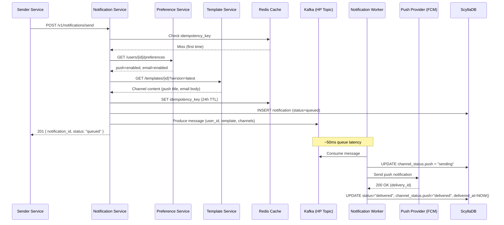
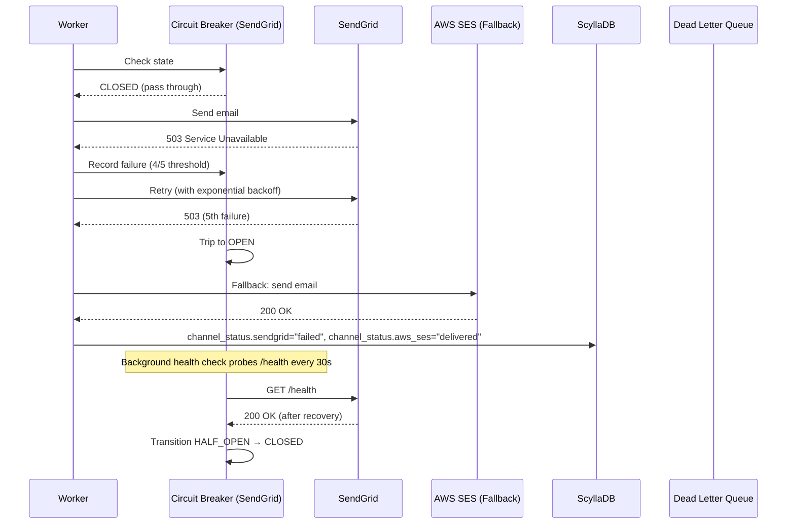
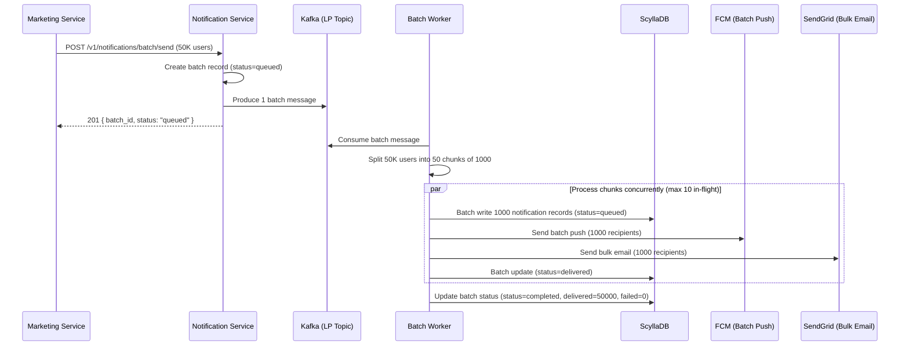

# API Contracts & Database Schema Reference

## Overview

This document defines the complete API surface and data models for the Scalable Notifications System. All APIs use REST over HTTPS with JSON serialization. The base URL follows the pattern:

```
https://notifications.{region}.{env}.example.com/v1
```

---

## 1. Notification APIs

### 1.1 Send Notification

Triggers a notification for a single user across one or more channels.

**POST** `/v1/notifications/send`

#### Request Body

| Field | Type | Required | Description |
|---|---|---|---|
| `user_id` | `string` | Yes | Unique user identifier |
| `channels` | `array<string>` | Yes | Target channels: `push`, `email`, `sms`, `in_app` |
| `template_id` | `string` | Yes | Template identifier for content rendering |
| `template_data` | `object` | Yes | Key-value pairs for template variable substitution |
| `priority` | `enum` | No | `"high"` (transactional) or `"low"` (promotional). Default: `"low"` |
| `idempotency_key` | `string` | Yes | Client-provided key for deduplication (24h window) |
| `expires_at` | `datetime` | No | ISO 8601 timestamp; notification dropped if not delivered by this time |
| `ttl_seconds` | `int` | No | Override default 90-day retention for this notification |

#### Response (201 Created)

```json
{
  "notification_id": "notif_a1b2c3d4",
  "status": "queued",
  "channel_status": {
    "push": "queued",
    "email": "queued"
  },
  "created_at": "2026-06-25T10:30:00Z"
}
```

#### Error Responses

| Code | Condition |
|---|---|
| 400 | Invalid `user_id`, unknown `template_id`, or unsupported channel |
| 409 | Duplicate `idempotency_key` within TTL window |
| 429 | Rate limit exceeded for sender identity |
| 503 | Service temporarily unavailable (circuit breaker open on downstream) |

---

### 1.2 List Notifications (User History)

**GET** `/v1/notifications`

#### Query Parameters

| Parameter | Type | Required | Description |
|---|---|---|---|
| `user_id` | `string` | Yes | Filter by recipient |
| `status` | `enum` | No | `queued`, `delivered`, `failed`, `read` |
| `channel` | `string` | No | Filter by channel type |
| `limit` | `int` | No | Page size (1–100, default 20) |
| `cursor` | `string` | No | Opaque pagination token from previous response |

#### Response (200 OK)

```json
{
  "notifications": [
    {
      "notification_id": "notif_a1b2c3d4",
      "template_id": "tpl_welcome",
      "channels": ["push", "email"],
      "priority": "high",
      "status": "delivered",
      "channel_status": {
        "push": "delivered",
        "email": "delivered"
      },
      "title": "Welcome!",
      "body": "Click to get started",
      "created_at": "2026-06-25T10:30:00Z",
      "delivered_at": "2026-06-25T10:30:01Z",
      "read_at": "2026-06-25T10:31:15Z"
    }
  ],
  "next_cursor": "eyJvZmZzZXQiOiIyMDI2LTA2LTI1VDEwOjMwOjAwWiIsInVzZXJfaWQiOiJ1c3JfYWJjMTIzIn0="
}
```

#### Pagination Contract

- `cursor` is opaque to clients (base64-encoded offset metadata).
- Absence of `next_cursor` indicates the last page.
- Cursor TTL: 5 minutes in Redis. Expired cursors return 404.

---

### 1.3 Mark Notification as Read

**PUT** `/v1/notifications/{notification_id}/read`

#### Response (200 OK)

```json
{
  "notification_id": "notif_a1b2c3d4",
  "status": "read",
  "read_at": "2026-06-25T10:32:00Z"
}
```

**Note:** Idempotent. Subsequent calls return the same response.

---

### 1.4 Batch Send (Bulk Campaign)

**POST** `/v1/notifications/batch/send`

#### Request Body

| Field | Type | Required | Description |
|---|---|---|---|
| `user_ids` | `array<string>` | Yes | List of recipient user IDs (max 50,000 per request) |
| `channels` | `array<string>` | Yes | Target channels |
| `template_id` | `string` | Yes | Template identifier |
| `template_data` | `object` | Yes | Template variables (applied uniformly to all users) |
| `priority` | `enum` | No | Default: `"low"` (campaigns are promotional) |
| `batch_idempotency_key` | `string` | Yes | Deduplication for the entire batch operation |

#### Response (201 Created)

```json
{
  "batch_id": "batch_001",
  "total_users": 50000,
  "status": "queued",
  "estimated_completion": "2026-06-25T10:35:00Z"
}
```

---

## 2. Preference APIs

### 2.1 Get User Preferences

**GET** `/v1/users/{user_id}/preferences`

```json
{
  "user_id": "usr_abc123",
  "channels": {
    "push": {
      "enabled": true,
      "quiet_hours_start": "22:00",
      "quiet_hours_end": "08:00",
      "timezone": "America/New_York"
    },
    "email": {
      "enabled": true,
      "digest": "instant"
    },
    "sms": {
      "enabled": false
    },
    "in_app": {
      "enabled": true,
      "sound_enabled": true,
      "badge_count": 3
    }
  },
  "global_opt_out": false,
  "updated_at": "2026-06-20T14:00:00Z"
}
```

### 2.2 Update User Preferences

**PUT** `/v1/users/{user_id}/preferences`

Supports partial update via JSON Merge Patch (RFC 7396). Only provided fields are modified.

```json
{
  "channels": {
    "sms": { "enabled": true }
  }
}
```

---

## 3. Template APIs

### 3.1 Create Template Version

**POST** `/v1/templates`

```json
{
  "template_id": "tpl_welcome",
  "name": "User Welcome",
  "version": 2,
  "channels": {
    "push": {
      "title": "Welcome {{username}}!",
      "body": "Tap to verify your account"
    },
    "email": {
      "subject": "Welcome to Example, {{username}}!",
      "body_text": "Hi {{username}},\n\nPlease verify your account: {{verify_link}}",
      "body_html": "<h1>Welcome!</h1><p>Verify: <a href=\"{{verify_link}}\">link</a></p>"
    },
    "sms": {
      "body": "Welcome {{username}}! Verify: {{verify_link}}"
    }
  },
  "defaults": {
    "priority": "medium",
    "ttl_seconds": 86400
  },
  "metadata": {
    "owner_team": "growth",
    "description": "Sent immediately after user signup"
  }
}
```

### 3.2 Get Template

**GET** `/v1/templates/{template_id}?version={version}`

Returns the specified version. If version is omitted, returns the latest published version.

---

## 4. Database Schema

### 4.1 ScyllaDB / Cassandra — Notification History

#### Table: `notifications_by_user`

Primary read path for user notification history.

```sql
CREATE TABLE notifications_by_user (
    user_id             TEXT,
    created_at_month    TEXT,           -- "2026-06" for partition sizing
    created_at          TIMESTAMP,
    notification_id     UUID,
    channels            SET<TEXT>,
    priority            TEXT,
    template_id         TEXT,
    status              TEXT,           -- queued, delivered, failed, read
    channel_status      MAP<TEXT, TEXT>,-- {push: delivered, email: queued}
    title               TEXT,
    body                TEXT,
    provider_responses  MAP<TEXT, TEXT>,-- {sendgrid: "250 OK", ...}
    idempotency_key     TEXT,
    expires_at          TIMESTAMP,
    delivered_at        TIMESTAMP,
    read_at             TIMESTAMP,
    PRIMARY KEY ((user_id, created_at_month), created_at, notification_id)
) WITH CLUSTERING ORDER BY (created_at DESC, notification_id ASC)
  AND default_time_to_live = 7776000;   -- 90 days (seconds)
```

**Access Patterns:**

| Query | Pattern |
|---|---|
| User's recent notifications | `WHERE user_id = ? AND created_at_month = ? ORDER BY created_at DESC LIMIT 20` |
| Single notification detail | `WHERE user_id = ? AND created_at_month = ? AND notification_id = ?` |
| Mark as read | `UPDATE SET read_at = ? WHERE user_id = ? AND created_at_month = ? AND created_at = ? AND notification_id = ?` |

**Partition Sizing:**
- Key: `(user_id, created_at_month)` → at most one month of data per partition.
- At 10 notifications/day × 30 days = 300 rows per partition for typical users.
- At 100 notifications/day × 30 days = 3,000 rows (~1–2 MB) — well under 100 MB limit.

---

#### Table: `notifications_by_status`

Operational table for reconciliation jobs and admin dashboards.

```sql
CREATE TABLE notifications_by_status (
    status              TEXT,           -- queued, delivered, failed
    bucket              TIMESTAMP,      -- truncated to hour: "2026-06-25T10:00:00Z"
    notification_id     UUID,
    user_id             TEXT,
    created_at          TIMESTAMP,
    PRIMARY KEY ((status, bucket), created_at, notification_id)
) WITH CLUSTERING ORDER BY (created_at DESC, notification_id ASC)
  AND default_time_to_live = 259200;    -- 3 days (seconds); operational only
```

**Access Patterns:**

| Query | Pattern |
|---|---|
| Find stale pending notifications | `WHERE status = 'queued' AND bucket = ?` |
| Admin: failed notifications in last hour | `WHERE status = 'failed' AND bucket = ?` |

---

#### Table: `idempotency_cache`

```sql
CREATE TABLE idempotency_cache (
    idempotency_key     TEXT,
    notification_id     UUID,
    created_at          TIMESTAMP,
    PRIMARY KEY ((idempotency_key))
) WITH default_time_to_live = 86400;    -- 24 hours (seconds)
```

**Note:** This is also cached in Redis (with 24h TTL) for sub-millisecond checks. Cassandra serves as the durable backing store.

---

### 4.2 PostgreSQL — Templates

```sql
CREATE TABLE templates (
    template_id     VARCHAR(64)     NOT NULL,
    version         INTEGER         NOT NULL,
    name            VARCHAR(255)    NOT NULL,
    channels        JSONB           NOT NULL,   -- channel-specific content
    defaults        JSONB,                      -- default priority, ttl, etc.
    metadata        JSONB,                      -- owner_team, description
    status          VARCHAR(16)     NOT NULL DEFAULT 'draft',  -- draft, published, deprecated
    created_by      VARCHAR(64),
    created_at      TIMESTAMPTZ     NOT NULL DEFAULT NOW(),
    updated_at      TIMESTAMPTZ     NOT NULL DEFAULT NOW(),
    PRIMARY KEY (template_id, version)
);

CREATE INDEX idx_templates_status ON templates (status) WHERE status = 'published';
```

### 4.3 PostgreSQL — User Preferences

```sql
CREATE TABLE user_preferences (
    user_id         VARCHAR(64)     PRIMARY KEY,
    channels        JSONB           NOT NULL DEFAULT '{}',  -- per-channel config
    global_opt_out  BOOLEAN         NOT NULL DEFAULT FALSE,
    updated_at      TIMESTAMPTZ     NOT NULL DEFAULT NOW()
);

-- GIN index for JSONB queries (e.g., find users with SMS enabled)
CREATE INDEX idx_user_preferences_channels ON user_preferences USING GIN (channels);
```

---

## 5. Data Flow Sequences

### 5.1 Single Notification (Happy Path)



### 5.2 Provider Failure with Circuit Breaker



### 5.3 Batch Campaign Processing



---

## 6. Observability Contracts

### 6.1 Health Check Endpoint

**GET** `/health`

```json
{
  "status": "ok",
  "version": "1.4.2",
  "uptime_seconds": 84321,
  "dependencies": {
    "scylladb": { "status": "ok", "latency_ms": 3 },
    "redis": { "status": "ok", "latency_ms": 1 },
    "kafka": { "status": "ok", "lag": 42 }
  }
}
```

### 6.2 Key Metrics (Prometheus)

| Metric | Type | Labels | Description |
|---|---|---|---|
| `notifications_sent_total` | Counter | `channel, priority, status` | Total notifications processed |
| `notifications_send_duration_seconds` | Histogram | `channel` | p50/p95/p99 latency for end-to-end delivery |
| `worker_queue_depth` | Gauge | `priority` | Current depth of each priority queue |
| `worker_processing_lag_ms` | Gauge | `priority` | Consumer lag from latest produced message |
| `provider_request_duration_seconds` | Histogram | `provider` | Per-provider API call latency |
| `circuit_breaker_state` | Gauge | `provider` | 0=CLOSED, 1=HALF_OPEN, 2=OPEN |
| `cache_hit_ratio` | Gauge | `cache_name` | Hit ratio for Redis caches |
| `db_partition_size` | Gauge | `keyspace, table` | Estimated partition size in MB |

---

## 7. Rate Limiting Contract

| Limit Type | Scope | Default | Burst |
|---|---|---|---|
| Per-sender throughput (transactional) | API key | 50,000 req/s | 75,000 |
| Per-sender throughput (promotional) | API key | 10,000 req/s | 15,000 |
| Per-user notification history reads | User ID | 100 req/min | 200 |
| Batch send max recipients | Per request | 50,000 users | — |

Rate limit headers in all responses:

```
X-RateLimit-Limit: 50000
X-RateLimit-Remaining: 42380
X-RateLimit-Reset: 1719302400
```

429 responses include `Retry-After` header with seconds to wait.
