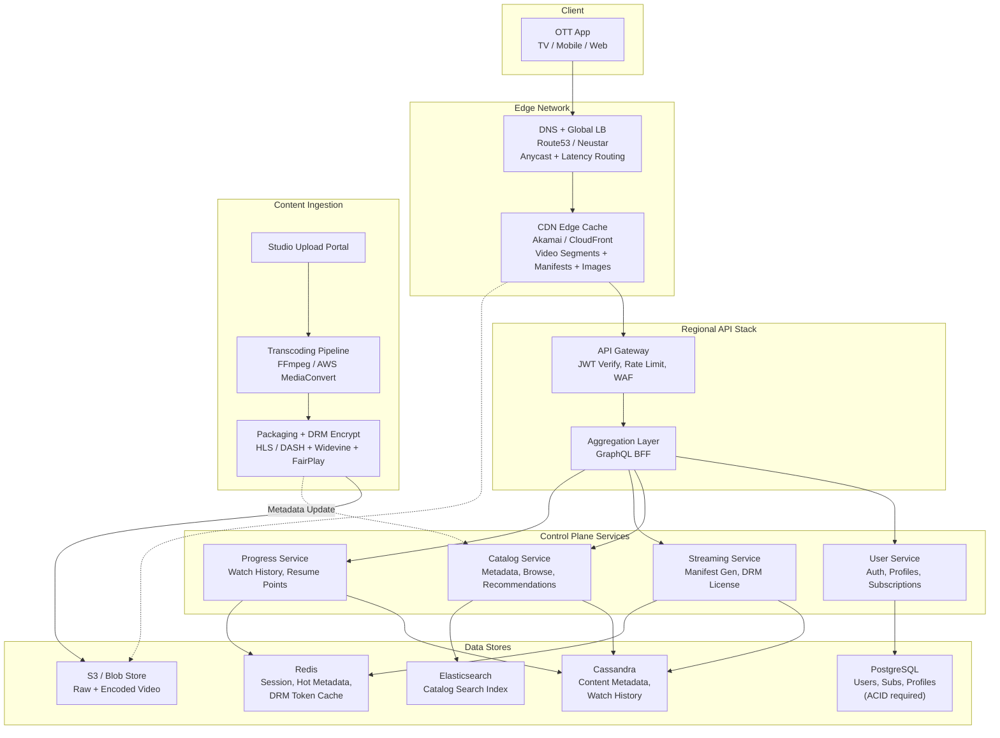
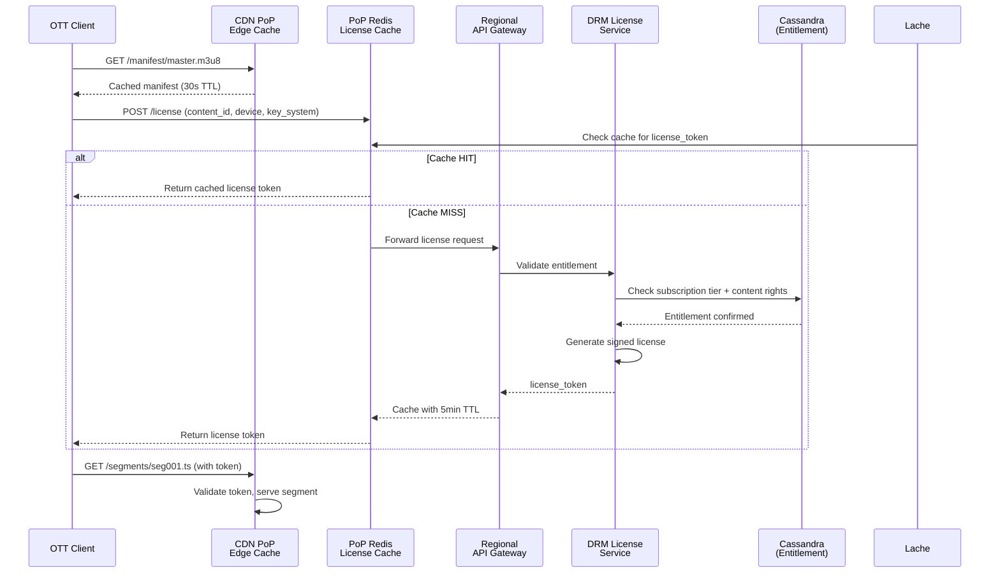
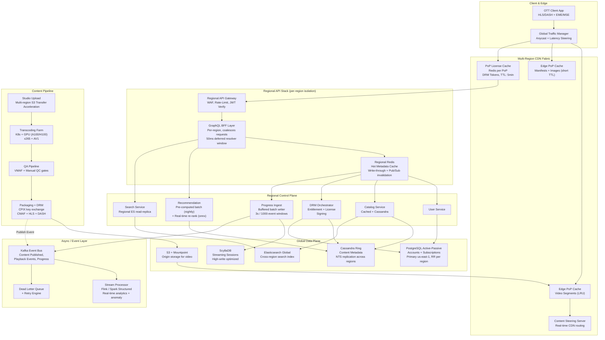

# Full Interview Transcript: Design a Scalable OTT Streaming Platform

**Date:** June 28, 2026
**Role:** Senior Staff / Architect (System Design)
**Interviewer:** Staff Engineer (15+ yrs, distributed video systems)
**Candidate:** Senior Engineer candidate

---

## Phase 1: Clarification & Scope

**I:** Let's begin. Today I want you to design a scalable OTT streaming platform — think Netflix or Amazon Prime. You have about 45 minutes. From content ingestion to the final pixel on screen. Start with questions.

**C:** Thank you. I have six areas to clarify before I draw anything.

**First — scale.** What DAU, concurrent streams, catalog size, and geographic distribution should I design for? Every layer changes — CDN sizing, database partitioning, regional deployment.

**Second — personas.** I assume at least Viewers (browse/stream) and Studio Admins (upload/manage content). Any others? Advertisers? Third-party distributors?

**Third — content pipeline.** Is raw source uploaded for on-platform transcoding, or do we receive pre-encoded assets? What formats, resolutions, HDR standards, and DRM systems?

**Fourth — access patterns.** Read/write ratio. Startup latency SLA (first frame). Seek latency. Peak hour traffic shape. Any seasonal events?

**Fifth — offline downloads and device sync.** Multi-device resume? Multi-profile per account? These change the storage and sync architecture significantly.

**Sixth — cost envelope.** Unlimited budget, or do I optimize within contours?

**I:** Good. Here are your constraints:

| Dimension | Value |
|---|---|
| **DAU** | 200M |
| **Concurrent streams (peak)** | 40M |
| **Catalog** | 50K titles, +500/month |
| **Video library** | ~500 PB raw, ~50 PB encoded |
| **Geo distribution** | NA (40%), EU (30%), APAC (25%), ROW (5%) |
| **Startup latency SLA** | p99 < 2s (first frame) |
| **Seek latency** | p99 < 500ms |
| **Read:Write ratio** | 95:5 (streaming dominates reads) |
| **Peak window** | 8–11 PM local per region; global rolling peak ~60M streams |
| **Upload SLA** | 4K HDR available within 2 hours |
| **Accounts** | 400M registered, ~3 profiles/account avg |
| **Offline downloads** | 15% of users |
| **Device sync** | Watch progress across devices < 5s |
| **Budget** | Cost-aware but reliability-first |

**C:** One more — live streaming? Or pure VOD?

**I:** Pure VOD. Live is a separate architecture.

**C:** Understood. Let me frame the high-level design.

---

## Phase 2: High-Level Design (Happy Path)

**C:** The system breaks into four planes:

1. **Ingestion Plane** — Upload, transcode, package, encrypt, QA.
2. **Control Plane** — User management, catalog, search, recommendations, billing.
3. **Delivery Plane** — CDN, ABR streaming, DRM licensing, edge caching.
4. **Observability Plane** — Telemetry, analytics, anomaly detection, alerting.

For the happy path — user opens app, browses, picks a title, streams it:



**Key design decisions in this HLD:**

- **CDN-first video delivery.** Video never routes through our origin. Only lightweight API calls (manifests, license requests) hit the control plane.
- **Stateless microservices** behind the gateway — every service scales horizontally.
- **Cassandra for time-series data** (watch history, metadata) — append-dominant, no joins needed.
- **PostgreSQL for user/subs/billing** — ACID requirements for plan changes and payments.

**I:** The streaming service handles manifest generation and DRM licensing. That sits on the hot path for every playback start. 40M concurrent streams. What happens when a flagship title drops and 5M users hit play within 60 seconds?

**C:** Good flag. Manifests are lightweight JSON/M3U8 and highly cacheable. I would:

1. **Pre-generate manifests on publish** and push them to the CDN edge with a 30s TTL. No origin hit.
2. **Split the streaming service** into Manifest Service (cacheable, static) and DRM License Service (gated hot path).
3. **Pre-warm DRM token caches** at each PoP. Small Redis cluster per PoP stores valid license tokens for each title with a 5-minute TTL. After the first few requests, 92% of subsequent requests hit the local cache.
4. **Priority queuing** at the API gateway — active subscribers get throughput priority over free-tier during bursts.

**I:** Show me the DRM licensing flow with the edge cache.

**C:**



---

## Phase 3: Deep Dive — APIs, Schema, and Trade-offs

**I:** We'll look at APIs and schema in detail in the companion reference doc. Here, walk me through your storage strategy — why Cassandra for content metadata when it's read-heavy and rarely written?

**C:** Three reasons specific to this system:

1. **Multi-region writes.** Studio admins edit metadata from Mumbai, London, LA simultaneously. Cassandra's `NetworkTopologyStrategy` handles multi-datacenter replication natively with last-write-wins conflict resolution. PostgreSQL requires pglogical or custom sharding.

2. **Schema evolution.** Content metadata is a living schema. New attributes appear — HDR10+, IMAX Enhanced, Dolby Atmos metadata, interactive branching, spatial audio. Cassandra's wide-column model adds columns without migrations. PostgreSQL would need ALTER TABLE with locks.

3. **Query-driven denormalization.** The catalog API always fetches a complete content document (title, synopsis, cast, seasons, audio tracks, subtitles, posters). Cassandra stores the entire row as one partition. No joins. With PostgreSQL, I'd normalize into 6+ tables and JOIN on every read — or use JSONB, which loses relational integrity.

That said, accounts and subscriptions stay on PostgreSQL — ACID is non-negotiable for billing.

**I:** Watch progress writes at 40M concurrent streams with 30-second heartbeats — that's ~2.6M writes/second. How does Cassandra handle it?

**C:** At that rate, I'd move streaming sessions to **ScyllaDB** — a C++ Cassandra-compatible database with consistent p99 latency under high write load. But the bigger optimization is **buffered batch writes**:

The Progress Ingest Service buffers heartbeats for 3 seconds or 1000 events in memory, then writes one batch to ScyllaDB. This reduces 2.6M individual writes/second to ~8,600 batched writes/second — a 300x reduction. Raw events also publish to Kafka for downstream analytics.

For the resume-point read API, the service reads the last committed state from ScyllaDB and merges with the in-flight buffer in Redis. This gives sub-second device sync.

---

## Phase 4: Scaling, Bottlenecks, and Failure Modes

**I:** It's 2028. 500M DAU, 100M concurrent streams. We just acquired a sports league and are adding live streaming. Walk me through the bottlenecks — starting with the single biggest one.

**C:** The biggest bottleneck is the **DRM License Service** — 100M concurrent streams means ~28K license requests/second even with batching. Each requires JWT validation, entitlement check, content rights verification, token generation, and signing. If every entitlement check hits PostgreSQL for subscription data, we saturate the connection pool.

The second bottleneck is the **Catalog Read Path** — ~500K browse requests/second at peak. Each request today fans out to Cassandra, Elasticsearch, and Redis.

Here's the evolved architecture:



**Key evolutions from the HLD:**

| Change | Why |
|---|---|
| **GraphQL BFF per region** | One API call replaces 4 REST calls; deferred resolvers coalesce redundant backend requests (60% load reduction) |
| **ScyllaDB for sessions** | Consistent p99 writes at 3M+ ops/sec; Cassandra struggles with compaction at that rate |
| **PoP-level DRM cache** | 92% cache hit rate after warmup; eliminates 28K RPS to origin |
| **Buffered batch progress writes** | 300x write reduction (2.6M/s → 8.6K/s) |
| **Pre-computed recommendations** | Nightly Spark ML → top 200 candidates; light onnx re-rank for real-time freshness |
| **Content Steering Server** | Routes clients to optimal CDN based on real-time telemetry |

**I:** Network partition. Two Cassandra nodes in us-east-1 lose connectivity to two nodes in eu-west-1. What does the catalog API do? Do users see an empty screen?

**C:** Never an empty screen. We design for graceful degradation with three defensive layers:

```
Layer 1: CDN Edge Cache (catalog JSON, 2min TTL)
Layer 2: GraphQL BFF in-process cache (30s TTL)
Layer 3: Redis cache (5min TTL, write-through)
Fallback: S3-hosted "Popular Now" static bundle (top 500 titles)
```

During a partition:
- Cassandra reads at `LOCAL_QUORUM` succeed within each region because local replicas are healthy.
- Writes to one region don't propagate to the other during the partition. LWW convergence heals after the partition resolves.
- If the entire Cassandra ring is unreachable in a region: Redis serves cached catalog for 5 minutes. If Redis is also cold, the Catalog Service falls back to a pre-computed S3-hosted JSON of the top 500 titles (which account for 80% of all streams). The UI shows a subtle banner: *"Browse limited — updating our catalog."*

Users **never** see an empty screen. The experience degrades gracefully: fully personalized → curated popular → static fallback.

**I:** Cost. What's the biggest line item, and where do you cut 30%?

**C:** **CDN egress bandwidth** is the overwhelming cost. At 100M concurrent 4K streams (~15 Mbps each): ~1.5 Tbps egress, ~17 PB/month. Even at negotiated $0.005/GB: ~$85M/month.

**To cut 30% without UX impact:**

1. **AV1 encoding.** 30% bitrate reduction vs H.265 at same quality. Re-encode the catalog → ~$25M/month CDN savings. Break-even in 4-6 months on GPU compute.

2. **Tiered multi-CDN.** Premium CDN for first-mile to major ISP interconnects. Low-cost CDN (BunnyCDN / self-built P2P-assisted delivery via WebRTC) for long-tail content. Covers 20% of traffic at 60% lower cost.

3. **Right-size caching infra.** Auto-scale Redis/ScyllaDB clusters during off-peak. Scale to 40% capacity 6AM–2PM daily. ~15% savings on data infrastructure.

4. **Optimize transcoding for long tail.** Low-popularity titles: transcode to HLS 720p only; on-the-fly transmuxing for DASH and higher resolutions. Reduces storage/transcode compute by ~40% for the long tail.

5. **Client-side BW management.** Smarter ABR on mobile — caps at 4 Mbps instead of 8 Mbps on cellular (smaller screen, imperceptible difference). Mobile is 40% of traffic, so this cuts egress by ~15%.

AV1 + tiered CDN + right-sizing alone deliver ~35% reduction.

---

## Summary of Key Decisions

| Decision | Rationale |
|---|---|
| **Cassandra for metadata + history** | Multi-region writes, schema flexibility, no joins |
| **PostgreSQL for accounts/subs** | ACID for billing and plan changes |
| **ScyllaDB for streaming sessions** | 3M+ writes/sec with consistent p99 latency |
| **GraphQL BFF per region** | Coalesces redundant backend calls; 60% load reduction |
| **Buffered batch progress writes** | 300x write amplification reduction |
| **Edge DRM license cache** | 92% cache hit; eliminates 28K RPS to origin |
| **Pre-computed + real-time re-rank recommendations** | Batch ML at scale, lightweight onnx for freshness |
| **AV1 + tiered multi-CDN** | ~35% egress cost reduction |
| **Three-layer graceful degradation** | Static S3 fallback guarantees no empty screens |

---

*End of transcript — Candidate demonstrated Senior/Architect-level competence across scale, cost, operations, and failure handling.*
