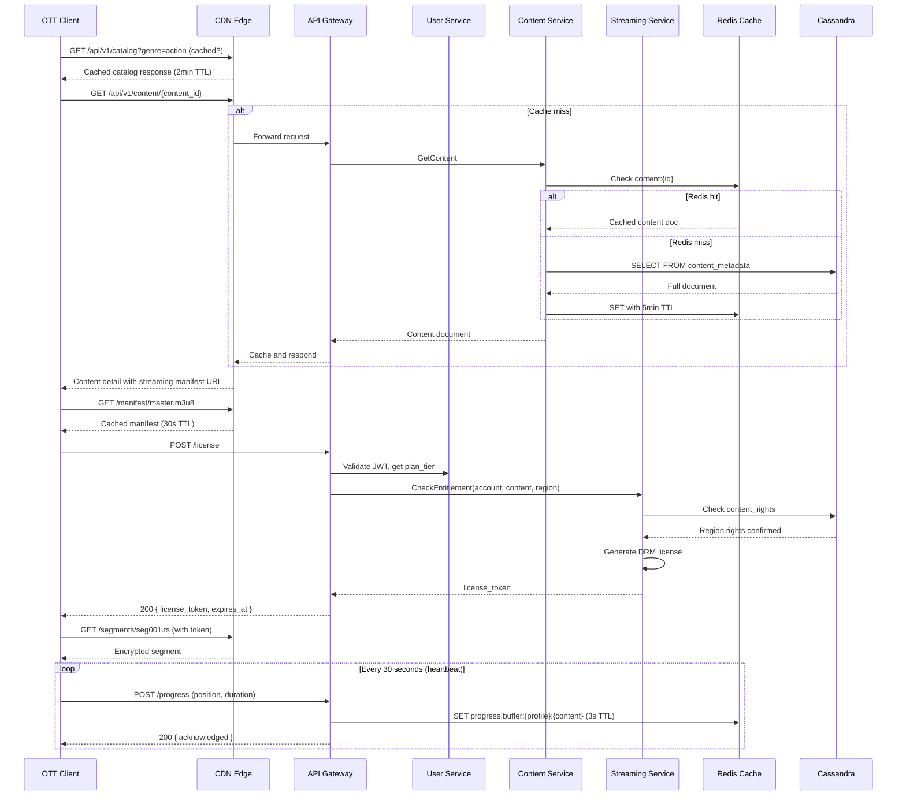
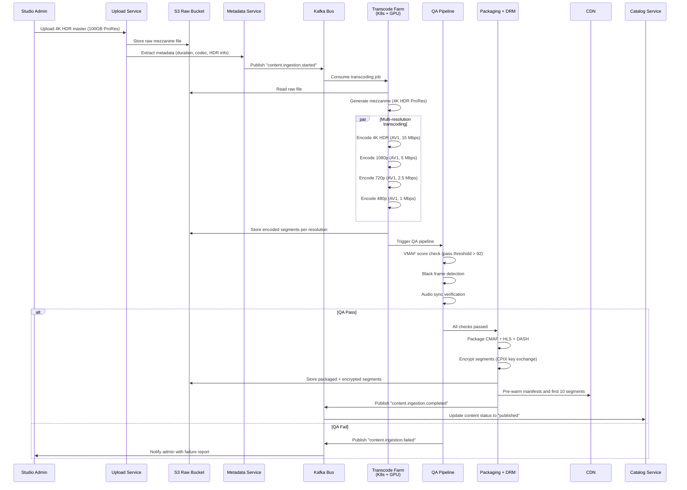
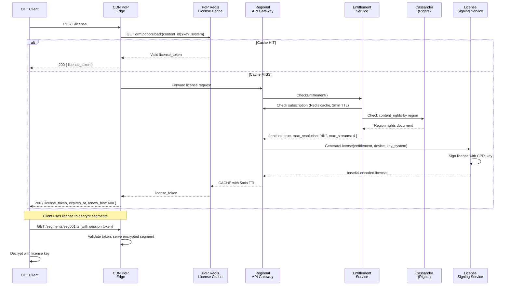
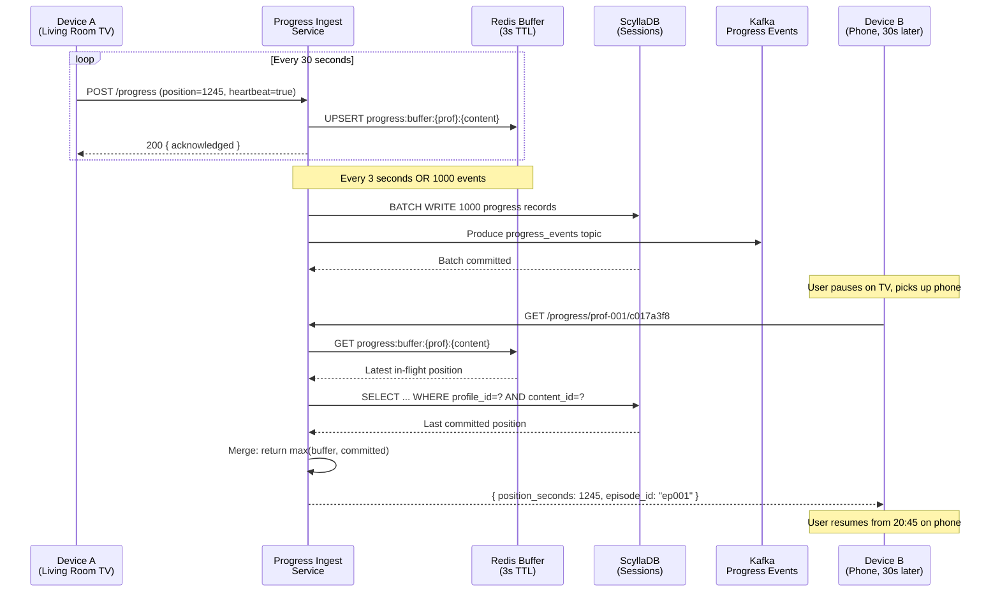
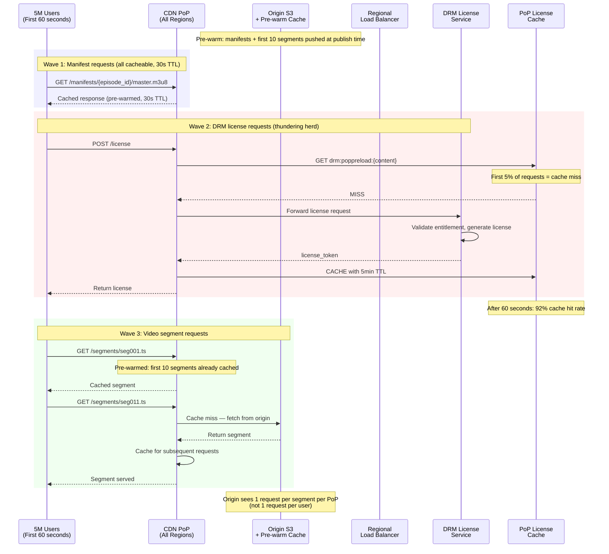
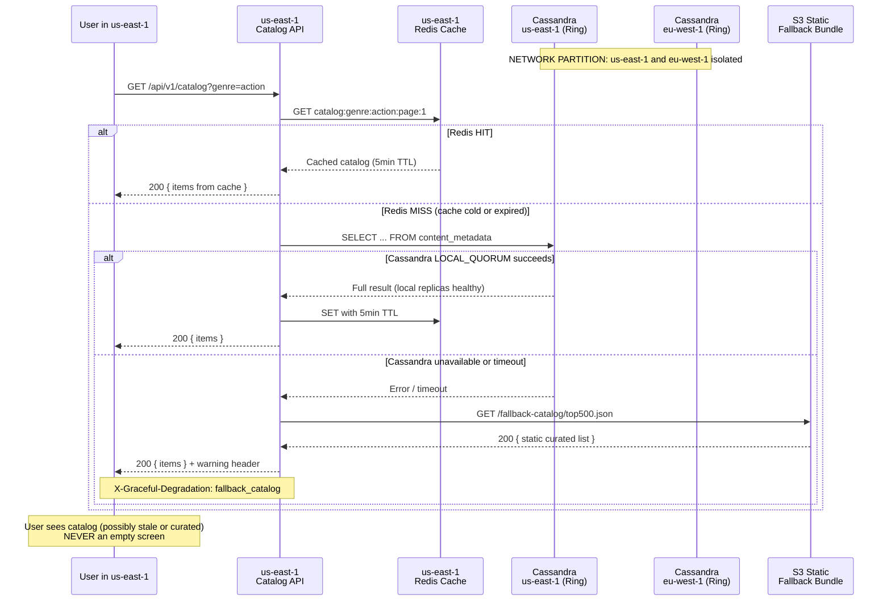

# API Contracts & Database Schema Reference

## Overview

This document defines the complete API surface, data models, sequence flows, and operational contracts for the Scalable OTT Streaming Platform. All external APIs use REST over HTTPS with JSON serialization. Inter-service communication uses gRPC.

Base URL pattern:
```
https://api.{region}.ott.example.com/v1
```

---

## 1. REST API Contracts

### 1.1 Browse Catalog

**GET** `/api/v1/catalog`

#### Query Parameters

| Parameter | Type | Required | Description |
|---|---|---|---|
| `genre` | `string` | No | Filter by genre slug (e.g., `action`, `sci-fi`) |
| `sort` | `enum` | No | `popularity` (default), `release_date`, `rating`, `trending` |
| `page` | `int` | No | Page number (1-indexed, default 1) |
| `limit` | `int` | No | Items per page (1–100, default 20) |
| `cursor` | `string` | No | Opaque cursor for cursor-based pagination (overrides `page`) |

#### Response (200 OK)

```json
{
  "items": [
    {
      "content_id": "c017a3f8",
      "title": "Stranger Tides",
      "type": "series",
      "year": 2026,
      "genres": ["action", "adventure"],
      "maturity_rating": "TV-MA",
      "poster_landscape": "https://cdn.ott.example.com/img/c017a3f8/ls.jpg",
      "poster_portrait": "https://cdn.ott.example.com/img/c017a3f8/pt.jpg",
      "average_rating": 4.7,
      "match_score": 96
    }
  ],
  "next_cursor": "eyJvZmZzZXQiOiIyMCJ9",
  "total_estimate": 1200
}
```

#### Error Responses

| Code | Condition |
|---|---|
| 400 | Invalid filter combination |
| 429 | Rate limit exceeded |

---

### 1.2 Content Detail

**GET** `/api/v1/content/{content_id}`

#### Path Parameters

| Parameter | Type | Description |
|---|---|---|
| `content_id` | `string` | UUID of the content item |

#### Response (200 OK)

```json
{
  "content_id": "c017a3f8",
  "title": "Stranger Tides",
  "synopsis": "A deep-sea expedition uncovers an ancient anomaly...",
  "cast": ["Actor A", "Actor B", "Actor C"],
  "directors": ["Director X"],
  "seasons": [
    {
      "season_number": 1,
      "episodes": [
        {
          "episode_id": "ep001",
          "title": "Pilot",
          "duration_seconds": 3540,
          "still_url": "https://cdn.ott.example.com/img/ep001/still.jpg",
          "streaming_manifest": {
            "hls": "https://cdn.ott.example.com/manifests/ep001/master.m3u8?token=<signed>",
            "dash": "https://cdn.ott.example.com/manifests/ep001/master.mpd?token=<signed>"
          }
        }
      ]
    }
  ],
  "available_audio": ["en", "es", "fr", "ja"],
  "audio_metadata": {
    "en": { "codec": "EAC3", "channels": "5.1" },
    "ja": { "codec": "AAC", "channels": "2.0" }
  },
  "available_subtitles": ["en", "es", "fr", "de", "ja"],
  "hdr_formats": ["HDR10", "DolbyVision"],
  "available_resolutions": ["SD", "HD", "4K"],
  "release_year": 2026,
  "maturity_rating": "TV-MA",
  "content_type": "series",
  "status": "published"
}
```

---

### 1.3 Request DRM License

**POST** `/api/v1/license`

#### Request Body

| Field | Type | Required | Description |
|---|---|---|---|
| `content_id` | `string` | Yes | UUID of the content |
| `episode_id` | `string` | Yes | UUID of the specific episode |
| `device_id` | `string` | Yes | Device hardware identifier |
| `key_system` | `enum` | Yes | `widevine` \| `playready` \| `fairplay` |
| `session_id` | `string` | Yes | Client-generated playback session ID |

#### Response (200 OK)

```json
{
  "license_token": "base64-encoded-cenc-license",
  "expires_at": "2026-06-28T21:00:00Z",
  "renewal_hint_seconds": 600,
  "allowed_renditions": ["SD", "HD"],
  "max_resolution": "1920x1080"
}
```

#### Error Responses

| Code | Condition |
|---|---|
| 402 | Payment required — subscription expired |
| 403 | Content not available in user's region |
| 451 | Content blocked due to legal restriction |

---

### 1.4 Report Watch Progress

**POST** `/api/v1/progress`

#### Request Body

| Field | Type | Required | Description |
|---|---|---|---|
| `content_id` | `string` | Yes | UUID of the content |
| `episode_id` | `string` | Yes | UUID of the episode |
| `profile_id` | `string` | Yes | Profile identifier |
| `position_seconds` | `int` | Yes | Current playback position |
| `duration_seconds` | `int` | Yes | Total duration of the episode |
| `device_id` | `string` | Yes | Device identifier |
| `timestamp` | `datetime` | Yes | ISO 8601 timestamp |
| `is_heartbeat` | `bool` | No | If `true`, this is a periodic heartbeat (not seek/jump) |

#### Response (200 OK)

```json
{
  "acknowledged": true,
  "sync_token": "st-abc123",
  "position_seconds": 1245
}
```

**Note:** Heartbeats are buffered server-side for up to 3 seconds before batch commit. The response acknowledges receipt immediately. The `sync_token` can be used by other devices to fetch the latest position.

---

### 1.5 Get Resume Point (Multi-Device Sync)

**GET** `/api/v1/progress/{profile_id}/{content_id}`

#### Path Parameters

| Parameter | Type | Description |
|---|---|---|
| `profile_id` | `string` | Profile UUID |
| `content_id` | `string` | Content UUID |

#### Query Parameters

| Parameter | Type | Description |
|---|---|---|
| `include_episodes` | `bool` | If `true`, return progress for all episodes in the series |

#### Response (200 OK)

```json
{
  "content_id": "c017a3f8",
  "profile_id": "prof-001",
  "episode_id": "ep001",
  "position_seconds": 1245,
  "duration_seconds": 3540,
  "last_updated": "2026-06-28T20:15:30Z",
  "device_id": "dev-a1b2c3",
  "watch_status": "in_progress"
}
```

`watch_status` values: `not_started`, `in_progress`, `completed`, `restarted`

If `include_episodes=true`:

```json
{
  "content_id": "c017a3f8",
  "profile_id": "prof-001",
  "episodes": {
    "ep001": { "position_seconds": 1245, "status": "in_progress" },
    "ep002": { "position_seconds": 0, "status": "not_started" }
  }
}
```

---

### 1.6 Search Catalog

**POST** `/api/v1/search`

#### Request Body

| Field | Type | Required | Description |
|---|---|---|---|
| `query` | `string` | Yes | Free-text search query |
| `filters` | `object` | No | Filter object (see below) |
| `page_size` | `int` | No | Results per page (1–50, default 20) |
| `next_cursor` | `string` | No | Pagination cursor |

**Filters object:**

| Field | Type | Description |
|---|---|---|
| `genres` | `array<string>` | Filter to specific genres |
| `year_range` | `object` | `{ "min": 2020, "max": 2026 }` |
| `maturity_ratings` | `array<string>` | e.g., `["TV-14", "TV-MA"]` |
| `content_type` | `array<string>` | `["movie", "series"]` |
| `audio_languages` | `array<string>` | e.g., `["en", "es"]` |
| `hdr_formats` | `array<string>` | e.g., `["HDR10", "DolbyVision"]` |

#### Response (200 OK)

```json
{
  "results": [
    {
      "content_id": "c017a3f8",
      "title": "Stranger Tides",
      "type": "series",
      "year": 2026,
      "genres": ["action", "adventure"],
      "maturity_rating": "TV-MA",
      "match_reason": "Title match + genre filter"
    }
  ],
  "next_cursor": "cursor-string",
  "total_estimate": 45,
  "suggestions": ["stranger tides", "stranger things", "strange planet"]
}
```

---

### 1.7 User Profile APIs

**GET** `/api/v1/profiles` — List profiles for authenticated account.

**POST** `/api/v1/profiles` — Create profile.

| Field | Type | Description |
|---|---|---|
| `name` | `string` | Profile name |
| `avatar_id` | `string` | Avatar identifier |
| `is_child` | `bool` | If true, enforce maturity PIN |
| `maturity_pin` | `string` | 4-digit PIN for mature content |

**PUT** `/api/v1/profiles/{profile_id}` — Update profile.

**DELETE** `/api/v1/profiles/{profile_id}` — Delete profile.

---

### 1.8 Subscription APIs

**GET** `/api/v1/subscription` — Get current plan and status.

```json
{
  "account_id": "acc-001",
  "plan_tier": "premium",
  "status": "active",
  "current_period_start": "2026-06-01T00:00:00Z",
  "current_period_end": "2026-07-01T00:00:00Z",
  "features": {
    "max_streams": 4,
    "max_profiles": 5,
    "max_resolution": "4K",
    "hdr_support": true,
    "dolby_atmos": true,
    "offline_downloads": true,
    "downloads_limit": 100
  }
}
```

**POST** `/api/v1/subscription/change` — Change plan.

| Field | Type | Description |
|---|---|---|
| `plan_tier` | `string` | `basic` \| `standard` \| `premium` |
| `payment_method_id` | `string` | Stored payment method identifier |

---

## 2. Internal gRPC Contracts

Inter-service communication uses gRPC with protobuf serialization. Key services:

### 2.1 Content Metadata Service

```protobuf
service ContentMetadata {
    rpc GetContent(GetContentRequest) returns (Content);
    rpc BatchGetContent(BatchGetContentRequest) returns (BatchGetContentResponse);
    rpc SearchContent(SearchContentRequest) returns (SearchContentResponse);
    rpc UpdateContent(UpdateContentRequest) returns (Content);
    rpc PublishContent(PublishContentRequest) returns (Content);
}

message GetContentRequest {
    string content_id = 1;
    string region = 2;           // For rights-filtered response
    int32 min_version = 3;       // Stale-read guard
}
```

### 2.2 Entitlement Service

```protobuf
service Entitlement {
    rpc CheckEntitlement(EntitlementRequest) returns (EntitlementResponse);
}

message EntitlementRequest {
    string account_id = 1;
    string content_id = 2;
    string region = 3;
    string device_id = 4;
}

message EntitlementResponse {
    bool entitled = 1;
    string plan_tier = 2;
    repeated string allowed_renditions = 3;
    string max_resolution = 4;
    int32 max_streams = 5;
    int32 current_streams = 6;
}
```

### 2.3 Progress Service

```protobuf
service Progress {
    rpc ReportProgress(stream ProgressHeartbeat) returns (ProgressAck);
    rpc GetResumePoint(ResumeRequest) returns (ResumeResponse);
}

message ProgressHeartbeat {
    string profile_id = 1;
    string content_id = 2;
    string episode_id = 3;
    int32 position_seconds = 4;
    int32 duration_seconds = 5;
    string device_id = 6;
    int64 timestamp_unix = 7;
    bool is_heartbeat = 8;
}
```

---

## 3. Database Schema

### 3.1 PostgreSQL — Accounts, Subscriptions, Profiles

#### Table: `accounts`

```sql
CREATE TABLE accounts (
    account_id          UUID PRIMARY KEY,
    email               VARCHAR(255) UNIQUE NOT NULL,
    password_hash       VARCHAR(255) NOT NULL,
    region              VARCHAR(6) NOT NULL,
    account_status      VARCHAR(20) NOT NULL DEFAULT 'active',
    payment_provider    VARCHAR(20),
    payment_token_enc   BYTEA,
    created_at          TIMESTAMPTZ NOT NULL DEFAULT NOW(),
    updated_at          TIMESTAMPTZ NOT NULL DEFAULT NOW()
) PARTITION BY LIST (region);
```

Partitions: `accounts_us`, `accounts_eu`, `accounts_apac`, `accounts_row`.

#### Table: `profiles`

```sql
CREATE TABLE profiles (
    profile_id      UUID PRIMARY KEY,
    account_id      UUID NOT NULL REFERENCES accounts(account_id),
    name            VARCHAR(100) NOT NULL,
    avatar_url      TEXT,
    avatar_id       VARCHAR(32),
    maturity_pin    VARCHAR(4),
    is_child        BOOLEAN DEFAULT FALSE,
    language_pref   VARCHAR(6) DEFAULT 'en',
    created_at      TIMESTAMPTZ NOT NULL DEFAULT NOW()
);

CREATE INDEX idx_profiles_account ON profiles(account_id);
```

#### Table: `subscriptions`

```sql
CREATE TABLE subscriptions (
    subscription_id         UUID PRIMARY KEY,
    account_id              UUID NOT NULL REFERENCES accounts(account_id),
    plan_tier               VARCHAR(20) NOT NULL,
    status                  VARCHAR(20) NOT NULL,
    current_period_start    TIMESTAMPTZ NOT NULL,
    current_period_end      TIMESTAMPTZ NOT NULL,
    canceled_at             TIMESTAMPTZ,
    pause_start             TIMESTAMPTZ,
    pause_end               TIMESTAMPTZ,
    created_at              TIMESTAMPTZ NOT NULL DEFAULT NOW(),
    updated_at              TIMESTAMPTZ NOT NULL DEFAULT NOW()
);

CREATE INDEX idx_subs_active ON subscriptions(account_id, status)
    WHERE status IN ('active', 'past_due');
CREATE INDEX idx_subs_expiring ON subscriptions(current_period_end)
    WHERE status = 'active';
```

---

### 3.2 Cassandra — Content Metadata

#### Table: `content_metadata`

```sql
CREATE TABLE content_metadata (
    content_id          UUID PRIMARY KEY,
    title               TEXT,
    synopsis            TEXT,
    genres              SET<TEXT>,
    cast_list           LIST<TEXT>,
    directors           LIST<TEXT>,
    maturity_rating     TEXT,
    release_year        INT,
    content_type        TEXT,
    status              TEXT,
    seasons             LIST<FROZEN<season_info>>,
    available_audio     SET<TEXT>,
    audio_metadata      MAP<TEXT, FROZEN<audio_codec_info>>,
    available_subs      SET<TEXT>,
    hdr_formats         SET<TEXT>,
    resolutions         SET<TEXT>,
    poster_urls         MAP<TEXT, TEXT>,
    still_urls          MAP<TEXT, TEXT>,
    avg_rating          FLOAT,
    popularity_score    FLOAT,
    duration_seconds    INT,
    version             BIGINT,
    created_at          TIMESTAMP,
    updated_at          TIMESTAMP
);

CREATE INDEX idx_content_genres ON content_metadata(genres);
CREATE INDEX idx_content_year ON content_metadata(release_year);
CREATE INDEX idx_content_type ON content_metadata(content_type);
CREATE INDEX idx_content_status ON content_metadata(status);
```

#### Table: `content_rights` (region rights per title)

```sql
CREATE TABLE content_rights (
    content_id      UUID,
    region          TEXT,
    available_from  TIMESTAMP,
    available_to    TIMESTAMP,
    license_type    TEXT,
    is_4k_enabled   BOOLEAN,
    is_hdr_enabled  BOOLEAN,
    PRIMARY KEY ((content_id), region)
);
```

#### Table: `watch_progress` (time-series, TTL-managed)

```sql
CREATE TABLE watch_progress (
    profile_id          UUID,
    content_id          UUID,
    episode_id          UUID,
    position_seconds    INT,
    duration_seconds    INT,
    device_id           UUID,
    last_updated        TIMESTAMP,
    watch_status        TEXT,
    PRIMARY KEY ((profile_id, content_id), episode_id)
) WITH default_time_to_live = 7776000;   -- 90 days
```

**Access patterns:**

| Query | Pattern |
|---|---|
| Get resume point | `WHERE profile_id = ? AND content_id = ?` |
| Get all episode progress (series) | `WHERE profile_id = ? AND content_id = ?` |
| Update heartbeat | `UPDATE ... WHERE profile_id = ? AND content_id = ? AND episode_id = ?` |

**Partition sizing:** An average user watches ~30 minutes/day across 2 titles. At 30-second heartbeat intervals, that's 60 rows per title per day. Over 90 days: ~5,400 rows per partition. Cassandra handles this comfortably under the 100MB partition limit.

---

### 3.3 ScyllaDB — Streaming Sessions

#### Table: `streaming_sessions`

```sql
CREATE TABLE streaming_sessions (
    session_id          UUID PRIMARY KEY,
    account_id          UUID,
    content_id          UUID,
    episode_id          UUID,
    device_id           UUID,
    profile_id          UUID,
    region              TEXT,
    cdn_pop             TEXT,
    started_at          TIMESTAMP,
    last_heartbeat      TIMESTAMP,
    ended_at            TIMESTAMP,
    bytes_streamed      BIGINT,
    duration_seconds    INT,
    bitrate_avg         INT,
    bitrate_max         INT,
    resolution          TEXT,
    session_status      TEXT,
    error_code          TEXT,
    error_message       TEXT
) WITH default_time_to_live = 2592000;   -- 30 days
```

**Indexes:**

```sql
CREATE INDEX idx_sessions_active ON streaming_sessions(account_id, session_status)
    WHERE session_status = 'active';
CREATE INDEX idx_sessions_content ON streaming_sessions(content_id);
CREATE INDEX idx_sessions_device ON streaming_sessions(device_id);
```

---

### 3.4 Redis Caching Keyspace

| Pattern | TTL | Purpose |
|---|---|---|
| `user:session:{jwt_hash}` | 1h | Profile info, plan tier, region |
| `content:{content_id}:v{version}` | 5min | Serialized full content document |
| `catalog:genre:{genre}:page:{page}` | 1min | Paginated catalog responses |
| `catalog:search:{query_hash}:{cursor}` | 2min | Search result cache |
| `drm:license:{session_id}` | 10min | DRM license token |
| `drm:poppreload:{content_id}:{key_system}` | 5min | PoP-level license preload |
| `progress:buffer:{profile_id}:{content_id}` | 3s | In-flight heartbeat merge buffer |
| `progress:committed:{profile_id}:{content_id}` | 24h | Last committed resume point |
| `entitlement:{account_id}:{content_id}` | 2min | Entitlement check result |
| `rate:limit:{endpoint}:{identity}` | 1s | Sliding window rate counter |

---

### 3.5 Elasticsearch Index: `content_catalog_v4`

```json
{
  "index": "content_catalog_v4",
  "settings": {
    "number_of_shards": 12,
    "number_of_replicas": 2,
    "analysis": {
      "analyzer": {
        "multi_language": {
          "tokenizer": "standard",
          "filter": ["lowercase", "asciifolding", "stop"]
        }
      }
    }
  },
  "mappings": {
    "dynamic": "strict",
    "properties": {
      "content_id":        { "type": "keyword" },
      "title":             { "type": "text", "analyzer": "multi_language", "fields": { "raw": { "type": "keyword" } } },
      "synopsis":          { "type": "text", "analyzer": "multi_language" },
      "genres":            { "type": "keyword" },
      "cast":              { "type": "text", "analyzer": "multi_language" },
      "directors":         { "type": "text", "analyzer": "multi_language" },
      "release_year":      { "type": "integer" },
      "maturity_rating":   { "type": "keyword" },
      "content_type":      { "type": "keyword" },
      "available_audio":   { "type": "keyword" },
      "available_subs":    { "type": "keyword" },
      "hdr_formats":       { "type": "keyword" },
      "resolutions":       { "type": "keyword" },
      "avg_rating":        { "type": "float" },
      "popularity_score":  { "type": "float" },
      "duration_seconds":  { "type": "integer" },
      "suggest":           { "type": "completion" },
      "status":            { "type": "keyword" }
    }
  }
}
```

---

## 4. Data Flow Sequences

### 4.1 Playback Happy Path



### 4.2 Content Ingestion Pipeline



### 4.3 DRM License Issuance with Edge Cache



### 4.4 Watch Progress Sync Across Devices



### 4.5 CDN Cache Miss Storm (New Release Thundering Herd)



### 4.6 Cassandra Network Partition — Graceful Degradation



---

## 5. Caching Strategy

| Cache Layer | What's Cached | TTL | Invalidation |
|---|---|---|---|
| **CDN Edge** | Video segments, manifests, images, catalog JSON | 2min (JSON), 30s (manifests), 24h (segments) | Purge API on content update |
| **PoP Redis** | DRM license tokens | 5min | Time-based expiry |
| **Regional Redis** | Content metadata, catalog pages, search results, entitlements | 1–5min | Write-through on content update |
| **GraphQL BFF** | Deferred resolver results, catalog page aggregations | 30s | In-process LRU |
| **Client** | Catalog pages, images, next-N-segments | Configurable | Cache-Control headers |

**Write-through invalidation pattern:**

```
Content update → Catalog Service → Write to Cassandra
                                → Publish "content.updated" to Kafka
                                → Regional Redis subscriber invalidates keys
                                → CDN purge API called (async)
```

---

## 6. Observability Contracts

### 6.1 Health Check Endpoint

**GET** `/health`

```json
{
  "status": "ok",
  "version": "2.1.7",
  "uptime_seconds": 172800,
  "region": "us-east-1",
  "dependencies": {
    "cassandra": { "status": "ok", "latency_ms": 4 },
    "scylladb": { "status": "ok", "latency_ms": 2 },
    "postgresql": { "status": "ok", "latency_ms": 3 },
    "redis": { "status": "ok", "latency_ms": 1 },
    "elasticsearch": { "status": "ok", "latency_ms": 12 },
    "kafka": { "status": "ok", "lag": 87 }
  }
}
```

### 6.2 Key Prometheus Metrics

| Metric | Type | Labels | Description |
|---|---|---|---|
| `playback_starts_total` | Counter | `region, content_type, plan_tier` | Total playback initiations |
| `playback_start_duration_seconds` | Histogram | `region` | p50/p95/p99 first-frame latency |
| `drm_license_requests_total` | Counter | `key_system, cache_hit` | DRM license request count |
| `drm_license_cache_hit_ratio` | Gauge | `region, key_system` | Hit ratio for PoP license cache |
| `streaming_seeks_total` | Counter | `region, content_type` | User seek actions |
| `cdn_egress_bytes_total` | Counter | `region, cdn_provider, resolution` | Total bytes served by CDN |
| `transcoding_duration_seconds` | Histogram | `resolution, codec` | Time to transcode a title |
| `kafka_consumer_lag` | Gauge | `topic, consumer_group`| Consumer lag per partition |
| `db_partition_size` | Gauge | `keyspace, table` | Estimated partition size in MB |
| `db_write_latency` | Histogram | `keyspace, table` | Database write p99 latency |
| `cache_hit_ratio` | Gauge | `cache_name, region` | Hit ratio per cache layer |
| `circuit_breaker_state` | Gauge | `service, downstream` | 0=CLOSED, 1=HALF_OPEN, 2=OPEN |

---

## 7. Rate Limiting Contract

| Limit Type | Scope | Default | Burst |
|---|---|---|---|
| Catalog API reads | Per API key (client) | 10,000 req/s | 15,000 |
| DRM license requests | Per device ID | 5 req/s | 10 |
| Progress heartbeats | Per profile | 1 req/10s | N/A (excess dropped) |
| Search queries | Per API key | 500 req/s | 750 |
| Profile management | Per account | 10 req/min | 20 |
| Content upload (studio) | Per studio account | 5 concurrent | 10 |

Rate limit headers in all responses:

```
X-RateLimit-Limit: 10000
X-RateLimit-Remaining: 8742
X-RateLimit-Reset: 1719302400
```

429 responses include `Retry-After` header (seconds to wait).

---

## 8. Failure Mode Reference

| Failure | Detection | Mitigation | Recovery |
|---|---|---|---|
| **CDN PoP degraded** | Content Steering health probe latency > 100ms | Route clients to nearest healthy PoP | Auto-resume when probe < 30ms for 60s |
| **DRM provider unreachable** | Circuit breaker trips (5 failures / 30s) | Fallback key system list in client | Background health check; CLOSED after success |
| **Cassandra partition** | Gossip failure detection | LOCAL_QUORUM reads; LWW convergence | Hinted handoff + read-repair |
| **PostgreSQL primary down** | RDS health check; 30s timeout | Promote read replica (Multi-AZ); 30s RTO | Old primary re-joins as replica |
| **Transcode worker crash** | Job timeout > 15 min without progress | SQS visibility timeout → re-queue; max 3 retries | Spot instance replaced by K8s |

---

## 9. Data Retention Policy

| Data Type | Hot Tier | Warm Tier | Cold Tier | Deletion |
|---|---|---|---|---|
| **Watch progress** | ScyllaDB: 30 days | — | S3 Glacier: 90–365 days | After 365 days (unless user re-activates) |
| **Streaming sessions** | ScyllaDB: 7 days | — | S3 Glacier: 8–90 days | After 90 days |
| **Content metadata** | Cassandra: indefinite | — | — | Never (catalog is permanent) |
| **User accounts** | PostgreSQL: indefinite | — | — | 30 days after account deletion request |
| **CDN logs** | — | S3 Standard: 30 days | S3 Glacier: 31–365 days | After 365 days |
| **Error logs** | Elasticsearch: 14 days | — | S3 Glacier: 15–90 days | After 90 days |
