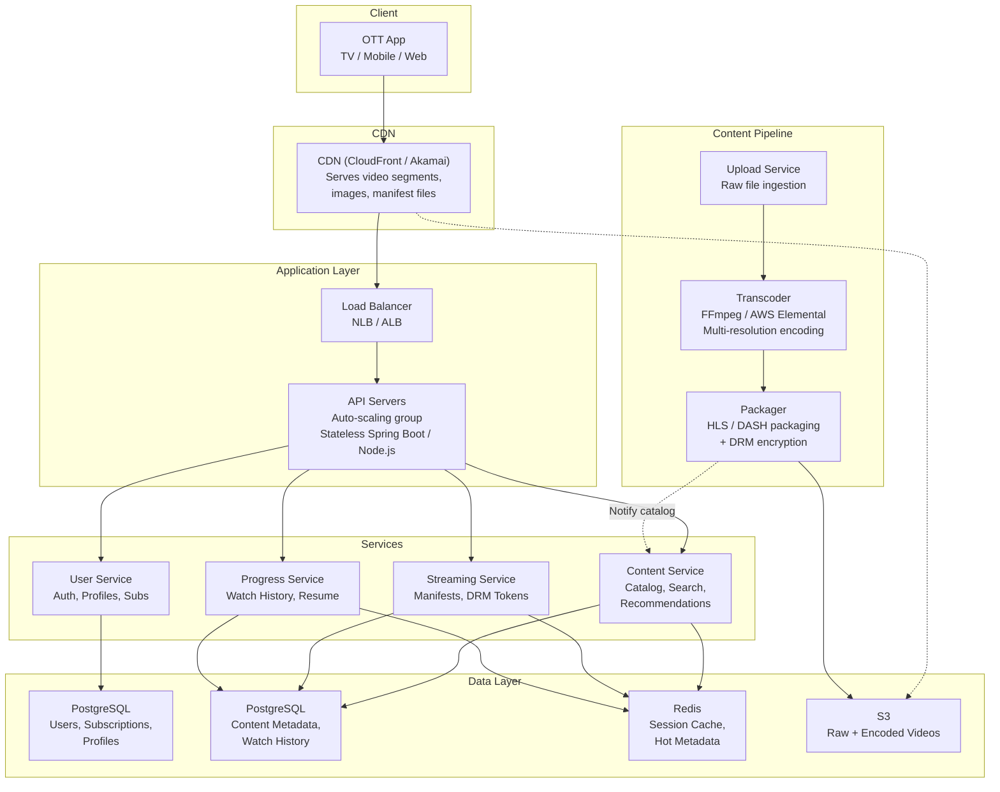
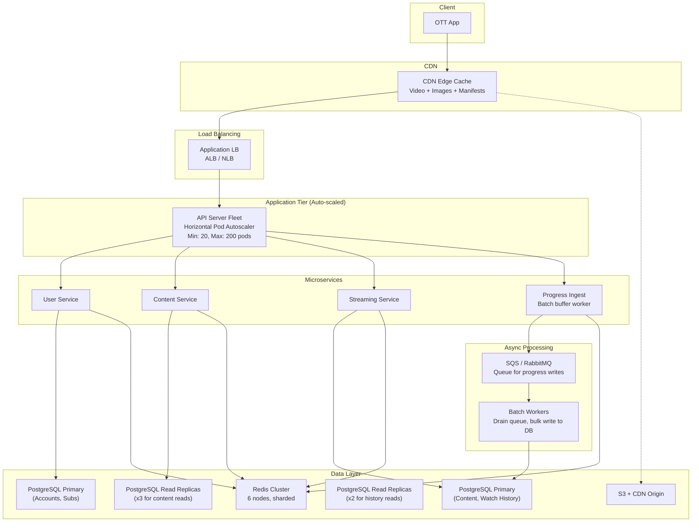

# Full Interview Transcript: Design a Scalable OTT Streaming Platform

**Date:** June 28, 2026
**Role:** Software Engineer (5 YOE — System Design)
**Interviewer:** Senior Engineer (8+ yrs)
**Candidate:** Mid-level Engineer

---

## Phase 1: Clarification & Scope

**I:** Let's start. I'd like you to design a scalable OTT streaming platform — think Netflix or Prime Video. You have about 40 minutes. Ask me questions, then walk me through your design.

**C:** Thanks. I have a few clarifying questions so I can scope things properly.

First — what's the expected scale? How many daily active users, and how many concurrent streams at peak?

**I:** 50 million DAU, roughly 10 million concurrent streams at peak. Our catalog is about 20,000 titles.

**C:** Good. Geographic distribution? Is this US-only or global?

**I:** Start US-only. We can think about global as a future step.

**C:** Understood. What about video quality? Do we support 4K, HDR? And what are the latency expectations — how fast should the video start playing?

**I:** Yes, 4K and HDR are required. For startup, we want first-frame-on-screen within 3 seconds at p99. Seek latency under 1 second.

**C:** What about content ingestion? Do studio admins upload pre-encoded files, or do we handle transcoding?

**I:** Raw source files are uploaded. We handle encoding, packaging, and DRM encryption in-house.

**C:** Last one — offline downloads? Multi-device sync? Multi-profile per account?

**I:** Yes to all three. Offline downloads for mobile users. Watch progress should sync across devices. Each account can have up to 5 profiles.

**C:** Perfect. Here's my summary of the requirements:

| Requirement | Value |
|---|---|
| DAU | 50M |
| Concurrent streams | 10M peak |
| Catalog | 20K titles |
| Region | US (start) |
| Video quality | Up to 4K HDR |
| Startup latency | p99 < 3s |
| Seek latency | p99 < 1s |
| Transcoding | In-house from raw sources |
| Offline downloads | Yes |
| Multi-device sync | Yes |
| Profiles per account | Up to 5 |

**I:** That's accurate. Let's move to the design.

---

## Phase 2: High-Level Design (Happy Path)

**C:** I'm thinking of four main components:

1. **CDN** — Serves video content close to users.
2. **Application Layer** — Handles user requests, catalog browsing, streaming logic.
3. **Content Pipeline** — Upload, transcode, and package videos.
4. **Data Layer** — Stores user data, content metadata, and watch history.

Here's the high-level happy path flow:



**C:** The key flow for a user watching a video:

1. User opens the app, request hits the CDN for static assets.
2. API calls go through the load balancer to our stateless API servers.
3. Servers query PostgreSQL for content metadata and user data.
4. Redis caches frequently accessed data — catalog pages, user sessions.
5. When playing a video, the client gets a manifest pointing to CDN-hosted segments.
6. Video streams directly from the CDN — never through our servers.

**I:** Why two PostgreSQL instances? And why not a single shared database?

**C:** Two practical reasons:

First, **workload isolation.** User data (auth, subscriptions) has frequent writes and needs strong consistency. Content data is read-heavy. If a sudden spike in catalog reads slows down that database, I don't want login requests to be affected. Separating them prevents cross-contamination.

Second, **scaling paths are different.** User data will benefit from connection pooling and read replicas. Content metadata might eventually move to a NoSQL database if we add more titles. Keeping them separate makes future migrations easier.

**I:** Fair enough. What about the CDN? Video hosting is expensive.

**C:** Yes — CDN is our biggest cost. I'd start with CloudFront or Akamai. The key optimization is to encode efficiently — using H.265 or AV1 to reduce bitrate without losing quality. We also cache segments aggressively at the edge. Popular content stays in CDN cache; long-tail content is fetched from S3 on cache miss.

---

## Phase 3: API & Database Specifications

**I:** Walk me through the key API endpoints and database schema.

**C:** Here are the main REST endpoints.

### Core APIs

**GET /api/v1/catalog?genre=action&page=1** — Browse content.

```json
{
  "items": [
    {
      "content_id": "c017a3f8",
      "title": "Stranger Tides",
      "genres": ["action", "adventure"],
      "year": 2026,
      "rating": 4.7,
      "poster_url": "https://cdn.example.com/img/poster.jpg"
    }
  ],
  "total_pages": 50
}
```

**GET /api/v1/content/{id}** — Get title details with episode list and streaming URLs.

**POST /api/v1/license** — Request DRM license.

```json
{
  "content_id": "c017a3f8",
  "episode_id": "ep001",
  "device_id": "dev-abc",
  "key_system": "widevine"
}
```

Response:
```json
{
  "license_token": "base64-license-data",
  "expires_at": "2026-06-28T21:00:00Z"
}
```

**POST /api/v1/progress** — Report watch position (sent every 30 seconds).

```json
{
  "content_id": "c017a3f8",
  "episode_id": "ep001",
  "profile_id": "prof-001",
  "position_seconds": 1245,
  "device_id": "dev-abc"
}
```

**GET /api/v1/progress/{profile_id}/{content_id}** — Get resume point for device sync.

**POST /api/v1/search** — Search catalog.

```json
{
  "query": "stranger",
  "filters": { "genres": ["sci-fi"] },
  "page": 1
}
```

### Database Schema

**PostgreSQL — Users and Accounts:**

```sql
CREATE TABLE accounts (
    account_id   UUID PRIMARY KEY,
    email        VARCHAR(255) UNIQUE NOT NULL,
    password_hash VARCHAR(255) NOT NULL,
    plan_tier    VARCHAR(20) DEFAULT 'basic',
    created_at   TIMESTAMPTZ DEFAULT NOW()
);

CREATE TABLE profiles (
    profile_id UUID PRIMARY KEY,
    account_id UUID REFERENCES accounts(account_id),
    name       VARCHAR(100) NOT NULL,
    is_child   BOOLEAN DEFAULT FALSE,
    created_at TIMESTAMPTZ DEFAULT NOW()
);

CREATE TABLE subscriptions (
    subscription_id  UUID PRIMARY KEY,
    account_id       UUID REFERENCES accounts(account_id),
    plan_tier        VARCHAR(20) NOT NULL,
    status           VARCHAR(20) DEFAULT 'active',
    current_period_end TIMESTAMPTZ NOT NULL
);
```

**PostgreSQL — Content Metadata:**

```sql
CREATE TABLE content_metadata (
    content_id      UUID PRIMARY KEY,
    title           VARCHAR(255) NOT NULL,
    synopsis        TEXT,
    genres          TEXT[],       -- Array of genre strings
    cast_members    TEXT[],
    maturity_rating VARCHAR(10),
    release_year    INTEGER,
    content_type    VARCHAR(10),  -- 'movie' or 'series'
    avg_rating      DECIMAL(3,2),
    poster_url      TEXT,
    status          VARCHAR(20) DEFAULT 'draft',
    created_at      TIMESTAMPTZ DEFAULT NOW(),
    updated_at      TIMESTAMPTZ DEFAULT NOW()
);

CREATE INDEX idx_content_genres ON content_metadata USING GIN(genres);
CREATE INDEX idx_content_year ON content_metadata(release_year);

CREATE TABLE episodes (
    episode_id       UUID PRIMARY KEY,
    content_id       UUID REFERENCES content_metadata(content_id),
    season_number    INTEGER NOT NULL,
    episode_number   INTEGER NOT NULL,
    title            VARCHAR(255) NOT NULL,
    duration_seconds INTEGER NOT NULL,
    still_url        TEXT,
    manifest_url     TEXT,
    created_at       TIMESTAMPTZ DEFAULT NOW()
);

CREATE INDEX idx_episodes_content ON episodes(content_id, season_number, episode_number);
```

**PostgreSQL — Watch History:**

```sql
CREATE TABLE watch_progress (
    profile_id       UUID,
    content_id       UUID,
    episode_id       UUID,
    position_seconds INTEGER,
    watch_status     VARCHAR(20) DEFAULT 'in_progress',
    last_updated     TIMESTAMPTZ DEFAULT NOW(),
    device_id        UUID,
    PRIMARY KEY (profile_id, content_id, episode_id)
);

-- Good for: "resume where I left off on any device"
CREATE INDEX idx_progress_profile ON watch_progress(profile_id);
```

**Redis Caching:**

```
Session:     user:session:{token} -> {profile_id, plan_tier}  TTL: 1h
Metadata:    content:{id}         -> serialized JSON          TTL: 5min
Catalog:     catalog:page:{n}     -> [content_ids]             TTL: 2min
Progress:    progress:{profile}:{content} -> {position}        TTL: 24h
```

**I:** Why PostgreSQL for everything? Watch history is high-write — every 30 seconds per active stream.

**C:** You're right — at 10M concurrent streams, that's about 333K writes/second. PostgreSQL can handle that with proper indexing and connection pooling, but I'd add two things:

1. **Batch the writes.** Instead of writing every heartbeat, the API server buffers progress updates for 5 seconds, then does a bulk INSERT. This reduces the write rate by a factor of ~150.

2. **Read replicas.** I'd set up a couple of read replicas for the watch history table so the primary isn't slowed down by "get resume point" reads.

If it still becomes a bottleneck, I could migrate watch history to a time-series optimized store like Cassandra. But for the current scale (50M DAU), PostgreSQL with batching should be sufficient.

**I:** Good pragmatic thinking. What about search?

**C:** For search, I'd use PostgreSQL's full-text search (`tsvector`) initially. It handles 20K titles easily. If the catalog grows to 100K+ titles and we need fuzzy search, autocomplete, and faceted search, I'd add Elasticsearch as a dedicated search index. But for launch, PostgreSQL FTS is simpler — one less infrastructure component to manage.

---

## Phase 4: Scaling, Bottlenecks, and Failure Modes

**I:** We launch successfully. Six months later, traffic doubles — 100M DAU, 20M concurrent streams. What breaks first?

**C:** Let me think through the bottlenecks in order:

**1. API servers.** These are stateless and auto-scale, so they're not the problem. I'd set up HPA (Horizontal Pod Autoscaler) based on CPU and request latency.

**2. PostgreSQL primary.** The user database primary handles writes — new signups, subscription changes. At double the traffic, writes increase but not proportionally (most users are existing). The bigger concern is the watch progress table. At 20M concurrent streams with 5-second batch windows, that's ~4M writes/second batched into ~27K bulk inserts/second. The primary might struggle.

**3. CDN egress cost.** This doubles. It's already the biggest cost.

Here's how I'd scale the system:



**Key changes from the initial design:**

| Change | Why |
|---|---|
| **Progress writes via queue** | Decouples heartbeat ingestion from DB writes. API servers are fast (just push to queue). Workers batch-write to PostgreSQL. |
| **PostgreSQL read replicas** | Catalog reads scale horizontally. 3 replicas handle the read traffic. |
| **Redis cluster** | 6 sharded nodes handle increased cache throughput. No single node bottleneck. |
| **Message queue for async writes** | RabbitMQ or SQS absorbs write spikes. Workers drain at a controlled rate. |

**I:** One of your PostgreSQL read replicas falls behind due to replication lag. Users see stale catalog data. How do you handle it?

**C:** Two mitigations:

First, I'd **monitor replication lag** as a critical metric. If lag exceeds 5 seconds, the load balancer should take that replica out of rotation. This is straightforward with PostgreSQL's `pg_stat_replication`.

Second, I'd **cache aggressively at the application level**. The Content Service caches catalog responses in Redis with a 2-minute TTL. Even if the replica serves slightly stale data, the impact is minimal because most requests hit the Redis cache. The Redis cache is refreshed by the primary, not replicas, so it always has fresh data.

For the rare case where a user needs immediately consistent data (e.g., checking if a newly uploaded title is visible), the API can route that specific query to the primary database.

**I:** What about a total CDN failure? CloudFront goes down for 30 minutes.

**C:** That's a tough scenario since video is 99% of our payload. Here's my plan:

1. **Multi-CDN fallback.** I'd have a secondary CDN provider (e.g., Akamai as primary, CloudFront as backup). The client gets a list of CDN URLs from the manifest service. If the primary CDN fails, the client retries with the secondary. This is configured at the application level — the streaming service returns two manifest URLs.

2. **Direct S3 serve as last resort.** If both CDNs fail, the client can fall back to S3 direct URLs. S3 handles the traffic (it's designed for it) but with higher latency. The user sees a "Video may be slow to load" message if we detect fallback mode.

3. **Graceful degradation.** If video is completely unavailable, the app still works for browsing, search, and profile management. The video player shows a clear error message: "Video service temporarily unavailable. Please try again."

**I:** Last question — cost. Your CDN bill is growing fast. What's your plan?

**C:** CDN egress is typically the #1 cost for OTT platforms. My approach:

1. **Efficient encoding.** Use H.265 or AV1 codec — 30-40% bitrate reduction over H.264 at the same quality. This directly reduces bytes served.

2. **Client-side bitrate optimization.** Don't stream 4K to a phone on cellular. The player should start at a lower bitrate and ramp up only if network conditions allow. This saves significant bandwidth.

3. **Caching at every layer.** CDN edge caches popular content. Application caches metadata. The fewer origin fetches, the lower the cost.

4. **Reserved CDN capacity.** Commit to a minimum monthly volume with the CDN provider for a better per-GB rate. A 1-year commitment typically gets 30-40% discount vs on-demand.

At our scale, I'd estimate CDN costs around $5-8M/month. Efficient encoding alone could save $1.5-2M/month.

---

## Summary of Key Decisions

| Decision | Rationale |
|---|---|
| **PostgreSQL for all data** | Simpler ops; batching handles write volume at 50M DAU |
| **Redis for caching** | Fast, simple; caches sessions, metadata, catalog pages |
| **Message queue for progress writes** | Decouples ingestion from DB; absorbs traffic spikes |
| **CDN-first video delivery** | Keeps traffic off application servers |
| **Multi-CDN fallback** | Resilience against CDN provider outages |
| **Batch progress writes** | Reduces DB write load by ~150x |
| **PostgreSQL full-text search** | Good enough for 20K titles; add ES later if needed |

---

*End of transcript — Candidate demonstrated solid mid-level system design with practical trade-offs and awareness of scaling challenges.*
