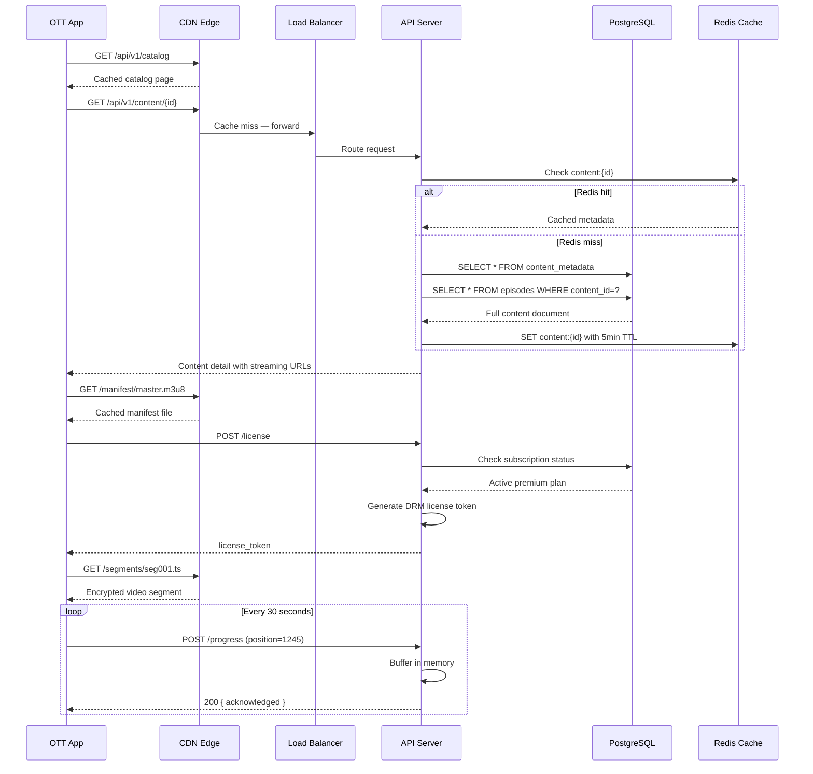
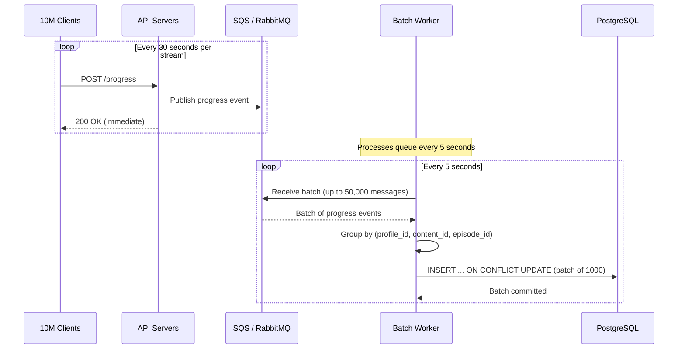
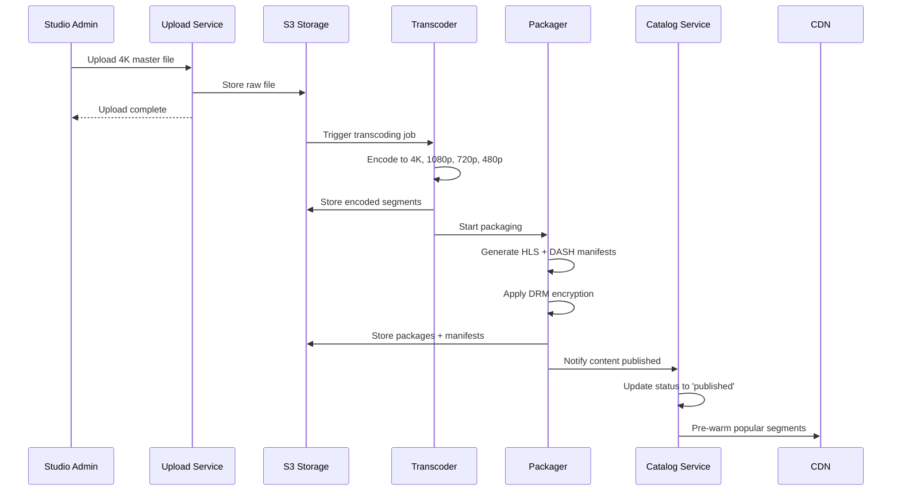
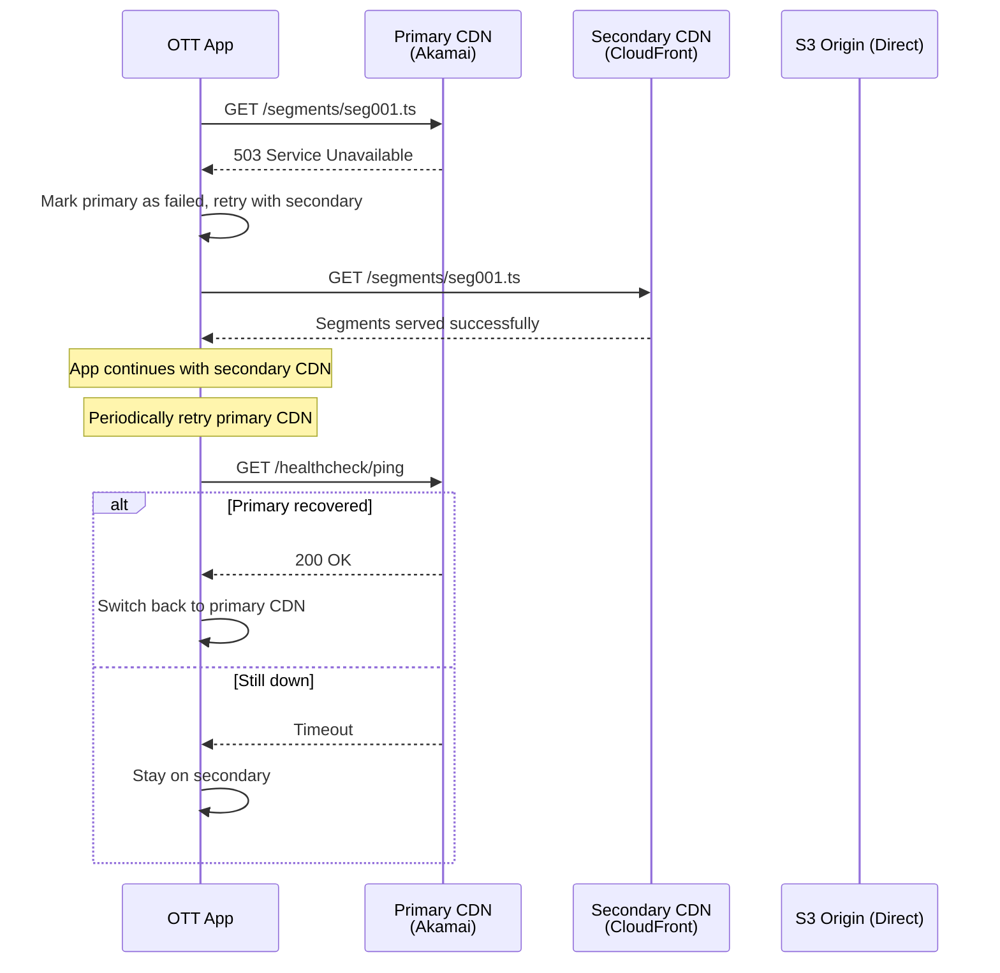

# API Contracts & Database Schema Reference

## Overview

This document defines the API surface and data models for the OTT Streaming Platform. All APIs use REST over HTTPS with JSON serialization.

Base URL:
```
https://api.ott.example.com/v1
```

---

## 1. REST API Contracts

### 1.1 Browse Catalog

**GET** `/api/v1/catalog`

#### Query Parameters

| Parameter | Type | Required | Description |
|---|---|---|---|
| `genre` | `string` | No | Filter by genre (e.g., `action`, `comedy`) |
| `sort` | `string` | No | `popularity` (default), `rating`, `newest` |
| `page` | `int` | No | Page number, default 1 |
| `limit` | `int` | No | Items per page, default 20, max 100 |

#### Response (200 OK)

```json
{
  "items": [
    {
      "content_id": "c017a3f8",
      "title": "Stranger Tides",
      "genres": ["action", "adventure"],
      "year": 2026,
      "maturity_rating": "TV-MA",
      "poster_url": "https://cdn.ott.example.com/img/c017a3f8/poster.jpg",
      "average_rating": 4.7,
      "content_type": "series"
    }
  ],
  "page": 1,
  "total_pages": 50,
  "total_items": 1000
}
```

---

### 1.2 Content Detail

**GET** `/api/v1/content/{content_id}`

#### Response (200 OK)

```json
{
  "content_id": "c017a3f8",
  "title": "Stranger Tides",
  "synopsis": "A deep-sea expedition uncovers an ancient anomaly...",
  "genres": ["action", "adventure"],
  "cast": ["Actor A", "Actor B"],
  "maturity_rating": "TV-MA",
  "release_year": 2026,
  "content_type": "series",
  "average_rating": 4.7,
  "seasons": [
    {
      "season_number": 1,
      "episodes": [
        {
          "episode_id": "ep001",
          "title": "Pilot",
          "duration_seconds": 3540,
          "still_url": "https://cdn.ott.example.com/img/ep001/still.jpg",
          "stream_url_hls": "https://cdn.ott.example.com/manifests/ep001/master.m3u8",
          "stream_url_dash": "https://cdn.ott.example.com/manifests/ep001/master.mpd"
        }
      ]
    }
  ],
  "available_audio": ["en", "es"],
  "available_subtitles": ["en", "es"]
}
```

---

### 1.3 Request DRM License

**POST** `/api/v1/license`

#### Request Body

| Field | Type | Required | Description |
|---|---|---|---|
| `content_id` | `string` | Yes | Content UUID |
| `episode_id` | `string` | Yes | Episode UUID |
| `device_id` | `string` | Yes | Device hardware ID |
| `key_system` | `string` | Yes | `widevine` \| `fairplay` |

#### Response (200 OK)

```json
{
  "license_token": "base64-encoded-license",
  "expires_at": "2026-06-28T21:00:00Z",
  "max_resolution": "3840x2160"
}
```

#### Error Responses

| Code | Condition |
|---|---|
| 402 | Subscription expired |
| 403 | Content not available on your plan |
| 451 | Content blocked in your region |

---

### 1.4 Report Watch Progress

**POST** `/api/v1/progress`

#### Request Body

| Field | Type | Required | Description |
|---|---|---|---|
| `content_id` | `string` | Yes | Content UUID |
| `episode_id` | `string` | Yes | Episode UUID |
| `profile_id` | `string` | Yes | Profile UUID |
| `position_seconds` | `int` | Yes | Current position |
| `device_id` | `string` | Yes | Device identifier |

#### Response (200 OK)

```json
{
  "acknowledged": true,
  "position_seconds": 1245
}
```

**Note:** Heartbeats are queued and batch-written to the database every 5 seconds.

---

### 1.5 Get Resume Point

**GET** `/api/v1/progress/{profile_id}/{content_id}`

#### Response (200 OK)

```json
{
  "profile_id": "prof-001",
  "content_id": "c017a3f8",
  "episode_id": "ep001",
  "position_seconds": 1245,
  "last_updated": "2026-06-28T20:15:30Z",
  "status": "in_progress"
}
```

`status` values: `not_started`, `in_progress`, `completed`.

---

### 1.6 Search

**POST** `/api/v1/search`

#### Request Body

| Field | Type | Required | Description |
|---|---|---|---|
| `query` | `string` | Yes | Search text |
| `genres` | `string[]` | No | Genre filters |
| `content_type` | `string` | No | `movie` or `series` |
| `page` | `int` | No | Page number |

#### Response (200 OK)

```json
{
  "results": [
    {
      "content_id": "c017a3f8",
      "title": "Stranger Tides",
      "type": "series",
      "match_reason": "Title match"
    }
  ],
  "page": 1,
  "total_results": 12
}
```

---

### 1.7 User Profile APIs

**GET** `/api/v1/profiles` — List profiles for authenticated account.

**POST** `/api/v1/profiles` — Create profile.

| Field | Type | Description |
|---|---|---|
| `name` | `string` | Profile name |
| `is_child` | `bool` | Child profile (requires PIN for mature content) |

**PUT** `/api/v1/profiles/{id}` — Update profile name.

**DELETE** `/api/v1/profiles/{id}` — Delete profile.

---

### 1.8 Subscription

**GET** `/api/v1/subscription` — Get current plan.

```json
{
  "plan_tier": "premium",
  "status": "active",
  "current_period_end": "2026-07-01T00:00:00Z",
  "features": {
    "max_streams": 4,
    "max_resolution": "4K",
    "hdr": true,
    "offline_downloads": true
  }
}
```

**POST** `/api/v1/subscription/change` — Change plan.

| Field | Type | Description |
|---|---|---|
| `plan_tier` | `string` | `basic` \| `standard` \| `premium` |

---

## 2. Database Schema

### 2.1 PostgreSQL — User Data

```sql
-- Accounts table
CREATE TABLE accounts (
    account_id      UUID PRIMARY KEY DEFAULT gen_random_uuid(),
    email           VARCHAR(255) UNIQUE NOT NULL,
    password_hash   VARCHAR(255) NOT NULL,
    plan_tier       VARCHAR(20) NOT NULL DEFAULT 'basic',
    account_status  VARCHAR(20) NOT NULL DEFAULT 'active',
    payment_token   VARCHAR(255),
    created_at      TIMESTAMPTZ NOT NULL DEFAULT NOW(),
    updated_at      TIMESTAMPTZ NOT NULL DEFAULT NOW()
);

-- Profiles table
CREATE TABLE profiles (
    profile_id   UUID PRIMARY KEY DEFAULT gen_random_uuid(),
    account_id   UUID NOT NULL REFERENCES accounts(account_id),
    name         VARCHAR(100) NOT NULL,
    avatar_url   TEXT,
    is_child     BOOLEAN NOT NULL DEFAULT FALSE,
    language     VARCHAR(6) DEFAULT 'en',
    created_at   TIMESTAMPTZ NOT NULL DEFAULT NOW()
);

CREATE INDEX idx_profiles_account ON profiles(account_id);

-- Subscriptions table
CREATE TABLE subscriptions (
    subscription_id      UUID PRIMARY KEY DEFAULT gen_random_uuid(),
    account_id           UUID NOT NULL REFERENCES accounts(account_id),
    plan_tier            VARCHAR(20) NOT NULL,
    status               VARCHAR(20) NOT NULL DEFAULT 'active',
    current_period_start TIMESTAMPTZ NOT NULL DEFAULT NOW(),
    current_period_end   TIMESTAMPTZ NOT NULL,
    canceled_at          TIMESTAMPTZ,
    created_at           TIMESTAMPTZ NOT NULL DEFAULT NOW()
);

CREATE INDEX idx_subs_active ON subscriptions(account_id, status)
    WHERE status = 'active';
```

### 2.2 PostgreSQL — Content Data

```sql
-- Content metadata
CREATE TABLE content_metadata (
    content_id      UUID PRIMARY KEY DEFAULT gen_random_uuid(),
    title           VARCHAR(255) NOT NULL,
    synopsis        TEXT,
    genres          TEXT[],
    cast_members    TEXT[],
    directors       TEXT[],
    maturity_rating VARCHAR(10),
    release_year    INTEGER,
    content_type    VARCHAR(10) NOT NULL CHECK (content_type IN ('movie', 'series')),
    average_rating  DECIMAL(3,2) DEFAULT 0,
    poster_url      TEXT,
    status          VARCHAR(20) NOT NULL DEFAULT 'draft'
                     CHECK (status IN ('draft', 'ingesting', 'published', 'archived')),
    created_at      TIMESTAMPTZ NOT NULL DEFAULT NOW(),
    updated_at      TIMESTAMPTZ NOT NULL DEFAULT NOW()
);

CREATE INDEX idx_content_genres ON content_metadata USING GIN(genres);
CREATE INDEX idx_content_year ON content_metadata(release_year);
CREATE INDEX idx_content_type ON content_metadata(content_type);
CREATE INDEX idx_content_status ON content_metadata(status);
CREATE INDEX idx_content_rating ON content_metadata(average_rating DESC);

-- Full-text search index
ALTER TABLE content_metadata ADD COLUMN search_vector TSVECTOR
    GENERATED ALWAYS AS (
        to_tsvector('english', coalesce(title, '') || ' ' || coalesce(synopsis, ''))
    ) STORED;

CREATE INDEX idx_content_search ON content_metadata USING GIN(search_vector);

-- Episodes
CREATE TABLE episodes (
    episode_id       UUID PRIMARY KEY DEFAULT gen_random_uuid(),
    content_id       UUID NOT NULL REFERENCES content_metadata(content_id)
                     ON DELETE CASCADE,
    season_number    INTEGER NOT NULL,
    episode_number   INTEGER NOT NULL,
    title            VARCHAR(255) NOT NULL,
    duration_seconds INTEGER NOT NULL,
    still_url        TEXT,
    manifest_url_hls  TEXT,
    manifest_url_dash TEXT,
    available_audio  TEXT[],
    available_subs   TEXT[],
    created_at       TIMESTAMPTZ NOT NULL DEFAULT NOW()
);

CREATE INDEX idx_episodes_content ON episodes(content_id, season_number, episode_number);
```

### 2.3 PostgreSQL — Watch History

```sql
CREATE TABLE watch_progress (
    profile_id       UUID NOT NULL,
    content_id       UUID NOT NULL,
    episode_id       UUID NOT NULL,
    position_seconds INTEGER NOT NULL DEFAULT 0,
    duration_seconds INTEGER,
    watch_status     VARCHAR(20) NOT NULL DEFAULT 'in_progress'
                     CHECK (watch_status IN ('not_started', 'in_progress', 'completed')),
    device_id        UUID,
    last_updated     TIMESTAMPTZ NOT NULL DEFAULT NOW(),
    PRIMARY KEY (profile_id, content_id, episode_id)
);

CREATE INDEX idx_progress_profile ON watch_progress(profile_id);
CREATE INDEX idx_progress_recent ON watch_progress(last_updated DESC);
```

### 2.4 Redis Caching Keys

| Key Pattern | TTL | Description |
|---|---|---|
| `session:{token}` | 1 hour | User session data (profile_id, plan_tier) |
| `content:{id}` | 5 minutes | Full content metadata JSON |
| `catalog:page:{genre}:{sort}:{page}` | 2 minutes | Paginated catalog responses |
| `search:{query_hash}:{page}` | 2 minutes | Search result pages |
| `progress:{profile}:{content}` | 24 hours | Latest resume position |
| `license:{device}:{content}` | 10 minutes | Recent DRM license token |

### 2.5 S3 Storage Layout

```
s3://ott-raw-videos/
  {upload_id}/{filename}.mov        -- Raw mezzanine files

s3://ott-encoded-videos/
  {content_id}/{episode_id}/
    4k/segments/seg001.ts           -- 4K HDR segments (AV1)
    1080p/segments/seg001.ts        -- 1080p segments (AV1)
    720p/segments/seg001.ts         -- 720p segments (AV1)
    480p/segments/seg001.ts         -- 480p segments (AV1)
    manifests/master.m3u8           -- HLS manifest
    manifests/master.mpd            -- DASH manifest

s3://ott-static/
  images/{content_id}/poster.jpg    -- Poster images
  images/{content_id}/still.jpg     -- Episode stills
```

---

## 3. Data Flow Sequences

### 3.1 Playback Happy Path



### 3.2 Batch Progress Write Flow



### 3.3 Content Ingestion Pipeline



### 3.4 CDN Failover Flow



---

## 4. Caching Strategy

| Layer | What's Cached | TTL | Notes |
|---|---|---|---|
| **CDN Edge** | Video segments, manifests, images, catalog JSON | 2-5 min for JSON, 24h for segments | CDN handles cache invalidation on content update |
| **Redis** | Session data, content metadata, catalog pages, search results | 1 min - 24h | In-memory, sub-millisecond reads |
| **Application (in-memory)** | Frequently accessed lookup data (genre lists, config) | 5 min | Simple hashmap in service code |

**Cache invalidation:** When content is updated (new title published, metadata edited), the Catalog Service publishes a cache invalidation event. Redis keys with matching content IDs are deleted. The next request fetches fresh data from PostgreSQL.

---

## 5. Scaling Strategy

| Component | Scaling Approach |
|---|---|
| **API Servers** | Horizontal auto-scaling (HPA) based on CPU > 70% or request latency > 500ms p99 |
| **PostgreSQL** | Read replicas for query scaling; primary handles writes only |
| **Redis** | Cluster mode with sharding (6-12 nodes) |
| **CDN** | Traffic-based, fully managed by provider |
| **Transcoders** | Spot instances + reserved GPU instances for baseline load |

---

## 6. Monitoring & Alerting

| Metric | Alert Threshold | Action |
|---|---|---|
| API p99 latency | > 1 second for 5 min | Scale up API servers, investigate slow queries |
| PostgreSQL CPU | > 80% for 5 min | Add read replica, optimize queries |
| Replication lag | > 10 seconds | Remove lagging replica from rotation |
| CDN error rate | > 1% of requests | Failover to secondary CDN |
| Queue depth (progress) | > 100,000 messages | Scale up batch workers |
| Redis memory | > 80% used | Add shards, reduce TTLs |

---

## 7. Rate Limiting

| Endpoint | Limit | Scope |
|---|---|---|
| Catalog browse | 100 req/s | Per API key |
| Content detail | 200 req/s | Per API key |
| License requests | 10 req/s | Per device ID |
| Progress reports | 1 req/10s | Per profile (excess dropped) |
| Search | 50 req/s | Per API key |
| Profile CRUD | 10 req/min | Per account |

Rate limit headers:
```
X-RateLimit-Limit: 100
X-RateLimit-Remaining: 73
X-RateLimit-Reset: 1719302400
```

---

## 8. Failure Scenarios

| Failure | Impact | Mitigation |
|---|---|---|
| **API server crash** | Some requests fail | Auto-scaling group replaces instance; load balancer routes around dead targets |
| **PostgreSQL primary failure** | Writes fail temporarily | Promote read replica to primary (RDS Multi-AZ); ~30s RTO |
| **Read replica lag** | Stale data served | Monitor lag; remove from rotation if > 10s behind |
| **CDN outage** | Video playback fails | Secondary CDN fallback; direct S3 as last resort |
| **Redis failure** | Cache misses spike | Service degrades to direct DB reads; slower but functional |
| **Transcoder failure** | New content delayed | Job retry with exponential backoff; fails to SQS DLQ after 3 attempts |

---

## 9. Data Retention

| Data | Retention | Cleanup |
|---|---|---|
| Watch progress | Indefinite (while account active) | Keep for resume points; archive inactive accounts after 1 year |
| Streaming sessions | 90 days | Cron job deletes records older than 90 days |
| User accounts | Indefinite | Soft-delete; purge 30 days after deletion request |
| Error logs | 30 days | Log rotation; aggregate to S3 for long-term analysis |
| CDN logs | 30 days | Export to S3 for cost analysis; delete raw after 30 days |
