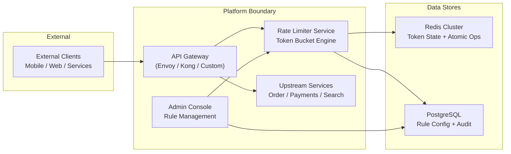

# Project Overview — Token Bucket Rate Limiter Service

## 1. Purpose

The Token Bucket Rate Limiter Service is a centralized, distributed rate-limiting infrastructure component. It provides a unified mechanism to control the rate of requests flowing through any API, service, or resource within the platform. The service implements the token bucket algorithm, offering flexible, configurable rate limits per client, endpoint, region, or any arbitrary key.

## 2. Why This Exists

Modern distributed systems face two fundamental challenges that rate limiting addresses:

**Fairness and Isolation.** Without rate limiting, a single aggressive tenant can saturate shared resources, degrading the experience for all other tenants. The rate limiter enforces per-tenant caps, ensuring noisy neighbors cannot monopolize capacity.

**Infrastructure Protection.** Upstream dependencies — databases, downstream APIs, third-party services — have finite capacity. The rate limiter acts as a circuit-breaker at the boundary, preventing cascading failures when traffic exceeds safe operating thresholds.

**Cost Control.** In metered environments, uncontrolled traffic drives unbounded infrastructure cost. Rate limits provide a hard ceiling on resource consumption per tenant.

## 3. What It Is Not

This service is a **decision engine** — it computes whether a given request is allowed or should be rejected based on current token availability. It is not a full API gateway, not a WAF, and not an authentication service. It operates as a lightweight middleware that another infrastructure layer (API Gateway, sidecar proxy, or application framework) consults.

## 4. System Context

The rate limiter sits between the API Gateway and upstream services. The gateway consults it synchronously before forwarding traffic. Configuration changes flow from the Admin Console through the Config Service into the data stores.

## 5. Key Stakeholders

| Stakeholder | Interest |
|---|---|
| **Platform Engineering** | Operate and scale the service; define global rate limit policies |
| **Product Teams** | Configure per-endpoint rate limits for their services |
| **SRE / Observability** | Monitor rate limit effectiveness; alert on threshold breaches |
| **Security** | Prevent abuse and DDoS via aggressive per-IP limits |
| **Finance / BizOps** | Enforce API-based billing tiers (requests per plan) |

## 6. Success Criteria

| Metric | Target |
|---|---|
| Decision latency (p99) | < 5ms (local), < 20ms (global) |
| Throughput per node | > 100,000 decisions/second |
| Availability | 99.99% (four nines) |
| Configuration propagation | < 1s from Admin Console to enforcement |
| False positive rate (incorrect rejections) | < 0.001% |

## 7. Design Tenets

1. **Fast path must stay fast.** The rate limiter adds overhead to every request. The hot path — token consumption — must be a single atomic operation in an in-memory store. No disk I/O, no synchronous replication.

2. **Consistency has a budget.** We accept eventual consistency for global rate limits within a bounded staleness window. Strong consistency is required only per-single-key decisions.

3. **Always make a decision.** Even if the backing store is unreachable, the service must degrade gracefully (e.g., allow the request, log the failure) rather than crash or hang.

4. **Configuration is code.** Rate limit rules are versioned, reviewable, and deployable through the same CI/CD pipeline as application code.
