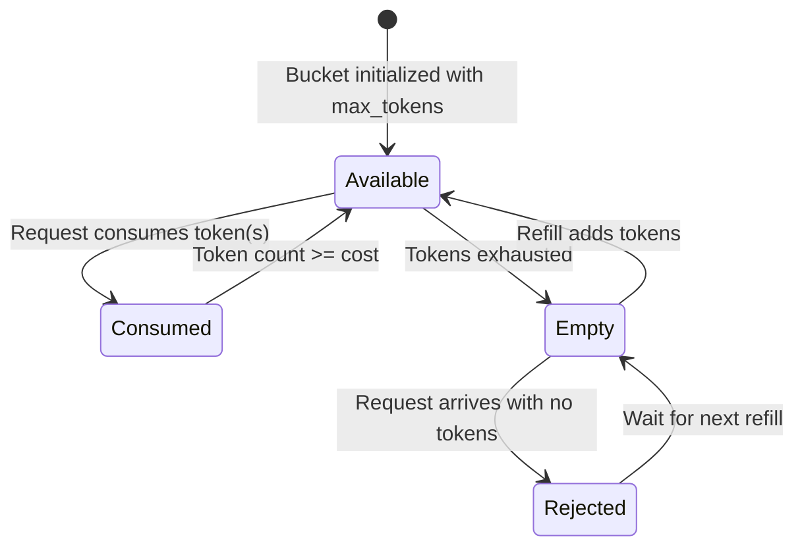

# Functional Requirements — Token Bucket Rate Limiter Service

## 1. Core Rate Limiting

### FR-1: Token Bucket Algorithm
The service MUST implement the token bucket algorithm:
- A bucket has a **maximum capacity** (`max_tokens`).
- Tokens are **refilled at a fixed rate** (`refill_rate` tokens per `refill_interval`).
- Each request **consumes one or more tokens** (configurable cost per request).
- If insufficient tokens remain, the request is **rejected** (or queued, depending on mode).

### FR-2: Multiple Bucket Scopes
Rate limits MUST be applicable at the following scopes:
- **Global:** Single limit across all traffic for a resource.
- **Per-Client:** Limit per API key, OAuth client, or IP address.
- **Per-Endpoint:** Limit per HTTP method + path pattern.
- **Per-User:** Limit per authenticated user identity.
- **Composite:** Combination of scopes (e.g., per-user per-endpoint).

### FR-3: Configurable Rate Limit Rules
The service MUST support rate limit rules defined by:

| Parameter | Type | Description |
|---|---|---|
| `key_pattern` | string | Template for the bucket key (e.g., `client:{client_id}:endpoint:{path}`) |
| `max_tokens` | integer | Maximum token bucket capacity |
| `refill_rate` | integer | Number of tokens added per refill interval |
| `refill_interval_ms` | integer | Refill interval in milliseconds |
| `request_cost` | integer | Tokens consumed per request (default: 1) |
| `burst_max` | integer | Maximum allowed burst size (may exceed refill_rate) |
| `mode` | enum | `reject` (return 429) or `defer` (queue until tokens available) |

### FR-4: Multi-Window Support
The service MUST support:
- **Fixed window** (resets at calendar-aligned boundaries)
- **Sliding window** (rolling time window for smoother enforcement)
- **Sliding window log** (exact timestamp-based counting for precision)

### FR-5: Decision Modes

| Mode | Behavior | Use Case |
|---|---|---|
| **Synchronous** | Block caller until decision is made | Critical paths requiring precise enforcement |
| **Async with callback** | Return decision asynchronously | Background batch processing |
| **Probabilistic** | Reject with configurable probability as limits approach | Gradual backpressure |

## 2. Configuration Management

### FR-6: Rule CRUD
The Admin Console MUST support creating, reading, updating, and deleting rate limit rules. Updates MUST be versioned with an audit trail.

### FR-7: Rule Validation
The system MUST validate rules on submission:
- No conflicting rules with overlapping key patterns.
- `max_tokens` must be >= `request_cost`.
- `refill_rate` must be positive.

### FR-8: Rule Priority and Overrides
Rules MUST support priority ordering. Higher-priority rules override lower-priority matches. The system MUST support:
- **Exact match** (highest priority)
- **Pattern match** (wildcard / prefix-based)
- **Default / catch-all** (lowest priority)

### FR-9: Dry-Run Mode
Rules MAY be deployed in **dry-run** mode. In dry-run, the service logs the decision (would reject / would allow) but does not actually reject traffic. This enables safe validation of new rules.

## 3. Observability

### FR-10: Decision Logging
Every rate limit decision MUST produce a structured log event containing:
- Bucket key, client identity, request metadata
- Decision (allowed / rejected)
- Current token count, refill timestamp
- Processing latency

### FR-11: Usage Reporting
The service MUST expose per-key token consumption metrics:
- Current token count
- Total requests allowed / rejected
- Time since last refill
- Average decision latency

### FR-12: Real-Time Alerts
The service MUST emit events when:
- A key crosses 80%, 90%, and 100% token exhaustion.
- A key's rejection rate exceeds a configurable threshold.
- Error rate in the rate limiter itself exceeds 1%.

## 4. Administrative

### FR-13: Rule Export / Import
Rate limit configurations MUST be exportable to JSON/YAML and importable for bulk operations and disaster recovery.

### FR-14: Emergency Override
Authorized administrators MUST be able to temporarily disable rate limiting for specific keys during incident response.

### FR-15: Rate Limit Simulation
The Admin Console MUST provide a simulation tool: given a rule set and a traffic pattern, predict how many requests would be allowed vs. rejected.
