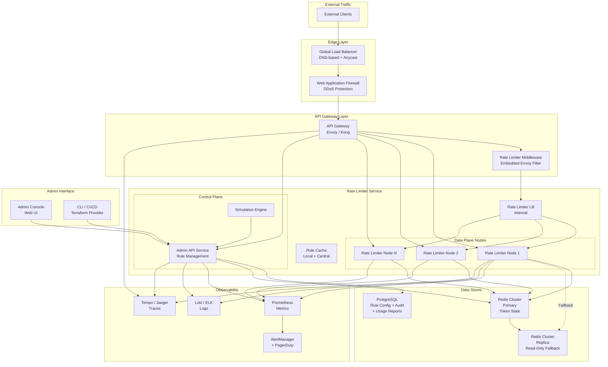
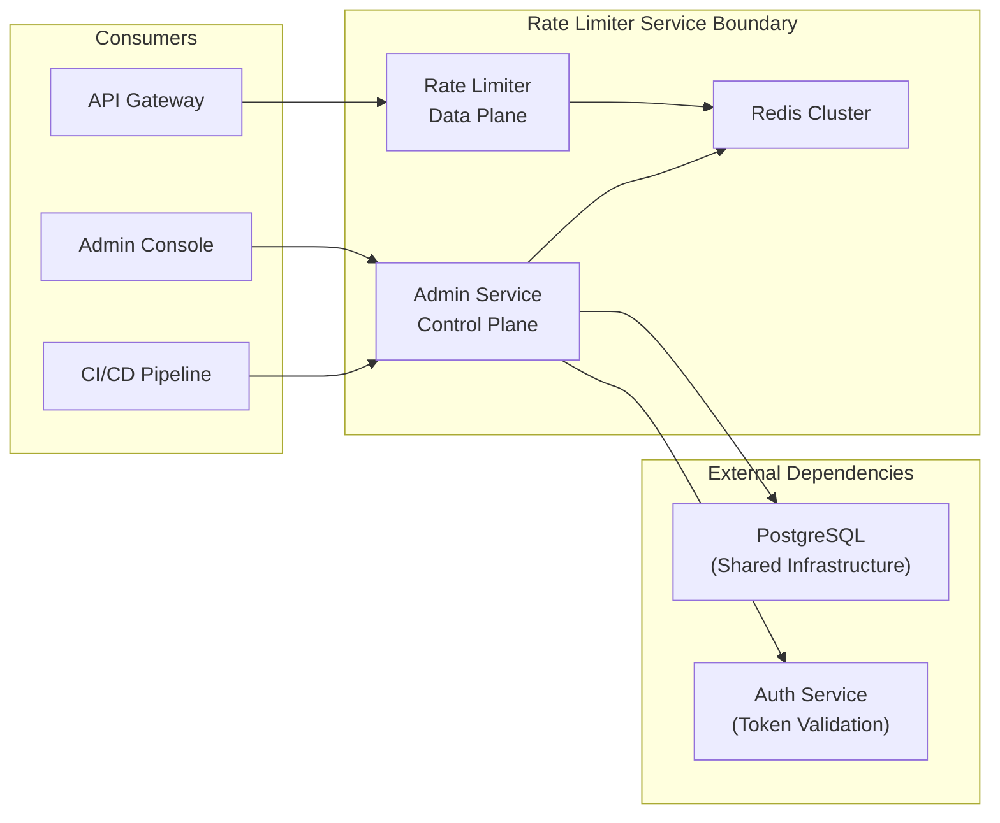
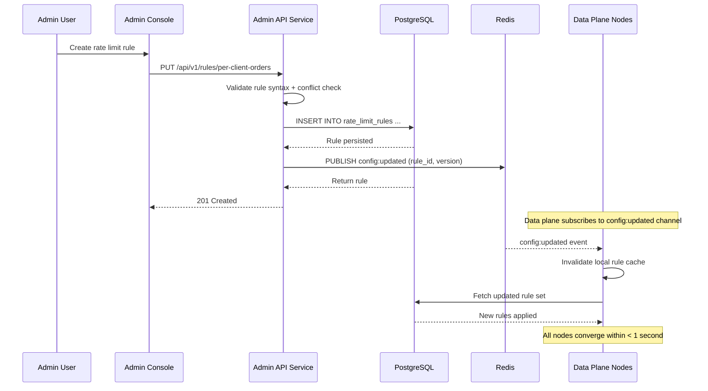

# High-Level System Design — Token Bucket Rate Limiter Service

## 1. System Architecture



## 2. Component Responsibilities

### 2.1 API Gateway with Embedded Middleware
The rate limiter middleware operates as a plugin/filter within the API Gateway (Envoy ext_authz, Kong plugin, or custom middleware). For each incoming request:
- Extract identity and endpoint from the request.
- Construct the bucket key(s) according to configured patterns.
- Call the Rate Limiter Service synchronously for each key.
- If ALL checks pass → forward request to upstream.
- If ANY check fails → return HTTP 429 with `Retry-After` header.

### 2.2 Rate Limiter Data Plane Node
Stateless worker that performs the actual token bucket computation. Responsibilities:
- Receive decision request with bucket key.
- Load or create the token bucket state from Redis.
- Apply refill logic: `tokens = min(max_tokens, current_tokens + elapsed * rate)`.
- Atomically decrement tokens if sufficient.
- Return decision and updated bucket state.
- Emit metrics and log the decision asynchronously.

### 2.3 Admin API Service (Control Plane)
Manages the lifecycle of rate limit rules:
- CRUD operations on rules (stored in PostgreSQL).
- Validates rule conflicts before accepting changes.
- Pushes rule updates to data plane nodes via Pub/Sub.
- Manages RBAC and audit logging.
- Exposes simulation engine for what-if analysis.

### 2.4 Redis Cluster
Primary store for token bucket state:
- **Key:** `rl:bucket:{bucket_key}`
- **Value:** `{ tokens, last_refill_ts, max_tokens }`
- **Operations:** `EVAL` (Lua script) for atomic read-modify-write on each decision.
- **Persistence:** AOF (Append-Only File) with fsync every second.
- **Replication:** Async replication to a cross-AZ replica. Failover is automatic via Redis Sentinel / Cluster.

### 2.5 PostgreSQL
Source of truth for rate limit rules:
- Stores all active and archived rules with version history.
- Powers audit trail queries.
- Exported rule configurations for disaster recovery.

## 3. Request Lifecycle

```mermaid
sequenceDiagram
    participant C as Client
    participant GW as API Gateway
    participant RL as Rate Limiter Node
    participant R as Redis
    participant PG as PostgreSQL
    participant LOG as Observability

    C->>GW: HTTP POST /api/orders
    GW->>GW: Extract client_id, endpoint, user_id
    GW->>RL: Check(bucket_key="client:abc:endpoint:/orders", cost=1)
    RL->>RL: Resolve matching rule from local cache
    alt Rule not in cache
        RL->>PG: Fetch rule config
        PG-->>RL: Return rate limit rule
        RL->>RL: Cache rule (5s TTL)
    end
    RL->>R: EVAL token_bucket.lua (key, cost, max_tokens, refill_rate)
    R->>R: Compute: current = min(max, stored + elapsed * rate)
    R->>R: if current >= cost: current -= cost; return allowed=true
    R-->>RL: Decision + updated token count
    alt Decision: ALLOWED
        RL-->>GW: allowed=true, remaining=9
        GW->>GW: Forward request to upstream
        GW-->>C: 200 OK
    else Decision: REJECTED
        RL-->>GW: allowed=false, retry_after=500ms
        GW->>GW: Set Retry-After: 500 header
        GW-->>C: 429 Too Many Requests
    end
    RL->>LOG: Emit decision event (async)
```

## 4. Key Design Decisions

| Decision | Rationale |
|---|---|
| **Redis for token state** | Sub-millisecond latency, atomic Lua operations, built-in replication. No other store provides the required performance for 100K+ decisions/sec/node. |
| **gRPC for data plane** | Low overhead binary protocol. Strongly typed contracts. Streaming support for future batch use cases. |
| **Stateless data plane nodes** | Any node can handle any key. Simple horizontal scaling. No session affinity required. |
| **PostgreSQL for rules** | ACID compliance for configuration data. Audit trail is a hard requirement. Well-understood operational model. |
| **Async logging** | Decision logging is off the hot path. A slow log aggregator must not slow down rate limit decisions. Logs are batched and sent asynchronously. |

## 5. System Boundaries



## 6. Configuration Data Flow


