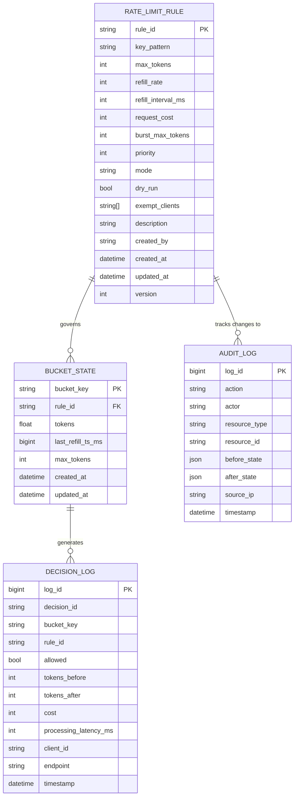
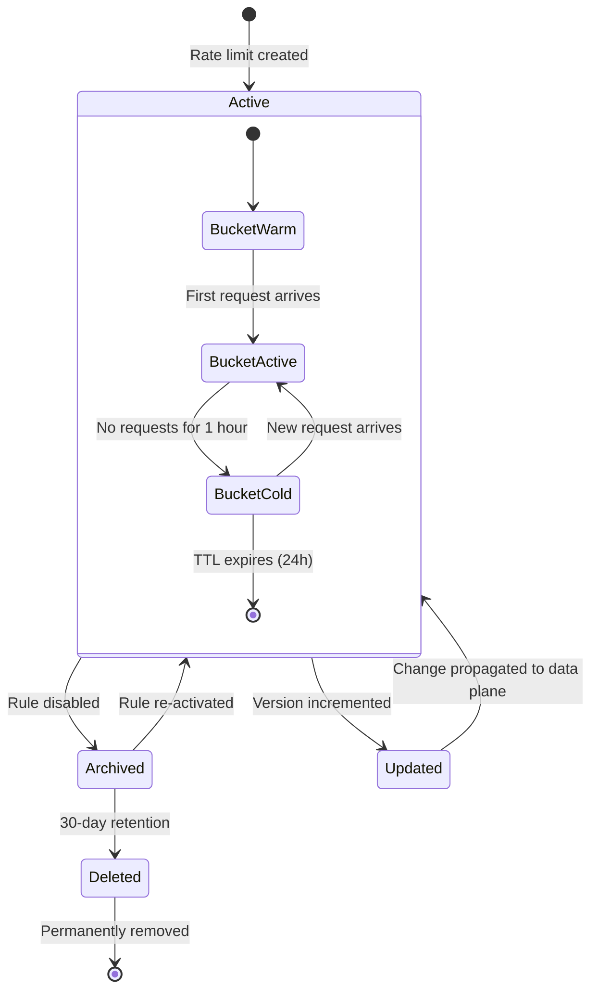

# Data Model — Token Bucket Rate Limiter Service

## 1. Logical Data Model



## 2. Redis — Token Bucket State

### Key Design

```
Key:   rl:bucket:{bucket_key}
Type:  Hash
TTL:   Varies by rule (max 24h; reset on activity)

Fields:
  tokens          Float    — Current token count (supports fractional for precise refill)
  last_refill_ts  Integer  — Unix timestamp (milliseconds) of last refill
  max_tokens      Integer  — Bucket capacity (denormalized for fast access)
  rule_id         String   — Reference to the governing rule
  created_at      Integer  — Bucket creation timestamp
```

### Lua Script: Atomic Token Consumption

```lua
-- KEYS[1] = bucket key
-- ARGV[1] = cost
-- ARGV[2] = current timestamp (ms)
-- ARGV[3] = refill rate (tokens per interval)
-- ARGV[4] = refill interval (ms)
-- ARGV[5] = max tokens

local key = KEYS[1]
local cost = tonumber(ARGV[1])
local now = tonumber(ARGV[2])
local refill_rate = tonumber(ARGV[3])
local refill_interval = tonumber(ARGV[4])
local max_tokens = tonumber(ARGV[5])

-- Load or initialize bucket
local bucket = redis.call('HGETALL', key)
local tokens, last_refill

if #bucket == 0 then
    tokens = max_tokens
    last_refill = now
else
    tokens = tonumber(bucket[2])
    last_refill = tonumber(bucket[4])
    max_tokens = tonumber(bucket[6])

    -- Refill: tokens += elapsed_time / refill_interval * rate
    local elapsed = now - last_refill
    if elapsed >= refill_interval then
        local refill_count = math.floor(elapsed / refill_interval)
        tokens = math.min(max_tokens, tokens + refill_count * refill_rate)
        last_refill = last_refill + refill_count * refill_interval
    end
end

local allowed = false
local remaining = tokens
local retry_after = 0

if tokens >= cost then
    tokens = tokens - cost
    remaining = tokens
    allowed = true
else
    -- Next refill time
    local next_refill = last_refill + refill_interval
    retry_after = math.max(0, next_refill - now)
end

-- Persist updated state
redis.call('HMSET', key,
    'tokens', tokens,
    'last_refill_ts', last_refill,
    'max_tokens', max_tokens)

-- Refresh TTL
redis.call('EXPIRE', key, 86400)

return { allowed, remaining, last_refill + refill_interval, retry_after }
```

### Why Lua?
- Atomic execution — no race condition between read and write.
- Single round-trip — all bucket logic executes on the Redis server.
- Minimizes network overhead for the critical path.

## 3. PostgreSQL — Rate Limit Rules

### Table: `rate_limit_rules`

```sql
CREATE TABLE rate_limit_rules (
    id                  UUID PRIMARY KEY DEFAULT gen_random_uuid(),
    key_pattern         VARCHAR(512) NOT NULL,
    max_tokens          INTEGER NOT NULL CHECK (max_tokens > 0),
    refill_rate         INTEGER NOT NULL CHECK (refill_rate > 0),
    refill_interval_ms  INTEGER NOT NULL CHECK (refill_interval_ms > 0),
    request_cost        INTEGER NOT NULL DEFAULT 1 CHECK (request_cost > 0),
    burst_max_tokens    INTEGER,
    priority            INTEGER NOT NULL DEFAULT 0,
    mode                VARCHAR(16) NOT NULL DEFAULT 'reject'
                        CHECK (mode IN ('reject', 'defer')),
    dry_run             BOOLEAN NOT NULL DEFAULT FALSE,
    exempt_clients      TEXT[],
    description         TEXT,
    created_by          VARCHAR(128) NOT NULL,
    status              VARCHAR(16) NOT NULL DEFAULT 'active'
                        CHECK (status IN ('active', 'archived')),
    version             INTEGER NOT NULL DEFAULT 1,
    created_at          TIMESTAMPTZ NOT NULL DEFAULT NOW(),
    updated_at          TIMESTAMPTZ NOT NULL DEFAULT NOW()
);

-- Indexes
CREATE UNIQUE INDEX idx_rules_pattern ON rate_limit_rules(key_pattern)
    WHERE status = 'active';
CREATE INDEX idx_rules_priority ON rate_limit_rules(priority DESC, created_at)
    WHERE status = 'active';
```

### Table: `rule_versions` (Audit)

```sql
CREATE TABLE rule_versions (
    version_id      UUID PRIMARY KEY DEFAULT gen_random_uuid(),
    rule_id         UUID NOT NULL REFERENCES rate_limit_rules(id),
    version         INTEGER NOT NULL,
    snapshot        JSONB NOT NULL,        -- Full rule definition at this version
    change_summary  VARCHAR(512),
    changed_by      VARCHAR(128) NOT NULL,
    changed_at      TIMESTAMPTZ NOT NULL DEFAULT NOW()
);

CREATE INDEX idx_rule_versions ON rule_versions(rule_id, version DESC);
```

## 4. PostgreSQL — Audit Log

```sql
CREATE TABLE audit_log (
    log_id          BIGSERIAL PRIMARY KEY,
    action          VARCHAR(32) NOT NULL,
    actor           VARCHAR(128) NOT NULL,
    resource_type   VARCHAR(64) NOT NULL,
    resource_id     VARCHAR(128),
    before_state    JSONB,
    after_state     JSONB,
    source_ip       INET,
    request_id      VARCHAR(64),
    timestamp       TIMESTAMPTZ NOT NULL DEFAULT NOW()
);

CREATE INDEX idx_audit_actor ON audit_log(actor, timestamp DESC);
CREATE INDEX idx_audit_resource ON audit_log(resource_type, resource_id, timestamp DESC);
CREATE INDEX idx_audit_timestamp ON audit_log(timestamp DESC);
```

## 5. ClickHouse / Time-Series — Decision Logs

Decision logs are **not** stored in PostgreSQL. They are streamed to a time-series store (ClickHouse or equivalent) for:

- Real-time dashboards (requests allowed/rejected per second).
- Per-tenant usage reports for billing.
- Historical analysis of rate limit effectiveness.

### Schema (ClickHouse)

```sql
CREATE TABLE decision_logs (
    timestamp           DateTime64(3) CODEC(Delta, ZSTD),
    decision_id         String,
    bucket_key          String,
    rule_id             UUID,
    allowed             Boolean,
    tokens_before       Float32,
    tokens_after        Float32,
    cost                UInt8,
    retry_after_ms      UInt32,
    processing_latency_ms UInt16,
    client_id           String,
    endpoint            String,
    region              LowCardinality(String),
    node_id             String
)
ENGINE = MergeTree()
PARTITION BY toDate(timestamp)
ORDER BY (timestamp, bucket_key)
TTL toDate(timestamp) + INTERVAL 90 DAY DELETE;
```

## 6. Data Lifecycle



## 7. Data Distribution

| Data | Store | Access Pattern | Consistency | Durability |
|---|---|---|---|---|
| Token bucket state | Redis (in-memory) | Read + write every decision | Strong per-key | Ephemeral (RPO < 1s) |
| Rate limit rules | PostgreSQL | Read often (cached), write rarely | Strong | Durable |
| Decision logs | ClickHouse | Write only (append), read for dashboards | Eventual | Durable |
| Audit log | PostgreSQL | Write rarely, read for compliance | Strong | Durable |
| Usage reports | ClickHouse → S3 | Batch exported monthly | Snapshot isolation | Durable |
