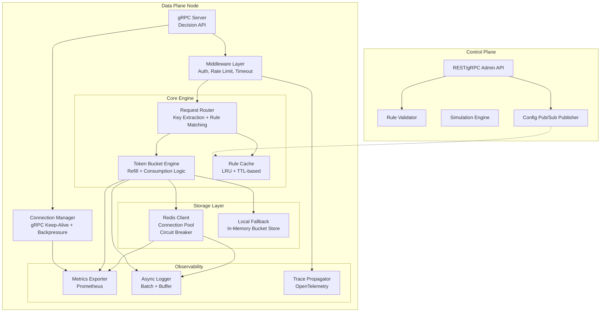
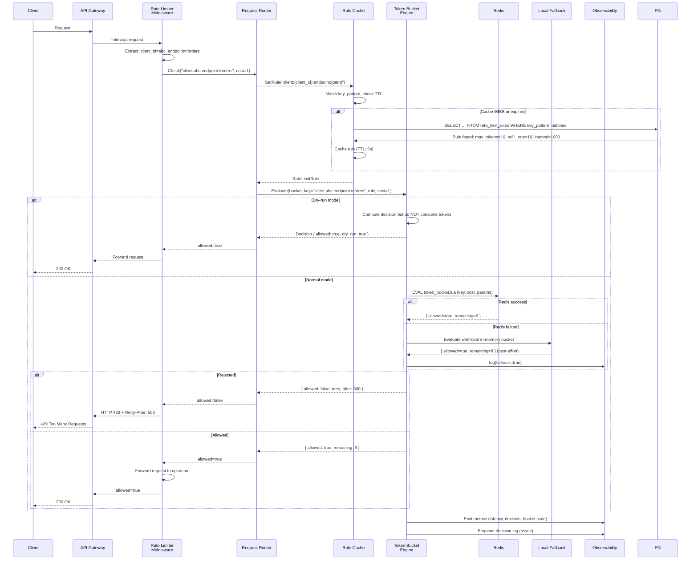
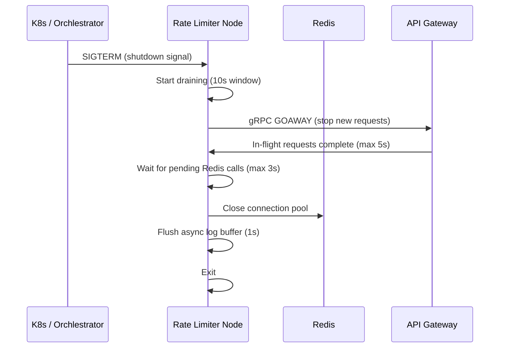

# Low-Level Design — Token Bucket Rate Limiter Service

## 1. Component Architecture



## 2. Component Responsibilities

### 2.1 Request Router
- Receives `CheckRequest` from the middleware layer.
- Extracts the bucket key from the request.
- Calls the Rule Cache to find the matching `RateLimitRule`.
- If no rule found, returns **allow** (default behavior).
- Passes the rule parameters + bucket key to the Token Bucket Engine.

### 2.2 Token Bucket Engine
The core decision-making component:

```
Input:  bucket_key, cost, rule(max_tokens, refill_rate, refill_interval, mode)
Output: allowed, remaining_tokens, retry_after

Flow:
1. Construct Redis key: "rl:bucket:{bucket_key}"
2. Execute Lua script with: key, cost, now_ms, refill_rate, refill_interval, max_tokens
3. Parse Lua response: [allowed, remaining, next_refill_ms, retry_after]
4. If Redis call fails → fall back to local in-memory bucket
5. Return result
```

### 2.3 Rule Cache
- Maintains an in-memory cache of all active rate limit rules.
- Cache is populated on startup from PostgreSQL.
- Refreshed every 5 seconds via background goroutine/polling.
- Invalidated immediately on config change via Redis Pub/Sub.
- LRU eviction if memory exceeds threshold.

**Cache entry structure:**
```
Cache Key:   token_bucket_rule:{key_pattern_hash}
Cache Value: { rule_id, max_tokens, refill_rate, refill_interval_ms, 
               request_cost, burst_max, priority, mode, dry_run, exempt_clients }
TTL:         5s (sliding; refreshed on access)
```

### 2.4 Redis Client
- Connection pool with configurable min/max connections.
- Circuit breaker: after 5 consecutive failures within 30s, open circuit for 10s.
- Health check pings every 3 seconds.
- Automatic failover: if primary Redis is unreachable, query replica.
- Timeout: 10ms connect, 5ms operation.

### 2.5 Local Fallback
When Redis is unreachable:
- Maintains a local `sync.Map` (or equivalent) of token bucket states.
- Best-effort accuracy: tokens are tracked locally without persistence.
- Bucket state is lost if the node restarts (acceptable — buckets reset).
- Metrics tagged with `fallback=true` for visibility.

### 2.6 Async Logger
- Buffers decision log entries in a ring buffer.
- Flushes to ClickHouse batch endpoint every 500ms or 10,000 entries.
- If ClickHouse is down, logs are dropped (non-critical path).
- Separate high-priority channel for audit-critical events.

## 3. Request Lifecycle (Detailed)



## 4. Concurrency Model

### 4.1 Per-Key Serialization
The Lua script executing on the Redis server ensures that all operations on a single bucket key are **serialized**. Redis is single-threaded for script execution, so two concurrent `Check` requests for the same key are processed atomically. No distributed lock needed.

### 4.2 Node-Level Concurrency
Each data plane node runs multiple worker goroutines/threads:
- Number of workers = `2 × CPU cores` (NIO pattern).
- Workers share a connection pool to Redis (N connections, where N ≈ workers × 2).
- No shared state between workers (stateless design).
- Request affinity: not required (any worker can handle any key).

### 4.3 Backpressure
The gRPC server uses flow control:
- Max concurrent streams per connection: 100,000.
- When connection pool to Redis is exhausted, new requests are queued with a max wait of 5ms.
- If wait exceeds 5ms, return `UNAVAILABLE` with backpressure signal.
- Clients (API Gateway) implement exponential backoff on `UNAVAILABLE`.

## 5. Error Scenarios

| Scenario | Behavior | Response |
|---|---|---|
| Redis connection timeout | Circuit breaker opens (5 failures / 30s) | Fall back to local in-memory bucket |
| Redis replica unreachable | Disable read-replica fallback | Continue with primary only |
| PostgreSQL unreachable (data plane) | Stale rule cache continues serving | Rules may be stale (max 5s) |
| PostgreSQL unreachable (control plane) | Admin API returns 503 | Rules are immutable until recovery |
| Clock skew > 100ms between nodes | Tokens refilled at slightly different times | Acceptable; skew bounded by NTP |
| Lua script execution > 10ms | Log warning, return ALLOW | Safety valve — never reject due to slow script |
| Local fallback memory > 1GB | Flush least-recently-used buckets | LRU eviction |

## 6. Graceful Shutdown


