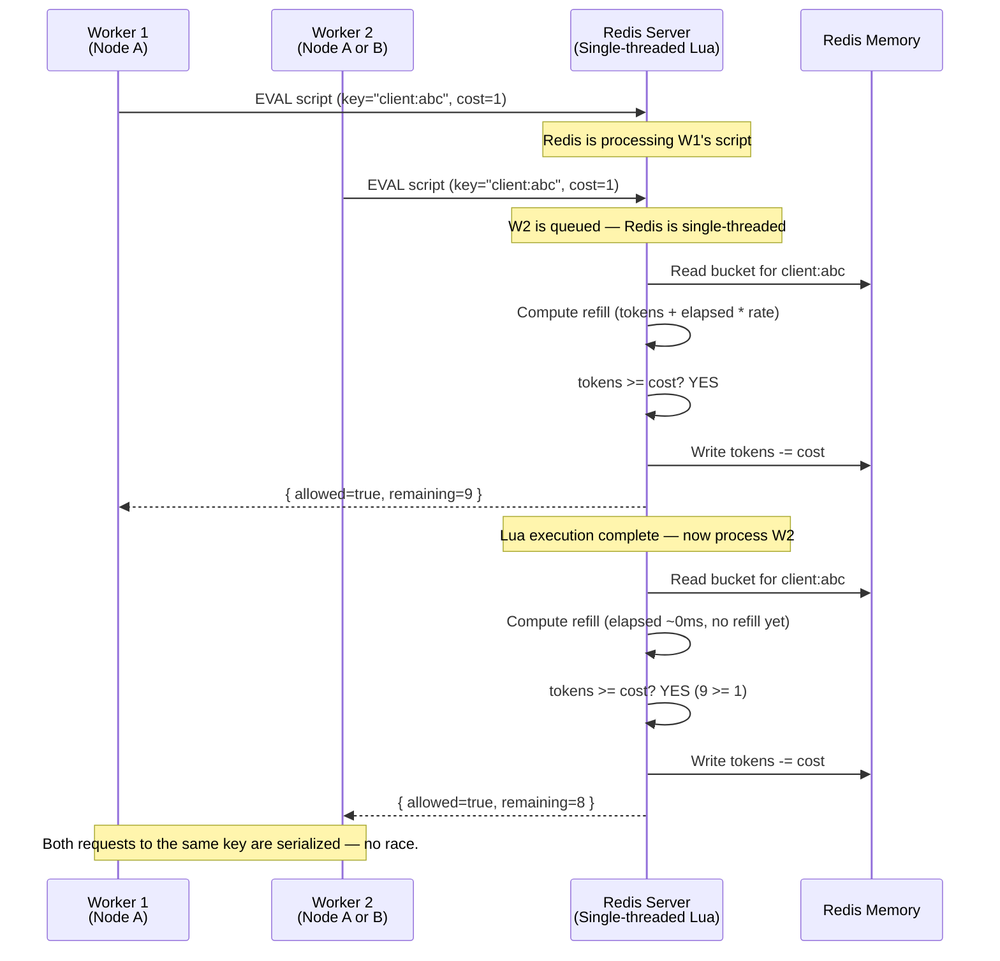
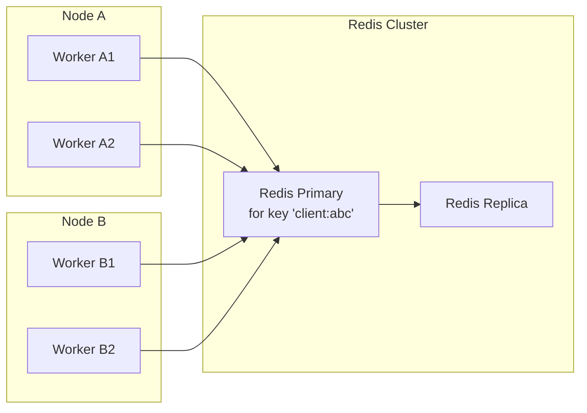
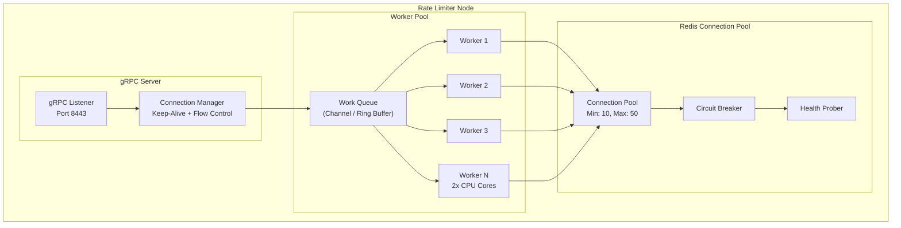

# Concurrency Design — Token Bucket Rate Limiter Service

## 1. Concurrency Challenges

The rate limiter operates at the intersection of three demanding concurrency requirements:

| Challenge | Context | Severity |
|---|---|---|
| **Atomic read-modify-write** | Every decision requires reading token count, checking sufficiency, and decrementing — all without a race window | Critical |
| **High throughput with shared state** | 100K+ decisions/second across potentially millions of bucket keys | Critical |
| **Distributed consistency** | Multiple nodes may make decisions for the same bucket key simultaneously | High |
| **Low-latency requirement** | The atomic operation must complete in < 2ms including network round-trip | High |
| **Thundering herd on cold keys** | When a previously idle bucket becomes active, all initial requests arrive simultaneously | Medium |

## 2. Solution: Redis Lua Scripts

The central concurrency mechanism is **server-side Lua scripting in Redis**. All token bucket operations — read, compute refill, compare, decrement, write — execute as a single atomic unit inside the Redis server.

### Why Lua Instead of Alternatives

| Approach | Problem | Verdict |
|---|---|---|
| **Optimistic locking (WATCH/MULTI/EXEC)** | High contention on hot keys causes constant retries. Throughput collapses under load. | Rejected |
| **Pessimistic locking (Distributed lock)** | Acquiring a Redis lock (Redlock) adds latency and complexity. Lock contention on popular keys creates a bottleneck. | Rejected |
| **Atomic increment (INCR) + separate window tracking** | Can't atomically check and consume tokens with a single INCR. Requires application-level compensation logic. | Rejected |
| **Lua script (EVAL)** | Single atomic execution on the Redis server. No network round-trips between read and write. Linearizable per-key. | **Selected** |

### Lua Execution Model



**Key property:** Because Redis executes Lua scripts single-threaded, two concurrent `EVAL` calls for the **same key** are automatically serialized. No distributed lock, no optimistic retry, no race window.

## 3. Multi-Node Concurrency

### 3.1 Same Key, Different Nodes



All workers from **all nodes** that need to operate on the same bucket key (`client:abc`) send their Lua scripts to the **same Redis primary** for that key slot. Redis handles serialization. The key property is: **all traffic for a given key converges on one Redis node**, which acts as the serialization point.

### 3.2 Redis Cluster Key Distribution

In a Redis Cluster, keys are distributed across 16,384 hash slots:

```
slot = CRC16("rl:bucket:client:abc") % 16384 → maps to Redis Node 3
slot = CRC16("rl:bucket:client:xyz") % 16384 → maps to Redis Node 7
```

This means:
- **Each key has exactly one primary** — the serialization point.
- **Keys are distributed** across Redis nodes — load is balanced.
- **All workers know the cluster topology** via Redis Cluster's MOVED/ASK redirection.

## 4. Handling Hot Keys

A "hot key" is a bucket key that receives disproportionately high traffic (e.g., a global rate limit, or a popular API client). Mitigations:

### 4.1 Key-Level Rate Limiting

If a single bucket key receives > 10,000 decisions/second, it can saturate a single Redis core. Solution:

- **Local cache of decision outcomes.** For extremely hot keys (e.g., global limits with `max_tokens` = 1000 and `refill_rate` = 1000/s), allow the local node to cache the decision for 1-2ms. During that window, all requests get the cached result without hitting Redis. Breach: can over-consume by up to 2ms worth of tokens, which is acceptable.

- **Key splitting.** For keys that represent aggregate limits (e.g., a per-IP limit), split into sub-keys by request hash:
  ```
  Before: "ip:203.0.113.42" (single hot key)
  After:  "ip:203.0.113.42:shard:0" ... "ip:203.0.113.42:shard:7"
  ```
  Each shard's token count = `max_tokens / 8`. This distributes load across 8 Redis hash slots. Trade-off: limits become approximate (off by up to `max_tokens/8` during a burst).

### 4.2 Adaptive Backpressure

When a Redis node's CPU exceeds 80%, it signals backpressure:
- The rate limiter nodes reduce concurrency on that key slot.
- Extra requests are locally rejected (fail-close) or buffered (fail-defer).
- Alert is triggered for operator intervention.

## 5. Worker Pool Architecture



### Worker Lifecycle

1. **Request arrives** on gRPC connection. Connection handler reads request and pushes to work queue.
2. **Worker dequeue** — blocks until work is available or timeout.
3. **Worker acquires connection** from Redis pool. If none available, wait up to 5ms.
4. **Worker executes Lua script** on Redis. Blocking call (NIO — thread yields).
5. **Worker parses response** and writes to gRPC response stream.
6. **Worker logs decision** asynchronously (non-blocking channel to logger).

### Worker Scaling

| Parameter | Value | Rationale |
|---|---|---|
| Workers per node | 2 × CPU cores | Optimal for I/O-bound workloads with some CPU for rule matching |
| Max queue depth | 10,000 | Memory bound (~200KB per 1000 requests) |
| Connection pool | Workers × 2 | Each worker may hold one connection while processing |
| Pool wait timeout | 5ms | Preceed to local fallback after this threshold |
| Local fallback threshold | Pool exhausted + 5ms wait | Safety valve — don't let the client hang |

## 6. Idempotency and Duplicate Decisions

The `decision_id` (UUID v4) generated for each `CheckRequest` ensures:
- Downstream consumers can deduplicate decision events.
- If a client retries a `Check` call (due to timeout), the second call is **not** treated as a second token consumption.
- The Lua script checks `decision_id` in a **deduplication set** (Redis SET with 60s TTL). If the ID exists, return the cached decision without consuming tokens.

## 7. Clock Skew Handling

Token refill depends on elapsed wall-clock time. Clock skew between the rate limiter node and the Redis server causes inaccurate refills:

| Skew Direction | Effect | Severity |
|---|---|---|
| Node ahead of Redis | Tokens refilled too early (over-consumption) | Medium (transient) |
| Node behind Redis | Tokens refilled too late (under-consumption) | Low (client sees slightly fewer tokens) |

**Mitigation:**
- All time-based decisions use the Redis server's `TIME` command, which returns the Redis server's clock. The Lua script fetches `TIME` at the start of execution.
- This ensures all decision serialized on the same Redis node use the same clock.
- Redis nodes are NTP-synchronized with < 10ms skew.
