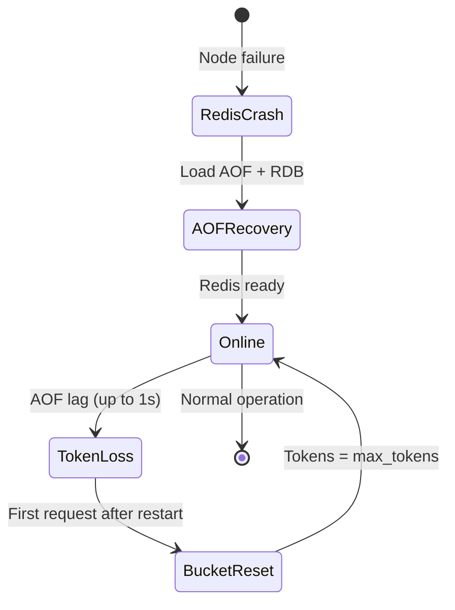
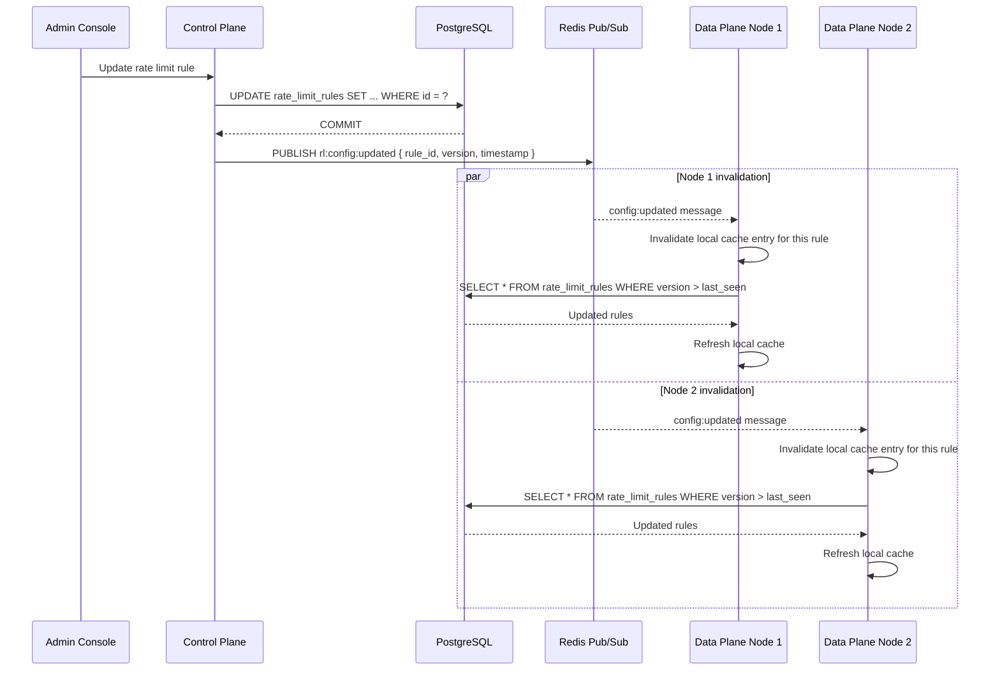
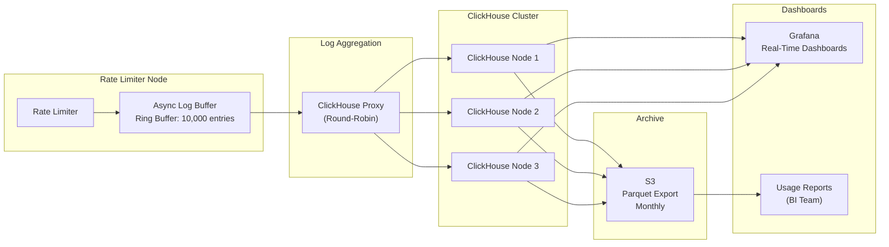

# Persistence Strategy — Token Bucket Rate Limiter Service

## 1. Data Classification

Not all data in the rate limiter requires the same durability guarantees. The persistence strategy is governed by the criticality of each data type:

| Data Class | Examples | Durability Required | Recovery Mechanism |
|---|---|---|---|
| **Ephemeral** | Token bucket state | Low — loss resets buckets | Rebuilt from rules on next request |
| **Configuration** | Rate limit rules | High — loss breaks the system | PostgreSQL with WAL + backups |
| **Audit** | Configuration changes | Very High — compliance requirement | PostgreSQL + archival to S3 |
| **Telemetry** | Decision logs | Medium — dashboards can tolerate gaps | ClickHouse with replication |

## 2. Token Bucket State (Ephemeral)

### Storage: Redis (In-Memory)

Token bucket state is stored entirely in Redis memory. This is an intentional trade-off:

**Why not persistent storage (PostgreSQL, SSDs)?**
- Decision latency would increase from < 1ms to > 10ms (disk I/O).
- Write throughput would be limited by disk IOPS.
- The operational cost of 100K writes/second to a durable store is prohibitive.

**Why Redis (versus pure in-memory on the application node)?**
- Shared state across rate limiter nodes — any node can handle any key.
- Persistence is still available via AOF + replication for crash recovery.
- Redis Cluster provides automatic failover with minimal token loss.

### Redis Persistence Configuration

```
appendonly yes
appendfsync everysec
auto-aof-rewrite-percentage 100
auto-aof-rewrite-min-size 64mb
save 60 10000    # RDB snapshot: 10K changes in 60s
save 300 100000  # RDB snapshot: 100K changes in 300s
```

**Trade-off:**
- `appendfsync everysec` = up to 1 second of token state loss on Redis crash. Acceptable — clients regain capacity. No data corruption, no revenue impact.
- AOF rewrite prevents unbounded log growth while maintaining crash recovery.

### Recovery on Redis Restart

1. Redis loads the last AOF + RDB snapshot.
2. All bucket states are reset to `max_tokens` on the first access after restart (Lua script initializes if key is missing).
3. Clients that were previously throttled regain full capacity. This is acceptable behavior — limits reset on infrastructure failure.



## 3. Rate Limit Rules (Configuration)

### Storage: PostgreSQL (Durable)

Rate limit rules are the source of truth for the entire system. They are stored in PostgreSQL with:

| Mechanism | Detail |
|---|---|
| **Primary storage** | PostgreSQL 15+ with `synchronous_commit = on` |
| **Replication** | Streaming replication to 2 cross-AZ standbys |
| **Backups** | pgBackRest: full daily + WAL every 5 minutes |
| **Retention** | 30 days of point-in-time recovery |
| **RPO** | < 5 minutes (WAL shipping) |
| **RTO** | < 1 hour (full restore) or < 1 minute (standby promotion) |

### Caching Layer

Rules are **not** read from PostgreSQL on every decision. They are cached in the data plane nodes:

```
┌─────────────────────────────────────────────┐
│          Data Plane Node                    │
│  ┌────────────────────────────────────┐     │
│  │      Rule Cache (In-Memory)        │     │
│  │  • Populated on startup            │     │
│  │  • Refreshed every 5 seconds       │     │
│  │  • Invalidated via Redis Pub/Sub   │     │
│  │  • LRU eviction if > 500MB         │     │
│  └────────────────────────────────────┘     │
│                      │                       │
│                      ▼                       │
│  ┌────────────────────────────────────┐     │
│  │      PostgreSQL (Source of Truth)  │     │
│  │  • All active rules                │     │
│  │  • Rule version history            │     │
│  │  • Audit trail                     │     │
│  └────────────────────────────────────┘     │
└─────────────────────────────────────────────┘
```

### Cache Invalidation Flow



## 4. Audit Log

### Storage Chain

```
Rate Limit Admin API → PostgreSQL (immediate)
                     → S3 (archival, 90-day retention)
                     → Glacier (compliance, 7-year retention)
```

### Why PostgreSQL for Audit?

| Requirement | PostgreSQL | Purpose-built audit store | Verdict |
|---|---|---|---|
| Strong consistency | ✅ Yes | ❌ Usually eventual | PostgreSQL wins |
| Complex queries | ✅ Yes | ✅ Yes | Tie |
| Retention (years) | ❌ Needs archival | ✅ Yes | Tie with S3 |
| Write throughput | ✅ Sufficient (rare writes) | ✅ Excessive | PostgreSQL wins |

Audit writes are infrequent (rule changes, not decisions). PostgreSQL easily handles this volume with the added benefit of transactional consistency with rule updates.

## 5. Decision Logs (Telemetry)

### Storage: ClickHouse

Decision logs are streamed to ClickHouse because:
- **Write throughput:** 100K+ decisions/second × N nodes = millions of rows/second. PostgreSQL cannot sustain this.
- **Analytical queries:** Dashboards query aggregate data (requests/second, top throttled clients). ClickHouse's columnar engine is 10-100× faster than PostgreSQL for these queries.
- **Compression:** ClickHouse compresses decision log data to ~10% of raw size.
- **TTL-based retention:** Automatic data expiration (90 days).

### Data Flow



### Batch Export to S3

Monthly cron job:
1. Query ClickHouse: `SELECT * FROM decision_logs WHERE month = ?`
2. Export as Parquet (compressed, columnar).
3. Upload to S3 with lifecycle policy: Standard → Glacier (1 year) → Delete (7 years).

## 6. Disaster Recovery

| Scenario | Recovery Action | RTO | RPO |
|---|---|---|---|
| Redis node failure | Redis Cluster automatic failover to replica | < 10s | < 1s |
| Redis cluster failure (all primaries) | Restore from AOF/RDB; all buckets reset | < 5 min | < 1s |
| PostgreSQL node failure | Promote standby to primary (Patroni) | < 30s | < 10s |
| PostgreSQL region failure | Cross-region standby promotion | < 5 min | < 5 min |
| ClickHouse node failure | Distributed query routes around dead node | < 1s | 0 (replicated) |
| Full region failure | DNS failover to secondary region | < 5 min | < 5 min (rules) |

## 7. Backup Schedule

| Data | Frequency | Type | Retention | Location |
|---|---|---|---|---|
| PostgreSQL (rules) | Daily | Full (pgBackRest) | 30 days | S3 (same region) |
| PostgreSQL (rules) | Continuous | WAL archive (5 min) | 7 days | S3 (same region) |
| PostgreSQL (audit) | Daily | pg_dump (compressed) | 90 days | S3 (cross-region) |
| Redis (AOF) | Continuous | AOF + RDB snapshot | 7 days | EBS volume snapshot |
| ClickHouse | Daily | ALTER TABLE ... FREEZE | 90 days | S3 (same region) |
| Decision logs | Monthly | Parquet export | 7 years | S3 → Glacier |
