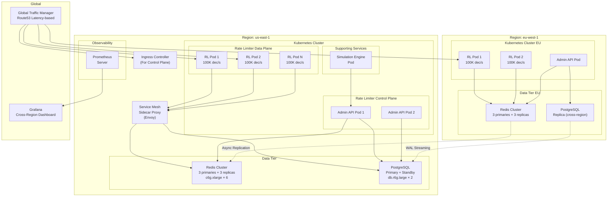
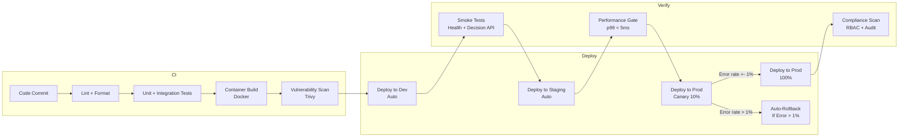
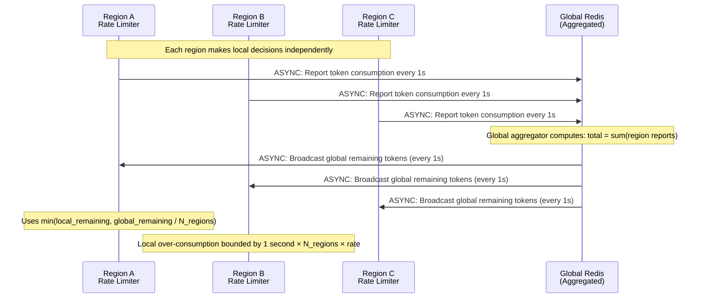

# Deployment Architecture — Token Bucket Rate Limiter Service

## 1. Deployment Model

The service is deployed as a set of **stateless microservices** running on Kubernetes, with stateful dependencies managed outside of Kubernetes (Redis Cluster, PostgreSQL).



## 2. Infrastructure Requirements

### 2.1 Compute (Kubernetes)

| Component | Instance Type | Replicas | Resources per Pod |
|---|---|---|---|
| Data plane node | c6i.xlarge (4 vCPU, 8 GB) | 3-20 (HPA) | 2 CPU, 4 GB RAM |
| Control plane node | c6i.large (2 vCPU, 4 GB) | 2-4 (HPA) | 1 CPU, 2 GB RAM |
| Simulation engine | c6i.2xlarge (8 vCPU, 16 GB) | 1 (on-demand) | 4 CPU, 8 GB RAM |

### 2.2 Data Stores

| Component | Instance Type | Count | Storage |
|---|---|---|---|
| Redis (Cluster) | c6g.xlarge (4 vCPU, 8 GB RAM) | 3 primaries + 3 replicas | In-memory only |
| PostgreSQL | db.r6g.large (2 vCPU, 16 GB RAM) | 1 primary + 1 standby | gp3: 500 GB |
| ClickHouse | c6i.2xlarge (8 vCPU, 16 GB) | 3 nodes | gp3: 1 TB each |

### 2.3 Networking

- **Latency budget:** Data plane → Redis < 1ms RTT (same AZ).
- **Bandwidth:** Each data plane node: ~50 Mbps (100K dec/s × ~500 bytes/request).
- **Firewall:** Port 6379 (Redis) accessible only from rate limiter service accounts.
- **TLS:** All inter-service communication uses mTLS.

## 3. Scaling Strategy

### 3.1 Horizontal Pod Autoscaler (Data Plane)

```
apiVersion: autoscaling/v2
kind: HorizontalPodAutoscaler
spec:
  metrics:
  - type: Pods
    pods:
      metric: rate_limiter_decisions_per_second
      target:
        type: AverageValue
        averageValue: 80000
  - type: Resource
    resource:
      name: cpu
      target:
        type: Utilization
        averageUtilization: 70
  minReplicas: 3
  maxReplicas: 20
  behavior:
    scaleDown:
      stabilizationWindowSeconds: 120
    scaleUp:
      stabilizationWindowSeconds: 30
```

### 3.2 Redis Cluster Scaling

Redis Cluster scales by adding shards (primary + replica pairs):
- Current: 3 primaries (3 hash slots groups).
- Scale to: 6 primaries by migrating hash slots.
- No downtime: Redis Cluster supports online re-sharding.
- Trigger: CPU > 70% on any Redis node sustained for 5 minutes.

## 4. CI/CD Pipeline



## 5. Multi-Region Deployment

### 5.1 Active-Active (Data Plane)

Rate limit decision-making is **active-active** across regions:
- Each region has its own data plane nodes and Redis cluster.
- Per-region rate limits are enforced locally with no cross-region dependency.
- Global rate limits (e.g., per-user across all regions) use asynchronous state replication.

### 5.2 Active-Passive (Control Plane)

The Admin API is **active-passive**:
- US-East is the primary region for rule management.
- EU-West and APAC operate as warm standbys.
- On primary region failure, DNS failover routes admin traffic to the secondary region.
- Cross-region PostgreSQL replication (streaming WAL) keeps the standby current.

### 5.3 Cross-Region Consistency for Global Limits

For global rate limits (e.g., "User X can make 1000 requests/hour globally"):



**Trade-off:** Global rate limits are eventually consistent. A user could over-consume by up to (regions × 1 second × rate) before the global aggregate catches up. For most use cases (hourly/daily limits), this is acceptable.
