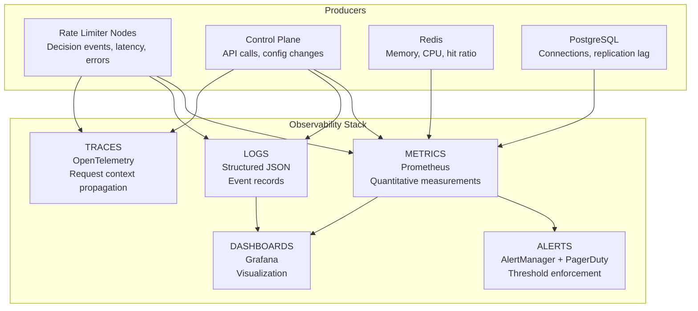
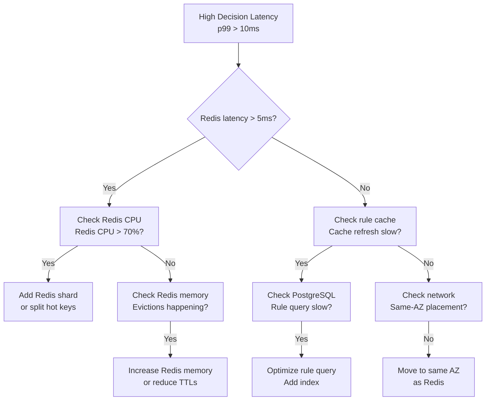

# Monitoring & Observability — Token Bucket Rate Limiter Service

## 1. Observability Pillars



## 2. Key Metrics

### 2.1 Data Plane Metrics

| Metric | Type | Labels | Description |
|---|---|---|---|
| `rate_limiter_decisions_total` | Counter | `allowed, rule_id, region, node` | Total decisions made |
| `rate_limiter_decision_latency_ms` | Histogram | `rule_id, cache_hit` | Decision latency buckets [0.1, 0.5, 1, 2, 5, 10, 50] |
| `rate_limiter_redis_latency_ms` | Histogram | `operation` | Redis call latency (EVAL, GET, SET) |
| `rate_limiter_redis_errors_total` | Counter | `error_type` | Redis connection failures, timeouts |
| `rate_limiter_local_fallback_total` | Counter | `reason` | Requests served by local in-memory bucket |
| `rate_limiter_rejected_total` | Counter | `rule_id, client_id` | Requests rejected due to rate limit |
| `rate_limiter_active_buckets` | Gauge | `region` | Number of distinct bucket keys tracked |
| `rate_limiter_rule_cache_size` | Gauge | `node` | Number of rules in local cache |
| `rate_limiter_rule_cache_staleness_ms` | Gauge | `node` | Time since last rule cache refresh |
| `rate_limiter_inflight_requests` | Gauge | `node` | Concurrent requests being processed |

### 2.2 Control Plane Metrics

| Metric | Type | Labels | Description |
|---|---|---|---|
| `rate_limiter_admin_api_latency_ms` | Histogram | `method, endpoint` | Admin API response time |
| `rate_limiter_config_changes_total` | Counter | `action` | Rate limit rule CRUD operations |
| `rate_limiter_simulation_runs_total` | Counter | `status` | Simulation engine invocations |

### 2.3 Infrastructure Metrics

| Metric | Source | Description |
|---|---|---|
| `redis_memory_usage_bytes` | Redis exporter | Memory consumption per Redis node |
| `redis_cpu_percent` | Redis exporter | CPU utilization per Redis node |
| `redis_hit_ratio` | Redis exporter | Cache hit ratio for Lua script responses |
| `redis_replication_lag_bytes` | Redis exporter | Replication lag from primary to replica |
| `pg_connections_active` | PostgreSQL exporter | Active database connections |
| `pg_replication_lag_seconds` | PostgreSQL exporter | Streaming replication delay |
| `container_cpu_utilization` | K8s metrics server | CPU usage per pod |
| `container_memory_utilization` | K8s metrics server | Memory usage per pod |

## 3. Dashboards

### 3.1 Rate Limiter Overview (Grafana)

```
┌────────────────────────────────────────────────────────────────┐
│  Rate Limit Decisions/sec  │  p99 Decision Latency  │  % Rejected  │
│  [Sparkline: 24h]          │  [Sparkline: 24h]       │  [Gauge]     │
├────────────────────────────────────────────────────────────────┤
│                                                                  │
│  Top 10 Throttled Keys                                          │
│  ┌──────────────┬────────────┬──────────┬──────────────┐       │
│  │ Bucket Key    │ Allowed/sec │ Rejected │ % Rejected   │       │
│  ├──────────────┼────────────┼──────────┼──────────────┤       │
│  │ ip:10.0.1.5 │ 1,200       │ 8,900    │ 88%          │       │
│  │ client:abc   │ 500         │ 450      │ 47%          │       │
│  └──────────────┴────────────┴──────────┴──────────────┘       │
├────────────────────────────────────────────────────────────────┤
│                                                                  │
│  Data Plane Health                                              │
│  ┌──────┬────────┬──────────┬────────┬─────────┬─────────┐    │
│  │ Node │ Status │ Requests │ Errors │ Latency │ Fallback │    │
│  ├──────┼────────┼──────────┼────────┼─────────┼─────────┤    │
│  │ rl-1 │ ✅ UP  │ 98,432   │ 12     │ 1.2ms   │ 0%      │    │
│  │ rl-2 │ ✅ UP  │ 97,212   │ 8      │ 0.9ms   │ 0%      │    │
│  │ rl-3 │ ✅ UP  │ 99,001   │ 15     │ 1.1ms   │ 0%      │    │
│  └──────┴────────┴──────────┴────────┴─────────┴─────────┘    │
├────────────────────────────────────────────────────────────────┤
│                                                                  │
│  Redis Cluster                                                  │
│  ┌──────┬────────┬────────────┬──────────┬───────────┐        │
│  │ Node │ Memory │ CPU        │ Hit Rate │ Ops/sec   │        │
│  ├──────┼────────┼────────────┼──────────┼───────────┤        │
│  │ r-1  │ 4.2GB  │ 45%        │ 99.2%    │ 152,000   │        │
│  │ r-2  │ 3.8GB  │ 38%        │ 99.5%    │ 143,000   │        │
│  └──────┴────────┴────────────┴──────────┴───────────┘        │
└────────────────────────────────────────────────────────────────┘
```

## 4. Structured Logging

### 4.1 Decision Log (JSON)

```json
{
  "timestamp": "2026-06-28T20:15:30.123Z",
  "level": "info",
  "service": "rate-limiter",
  "node": "rl-pod-7f4b9c8d5-abc12",
  "decision_id": "dec_a1b2c3d4",
  "bucket_key": "client:abc:endpoint:/orders",
  "rule_id": "rule_001",
  "allowed": true,
  "remaining_tokens": 9,
  "cost": 1,
  "processing_latency_ms": 0.8,
  "tokens_before": 10,
  "tokens_after": 9,
  "client_id": "abc",
  "endpoint": "/orders",
  "region": "us-east-1",
  "fallback_used": false,
  "cache_hit": true,
  "trace_id": "tr_xyz789"
}
```

### 4.2 Configuration Change Log (JSON)

```json
{
  "timestamp": "2026-06-28T20:10:00.000Z",
  "level": "info",
  "service": "rate-limiter-admin",
  "action": "rule_updated",
  "actor": "john.doe@company.com",
  "rule_id": "rule_001",
  "resource_type": "rate_limit_rule",
  "change_summary": "Reduced max_tokens from 100 to 50 for per-client orders endpoint",
  "diff": {
    "before": { "max_tokens": 100, "refill_rate": 10 },
    "after": { "max_tokens": 50, "refill_rate": 10 }
  },
  "source_ip": "10.0.1.100",
  "trace_id": "tr_abc456"
}
```

## 5. Distributed Tracing

### 5.1 Trace Propagation

Every `CheckRequest` propagates a trace context:

```
Client (API Gateway) → Rate Limiter Middleware → Rate Limiter Node → Redis
```

### 5.2 Key Trace Spans

| Span | Description | Expected Duration |
|---|---|---|
| `rl.check` | Total decision time | < 5ms |
| `rl.rule_cache.lookup` | Match bucket key to rule | < 100µs |
| `rl.redis.eval` | Execute Lua script on Redis | < 1ms (same AZ) |
| `rl.local_fallback` | Local bucket computation (fallback) | < 50µs |
| `rl.log.async` | Enqueue decision to logger | < 10µs |

### 5.3 Trace Sampling

| Traffic Type | Sampling Rate | Rationale |
|---|---|---|
| Normal (allowed) | 1% | High volume; traces are expensive |
| Rejected | 10% | Higher value for debugging throttling |
| Error (timeout, fallback) | 100% | Always trace failures |
| Configuration changes | 100% | Always trace admin actions |

## 6. Alerting

### 6.1 Critical Alerts (PagerDuty)

| Alert | Condition | Severity | Response |
|---|---|---|---|
| `HighDecisionLatency` | p99 latency > 10ms for 5 min | Critical | Investigate Redis cluster health |
| `RedisUnreachable` | Redis connection errors > 10% for 1 min | Critical | Failover Redis or engage SRE |
| `LocalFallbackActive` | > 10% of decisions use local fallback | Critical | Redis cluster issue — page on-call |
| `HighErrorRate` | Decision error rate > 1% for 2 min | Critical | Service degraded — page on-call |
| `ConfigPropagationDelay` | Rule cache staleness > 10s | High | Pub/Sub issue; check Redis Pub/Sub health |

### 6.2 Warning Alerts (Slack / Email)

| Alert | Condition | Action |
|---|---|---|
| `HighRejectionRate` | > 50% of requests rejected for any client | Notify client owner; verify legitimate traffic |
| `RedisMemoryHigh` | Redis memory > 75% | Plan cluster scale-up or increase TTL |
| `RedisCPUHigh` | Redis CPU > 60% for 10 min | Consider key splitting or shard addition |
| `HPA at Max` | Data plane pods at max replicas | Review scale threshold; may need to increase max |
| `ClockSkewDetected` | Node-Redis clock skew > 100ms | NTP service issue — investigate |

### 6.3 Alert Response Runbook



## 7. SLOs / SLIs

| Indicator | SLO Target | Measurement Method |
|---|---|---|
| Decision latency (p99) | < 5ms | Prometheus histogram (sliding 5m window) |
| Availability | 99.99% | Request success rate (non-5xx responses) |
| Config propagation | < 1s | Time from Pub/Sub message to rule cache update |
| Decision accuracy | > 99.9% | False positive audit (log-sampled replay) |
| Throughput per node | > 100K decisions/s | Prometheus counter over 60s average |
