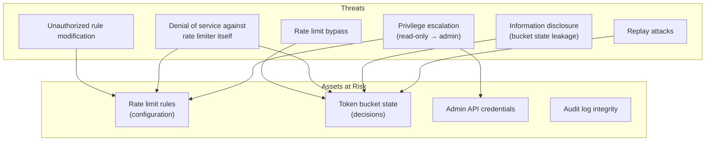
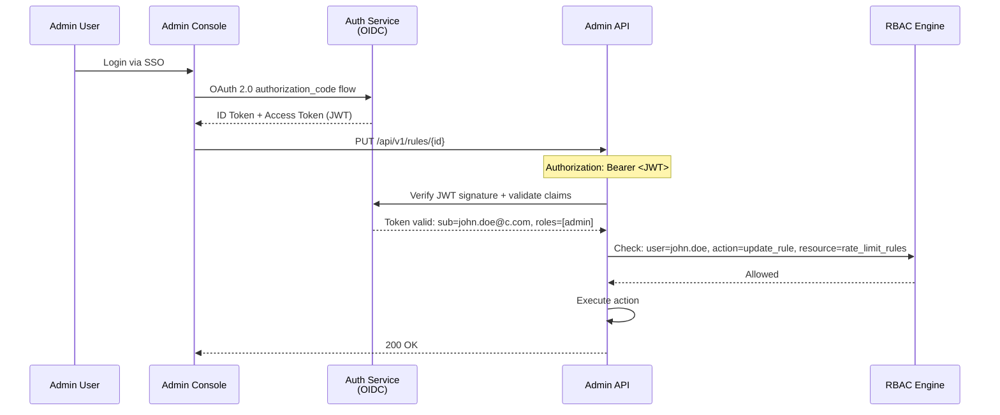

# Security Design — Token Bucket Rate Limiter Service

## 1. Threat Model



## 2. Authentication

### 2.1 Data Plane (Rate Decision API)

| Communication | Authentication | Rationale |
|---|---|---|
| API Gateway → Rate Limiter | mTLS (mutual TLS) | Runs within the internal service mesh. Both sides present certificates signed by the internal CA. |
| Rate Limiter → Redis | Redis AUTH + TLS | TLS for encryption; AUTH password for access control. |
| Rate Limiter → PostgreSQL | Client certificates | mTLS to PostgreSQL. No password-based auth. |

Certificate rotation: 90-day validity with automatic rotation via cert-manager.

### 2.2 Control Plane (Admin API)

| Authentication | Mechanism |
|---|---|
| Human users (Admin Console) | OAuth 2.0 (OIDC) with corporate SSO (Okta/Azure AD). Must have `rate-limiter.admin` scope. |
| Machine users (CI/CD) | mTLS with service account certificates. Scoped to specific operations via X.509 extension. |
| API tokens | Short-lived (1 hour) JWT issued by Auth Service. Contains RBAC claims. |

### 2.3 Admin API Token Validation Flow



## 3. Authorization (RBAC)

### 3.1 Roles and Permissions

| Role | Permissions | Use Case |
|---|---|---|
| **super-admin** | Full CRUD on all rules. Emergency override. Access audit logs. | Platform Engineering leads |
| **admin** | CRUD on rules within assigned team scope. View audit logs. | Team leads |
| **editor** | Create and update rules within assigned scope. No delete. | Service owners |
| **viewer** | Read-only access to rules and dashboards. | Auditors, stakeholders |
| **emergency-responder** | Temporary (24h) full access on incident declaration. | On-call SRE |

### 3.2 Scope-Based Access

Rules are scoped to **teams** and **environments**:

```json
{
  "rule_id": "rule_001",
  "team": "payments",
  "environment": "production",
  "allowed_roles": ["super-admin", "admin:payments", "editor:payments"]
}
```

A user with `admin:payments` role can modify rules scoped to the `payments` team, but not rules scoped to `search`.

## 4. Network Security

### 4.1 Network Segmentation

```
Internet
    │
    ▼
DMZ Zone
┌─────────────────────────┐
│  WAF (DDoS Protection)  │
│  TLS Termination        │
└─────────────────────────┘
    │
    ▼
Application Zone
┌─────────────────────────┐
│  API Gateway (Envoy)    │
│  * Rate Limiter Client  │
└─────────────────────────┘
    │
    ▼
Service Mesh (mTLS)
┌─────────────────────────┐
│  Rate Limiter Data Plane │
│  Rate Limiter Control    │
│  Plane                   │
└─────────────────────────┘
    │
    ▼
Data Zone
┌─────────────────────────┐
│  Redis Cluster          │
│  PostgreSQL             │
│  (No public access)     │
│  (mTLS only)            │
└─────────────────────────┘
```

### 4.2 Firewall Rules

| Source | Destination | Port | Protocol | Purpose |
|---|---|---|---|---|
| API Gateway | Rate Limiter | 8443 | gRPC (TLS) | Rate limit decisions |
| Admin Console | Admin API | 8444 | HTTPS | Rule management |
| Rate Limiter | Redis | 6379 | Redis (TLS) | Token state operations |
| Rate Limiter | PostgreSQL | 5432 | PostgreSQL (TLS) | Rule config queries |
| Rate Limiter | Prometheus | 9090 | HTTP | Metrics scraping |

All other ports are denied by default.

## 5. Data Protection

### 5.1 Encryption at Rest

| Data Store | Encryption | Mechanism |
|---|---|---|
| PostgreSQL | AES-256 | Transparent Data Encryption (TDE) |
| Redis | AES-256 | EBS volume encryption (if persistence enabled) |
| ClickHouse | AES-256 | EBS volume encryption |
| S3 (backups) | AES-256 | Server-Side Encryption (SSE-S3) |

### 5.2 Encryption in Transit

- All inter-service communication: TLS 1.3.
- mTLS required for data plane decisions.
- Redis: TLS enabled with mutual authentication.
- PostgreSQL: TLS with client certificate verification.

### 5.3 Sensitive Data Handling

The rate limiter does **not** store PII, secrets, or payment data. Bucket keys are opaque identifiers (client IDs, IP addresses). However:

- **IP addresses** in bucket keys (`ip:203.0.113.42`) are considered PII in some jurisdictions. If used as bucket keys, they must be hashed with a rotating salt: `ip:SHA256(ip + daily_salt)`.
- **Decision logs** that contain raw bucket keys are retained for only 90 days (vs. 7 years for anonymous aggregates).

## 6. Rate Limiter Self-Protection

The rate limiter must be protected from abuse just like any other service:

### 6.1 Ingress Rate Limiting

The Admin API has its own rate limits to prevent brute-force attacks:

| Endpoint | Limit | Scope |
|---|---|---|
| `PUT /api/v1/rules/*` | 10 req/min | Per user |
| `DELETE /api/v1/rules/*` | 5 req/min | Per user |
| `POST /api/v1/simulate` | 2 req/min | Per user |
| `POST /api/v1/emergency/override` | 1 req/5min | Per user |
| All admin endpoints | 100 req/min | Per IP |

### 6.2 Data Plane Access Control

Only the API Gateway (identified by mTLS certificate) may call the data plane Check API. If a request arrives without a valid service mesh certificate, it is rejected at the transport layer.

### 6.3 Audit Integrity

Audit logs are **immutable**:
- Written to PostgreSQL with `INSERT`-only access (no `UPDATE` or `DELETE`).
- Periodic hash chain verification: `hash(n) = SHA256(log_entry_n + hash(n-1))`.
- If an audit entry is modified, the hash chain breaks and an alert fires.

## 7. Security Incident Response

| Incident | Detection | Response |
|---|---|---|
| Unauthorized rule change | Audit log alert: unexpected actor | Immediately revert; rotate credentials; investigate |
| Rate limit bypass attempt | Sudden traffic spike from single IP | IP block; verify rate limit logic |
| Admin API brute force | Multiple 401 responses from same IP | Rate limit the IP; alert security team |
| Certificate compromise | Expired or revoked cert used | Revoke all certs in the chain; re-issue |

## 8. Compliance

| Requirement | How It's Met |
|---|---|
| **SOC 2** (Access Control) | RBAC + audit logging + access reviews |
| **GDPR** (Data Minimization) | No PII stored; IPs hashed with rotating salt |
| **SOX** (Change Management) | All rule changes require approved ticket + audit trail |
| **PCI-DSS** (If applicable) | Rate limiter does not process payment data |
