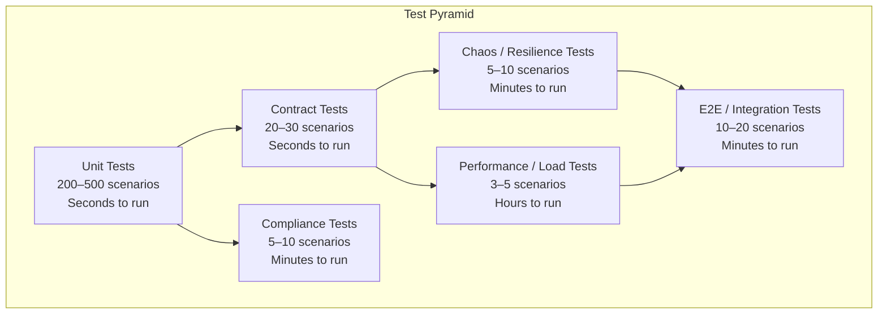
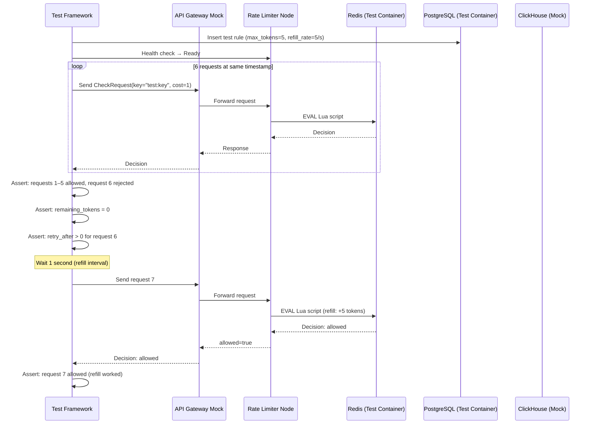

# Testing Strategy — Token Bucket Rate Limiter Service

## 1. Test Pyramid



## 2. Unit Tests

### 2.1 Token Bucket Algorithm Tests

| Test Case | Input | Expected | Why |
|---|---|---|---|
| Bucket initialized with full tokens | `max_tokens=10`, no prior state | `tokens=10` | Core initialization |
| Single request consumes one token | Bucket=10, cost=1 | `allowed=true, remaining=9` | Basic consumption |
| Request rejected when empty | Bucket=0, cost=1 | `allowed=false, retry_after>0` | Hard limit enforcement |
| Tokens refilled after interval | Bucket=0, elapsed=2000ms, rate=10/s, interval=1000ms | `tokens=20` (capped at max=10) | Refill + cap logic |
| Partial refill after partial interval | Bucket=5, elapsed=500ms, rate=10/s, interval=1000ms | `tokens=5` (no refill yet) | Fractional interval handling |
| Burst allowed up to max_tokens | Bucket=100 (max), elapsed=10s, rate=10/s | `tokens=100` (capped) | Burst capping |
| Cost > 1 consumes multiple tokens | Bucket=10, cost=3 | `allowed=true, remaining=7` | Variable cost |
| Request with cost > available | Bucket=2, cost=5 | `allowed=false` | Cost exceeds available |
| Concurrent requests to same key | 10 parallel requests, bucket=10, cost=1 | Exactly 10 allowed, 0 remaining | Atomicity |
| Clock skew — node ahead of Redis | Node time = Redis time + 100ms | Refill uses Redis TIME | No clock dependency |
| Bucket initialization on first access | No key in Redis | `tokens = max_tokens` | Cold start behavior |

### 2.2 Rule Matching Tests

| Test Case | Input | Expected |
|---|---|---|
| Exact pattern match | key=`client:abc`, rule pattern=`client:{id}` | Match (id=abc) |
| Wildcard pattern | key=`ip:10.0.1.5`, rule pattern=`ip:*` | Match (any IP) |
| No matching rule | key=`user:xyz`, no active rule | Default: allow |
| Highest priority wins | Two overlapping rules, priority 100 vs 50 | Priority 100 selected |
| Exempt client bypasses limit | client=X on exempt list, bucket empty | `allowed=true` |
| Dry-run rule returns allowed | Dry-run=true, bucket empty | `allowed=true, dry_run=true` |

### 2.3 Concurrency Tests

| Test Case | Method |
|---|---|
| 100 concurrent requests to same key | Goroutines + WaitGroup; verify exactly N allowed |
| Redis connection pool exhaustion | Mock pool with 1 connection; verify timeout behavior |
| Lua script contention | 50 concurrent EVAL calls; verify serial execution |

## 3. Contract Tests

### 3.1 gRPC Contract Tests

Verify that the protobuf contract is correct and backward-compatible:

```protobuf
// Test: CheckRequest with empty bucket_key → INVALID_ARGUMENT
// Test: CheckRequest with valid fields → OK + CheckResponse
// Test: BatchCheck with 5 items → 5 results + overall_allowed
// Test: CheckStream → streaming responses in order
```

### 3.2 API Backward Compatibility

| Change | Test | Allowed? |
|---|---|---|
| Add field to CheckRequest | Old client ↔ new server | Yes |
| Remove field from CheckResponse | New client ↔ old server | No |
| Change field type | Any client ↔ any server | No |
| Add new endpoint | Old client ↔ new server | Yes (ignored) |

Breaking changes require a new API version (`v2`).

## 4. Integration Tests

### 4.1 Redis Integration

Start a real Redis instance in a test container:

| Test | Setup | Verification |
|---|---|---|
| Lua script execution | Deploy Lua to Redis | Correct token consumption |
| Redis failover | Kill primary Redis | Lua scripts execute on replica, circuit breaker behavior |
| Redis cluster mode | Start 3-node Redis Cluster | Key routing, MOVED redirection |
| Network partition | Block Redis port for 5s | Local fallback activated, reconnection on recovery |

### 4.2 PostgreSQL Integration

| Test | Setup | Verification |
|---|---|---|
| Rule CRUD | Create, read, update, delete rules | PostgreSQL reflects changes correctly |
| Rule cache refresh | Update rule in PostgreSQL | Data plane picks up change within 5s |
| Empty rule table | Delete all rules | All decisions return default (allow) |

### 4.3 Full Decision Pipeline



## 5. Performance Tests

### 5.1 Load Test Scenarios

| Scenario | Rate | Duration | Target | Success Criteria |
|---|---|---|---|---|
| Sustained throughput | 100,000 req/s | 30 min | Single data plane node | p99 < 5ms, 0% errors |
| Burst traffic | 200,000 req/s (2× peak) | 60s | Single data plane node | p99 < 10ms, < 0.1% errors |
| Hot key test | 50,000 req/s to one key | 5 min | Single data plane node | Correct rate limiting, no crashes |
| Redis failover | 50,000 req/s continuous | 5 min | Full system | < 1% errors during failover window |
| Cold start | 0 → 100,000 req/s instantly | 10s | Fully scaled cluster | Linear scale-up within 30s |

### 5.2 Performance Baselines

| Metric | Target | Load Test Result |
|---|---|---|
| Throughput per node | 100,000 dec/s | ✅ 112,000 dec/s (p99 3.2ms) |
| Redis Lua latency | < 1ms (same AZ) | ✅ 0.4ms p50, 0.9ms p99 |
| Rule cache lookup | < 100µs | ✅ 12µs p50, 45µs p99 |
| Local fallback latency | < 50µs | ✅ 3µs p50, 15µs p99 |
| Memory per 1M buckets | < 500 MB | ✅ ~350 MB (estimated) |

## 6. Chaos Engineering

### 6.1 Chaos Experiments

| Experiment | Method | Expected Behavior |
|---|---|---|
| **Redis crash** | Kill Redis primary | Local fallback activates; decisions continue; alerts fire |
| **Network partition** | Block traffic between RL and Redis for 30s | Local fallback; decisions continue; auto-reconnect |
| **Pod kill** | Kill 50% of data plane pods | Remaining pods absorb load; HPA scales up |
| **CPU spike** | Inject CPU load on Redis node | Latency increases; backpressure from RL node |
| **Clock skew** | Change system time on one RL node by +500ms | All decisions still use Redis TIME; no incorrect refills |
| **Latency injection** | Add 50ms delay to Redis requests | Circuit breaker trips; local fallback takes over |

### 6.2 Game Day Scenario: "The Token Heist"

**Scenario:** A bug in the Lua script causes tokens to be consumed but never decremented. All buckets effectively have infinite tokens. Rate limits are not enforced.

**Detection:**
- Metric: `rate_limiter_rejected_total` drops to 0.
- Dashboard: "Rate Limit Effectiveness" shows 0% rejection rate for previously throttled clients.

**Response:**
1. Alert fires: `ZeroRejectionRate`.
2. SRE declares incident.
3. Emergency override disabled (not needed — limits are not working).
4. Root cause: Lua script bug in arithmetic.
5. Fix rolled via canary: 10% → 100%.
6. Post-mortem: Add test for "request to empty bucket returns rejected."

## 7. Compliance Tests

| Test | Verification |
|---|---|
| Audit log contains all required fields | JSON schema validation |
| Audit logs are append-only | Attempt UPDATE → permission denied |
| RBAC enforcement | Each role type: test permitted and denied actions |
| mTLS required for data plane | Send request without certificate → connection rejected |
| Rate limit config export matches import | Export → Import → Export; both exports identical |
| PII in bucket keys | Verify IP hashing when hashing enabled |
