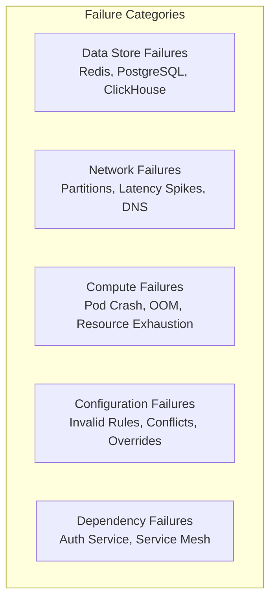
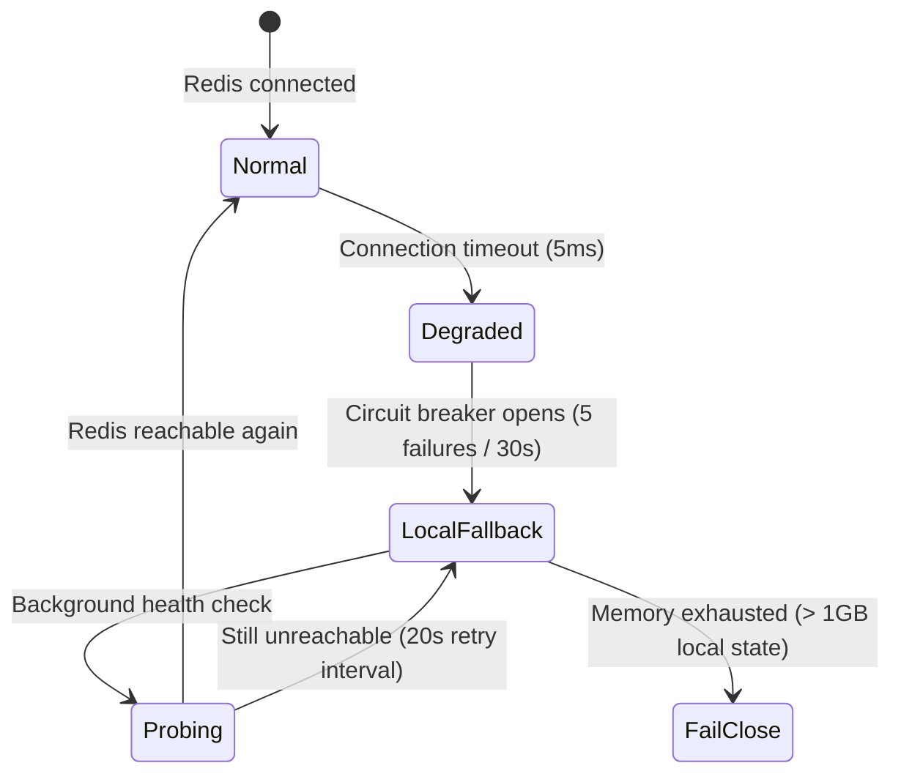
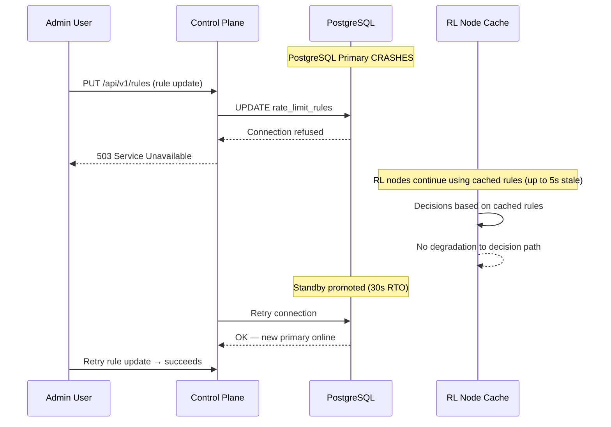
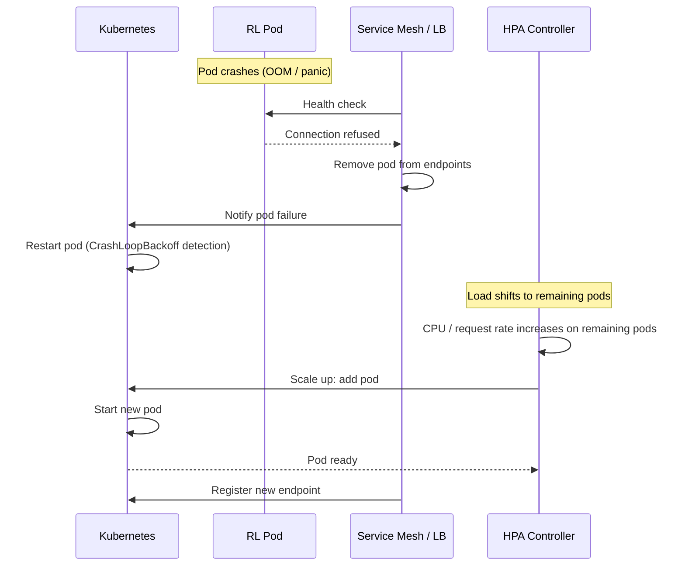

# Failure Handling — Token Bucket Rate Limiter Service

## 1. Failure Classification

## 2. Data Store Failures

### 2.1 Redis Unreachable

**Scenario:** The rate limiter node cannot connect to the Redis cluster. Primary is down, replica promotion hasn't completed, or a network partition isolates the node.

**Behavior in each state:**

| State | Decision Behavior | Logging |
|---|---|---|
| **Normal** | All decisions via Redis Lua scripts | Standard decision log |
| **Degraded** | Retry Redis with backoff (50ms, 100ms, 200ms, 500ms). Return ALLOW if all retries fail. | `degraded=true`, `reason=redis_timeout` |
| **Local Fallback** | In-memory token bucket. Best-effort accuracy. No persistence. Buckets reset if node restarts. | `fallback=true`, `reason=circuit_open` |
| **Fail-Close** | ALL requests are REJECTED. Only for security-critical keys (configured per rule). | `fail_close=true` |

**Recovery:** Background health prober pings Redis every 3 seconds. On success, circuit breaker transitions to HALF-OPEN (test 1 request), then CLOSED (full operation).

### 2.2 Redis Data Loss

**Scenario:** Redis restarts with empty AOF (append-only file corrupted or fsync lag).

**Impact:** All token bucket states are reset. Previously throttled clients regain full capacity.

**Why this is acceptable:**
- Rate limits are not a security guarantee — they are a traffic management mechanism.
- A burst of traffic after Redis restart is bounded by `max_tokens`.
- Clients that were legitimately throttled before the crash will re-accumulate tokens naturally.
- No data corruption, no financial impact, no inconsistency.

### 2.3 PostgreSQL Failure (Control Plane)

**Scenario:** PostgreSQL primary is unreachable. The Admin API cannot read or write rate limit rules.

**Impact on data plane:** **None.** Data plane nodes have the rule set cached locally. They continue making decisions using stale rules (up to 5 seconds old). The system continues operating normally for decisions.

**Impact on control plane:** Admin API returns 503. No rule changes possible until PostgreSQL recovers.

## 3. Network Failures

### 3.1 Network Partition (Data Plane ↔ Redis)

**Scenario:** A network failure isolates a subset of rate limiter nodes from the Redis cluster.

**Mitigation:**
1. Each RL node detects partition via Redis connection health checks.
2. Partitioned nodes enter Local Fallback mode.
3. Non-partitioned nodes continue operating normally with Redis.
4. When partition heals, partitioned nodes reconnect, flush local state, and resume Redis-backed decisions.

**Consistency during partition:**
- Token state diverges between Redis and partitioned nodes.
- On heal, partitioned nodes discard their local state and sync from Redis.
- Over-consumption (if any) is bounded by the partition duration × per-node rate.

### 3.2 High Network Latency

**Scenario:** Cross-AZ traffic causes Redis round-trip to spike from < 1ms to > 10ms.

**Detection:** Prometheus alert: `redis_latency > 5ms` sustained for 2 minutes.

**Mitigation:**
1. **Affinity routing:** The service mesh should route RL node → Redis within the same AZ. This is a deployment configuration fix, not a runtime change.
2. **Hedged requests:** If Redis latency exceeds 5ms for any single request, the RL node sends a second request to a Redis replica. Whichever responds first wins.
3. **Fallback threshold:** If p50 latency exceeds 20ms, the circuit breaker opens and the node enters Local Fallback mode.

## 4. Compute Failures

### 4.1 Rate Limiter Node Crash

**Scenario:** A data plane pod OOMs or crashes due to a software bug.

**Impact:** Zero — remaining nodes absorb the load. If remaining nodes are at capacity, HPA scales up within 30 seconds. During the scale-up window, the partial capacity may cause slightly higher latency but no data loss.

### 4.2 Resource Exhaustion (Memory)

**Scenario:** A single node handles many unique bucket keys, exhausting its memory budget.

**Mitigation:**
- Per-node memory limit: 4 GB (Kubernetes resource limit).
- When memory exceeds 3.5 GB, the node aggressively evicts least-recently-used rule cache entries and local fallback buckets.
- If memory exceeds 3.8 GB, the node enters **read-only** mode — it stops accepting new buckets and returns ALLOW for unknown keys.

## 5. Configuration Failures

### 5.1 Invalid Rule Deployment

**Scenario:** An operator deploys a rule with `max_tokens=0` or a negative refill rate.

**Mitigation:**
- **Pre-deployment validation** in the Admin API: rejects rules with invalid parameters before writing to PostgreSQL.
- **Dry-run mode:** New rules can be deployed in dry-run mode for observation before enforcement.
- **Canary rules:** Rules can be applied to 1% of traffic first, then gradually increased.
- **Auto-revert:** If the error rate increases by > 1% within 5 minutes of a rule change, the system reverts to the previous rule version.

### 5.2 Rule Conflict

**Scenario:** Two rules match the same bucket key with different parameters, causing unpredictable behavior.

**Mitigation:**
- The Admin API detects overlapping key patterns at creation time and warns the operator.
- Priority field determines which rule wins (higher priority = higher precedence).
- If priorities are equal, the most recently created rule wins (warning logged).

## 6. Dependency Failures

### 6.1 Auth Service Unavailable

**Scenario:** The OIDC provider used for Admin Console login is unreachable.

**Impact:** No new admin sessions can be created. Existing sessions continue until token expiry (typically 1 hour).

**Mitigation:**
- **Offline tokens:** Admin sessions use refresh tokens that can be cached for up to 24 hours.
- **Emergency access:** A pre-configured emergency account (stored in a separate, redundant directory) allows critical operations during extended auth provider outages.
- **Audited:** Emergency access triggers an immediate alert to the security team.

### 6.2 Service Mesh Failure (mTLS)

**Scenario:** The service mesh certificate authority is unreachable, and existing mTLS certificates have expired.

**Impact:** All inter-service communication fails — no rate limit decisions can be made.

**Mitigation:**
- **Long-lived fallback certificates:** Each node has a 90-day fallback certificate stored outside the mesh (in a Kubernetes Secret with 30-day rotation). If the mesh CA is down, nodes fall back to the static certificate.
- **Fail-open mode:** If the data plane itself cannot make decisions due to infrastructure failure, the API Gateway can be configured to fail-open (allow all requests) with a configuration flag.

## 7. Failure Mode Summary

| Failure | Detection | Impact | Mitigation | RTO |
|---|---|---|---|---|
| Redis primary crash | Connection timeout | Local fallback activated | Redis Cluster auto-failover | < 10s |
| Redis full outage | All nodes in fallback | Best-effort rate limiting | Restore from AOF/RDB | < 5 min |
| PostgreSQL primary crash | Connection refused | No config changes (30s) | Patroni standby promotion | < 30s |
| RL node crash | Health check failure | Capacity reduced | K8s restart + HPA scale-up | < 10s |
| Network partition | Redis health checks fail | Local fallback per node | Auto-detect on partition heal | < 5s |
| Invalid rule deployment | Validation failure at API | Deployment rejected | Pre-validation + dry-run | Instant |
| RL resource exhaustion | OOMKilled | Pod restart | Memory limits + LRU eviction | < 30s |
| Dependency (Auth) | OIDC timeout | New admin logins blocked | Offline tokens + emergency access | Varies |
