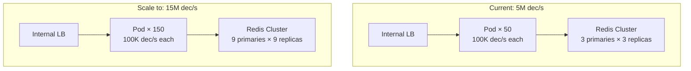
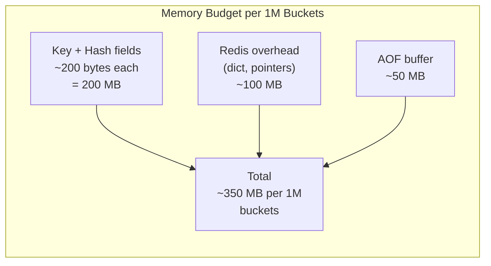
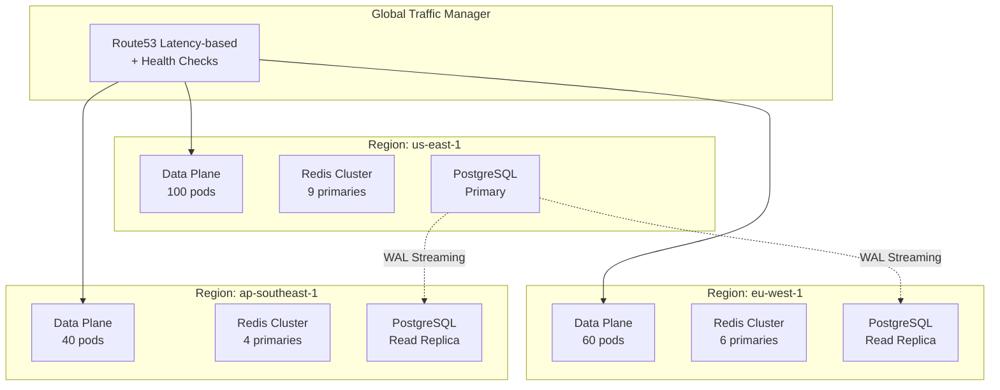
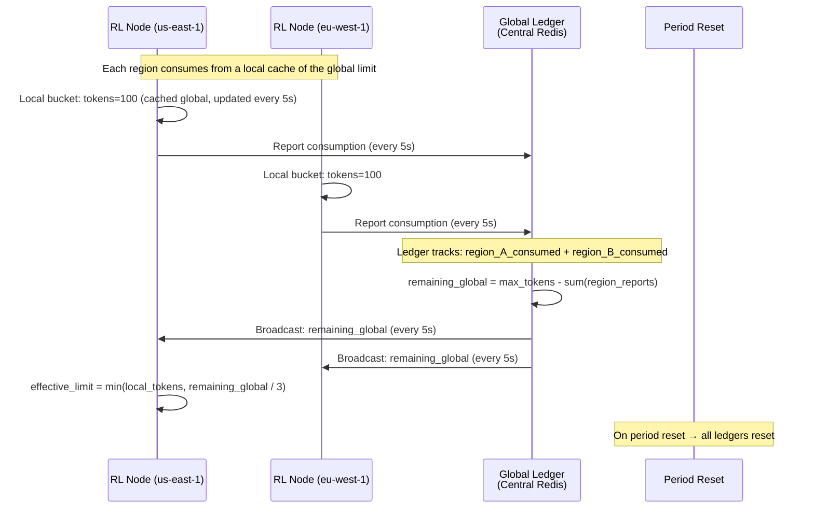

# Scaling Strategy — Token Bucket Rate Limiter Service

## 1. Scaling Dimensions

The rate limiter must scale across four dimensions:

| Dimension | Current Target | Future Target | Primary Constraint |
|---|---|---|---|
| **Throughput** (decisions/sec) | 5M/sec global | 50M/sec global | Redis CPU |
| **Bucket count** (unique keys) | 10M | 100M | Redis memory |
| **Rule count** (configs) | 100K | 1M | PostgreSQL + cache size |
| **Latency** (p99 decision) | 5ms | 2ms | Network + Redis proximity |

## 2. Data Plane Scaling

### 2.1 Horizontal Scaling (Throughput)

The data plane scales horizontally by adding more stateless pods. Since all nodes are stateless and share nothing, scaling is linear:



**Scaling formula:** `nodes = (target_decisions_per_second / 100,000) × redundancy_factor(1.2)`

At 5M dec/s: `(5,000,000 / 100,000) × 1.2 = 60 nodes` (plus HPA buffer)

### 2.2 Redis Scaling

Redis is the primary bottleneck at scale. Scaling strategy:

**Phase 1 — Add shards (0 → 3 → 9 → 27 primaries):**
- Start with 3 primaries (Redis Cluster default).
- Monitor CPU per node. When any node exceeds 60% CPU, add 3 more primaries.
- Redis Cluster supports online re-sharding — no downtime.

**Phase 2 — Key splitting for hot keys:**
- If a single key receives > 10,000 dec/s, split it into N sub-keys.
- Each sub-key has `max_tokens / N` capacity.
- Distributes load across N hash slots.

**Phase 3 — Read replicas for cache warming:**
- Redis replicas serve as read-only fallback.
- Not used for primary decisions (write must go to primary).
- Used for cache warming: when a new node starts, it can pre-fetch hot keys from replicas.

### 2.3 Redis Memory Scaling



At 10M buckets: ~3.5 GB per Redis node. At 100M buckets: ~35 GB. Scaling to 100M buckets requires larger instance types (r6g.2xlarge → r6g.8xlarge) or more shards.

## 3. Control Plane Scaling

### 3.1 Admin API

The control plane has low traffic (tens of requests per second — rule changes are infrequent). It scales by adding pods behind a load balancer.

**HPA configuration:**
- Metric: CPU > 60%.
- Min: 2 pods (HA).
- Max: 10 pods.

### 3.2 Rule Cache Propagation

As the number of nodes grows, rule cache propagation becomes a concern:

| Node Count | Invalidation Strategy | Max Propagation Time |
|---|---|---|
| < 50 | Redis Pub/Sub (all nodes subscribe) | < 1s |
| 50–500 | Redis Pub/Sub + polling (5s backup) | < 1s (Pub/Sub) / < 5s (poll) |
| > 500 | Gossip protocol (SWIM-based) + periodic polling | < 2s (gossip) / < 5s (poll) |

At the current scale (< 200 nodes), Redis Pub/Sub is sufficient. At massive scale (> 500 nodes), Pub/Sub scalability becomes a concern (each message is fanned out to N subscribers). A gossip-based protocol distributes the invalidation message without a single fan-out bottleneck.

## 4. Global Scaling (Multi-Region)



### 4.1 Regional Sizing by Traffic

| Region | Traffic Share | Data Plane Pods | Redis Primaries |
|---|---|---|---|
| us-east-1 | 40% | 100 | 9 |
| eu-west-1 | 30% | 60 | 6 |
| ap-southeast-1 | 20% | 40 | 4 |
| sa-east-1 | 10% | 20 | 2 |

### 4.2 Global Rate Limits

For rate limits that span regions (e.g., "1000 requests/hour per user globally"):

**Approach: Global token ledger**



**Trade-off:** Global limits are eventually consistent (up to 5 seconds stale). Over-consumption of up to `regions × 5s × rate` is possible. For hourly/daily limits, this is acceptable.

## 5. Auto-Scaling Rules

### 5.1 Data Plane HPA

```yaml
metrics:
  - type: Pods
    pods:
      metric: rate_limiter_decisions_per_second
      target:
        type: AverageValue
        averageValue: 80000
  - type: Resource
    resource:
      name: cpu
      target:
        type: Utilization
        averageUtilization: 70
behavior:
  scaleDown:
    stabilizationWindowSeconds: 120
    policies:
      - type: Pods
        value: 2
        periodSeconds: 60
  scaleUp:
    stabilizationWindowSeconds: 30
    policies:
      - type: Percent
        value: 100
        periodSeconds: 15
```

### 5.2 Redis Cluster Scaling (Manual / Scheduled)

Redis Cluster does not support auto-scaling natively. Scaling is a planned operation:

**Trigger:** Primary CPU > 60% for 1 hour or Memory > 70%.

**Process:**
1. Add 3 new Redis nodes to the cluster.
2. Rebalance hash slots: `redis-cli --cluster rebalance <new-node>`.
3. Monitor: CPU utilization across all nodes should decrease proportionally.
4. Verify: Decision latency remains stable during the migration.

## 6. Capacity Planning

### 6.1 Current Requirements

| Component | Current | Growth Rate | 12-Month Projection |
|---|---|---|---|
| Decisions/sec | 5M | 3× / year | 15M |
| Unique bucket keys | 10M | 2× / year | 20M |
| Rate limit rules | 10K | 1.5× / year | 15K |
| Redis memory | 35 GB | 2× / year | 70 GB |

### 6.2 Cost Projection

| Component | Current Monthly | 12-Month Projected | Scaling Driver |
|---|---|---|---|
| Data plane pods (compute) | $8K | $24K | Decisions/sec |
| Redis Cluster | $12K | $36K | Bucket count + throughput |
| PostgreSQL | $2K | $3K | Rule count (minor) |
| ClickHouse | $4K | $8K | Decision log volume |
| **Total** | **$26K** | **$71K** | |

**Optimization levers:**
- Reserved instances for Redis and PostgreSQL (30% discount).
- Spot instances for data plane pods (60% discount).
- Decision log sampling (reduce ClickHouse volume by 90% with 1% sampling for high-traffic keys).
