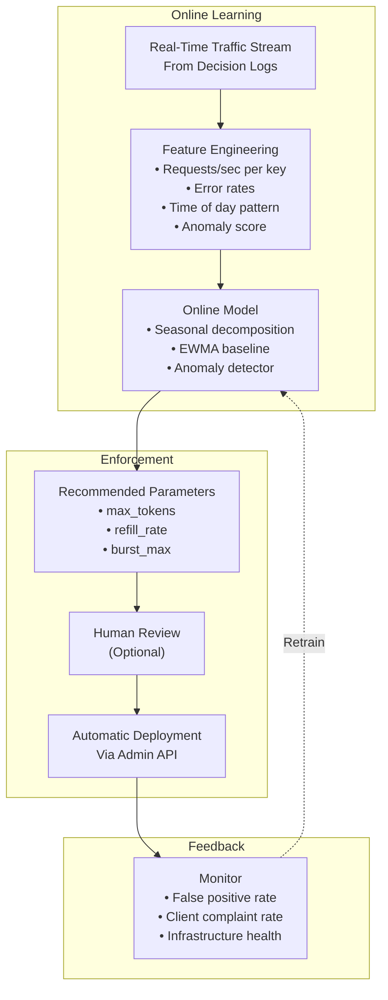

# Future Enhancements — Token Bucket Rate Limiter Service

## 1. Planned Roadmap

| Quarter | Enhancement | Priority | Effort |
|---|---|---|---|
| Q3 2026 | Adaptive rate limiting (ML-based) | High | 3 months |
| Q3 2026 | Weighted rate limits (per-endpoint cost) | Medium | 1 month |
| Q4 2026 | Global rate limit consistency improvements | Medium | 2 months |
| Q4 2026 | gRPC interceptor SDK for direct embedding | High | 2 months |
| Q1 2027 | Tiered rate limits (plan-based) | High | 1 month |
| Q1 2027 | Canary rule deployments (gradual rollout) | Medium | 1 month |
| Q2 2027 | Rate limit marketplace (API product catalog) | Low | 4 months |

## 2. Adaptive Rate Limiting (ML-Based)

### 2.1 Current Limitation

Static rate limit rules require manual tuning. When traffic patterns change — a viral event, a new client deployment, a DDoS ramp-up — static limits are either too permissive (fail to protect) or too restrictive (block legitimate traffic).

### 2.2 Proposed Enhancement

An ML model analyzes historical traffic patterns and **automatically adjusts rate limit parameters**:



**Key design decisions:**
- **Online (not batch) training.** The model updates continuously as new traffic arrives. No daily retraining job needed.
- **Conservative by default.** The model's recommended `max_tokens` is multiplied by a safety factor (1.5×) before deployment.
- **Human-in-the-loop.** For the first quarter, recommendations are surfaced to operators for approval. After validation, auto-deploy with instant rollback.

### 2.3 Success Metrics

| Metric | Current | Target |
|---|---|---|
| False positive rate (legitimate traffic blocked) | < 0.1% | < 0.01% |
| Time to respond to traffic spikes | Manual (hours) | Automatic (minutes) |
| Operator tuning effort | 10 hours/week | 1 hour/week |

## 3. Weighted Rate Limits

### 3.1 Current Limitation

Every request costs exactly 1 token. In reality, different API endpoints have different costs:
- `GET /api/users/me` — lightweight (cost: 1)
- `POST /api/orders` — moderate (cost: 5)
- `POST /api/reports/generate` — expensive (cost: 50)

### 3.2 Proposed Enhancement

Add **cost metadata** to the rate limit rule and **weighted token consumption**:

```protobuf
message RateLimitRule {
    // ... existing fields ...
    
    // Default request cost if not specified by the caller
    int32 default_cost = 3;
    
    // Override cost per endpoint pattern
    repeated CostOverride cost_overrides = 17;
}

message CostOverride {
    string endpoint_pattern = 1;  // e.g., "/api/reports/*"
    int32 cost = 2;               // e.g., 50
}
```

This allows a single rate limit rule to protect a heterogeneous API surface with appropriate granularity.

## 4. gRPC Interceptor SDK

### 4.1 Current Limitation

The rate limiter is a separate service that the API Gateway calls via gRPC. This adds one network hop per decision and creates a dependency on the gateway's middleware capabilities.

### 4.2 Proposed Enhancement

**Embedded rate limiter library** that can be loaded directly into the application process:

```go
// Future: Embedded rate limiter interceptor
import rl "github.com/company/rate-limiter-sdk"

grpcServer := grpc.NewServer(
    grpc.UnaryInterceptor(
        rl.NewInterceptor(rl.Config{
            RedisEndpoint: "redis-cluster:6379",
            DefaultAction: rl.ActionReject,  // or ActionDefer
        }),
    ),
)
```

**Benefits:**
- Eliminates network hop for rate decisions (0.5ms → 0.05ms).
- No dependency on API Gateway capabilities.
- Works for any gRPC service, including those not behind the gateway.
- Can be extended to non-HTTP protocols (message queue consumers, background workers).

**Trade-off:** Library must be maintained in multiple languages (Go, Java, Python, Node.js). We start with Go (primary platform) and expand based on team demand.

## 5. Tiered Rate Limits (Plan-Based)

### 5.1 Current Limitation

Rate limits are key-based (per-client, per-IP, per-endpoint) but have no concept of **plan tier**. A Free-tier customer and an Enterprise customer on the same API key pattern receive the same rate limit.

### 5.2 Proposed Enhancement

```json
{
  "key_pattern": "client:{client_id}:endpoint:/orders",
  "tiers": {
    "free":     { "max_tokens": 10,  "refill_rate": 10,  "refill_interval_ms": 60000 },
    "pro":      { "max_tokens": 100, "refill_rate": 100, "refill_interval_ms": 60000 },
    "enterprise": { "max_tokens": 1000, "refill_rate": 1000, "refill_interval_ms": 60000 }
  },
  "tier_resolution": {
    "source": "client_metadata.tier",  // Field on the request context
    "default": "free"
  }
}
```

When a `CheckRequest` arrives, the rate limiter resolves the client's tier (from the request context or a lookup), selects the appropriate tier's parameters, and enforces accordingly.

This enables **self-serve API billing** — a customer's rate limit automatically adjusts when they upgrade their plan.

## 6. Canary Rule Deployments

### 6.1 Current Limitation

Rule changes are instant and global. A misconfigured rate limit can immediately block production traffic.

### 6.2 Proposed Enhancement

```protobuf
message CanaryDeployment {
    string rule_id = 1;
    
    // Percentage of traffic to apply the new rule to
    double traffic_percentage = 2;  // 0.0 to 100.0
    
    // Auto-promote if conditions are met
    AutoPromoteConditions auto_promote = 3;
}

message AutoPromoteConditions {
    double max_error_rate_increase = 1;  // +1% error → rollback
    double max_latency_increase_ms = 2;   // +5ms p99 → rollback
    int32 evaluation_window_seconds = 3;  // 300 (5 minutes)
}
```

**Flow:**
1. Deploy new rule with `traffic_percentage = 5`.
2. 5% of matching requests use the new parameters; 95% use the old.
3. After 5 minutes, evaluate: error rate, latency, rejection rate.
4. If all metrics are healthy, auto-promote to 25% → 50% → 100%.
5. If any metric degrades, auto-rollback to 0% and alert.

## 7. Additional Minor Enhancements

| Enhancement | Description | Priority |
|---|---|---|
| **Rate limit webhooks** | Notify clients when they approach their limit (80%, 90%, 100%) | Medium |
| **Scheduled rule changes** | "Increase rate limit during business hours, reduce at night" | Low |
| **Rate limit compression** | Batch multiple small rate limits into a coarser-grained limit for efficiency | Low |
| **Cost allocation tags** | Tag rate limit usage with cost center for chargeback | Medium |
| **Rate limit export to billing** | Export throttling events as billing adjustments | Low |
| **Multi-protocol support** | Rate limit non-HTTP protocols (WebSocket, gRPC streaming, Kafka consumers) | Medium |
| **Rate limit reason codes** | Return machine-readable reason for rejection (rate_limit, quota_exceeded, burst_exceeded) | Low |
