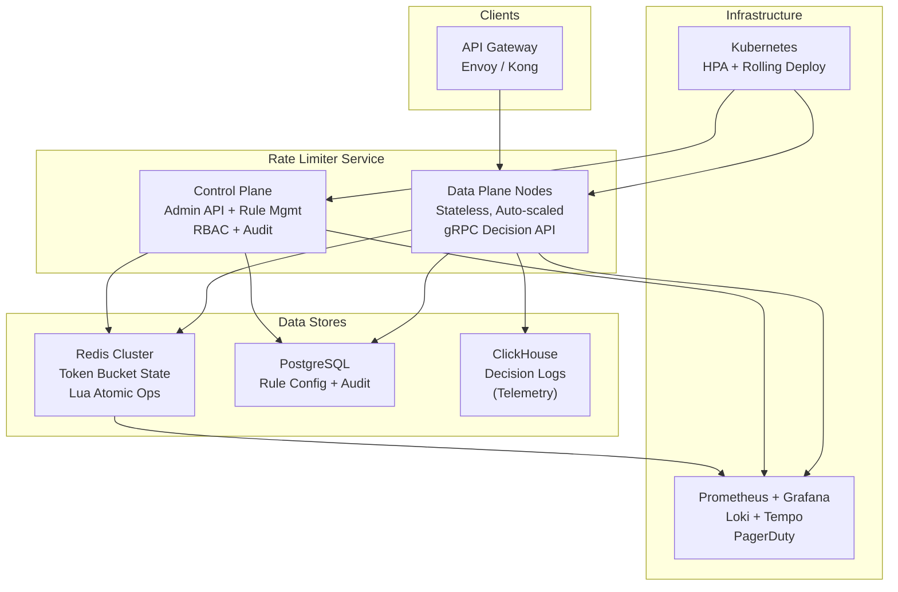

# Token Bucket Rate Limiter Service — Engineering Design Docs

## Overview

This directory contains the complete engineering design documentation for a distributed, centralized rate limiting service implementing the token bucket algorithm. The service provides configurable rate limit enforcement for multi-tenant API platforms, designed for high throughput (5M+ decisions/sec), low latency (p99 < 5ms), and multi-region deployment.

**Target Audience:** Senior backend engineers, SRE, and architects reviewing the design before implementation.

**Date:** June 2026 | **Status:** Pre-Implementation Design Review

---

## Document Index

| # | Document | Description |
|---|----------|-------------|
| 01 | [Project Overview](01-Project-Overview.md) | Purpose, system context, stakeholders, success criteria, design tenets |
| 02 | [Business Requirements](02-Business-Requirements.md) | Business drivers, stakeholder needs, constraints, success metrics |
| 03 | [Functional Requirements](03-Functional-Requirements.md) | 15 functional requirements: token bucket algorithm, rule CRUD, dry-run, simulation |
| 04 | [Non-Functional Requirements](04-Non-Functional-Requirements.md) | 20 NFRs: latency, throughput, availability, consistency, durability, security, operability |
| 05 | [API Contract](05-API-Contract.md) | gRPC + REST contracts, protobuf schemas, error codes, rule resolution logic |
| 06 | [High-Level System Design](06-High-Level-System-Design.md) | Architecture diagram, component responsibilities, request lifecycle, data flow |
| 07 | [Data Model](07-Data-Model.md) | ERD, Redis Lua script, PostgreSQL DDL, ClickHouse schema, data lifecycle |
| 08 | [Low-Level Design](08-Low-Level-Design.md) | Component architecture, request lifecycle detail, error scenarios, graceful shutdown |
| 09 | [Concurrency Design](09-Concurrency-Design.md) | Lua atomicity model, multi-node concurrency, hot key handling, worker pool architecture |
| 10 | [Persistence Strategy](10-Persistence-Strategy.md) | Redis AOF/RDB, PostgreSQL WAL + backups, ClickHouse retention, DR plan |
| 11 | [Deployment Architecture](11-Deployment-Architecture.md) | Multi-region K8s, HPA config, CI/CD pipeline, cross-region consistency |
| 12 | [Monitoring & Observability](12-Monitoring-Observability.md) | Metrics, Grafana dashboards, structured logging, distributed tracing, SLOs |
| 13 | [Security Design](13-Security-Design.md) | Threat model, mTLS, RBAC model, network segmentation, compliance (SOC2/GDPR) |
| 14 | [Testing Strategy](14-Testing-Strategy.md) | Unit, contract, integration, chaos, performance test plans and scenarios |
| 15 | [Failure Handling](15-Failure-Handling.md) | Redis crash, network partition, compute failure, config error responses |
| 16 | [Scaling Strategy](16-Scaling-Strategy.md) | Redis sharding, global ledger, HPA auto-scaling, capacity planning |
| 17 | [Future Enhancements](17-Future-Enhancements.md) | ML adaptation, weighted costs, embedded SDK, canary rules, plan-based tiers |
| 18 | [Risks & Trade-offs](18-Risks-and-Trade-offs.md) | Architecture decisions, consistency model, operational risks, decision log |

---

## Architecture at a Glance

## Key Design Decisions

| Decision | Choice | Rationale |
|---|---|---|
| **Token state storage** | Redis (in-memory) | Sub-millisecond latency for atomic operations |
| **Atomicity model** | Redis Lua scripts | Single round-trip, serialized execution, no race conditions |
| **Consistency model** | Strong per-key, eventual global | Accept 5s staleness for cross-region limits |
| **Failure mode** | Fail-open (default), fail-close (security) | Availability over correctness for rate limiting |
| **Transport** | gRPC (data plane), REST (control plane) | Throughput for decisions, accessibility for admin |
| **Deployment** | Centralized service (not library) | Operational simplicity over marginal latency gain |

## Total

**3,468 lines** across 18 documents with **18 Mermaid diagrams** (architecture, sequence, state, ERD, deployment, pipeline, flow).
